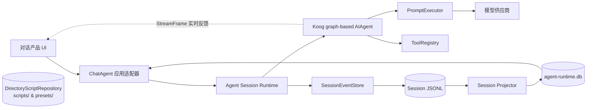
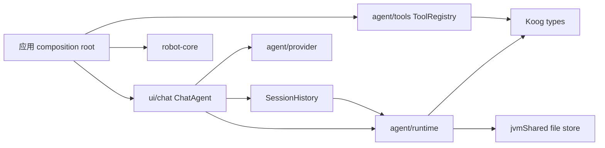
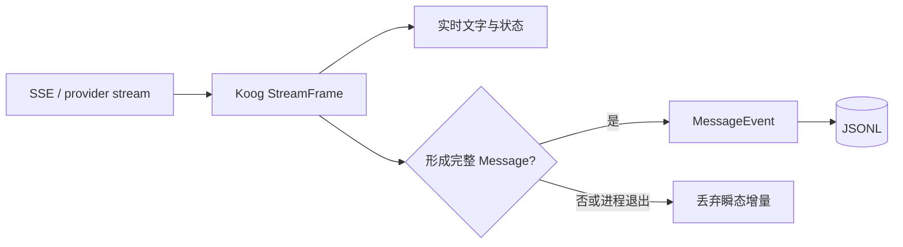
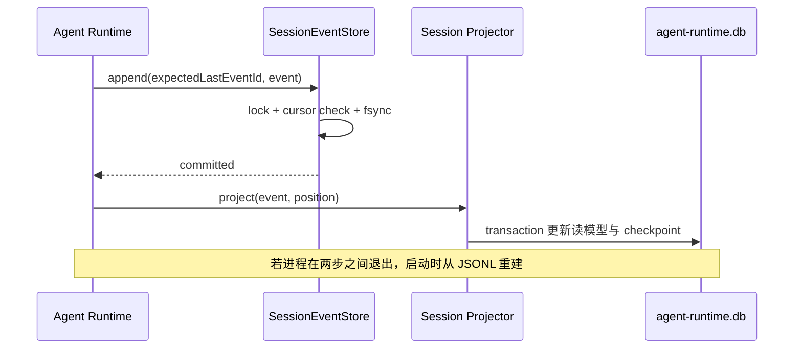
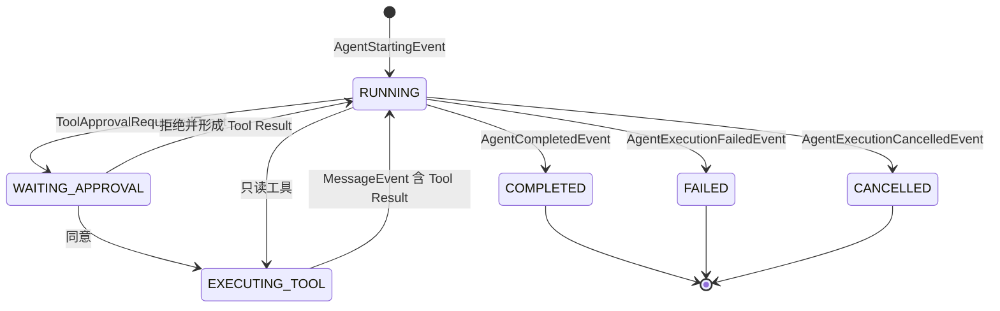
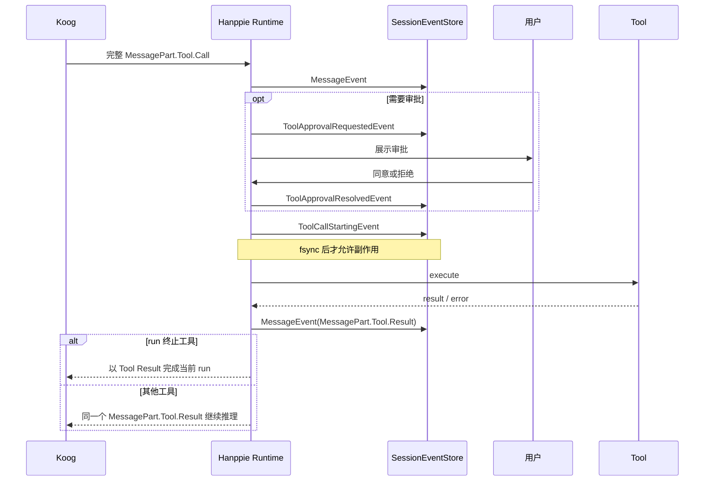

# Hanppie 智能体运行时技术方案

> 状态：技术方案与当前实现基线
> 日期：2026-09-13
> 范围：Android 与桌面共享智能体运行时
> 产品小功能：见[对话体验产品需求](./conversation-product-requirements.md)
> Hanppie 智能体：见[对话智能体产品设计](./conversation-agent-product-design.md)
> 当前实现事实：见[客户端架构](./architecture.md)

## 1. 核心决定

Hanppie 的运行时聚合根是 **Agent Session**，不是 Conversation。一个 Session 可以包含多次 Koog agent run、模型消息、工具调用、审批和后续制品；“对话记录”只是当前产品界面的名称。

本阶段采用以下边界：

1. 每个 Session 的追加式 JSONL 是耐久事实来源；供应商 SSE、token delta、keepalive 和 Koog `StreamFrame` 只属于实时运行通道。
2. 事件直接保存 Koog `Message`、`MessagePart.Tool.Call`、`LLModel` 和 `AgentExecutionInfo`，不设计平行的消息、工具调用或执行 DTO。
3. 事件模型沿用 DTEmpower 的 `SessionEvent`、`AgentStartingEvent`、`MessageEvent`、agent 终态事件和 `expectedLastEventId` 游标设计；Hanppie 只补 Session 元数据、人工审批和副作用开始这三类额外事实。
4. 运行时独立拥有事件目录和 `agent-runtime.db`。脚本库使用本地目录树（`DirectoryScriptRepository`），与
   Agent 运行时完全解耦，两者没有共享存储、事务或交叉依赖。
5. 当前格式尚未发布，也没有需要保留的历史 Session 数据，因此不实现旧 schema upcaster、Unknown 事件、双写或兼容读取。格式正式发布后，只有存在真实历史数据时才单独设计并验证迁移。
6. SQLite 只是可删除、可重建的查询投影；任何写命令先提交 JSONL，再更新投影。
7. 工具副作用前必须先持久化 `ToolCallStartingEvent`。开始后没有匹配的 Koog `MessagePart.Tool.Result`，恢复时只能记为结果未知，禁止自动重放。
8. agent 编排使用 Koog graph-based `AIAgent` 和显式策略图；工具实现使用具名的 class-based `Tool<TArgs, TResult>`，由应用 composition root 直接组合为一个 `ToolRegistry` 并一次注入，不引入平行的 Environment 接口、函数式循环、匿名工具或反射 ToolSet。
9. 产品适配器把机器人副作用工具声明为 run 终止点；其 Tool Result 持久化后直接完成当前 run，不再交给模型规划下一步。模型请求关闭并行工具调用；只读工具可以按任务需要查询多个分类或对象，统一由 run 的模型请求上限阻止无界循环，达到上限必须失败并留下可追踪终态，不能把最后一次工具输出冒充最终答复。

## 2. 当前实现与后续边界

| 范围 | 当前事实 | 后续工作 |
| --- | --- | --- |
| Session 事件 | sealed `SessionEvent` 直接保存 Koog 类型；JSONL 不保存流式 frame；工具审批、执行开始与超时已由 run-scoped Koog environment feature 采集 | 把其余 run/message 事件采集从 `ChatAgent` 适配器下沉为 Koog feature |
| 文件存储 | 每 Session 一份 JSONL；进程锁、文件锁、末事件游标、事件 ID 冲突检查、fsync、尾部隔离、坏行拒绝 | 增量读取与 byte offset checkpoint |
| 查询投影 | 独立 `agent-runtime.db`，可从 JSONL 全量重建 | 分页、搜索、结构化运行详情 |
| 执行恢复 | 未完成 run 记为失败；待审批安全拒绝；已开始工具生成结果未知的 Koog Tool Result | 恢复仍在等待的审批卡片；Koog graph checkpoint |
| 模型配置 | DashScope、OpenAI、DeepSeek、MiMo、Custom，模型发现和分阶段测试 | 每供应商独立 profile/key 与能力证据三态 |
| 产品工具 | 八个具名 `Tool<TArgs, TResult>`：状态、Lab API 查询、脚本库 CRUD、执行和停止 | 本地程序风险分析和证据等级 |

`ChatAgent` 目前仍组合 HTTP client、Koog 策略、审批交互和 UI 状态，但只依赖 Koog `ToolRegistry`，不再知道八个工具实现或转发其参数。工具实现由应用 composition root 构造；run-scoped environment feature 使用 Koog 原始 `MessagePart.Tool.Call` 处理审批、执行开始与超时。事件、Session 查询接口和持久化已经位于 `agent/runtime`，也不依赖应用数据库；下一步应把剩余执行编排移入独立 runtime service，而不是让 UI 继续增长。

## 3. 运行时与应用边界



脚本库在架构上不连接运行时。两者由同一个 composition root (`WorkbenchStorage`) 初始化，但所有权和生命周期完全独立。
`AgentRuntimeStorage` 接收显式数据库路径与事件目录，Hanppie 只是它的一个宿主。

依赖方向固定为：



UI 不得直接追加 JSONL 或修改运行时 SQLite 表。投影器是从事件更新查询表的唯一入口。

## 4. 语言与 Koog 类型复用

### 4.1 标识

- `sessionId`：可重新打开并继续工作的 Agent Session；
- `runId`：Koog 一次 agent run 的标识，事件字段沿用 Koog 命名；
- `eventId`：耐久事件的唯一 ID；
- `toolCallId`：直接使用 `MessagePart.Tool.Call.id`，结果继续使用同一 ID；
- 消息 ID：直接使用 Koog `Message.id`，需要稳定 ID 时在持久化前补齐。

事件顺序就是 JSONL 行顺序。存储通过 `expectedLastEventId` 做乐观并发校验，不再额外发明序号、hash 链或另一套执行标识。

### 4.2 直接复用

| 语义 | 类型 |
| --- | --- |
| 系统、用户、助手和工具结果消息 | Koog `Message` |
| 文本、推理、附件、工具调用和工具结果 | Koog `MessagePart` |
| 模型上下文 | Koog `Prompt` |
| 模型与能力 | Koog `LLModel`、`LLMCapability` |
| 工具定义与注册 | Koog `Tool`、`ToolDescriptor`、`ToolRegistry` |
| run 与嵌套执行位置 | Koog `runId`、`AgentExecutionInfo` |
| 实时模型输出 | Koog `StreamFrame`，仅内存 `Flow` |

Hanppie 自有类型只描述 Koog 没有的事实：Session 名称、用户审批、工具副作用开始、供应商配置来源和 SQLite 查询行。SQLite 的文本预览是读模型，不是领域消息 DTO。

## 5. Session 事件模型

### 5.1 已实现事件

| 事件 | 直接承载的数据 | 说明 |
| --- | --- | --- |
| `SessionCreatedEvent` | 标题 | Session 生命周期 |
| `SessionRenamedEvent` | 标题 | 产品元数据，但仍属于 Session 事实 |
| `AgentStartingEvent` | `Message.User`、`LLModel`、`runId`、`AgentExecutionInfo` | 一次 fsync 同时接受用户输入与开始 run |
| `MessageEvent` | Koog `Message` | 完整助手消息或工具结果；不保存 delta |
| `ToolApprovalRequestedEvent` | `MessagePart.Tool.Call` | Hanppie 人工审批事实 |
| `ToolApprovalResolvedEvent` | `toolCallId`、决定 | Hanppie 人工审批事实 |
| `ToolCallStartingEvent` | `MessagePart.Tool.Call` | 副作用前的耐久边界 |
| `AgentCompletedEvent` | Koog run 结果摘要 | 明确完成 |
| `AgentExecutionFailedEvent` | 原始异常 traceback 或恢复原因 | 失败、超时或进程重启中断 |
| `AgentExecutionCancelledEvent` | 取消原因 | 用户或宿主取消 |

工具完成不再单独定义 `ToolFinished` DTO。Koog `MessagePart.Tool.Result` 随 `MessageEvent` 保存，就是模型上下文和历史投影使用的同一个结果。

### 5.2 JSONL 示例

```json
{
  "eventType": "Message",
  "eventId": "event-uuid",
  "runId": "run-uuid",
  "timestamp": 1789297800123,
  "executionInfo": {
    "parent": null,
    "partName": "hanppie-agent"
  },
  "message": {
    "type": "ai.koog.prompt.message.Message.Assistant",
    "parts": []
  }
}
```

`message` 的准确形状由 Koog serializer 决定，Hanppie 不复制字段。当前 codec 直接使用 sealed `SessionEvent.serializer()`，`eventType` 使用稳定的 `@SerialName`。

“原始事件”指未被聊天气泡压扁的完整 agent 业务事实，不是 HTTP 抓包。Authorization、Cookie、API Key、完整响应 body 和 SSE envelope 禁止写入。

### 5.3 为什么不保存 SSE

供应商 delta 可能拆词、重复、重连或包含尚未闭合的工具参数。它们只驱动当前 UI：



崩溃时可以丢失尚未完成的 delta；已经接受的用户输入、工具审批和副作用开始事实不能丢失。OpenAI Agents API 也把实时 Session events 与可列举的 Session records 分成不同接口，这只用于验证“实时流与耐久事实应分层”，不用于复制 Codex 的领域名称。[实时 Session events](https://developers.openai.com/api/reference/python/resources/beta/subresources/agents/subresources/sessions/subresources/events/methods/stream) · [Session records](https://developers.openai.com/api/reference/python/resources/beta/subresources/agents/subresources/sessions/subresources/items/methods/list)

## 6. JSONL Event Store

当前路径为 `filesDir/agent-runtime/sessions/<session-id>.jsonl`。

写入契约与 DTEmpower 一致：

1. 每个 store 在 append 前读取最后事件 ID；调用者必须提供 `expectedLastEventId`。
2. store 在进程内锁与 `<session-id>.lock` 文件锁内重新校验游标。
3. 同一个 `eventId` 和完全相同内容重复写入视为幂等；相同 ID 不同内容立即报冲突。
4. 一行只包含一个完整 UTF-8 JSON 对象，并以 `\n` 作为提交边界。
5. 写完整行后调用 `FileChannel.force(true)`。
6. 没有换行的尾部视为未提交数据，复制到 `.jsonl.tail.corrupt` 后截断；已换行的坏 JSON、空行、重复 ID 或非法字段拒绝加载。
7. 删除 Session 时删除 JSONL 与尾部隔离文件，但保留 lock 文件，避免并发者锁住不同 inode。

存储不预置 schema v1/v2 兼容器，也不对未知事件静默降级。当前格式变更直接更新实现与测试；正式发布后若存在历史数据，再以真实 fixture 制定一次明确迁移。

## 7. 独立 SQLite 投影

`agent-runtime.db` 当前包含：

| 表 | 用途 |
| --- | --- |
| `session_projection` | 标题、创建/更新时间、最近事件 ID、消息预览 |
| `session_messages` | `eventId`、Session 内位置、角色、完整 Koog `messageJson`、文本预览 |
| `agent_runs` | `runId`、模型快照、开始/完成时间、终态和完整失败信息 |
| `session_projection_checkpoints` | 每个 Session 的 `lastEventId` 与 `eventCount` |

脚本库使用文件目录树存储。运行时库可以单独关闭、删除并从 JSONL 重建；不能使用外部存储事务制造跨系统原子性，也不能用
`fallbackToDestructiveMigration` 冒充事件迁移。

投影流程：



## 8. Run、工具与恢复

### 8.1 Run 状态



provider 连接成功、首个 delta 或工具命令已发送都不代表 run 完成。每个 Session 同时最多一个活动 run；当前应用同时最多允许一个会派发机器人工具的 run。

应用适配器使用单一 `ChatPhase`（`INITIALIZING`、`IDLE`、`RUNNING`、`MANAGING`、`CLOSED`）同时决定命令准入和界面可操作性，不再用不可观察的原子布尔值维护第二份“正在运行”状态。发送或 Session 管理若因当前阶段被拒绝，调用方会得到失败结果和明确说明，不能静默丢弃。agent run 的 `runId` 同时出现在原始日志、JSONL 终态事件和 SQLite `agent_runs` 投影中；初始化和 Session 管理等尚未产生 run 的操作使用独立操作 ID。关联 ID 不展示给终端用户，只用于开发日志与耐久记录之间的故障追踪。`PromptExecutor` 不改写异常；异步 UI、run 终态持久化和资源释放等必须处理异常的边界使用原始 `Throwable` 记录完整 cause chain 与 traceback。工具异常不得转换为看似成功的文本结果；开始过副作用的工具按结果未知处理并让 run 失败。

120 秒超时分别约束单次模型请求和单次工具操作，不包住整个 run。`WAITING_APPROVAL` 是可取消、可持久化的人机等待状态，不消耗模型或工具执行超时；否则用户停留在审批卡片上的时间会导致“刚确认就超时”。图的模型请求数与重复工具上限保证取消审批等待后仍有有限的自动执行边界。

### 8.2 工具顺序



`execute_lab_python` 与 `stop_lab` 当前都是 run 终止工具。Lab API 查询和脚本库列出/读取属于只读工具；保存和经批准后的删除只修改应用脚本库，可以把结果交回模型整理，但不会上传或运行脚本。命令发送后的脚本状态由应用已有的全局状态流异步投影；agent 不通过连续 `robot_status` 查询等待 `STARTED` 或完成。重试必须来自新的用户消息和新的审批，不能由同一 run 自行修正后再次执行。模型请求上限仍是异常供应商输出的最后保险；达到上限时抛出专用异常，持久化带完整 traceback 的 `AgentExecutionFailedEvent`，并向用户显示与网络或供应商错误不同的本地化终态。

启动恢复按以下规则执行：

1. JSONL 与 checkpoint 的 `lastEventId/eventCount` 不一致时清空并重建该 Session 投影。
2. `ToolApprovalRequestedEvent` 没有决定且工具未开始时，追加拒绝事件；不恢复为已同意。
3. `ToolCallStartingEvent` 没有匹配 `MessagePart.Tool.Result` 时，追加 `isError=true` 的结果未知 Tool Result；不调用工具。
4. `AgentStartingEvent` 没有 agent 终态时，追加重启提示与 `AgentExecutionFailedEvent(failure=ProcessRestart)`。
5. 系统恢复提示只用于 UI，不进入下一次模型上下文。

取消 run 不表示机内脚本停止。停止机器人必须走 `stop_lab` 或现有本地安全入口。

## 9. 供应商、模型能力与配置测试

模型主体直接使用 Koog `LLModel`；工具、图像、音频、文档、推理、JSON Schema 和 endpoint 等能力直接使用 `LLMCapability`。Hanppie 只附加能力来源证据，不能从模型名称猜测能力。

能力信息按字段合并：

1. 用户明确覆盖；
2. 无副作用探测的确定结果；
3. 供应商目录返回的字段；
4. 随 Hanppie 发布的内置目录；
5. `UNKNOWN`。

配置测试分为本地校验、模型目录、最小流式文本、无副作用工具调用四步。目录成功只证明模型可见；文本成功不能证明工具调用可用。测试不创建用户 Session、不调用机器人，也不把配置的 API Key 主动拼接进日志；供应商抛出的原始异常则连同 cause chain 和 traceback 直接记录，不再提取错误分类或改写正文。

模型目录发现不是 Session Runtime 的启动依赖，也不进入 Session 事件。应用适配层只在用户展开模型选择器或显式启动配置测试时请求目录；模型选择器先展示内置 `LLModel` 预设与当前模型 ID，再异步合并远端 ID。设置页初始化、供应商切换和应用启动均不预取，失败也不后台重试。

| 供应商 | 默认发现 | 能力补充 |
| --- | --- | --- |
| DashScope | `/api/v1/models` | 目录字段与内置证据 |
| OpenAI | `/models` | 内置官方目录与探测 |
| DeepSeek | `/models` | 内置目录与探测 |
| MiMo | `/v1/models` | 内置目录与探测 |
| Custom | 尝试 `/models`，允许手填 | 默认 `UNKNOWN` |

## 10. Koog 与 DTEmpower 的采用边界

Hanppie 与 DTEmpower 当前均使用 Koog `1.2.0`。本方案采用的是经过 DTEmpower 实现验证的结构，不复制其业务：

- agent 使用显式策略图组织模型节点、工具节点与条件边，不复制 DTEmpower 的业务节点；
- 产品工具实现为具名的 class-based Koog `Tool<TArgs, TResult>`，直接声明可序列化 `Args`/`Result`；不用 `SimpleTool` 把结构化业务结果降级成自然语言字符串；
- `SessionEvent` 是 sealed 事件，不是“信封 + payload DTO”；
- `AgentStartingEvent` 保存 `Message.User`，`MessageEvent` 保存完整 Koog `Message`；
- agent 终态沿用 `AgentCompleted`、`AgentExecutionFailed`、`AgentExecutionCancelled` 命名；
- 每个 run 保存 `AgentExecutionInfo`；
- Event Store 用 `expectedLastEventId`、事件 ID 幂等和文件顺序保证追加一致性；
- 流式 delta 不进入长期事件日志；
- Koog Persistence 以后只负责活动 run 的 graph checkpoint，不能代替跨 run 的 Session 历史。

Hanppie 的差异只有机器人安全所需的审批和副作用开始事件，以及产品需要的 Session 标题事件。当前 `ChatAgent` 把同一个 `runId` 显式传给 Koog，根 `AgentExecutionInfo.partName` 也与 Koog agent ID 一致；若以后把手动记录下沉为 Koog feature，应像 DTEmpower 一样直接订阅 lifecycle interceptor，进一步使用 Koog 产生的 event ID 和嵌套执行位置。

参考：[Koog Agent events](https://docs.koog.ai/agent-events/) · [Koog persistence](https://docs.koog.ai/features/persistence/) · [Koog chat memory](https://docs.koog.ai/features/chat-memory/)

## 11. 包与实施顺序

| 路径               | 职责                                              |
|------------------|-------------------------------------------------|
| `agent/runtime`  | Session events、Event Store、独立 Room 投影、恢复和存储生命周期 |
| `agent/provider` | provider preset、模型目录和配置测试；不复制 Koog 模型/消息 DTO    |
| `agent/tools`    | 具名的 class-based Koog tools、审批策略和 robot-core 适配  |
| `ui/chat`        | 对话产品展示与当前应用适配器                                  |
| `ui/scripts`     | 基于本地文件目录树的脚本 repository，不保存 Session             |

实施顺序：

1. 完成当前事件模型、JSONL 游标契约和独立投影库；
2. 把记录与执行编排从 `ChatAgent` 移入 `AgentRuntime`/Koog feature；
3. 完成 provider profile、能力证据和配置测试；
4. 补分页、搜索、运行详情和诊断导出；
5. 有真实长上下文数据后再决定是否引入 compaction；
6. 只有出现已发布历史格式时才设计迁移，不为假设数据预置兼容层。

## 12. 验证标准

- JSONL 已写而 SQLite 未提交时，重启能从 JSONL 重建且不重复消息；
- 错误末事件游标、同 ID 不同内容、空行、已提交坏行和重复 ID 都明确失败；
- 未换行尾部被隔离并截断，最后一条已提交事件不受影响；
- 删除 `agent-runtime.db` 后可只靠 Session JSONL 重建列表、消息和 run 状态；
- `StreamFrame`、SSE 和 token delta 不出现在 Session Event Store；
- 工具开始后崩溃，恢复只产生结果未知的 Koog Tool Result，不重放副作用；
- API Key、Authorization、完整 provider body 不进入事件、投影或 UI；
- `DirectoryScriptRepository` 和 `agent-runtime.db` 可分别初始化、关闭和独立验证；
- JVM 运行时/ChatAgent 测试、Android 编译与 lint 分层通过；真实供应商和实机机器人验证仍需显式环境与授权。
