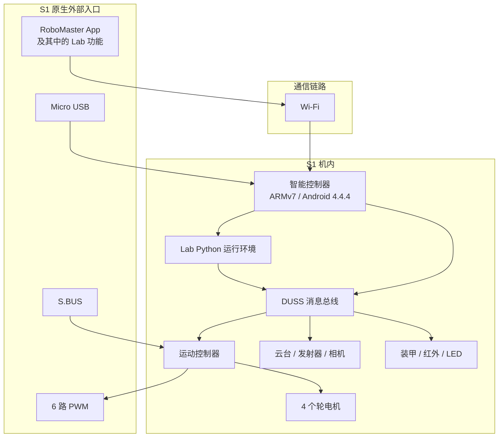
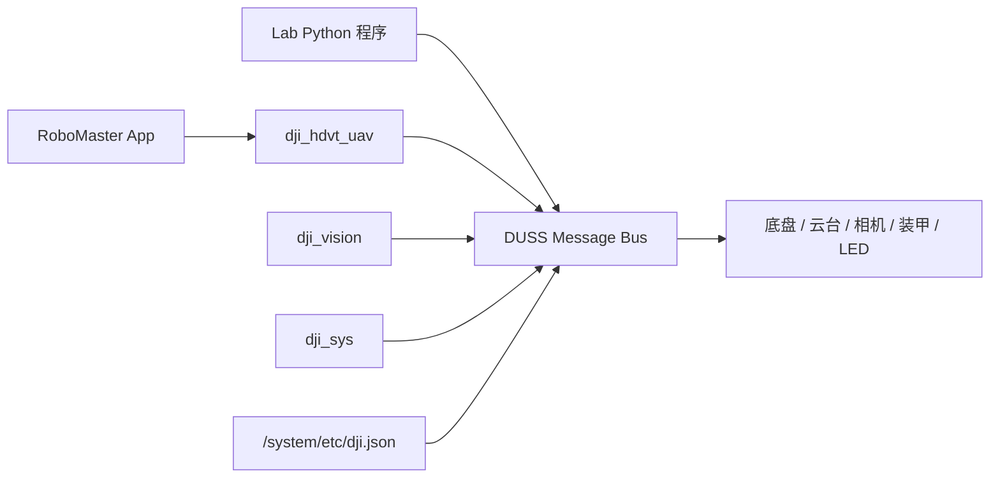
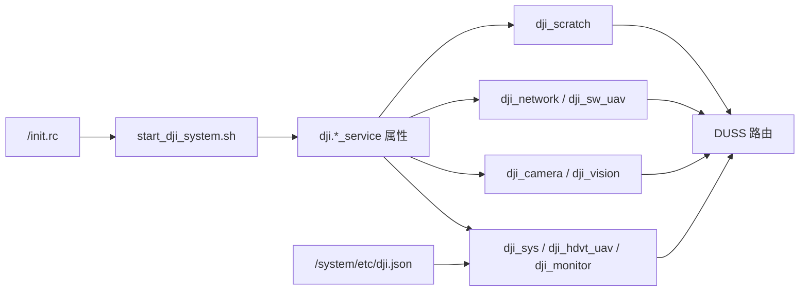
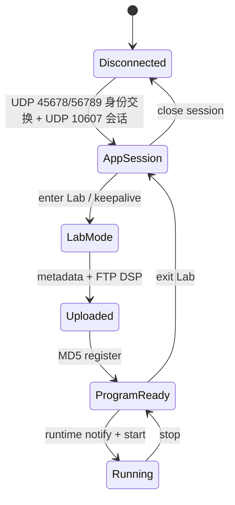

# RoboMaster S1 原生架构、协议与调查

> 文档性质：RoboMaster S1 原生硬件、固件、协议与外部生态的长期技术事实源。<br>
> 最后更新：2026-09-13<br>
> 已验证固件：RoboMaster S1 `00.06.0521`

本文只记录 RoboMaster S1 的当前固有架构、通信、协议调查和外部扩展边界。Hanppie 当前增加的主机能力、代码结构、安全策略和验证状态统一维护在 [Hanppie 技术架构](./architecture.md)。已被替代的方案、旧命令、迁移过程和开发取舍不进入正文，由日期化调研、联调记录与 Git 历史保存。

## 文档所有权

| 信息类型 | 权威位置 |
| --- | --- |
| S1 原生硬件、固件服务、DUSS、App/Lab 机制、媒体链路和外部生态 | 本文 |
| Hanppie 代码结构、实现机制、能力矩阵和安全边界 | [`architecture.md`](./architecture.md) |
| 安装、CLI 参数和开发命令 | 中英文 README、`hanppie --help` 和 `pyproject.toml` |
| 单次实机命令、原始输出、故障和测量值 | 日期化联调记录或 `diag` 自动报告 |
| 内置 SDK fork 来源 | [`src/robomaster/UPSTREAM.md`](../src/robomaster/UPSTREAM.md) |

## 证据标记

本文复用 [Hanppie 技术架构中的证据等级](./architecture.md#证据标记)，不在此复制第二份定义。原生能力和协议调查同样必须区分接口存在、命令被接受、遥测变化与物理效果。

## 1. 文档范围与归属

本文使用以下归属，章节中的“原生”“外部”和“项目”均按此定义：

| 归属 | 含义 | 主要章节 |
| --- | --- | --- |
| **S1 原生** | 出厂硬件、固件服务、DUSS、RoboMaster App、Lab 功能和机内 Python；即使没有 Hanppie 也存在 | 第 2～5 章 |
| **外部生态** | S.BUS 接收机、SocketCAN/vcan、ROS 2、DJI EP SDK 等可与 S1 相关但不属于 Hanppie 的技术 | 第 6 章 |
| **Hanppie 项目** | 本仓库增加、恢复、组合或规划的主机代码、机内载荷、临时补丁和安全策略 | [Hanppie 技术架构](./architecture.md) |

“仓库中保存了原机文件”不表示该文件由 Hanppie 创建；`runtime/` 和 `resources/` 中的恢复内容是分析 S1 的证据。Lab Bridge、ADB 启动载荷和 PyAV 兼容层均为项目增量，不能写成 S1 出厂能力。

### 1.1 术语来源与实际对象

本文同时涉及 DJI 产品名称、原厂程序、逆向得到的网络封包和 Hanppie 自有组件。它们不是同一层概念：

| 名称 | 名称来源 | 本文实际指向 |
| --- | --- | --- |
| RoboMaster App | DJI 产品名称 | 手机/macOS 应用；与 S1 的身份交换使用 Host UDP `45678` 和 S1 UDP `56789`，后续数据会话通常使用 Host UDP `10609` 和 S1 UDP `10607` |
| RoboMaster Lab | DJI App 中的功能名称 | 创建和运行 `.dsp` 程序；机内由 `/data/dji_scratch/bin/dji_scratch.py` 管理，文件经 FTP `21` 上传，生命周期命令通过 DUSS 发送 |
| `AppEnvelope` | Hanppie 代码名称，不是 DJI 官方术语 | [`lab/protocol.py`](../src/hanppie/lab/protocol.py) 对 UDP `10607` 报文中、位于 DUSS 或媒体数据之外的 session、tick、direct/control channel 等字段的封装；字段来自固定 App 抓包并经实机互操作验证 |
| DUSS | 原厂代码和协议常量中的名称 | 具有 sender、receiver、sequence、command set、command id、payload 和 CRC 的消息；机内由 Unix Datagram Socket 路由，并可经 UART 或 UDP `10607` 外层封包承载 |
| Lab Python 控制对象 | 本文对机内对象的统称，不是独立协议名称 | Lab 程序上下文中的 `robot_ctrl`、`chassis_ctrl`、`gimbal_ctrl`、`led_ctrl`、`media_ctrl` 等对象；对应恢复的 `rm_ctrl.py` 高层类 |
| Hanppie Lab Bridge | Hanppie 项目名称 | 上传到 `/data/ftp/python/python_raw.dsp` 的项目程序；Host → S1 UDP `40923` 接收 JSON，S1 → Host UDP `40924` 回传 JSON |
| DJI 官方 Python SDK | DJI 发布的软件包 | 电脑上的 `robomaster` 包；`Robot.initialize()` 依赖机器人端 EP SDK 服务，详细边界见第 6.3 节 |

`App/Lab` 和 `App UDP` 都不代表一套协议或一个进程。本文描述具体链路时直接写 RoboMaster App、Lab 功能、机内程序、传输协议和端口；“外层封包”只表示 `AppEnvelope` 对应的 UDP `10607` 报文结构。

## 2. S1 原生整机架构

S1 不是一个由电脑直接驱动电机的外设。它内部已经包含智能控制器、运动控制器、云台/相机和多个执行器/传感模块；出厂软件通过 RoboMaster App、Lab 功能、Wi-Fi 和机内服务控制这些模块。



图中只画出 S1 出厂存在的入口和模块，不包含 Hanppie、官方 EP SDK 兼容补丁或计划中的远程控制器。Hanppie 如何接入这些入口见 [Hanppie 技术架构](./architecture.md#1-hanppie-项目实现与机制)。

## 3. S1 原生硬件架构

### 3.1 主要模块

| 模块 | 主要职责 | 证据 |
| --- | --- | --- |
| 智能控制器 | Wi-Fi、USB、视频、视觉、RoboMaster App、Lab Python 运行环境和固件内网络服务 | **实测/代码** |
| 运动控制器 | 底盘运动、电源和外部 PWM/S.BUS 接口 | **官方/代码** |
| 两轴云台 | 俯仰、偏航和工作模式 | **官方/代码** |
| 相机与媒体链路 | 720p H.264 图传，音频链路使用 Opus | **实测/官方 SDK 代码** |
| 四轮底盘 | M3508I 电机与麦克纳姆轮运动 | **官方** |
| 装甲与红外 | 击打、红外事件和灯效 | **官方/代码，事件待实测** |
| 智能电池 | 供电、电量和状态管理 | **官方；外部 SDK 电量值不可信** |

### 3.2 智能控制器

已连接设备显示智能控制器使用 ARMv7 平台，运行 Android 4.4.4/API 19，构建类型为 `userdebug`、`test-keys`。设备包含 Python、DJI 服务、BusyBox、ADB 相关脚本和 DUSS 路由配置。**实测/代码**

这解释了几个关键现象：

1. RoboMaster Lab 的 Python 实际运行在机器人内部，而不是手机或电脑上；
2. 机内 Python 可以通过本地 DUSS 总线调用底盘、云台、灯光等模块；
3. S1 与 EP 的底层模块高度复用，但对外开放的服务集合不同；
4. 外部电脑能否使用某套 DUSS 客户端，还取决于机内是否开放对应的会话和转发入口。

### 3.3 外部接口

| 接口 | 原生用途 | 原生边界 |
| --- | --- | --- |
| 智能控制器 Micro USB | RNDIS、Mass Storage、Bulk、ACM 等复合 USB；固件也包含 ADB 组件 | 量产启动后不保证开放 ADB |
| Wi-Fi AP/Station | RoboMaster App、Lab 功能、媒体和机内网络服务 | S1 原厂不开放完整 EP SDK 入口 |
| S.BUS | 单向底盘、云台、模式和扭矩控制 | 没有相机和完整遥测 |
| 6 路 PWM | 外部执行器扩展 | 只提供 PWM 输出能力 |
| 模块 CAN/UART | 运动控制器、云台、装甲等内部模块互连 | 不是官方消费级扩展 API |
| 保留 UART/USB | 固件或硬件内部用途 | 官方没有提供稳定扩展契约 |

S.BUS 信号、5 V 和 GND 的方向必须按机身丝印和手册确认。内部 CAN 不是面向普通用户的即插即用接口；接线、供电、终端电阻和主动发帧均可能损坏硬件。

## 4. S1 原生机内软件架构



### 4.1 系统信息快照

下表只记录已经从真机、ADB 输出或固件文件确认的内容；没有把社区同型号信息当作本机事实。

| 信息项 | 固件 `00.06.0521` 的记录 | 证据 |
| --- | --- | --- |
| CPU/ABI | ARMv7，机内关键二进制为 ARM32 EABI5 | **实测/文件审计** |
| 操作系统 | Android `4.4.4`，API 19 | **实测** |
| 型号/产品 | `L1860` / `full_xw607_dz_ap0002_v4` | **实测** |
| DJI 平台 | `XW0607_1860AC01` | **代码：`dji.json`** |
| 构建 | `userdebug`、`test-keys`，构建日期 2022-10-27 | **实测** |
| 系统属性 | `ro.secure=1`、`ro.debuggable=1`；DJI init 服务以 root 用户运行 | **代码/实测** |
| Shell/基础工具 | Android `mksh`、BusyBox，包含 ADB 脚本和 `adbd` | **代码/实测** |
| Lab 解释器 | `/data/python_files/bin/python`，Python `3.6.6`，GCC 4.8.3 构建 | **实测** |
| 运行环境 | `DEVICE_TYPE=UAV`，DJI 启动脚本设置 `HOME=/data`，init 设置固定 `PYTHONPATH` | **代码** |
| 主要网络接口 | `iwlan0`；`usb0` 固定为 `192.168.1.10`；`rndis0` 固定为 `192.168.42.2` | **代码；Wi-Fi Station 实测** |
| USB 复合功能 | 原厂路径使用 RNDIS、Mass Storage、Bulk、ACM；调试路径额外加入 ADB | **代码/实测** |

`default.prop` 中出现 ADB 配置不表示量产启动后一定能连接 ADB。`start_dji_system.sh` 会根据启动参数和白名单决定是否执行 `adb_en.sh`；本机正常重启后 ADB 不可见。**代码/实测**

### 4.2 启动链与系统服务

机内使用 Android init 的属性触发模型：`/init.rc` 在启动阶段运行一次 `/system/bin/start_dji_system.sh`；该脚本完成分区检查、Wi-Fi/SDR 选择、USB 和网络配置、FTP 启动、音频配置、日志目录准备，再设置 `dji.*_service` 属性。init 根据属性启动或停止对应进程。**代码**



| init 服务 | 启动程序 | 启动条件与职责 | 证据 |
| --- | --- | --- | --- |
| `start_dji_system` | `/system/bin/start_dji_system.sh` | 启动阶段一次性编排 DJI 系统 | **代码** |
| `dji_monitor` | `/system/bin/dji_monitor -m` | 监控 DJI 进程；启动脚本把它与 `dji_sys`、`dji_hdvt_uav` 作为关键存活检查 | **代码** |
| `dji_sys` | `/system/bin/dji_sys` | 系统服务和 DUSS 路由核心之一 | **代码/推断** |
| `dji_hdvt_uav` | `/system/bin/dji_hdvt_uav -g` | App 网络会话、DUSS 外部传输和媒体相关入口 | **代码/实测** |
| `dji_hdvt_cls` | `/system/bin/dji_hdvt_uav` | 同一二进制的另一启动形态，原厂启动脚本设为关闭 | **代码** |
| `dji_camera` | `/system/bin/dji_camera` | 相机与媒体服务 | **代码/推断** |
| `dji_vision` | `/system/bin/dji_vision` | 视觉处理服务，原厂启动脚本启用 | **代码** |
| `dji_network` | `/system/bin/dji_network -t wifi -i 10 -t sdr -i 5` | 网络路由；Wi-Fi 模式启用、SDR 模式关闭 | **代码** |
| `dji_sw_uav` | `/system/bin/dji_sw_uav` | Wi-Fi 模式的软件传输服务 | **代码/推断** |
| `dji_scratch` | `/data/python_files/bin/python /data/dji_scratch/bin/dji_scratch.py` | 常驻 Lab/Scratch 管理器，接收程序、控制执行并转发日志 | **代码** |
| `dji_blackbox` | `/system/bin/dji_blackbox` | 黑匣子与日志归档 | **代码** |
| `dji_perception` | `/system/bin/dji_perception` | 可选感知服务；原厂启动脚本默认未启用 | **代码** |

这些 init 服务均声明为 `disabled`，含义是“不随 Android service class 自动启动”，不是永久禁用；它们由 `dji.*` 属性显式启动。**代码/实测**

启动脚本还启动匿名可写 FTP：`busybox tcpsvd -vE 0 21 busybox ftpd -w /ftp`。`/ftp` 是指向 `/data/ftp` 的符号链接，因此 FTP 21 暴露的是持久数据分区。实机根目录包含 `blackbox`、`flyctrl`、`python`、`upgrade`、`v2` 和 `workspace` 等内部服务数据，不是用户媒体库；服务没有应用层认证，只应在可信隔离网络使用。实机 `FEAT` 只报告 `EPSV`、`PASV`、`REST STREAM`、`MDTM` 和 `SIZE`，不支持 UTF-8，非 ASCII 名称会退化为问号。Hanppie 的内部文件页只把这个 FTP chroot 表现为 `/`，不会把它映射成 Android `/system`、完整 `/data` 或任意 root 文件系统。**代码/实测**

RoboMaster macOS 1.1.5 客户端中的媒体库由 `DJILocalAlbumController` 管理主机本地照片和视频，不是 FTP 根目录浏览器；黑匣子导出则会先向 S1 发送带 `isDecrypt=true` 的准备请求，再进入 FTP 下载。实机也确认普通 FTP 对非空上传进行了确定性的分组变换：输入长度 `1/15/16/17/31/32/33/46` 字节时，回读长度分别为 `16/16/32/32/32/48/48/48` 字节，相同明文得到相同回读内容。公开 DSP 容器密钥不能解开该结果。因此裸 FTP 只提供内部数据搬运，不提供原厂工作流中的通用解密语义；Hanppie 可以浏览、传输和把原始数据交给系统应用，但不能承诺这些数据可直接作为普通音频、视频或日志打开。**客户端静态分析/实测**

### 4.3 关键程序与文件

| 路径 | 原机职责 | 原生状态 |
| --- | --- | --- |
| `/init.rc` | DJI 服务定义、属性触发器、Lab 解释器入口、全局环境变量 | 系统启动配置 |
| `/system/bin/start_dji_system.sh` | DJI 系统启动编排、FTP/网络/USB/音频/日志初始化 | 原厂启动脚本 |
| `/system/etc/dji.json` | 平台、HAL、DUSS 服务及路由表 | 原厂路由配置 |
| `/system/bin/dji_hdvt_uav` | App 网络会话、DUSS 外部传输和媒体相关入口 | 原厂二进制 |
| `/system/bin/dji_sys`、`dji_vision`、`dji_camera` | 系统、视觉和媒体关键进程 | 原厂二进制 |
| `/data/dji_scratch/bin/dji_scratch.py` | init 实际启动的 Lab/Scratch 常驻管理器 | 持久数据分区中的原厂程序 |
| `/data/dji_scratch/src/robomaster/` | 机内 `rm_ctrl`、`rm_module`、DUSS 客户端等 Python 运行库 | Lab 原生运行库 |
| `/data/python_files/bin/python` | Lab/Scratch 固定 Python 解释器 | 固件随附解释器 |
| `/data/ftp/python/python_raw.dsp` | RoboMaster Lab 上传的 DSP 程序容器 | 每次上传覆盖；文件存在不代表正在运行 |
| `/system/bin/adb_en.sh`、`/sbin/adbd` | 原厂调试脚本和 ADB daemon | 固件包含，量产启动后不一定启用 |

备份中还保存了 `/data/dji/dji_scratch.py`，其内容是 Lab/Scratch 管理器实现；但 init 中确认的实际服务入口是 `/data/dji_scratch/bin/dji_scratch.py`，在没有进一步 inode/符号链接证据前，不把两者写成同一个活动文件。**代码，关系待验证**

### 4.4 DUSS 路由与模块

恢复的 [`event_client.py`](../src/hanppie/runtime/event_client.py) 使用 Android 抽象 Unix Datagram Socket，例如 `\0/duss/mb/0x...`。[`dji.json`](../src/hanppie/resources/dji.json) 描述服务、模块和路由关系。**代码**

Lab 系统客户端和用户脚本分别绑定类似 `\0/duss/mb/0x905`、`\0/duss/mb/0x906` 的本地地址，未命中专用路由时把消息发往默认代理 `\0/duss/mb/0x900`。路由器再按 receiver 映射到相机、视觉、系统或 `vt_air` 等本地进程。底盘、云台、电池、ESC、装甲和发射器等模块在原厂 `dji.json` 中主要经 `/dev/ttyS3`、`921600 baud` 的 DUSS V1 路由连接。**代码**

[`rm_module.py`](../src/hanppie/runtime/rm_module.py) 把底盘、云台、灯光、相机、视觉、声音、装甲等能力封装为 DUSS 消息；[`rm_ctrl.py`](../src/hanppie/runtime/rm_ctrl.py) 再提供面向 Lab 程序的高层控制对象。**代码**

仓库中的 `src/hanppie/runtime` 和 `resources/dji.json` 是从原机恢复并整理的分析副本，不是桌面 SDK，也不是 Hanppie 重新设计的协议实现。对这些副本所做的必要整理见 [Hanppie 技术架构](./architecture.md#18-内置-sdk-fork-的边界)。

这说明“DUSS 总线”不是单根物理总线：在智能控制器内它表现为 Unix Datagram Socket 和消息路由，在控制器到下级模块之间又可以映射为 UART 等传输。内部 CAN 研究是另一层硬件路径，不能与这里的机内 DUSS 路由直接画等号。

### 4.5 S1 与 EP 的产品边界

DJI 官方 Python SDK 以 EP/EP Core 为正式对象。S1 拥有大量相同的 DUSS 命令和模块，但原厂状态没有对电脑开放完整的 EP SDK 代理。**官方/代码/实测**

实机重启后的原厂状态中，DJI 服务正常运行，但 UDP 30030 不监听，官方 SDK 握手超时。**实测** 这是 S1 的原厂能力边界；项目后端选择见 [Hanppie 技术架构 1.3.3 节](./architecture.md#133-为什么官方-sdk-不是当前控制后端)。

## 5. S1 原生通信机制

本章只描述原厂固件、RoboMaster App、Lab 功能和机内模块已经具备的机制。Hanppie 对这些机制的复用方式见 [Hanppie 技术架构](./architecture.md)。

### 5.1 DUSS 二进制消息

从机内运行库恢复的 DUSS V1 消息结构如下：

| 字段 | 作用 |
| --- | --- |
| `0x55` | 帧起始标记 |
| 版本与长度 | 表示协议版本和整帧长度 |
| CRC8 | 保护消息头 |
| sender / receiver | 编码后的模块地址 |
| sequence | 请求与响应关联 |
| command type | 请求、响应、是否需要 ACK |
| command set / command id | 能力类别与具体命令 |
| payload | 参数或遥测数据 |
| CRC16 | 保护完整消息 |

恢复的 [`duss_event_msg.py`](../src/hanppie/runtime/duss_event_msg.py) 负责打包和解包，[`duml_crc.py`](../src/hanppie/runtime/duml_crc.py) 实现 CRC8/CRC16。**代码**

DUSS 是多个传输上的共同消息语义，不等同于某个固定网口：智能控制器内使用抽象 Unix Datagram Socket，智能控制器与部分下级模块之间映射到 UART 等链路，App 会话又可在外层报文中承载 DUSS。

S1 的 Wi-Fi 侧没有在原厂路由表中暴露一个接受“裸 DUSS V1 帧”的通用网络 socket。原厂 `dji.json` 把 `iwlan0` UDP `10607` 配置为 `target=mobile`、`protocol=sw_v2_proto` 的服务路由；`dji_hdvt_uav` 是这条外部传输链中的关键原厂进程，但当前证据没有把每个 socket fd 逐一归属到具体 PID。客户端先完成 UDP `45678/56789` 的 AppID 身份交换，再在 UDP `10609/10607` 上维护 session 和 tick，把完整 DUSS 帧放入 direct channel。Hanppie 将这层非官方公开的封包命名为 `AppEnvelope`。因此“电脑直接与 DUSS 通信”在工程上可以实现，但准确链路是“Host → UDP `10607` 外层封包中的 DUSS → 机内 DUSS 路由”，不是“Host → 裸 DUSS 端口”。同一会话还有用于连续底盘控制的 control channel，不能假设所有能力都只需调用同一种 `send_duss()`。**代码/外部实现/实测**

因此可以把结论概括为：**DUSS 是 S1 模块控制面的核心协议，但“能构造一帧 DUSS”不等于已经获得完整的电脑控制能力。**

| DUSS 已解决的部分 | 仍需额外解决的部分 |
| --- | --- |
| 模块地址、命令集/命令 ID、请求与 ACK、任务进度、遥测事件 | 外部客户端如何发现并占用会话 |
| 底盘、云台、灯光、装甲、相机配置等模块消息 | 外层 session、tick、sequence、channel 和 keepalive |
| 机内服务和下级模块之间的统一消息语义 | 工作模式切换、初始化序列、连续控制与失联停车 |
| 同一命令在不同物理传输上的路由基础 | DSP/音频文件传输、H.264/Opus 媒体数据和解码 |
| 用任意语言重新实现编解码的可能性 | 未公开 payload 的语义、固件差异和物理安全验证 |

Python 不是 DUSS 的组成部分。只要实现帧格式、CRC、地址、序列、ACK/任务状态和相应生命周期，就可以用 C、C++、Rust、Go 等语言收发 DUSS。Python 只是 RoboMaster Lab 和现有主机 SDK 采用的一种实现语言。

### 5.2 原生网络通道与端口

| 通道 | 连接/端口 | 原生作用 | 本机证据 |
| --- | --- | --- | --- |
| RoboMaster App 身份交换 | Host UDP `45678` ↔ S1 UDP `56789` | 发现机器人、声明 8 字节 AppID | **实测可用；处理进程待 fd 级确认** |
| UDP `10607` 数据会话 | Host 默认 UDP `10609` ↔ S1 UDP `10607` | 用 `AppEnvelope` 所指的外层字段包裹 DUSS、控制帧和媒体数据，维护 session/tick | **实测可用；原厂路由见 `dji.json`** |
| Lab 程序文件 | 匿名 FTP/TCP `21` | 上传 DSP 到 `/python/python_raw.dsp` | **实测可用** |
| 视频/音频 | 复用 UDP `10609` ↔ `10607` | 视频 channel `0x02`；音频 DUSS `0x3F/0x1D`；H.264 / Opus | **视频与音频均实测可用** |
| 通用裸 DUSS 网络入口 | 未发现 | 原厂路由配置没有把机内抽象 Unix Datagram Socket 或 UART DUSS 路由直接暴露给网络客户端 | **代码** |
| ADB 组件 | USB 或 TCP `5555` | 固件维护和调试 | **固件存在；原厂正常重启后未开放** |

原厂 `dji.json` 还包含以下内部或条件路由。它们用于系统盘点，不应直接当作可访问 API：

| 配置端口 | 路由用途 | 配置状态/边界 |
| --- | --- | --- |
| TCP `9001` | `camera_sdr` 的 DMP 通道 | 路由启用，当前 Wi-Fi/App 会话是否直接使用待抓包确认 |
| TCP `20002` | `download_service` 到相机的下载通道 | Wi-Fi 路由启用 |
| `20000` / `20001` | `usb0` 上相机/下载内部通道 | 原厂表中相关路由关闭 |
| TCP `22350` | system service 到 PC 的通道 | 原厂表中关闭 |
| UDT `5555` | 相机/下载到固定 mobile/glass 地址的 UDT 通道 | 与 TCP 5555 ADB 无关 |
| `8905`–`8916`、`8919`、`8925` | 各 DJI 进程的 blackbox output port | 配置字段，未逐端口验证监听状态 |

端口号必须连同传输协议、会话角色和服务状态理解；端口出现在配置中不表示原厂启动后一定监听。

### 5.3 RoboMaster App 与 Lab 程序机制

RoboMaster App 提供手机和 macOS 客户端，Lab 是该应用中的程序功能；两者不共同构成一套名为“App/Lab”的协议。实际链路由以下机制组成：

- **身份交换**：Host UDP `45678` 与 S1 UDP `56789` 交换广播和 8 字节 AppID；
- **数据会话**：Host UDP `10609` 与 S1 UDP `10607` 交换带 session/tick 的外层封包，其中可以承载 DUSS、control channel 和媒体；
- **Lab 生命周期**：通过上述 UDP `10607` 会话中的 DUSS 切换 Lab 模式、提交程序元数据、注册并启动或停止程序；
- **FTP 文件层**：把 DSP 程序容器上传到 S1，文件内容不塞进普通 DUSS 控制帧；
- **机内执行层**：`/data/dji_scratch/bin/dji_scratch.py` 使用固件内置 Python 管理用户程序，程序通过注入的 Lab Python 控制对象调用机内 DUSS。

AppID 是 RoboMaster App 日志中十进制标识按 8 字节小端序解释得到的 ASCII 值；设备实际值属于本地标识，不写入公开仓库。session、tick 以及 direct/control 序列属于每次 UDP `10607` 连接的动态状态，不能固定重放一次抓包的头部。**代码/实测**

RoboMaster macOS `1.1.5`（build `239`）没有从 24 字节身份广播中读取型号。未连接时的 S1/EP 选择器写入最近选择，仅服务于连接前界面；连接后选择器禁用，`RoboMasterProductManager::fetchProductInfo()` 发送 `cmdset=0x3F`、`cmdid=0xFE`、payload `00` 的产品信息查询。Hanppie 已有 App 会话抓包中的对应请求路由为 sender `0x02` → receiver `0x28`、attr `0x40`；原厂回调从响应 payload 的第 2 个字节读取产品码，`DJIProductType` 定义 `1` 为 `RoboMaster_S1`、`2` 为 `RoboMaster_S1_EDU`，后者在原厂产品界面显示为 EP。S1 实机返回 attr `0xC0`、payload `00 01`，与 S1 产品码吻合。原厂另监听内部 full-command 键 `0x403F0012` 的系统 working-devices push；该键不能直接当作 DUSS attr，S1 实机线上的帧为 attr `0x00`、`0x3F/0x12`。payload 第 1 字节是设备数，随后每项由 16 位设备 ID、附加值数量和对应数量的 16 位原始值组成；原厂组件列表逻辑只用数量跨过这些字节，当前证据不足以命名其具体语义。本次 S1 报告 16 个 working devices，覆盖图传、相机、底盘、电池、4 个 ESC、云台、水弹发射器和 6 块装甲；原厂枚举还包含舵机、机械臂、机械爪、TOF、传感器转接模块和红外发射器。产品型号与在线组件分别发布为 `DJIProductType` 和 `DJIRobomasterSystemWorkingDevices`，因此型号不是组件能力表。**客户端静态分析/S1 实机**

#### 5.3.1 DSP 程序容器

Lab 程序不是裸 `.py` 文件，而是 `.dsp` XML 容器，主要包含：

- `guid`、`sign`、标题、固件/App 版本条件等元数据；
- `code_type=python`；
- `<python_code><![CDATA[...]]></python_code>` 中的用户 Python；
- 可选 Scratch 描述和音频资源。

恢复的机内解析器为自定义音频保留十个逻辑 ID `0x10010..0x10019`，从 DSP 的 `<audio>` 节点读取名称、类型、MD5、`modify` 和可选 `audio_data`。RoboMaster macOS 1.1.5 客户端上传前先查询 DSP 与音频资源 MD5；已匹配的音频会把 `modify` 置为 false 并省略数据，未匹配资源随 DSP 继续上传。因此内置音效 ID、Host PCM 临时对讲和 Lab 自定义音频是三条不同路径；自定义音频不是 FTP 根目录中可任意播放的普通媒体库，机内转换后的缓存位置和清理策略仍缺少运行时证据。**代码/客户端静态分析**

兼容客户端先发送 GUID、sign 和字节数等 DUSS 元数据，再以匿名 FTP 把文件写到 `/python/python_raw.dsp`。由于 `/ftp -> /data/ftp`，对应机内文件是 `/data/ftp/python/python_raw.dsp`。FTP 成功只证明文件已写入，不能证明程序已经注册或执行。**代码/实测**

#### 5.3.2 原生程序生命周期



| 阶段 | 原生行为 | 重要边界 |
| --- | --- | --- |
| 建立网络会话 | UDP `45678/56789` 身份交换、UDP `10609/10607` session/tick 和接收循环 | 尚未进入 Lab |
| 进入 Lab | 切换工作模式并持续发送 Lab keepalive | keepalive 是运行状态的一部分 |
| 上传程序 | 发送 metadata/GUID/size，再经 FTP 写入 DSP | 文件写入不等于注册或启动 |
| 注册与启动 | 使用 MD5 注册，发送 runtime notify 和 start | 启动结果需由程序行为或事件确认 |
| 停止程序 | 发送脚本停止控制和运行时通知 | 不等于删除 DSP 文件 |
| 退出 Lab | 停止 Lab keepalive并恢复普通模式 | 不等于关闭基础 App socket |
| 关闭会话 | 结束接收循环和网络 socket | 应在机械归零和停止程序之后执行 |

程序文件位于 `/data`，退出 Lab 不会删除它；注册状态能否跨客户端重连或冷启动复用尚未实测，不能把文件存在、程序已注册和程序正在运行视为同一个状态。

#### 5.3.3 机内程序执行

`dji_scratch` 是常驻的 root Python 管理进程。恢复入口注册了脚本数据下载、下载完成、脚本控制和 heartbeat 等 DUSS 回调；实际的 `script_manage` 模块没有包含在公开恢复代码中，因此“如何从 DSP 生成具体临时文件和子进程”的最后一段实现仍待补证据。已确认的边界是：

1. init 用 `/data/python_files/bin/python` 启动 `/data/dji_scratch/bin/dji_scratch.py`；
2. 管理器解析 DSP 的 XML 和 `python_code`，根据控制消息创建、启动和停止用户脚本；
3. 用户程序在 DJI 注入的 `robot_ctrl`、`chassis_ctrl`、`gimbal_ctrl`、`rm_define` 等上下文中暴露 `start()`。

本文所称“Lab Python 控制对象”就是第 3 点中的这些全局对象，不是电脑 SDK，也不是新的网络协议。恢复代码给出了从高层方法到 DUSS 的完整下半段；由于 `script_manage` 未恢复，对象在用户脚本进程中的具体实例化与注入语句仍待确认。

以底盘速度控制为例：

```text
chassis_ctrl.move_with_speed(x, y, z)
→ rm_ctrl.ChassisCtrl.move_with_speed()
→ rm_ctrl.ChassisCtrl._set_chassis_speed()
→ rm_module.Chassis.set_move_speed()
→ duss_event_msg.EventMsg 打包 receiver/cmdset/cmdid/payload/CRC
→ event_client.EventClient.send_msg()
→ Android 抽象 Unix Datagram Socket
→ dji.json DUSS 路由
→ /dev/ttyS3 上的下级底盘模块
```

`gimbal_ctrl`、`led_ctrl`、`media_ctrl` 等对象采用相同分层：`rm_ctrl.py` 负责参数检查、模式、动作和状态，`rm_module.py` 选择模块地址与命令并构造 DUSS，`event_client.py` 负责发送、ACK、异步事件和任务进度。**代码**

#### 5.3.4 机内 Python 兼容性

S1 Lab 程序受固件内固定的 Python `3.6.6`、标准库和 DJI 注入模块约束。root ADB 直接启动解释器时，默认 `site` 初始化会因 Android 的 root UID 没有 passwd 记录而报 `getpwuid(): uid not found: 0`；使用 `-S` 可完成 `sys`、`socket`、`json`、`select`、`threading` 和 `_thread` 探针。Lab 程序由 `dji_scratch` 提供自己的运行环境，不能用 root shell 直接执行的结果代替 Lab 执行结果。这个约束只属于机内 Lab 实现，不属于 DUSS 协议本身；主机端或其他语言客户端的版本边界见 [Hanppie 技术架构 1.5 节](./architecture.md#15-sdk-打包与-python-边界)。

#### 5.3.5 macOS 客户端静态分析边界

RoboMaster macOS `1.1.5`（build `239`）安装包采用 Unity `2019.2.3f1` / Mono，业务程序集包括 `Assembly-CSharp.dll`、`RobotService.dll` 和 `Native.dll`。Unity 资源包含机器人零件网格、纹理、材质和 Transform 层级；这些是应用显示资源，不是经标定的 CAD、URDF、碰撞或惯性模型。**代码**

`RobotService` 的 `DJICommandController` 经 `DJIUnityBridge` 调用 `unitybridge` 原生入口，支持字符串、数值和结构体参数；`DJIParamValue.Encode()` 使用 JSON。`DJIUnityEvent.GetCode()` 将事件类型放入高 32 位、key/subtype 放入低 32 位。例如云台速度动作 key 为 `0x04000009`，参数类包含 `short pitch/roll/yaw`；这些是进程内桥接语义，不能直接解释成线上 DUSS 命令号或载荷布局。**代码**

`unitybridge.bundle` 保留底盘、云台、Scratch 控制处理器以及 `DjiProtocolEncoder::Encode`、`DjiProtocolDecoder::DecodeV1/DecodeCommand/DecodeExtHeader` 的原生符号。反汇编显示编码路径调用 CRC16；`GetFullCmdId(a,b,c)` 的位组合为 `((a << 30) | (b << 16) | c)` 的 32 位结果。静态提取尚未还原全部封包分支、参数单位和 App 会话状态机，也未以该桌面版本进行实机互操作验证。不能将其直接替换为 Hanppie 的已验证协议实现。**代码**

**云台订阅与角度字段：** macOS `SubscribeManager::GetStructureSize` 为 UID `0x00020009f79b3c97` 返回 9 字节；云台订阅回调检查该 UID，按 signed int16 读取角度，并使用 `0.1` 缩放。与上游 `GimbalPosSubject` 和现有 S1 报文对照后，当前使用的周期推送可按下表解析。地面参考角沿用 SDK 的 `ground` 命名，不代表已标定的世界坐标或指南针航向。**代码/实测报文**

| DUSS `48:08` payload 偏移 | 类型 | 字段 |
| --- | --- | --- |
| 0 | u8 | 周期订阅模式，本订阅为 `0` |
| 1 | u8 | 本会话订阅消息 ID，本订阅为 `0x0a`；不是 UID 或设备地址 |
| 2 / 4 | little-endian int16，各除以 10 | ground yaw / ground pitch（度） |
| 6 / 8 | little-endian int16，各除以 10 | yaw / pitch（度，SDK 字段语义） |
| 10 | u8 | 原始状态位；当前诊断不解释为任务完成或校准完成 |

本订阅的 `48:04` 删除载荷为 `sub_mode=0, node_id=2, msg_id=10`；`48:03` 添加载荷为 `node_id=2, msg_id=10, flags=0, sub_mode=0, UID count=1, UID=<Q>, frequency=<H>(10 Hz)`。推送包含两字节订阅头和九字节主题数据；其语义依赖本会话已建立的订阅，不能仅凭任意 `48:08` 报文的长度判定字段。当前 62 字节复合遥测的完整 UID 顺序尚未确认，不能据此把其中全部浮点值标注为位置或速度。

macOS 云台回调还包含参考值相减和角度折返，官方 UI 展示值不必等于原始字段直接缩放。`DJISubscribeController` 的 `Input.gyro` 路径采集的是客户端传感器；它不是机器人 IMU 解码器。

**内部调试控制路径：** `ViewChassis.sendSpeedAndFollow` 用两个不同 key 选择速度和跟随处理。`DJIRobomasterChassisControlProcessor::OnTimerTicked` 的速度分支构造 `3f:21` 的三个 float、共 12 字节载荷，与当前 Kotlin 底盘速度路径相互印证；跟随分支构造 `3f:22` 的 `(x,y,0)` float 载荷，并调用 `SendGimbalYaw`。这只证明该客户端存在上述发送路径，未确认其在当前 S1 固件上的完整模式前置条件、参考系和失联行为。Hanppie 没有启用这个原生跟随分支。**代码**

可复现的输入指纹、反汇编地址和本次验证记录见 [macOS App 静态分析记录](s1-app-static-analysis-2026-09-08.md)。本地提取对象索引位于 `.hanppie/app-analysis/2026-09-08/report.md`；厂商程序、反编译输出和模型保留在 Git 忽略目录。

### 5.4 原生媒体路径

S1 会在 UDP `10607` 数据会话中输出 H.264 视频和 Opus 音频。本机已解码出 `1280×720 yuv420p` 视频帧，以及 48 kHz、单声道、signed 16-bit PCM 音频帧。这里描述的是 S1 原生媒体能力；Hanppie 如何请求、分流和解码见 [Hanppie 技术架构 1.9 节](./architecture.md#19-媒体兼容与混合后端)。**实测/代码**

### 5.5 红外发射与命中链路

S1 的红外能力至少包含三层，不能把其中任意一层统称为“红外编码”：

| 层次 | 当前已知内容 | 当前边界 |
| --- | --- | --- |
| App/主机触发 | RoboMaster App 的 control channel 可触发一次红外发射；公开 SDK 还定义了 DUSS `0x3F/0x51` 发射请求，其中 `type=1` 表示红外 | 这是发给机器人控制系统的命令，不是枪口发出的光学波形 |
| 机内命中事件 | 公开 SDK 定义了 DUSS `0x3F/0x02` 装甲命中事件和 `0x3F/0x10` 红外命中事件；后者解出 `skill_id`、`role_id`、接收设备和接收引脚 | 这是接收器和固件处理后的机内事件，不能据此反推空气中的位编码 |
| 光学链路 | 官方只公开窄红外单元在室内约 `6 m` 有效、发射区域随距离约为 `10°～40°`，以及广角红外单元在室内约 `3 m`、覆盖 `360°` | 当前官方手册、编程指南和公开 SDK 均未给出载波频率、脉冲宽度、帧头、位序、重复规则或校验算法 |

因此当前没有经过证据验证的“手机红外码”。普通家电遥控码即使被 S1 接收器感知，也不能证明其等价于另一台 S1 的红外弹；需要先采集 S1 枪口的原始光学波形，再结合机内命中事件验证。**官方/代码；光学编码待实测**

## 6. 外部扩展机制与生态

本章中的技术可能连接或适配 S1，但它们不是 Hanppie 的发明，也不应视为 S1 机内软件的一部分。

### 6.1 S.BUS、PWM 与内部 CAN

| 机制 | 归属 | 可获得能力 | 主要边界 |
| --- | --- | --- | --- |
| S.BUS | S1 硬件原生入口 + 外部接收机 | 底盘、云台、模式、速度和底盘扭矩 | 单向控制，没有相机和完整遥测 |
| PWM | S1 硬件原生输出 | 驱动外部执行器 | 不是模块控制总线 |
| 内部 CAN/UART | S1 模块互连 | 深层模块控制和遥测研究 | 非公开扩展契约，电气与协议风险高 |

S.BUS 是遥控接收机常用的反相串行通道。S1 手册定义了对应通道，但外部接收机、信号转换和控制器需另行提供。信号、5 V 和 GND 方向必须按机身丝印和手册确认。

### 6.2 SocketCAN 与 vcan

- **SocketCAN** 是 Linux 将 CAN 控制器暴露为 socket 的统一 API，应用通过类似 `can0` 的接口读写 CAN 帧。
- **vcan** 是不连接真实硬件的虚拟 SocketCAN 接口，适合测试帧编码、过滤和状态机，但不能验证电气层或真实 S1 模块响应。

二者都是 Linux 主机侧的开发接口，不是 S1 固件服务。把 vcan 测试通过也不能证明 S1 CAN 接线、位速率、终端电阻或消息语义正确。

### 6.3 DJI EP SDK

DJI 官方 Python SDK 正式支持 EP/EP Core，不正式支持 S1。其网络服务和 Python 客户端都属于 DJI SDK 生态；S1 只是复用了部分模块和 DUSS 命令，原厂状态没有开放完整 SDK proxy。

“官方 SDK 对 S1 有没有作用”必须按使用方式回答：

| 使用方式 | 当前结论 | 已有证据 |
| --- | --- | --- |
| 在原厂 S1 上直接运行 `robomaster.robot.Robot.initialize()` | **不可用** | 原厂 UDP `30030` 不监听，握手超时 |
| 给 S1 临时换入带 EP SDK handler 的非官方 `dji_hdvt_uav` 和路由配置 | **部分可用，但不是完整兼容** | 固件 `00.06.0521` 已实测初始化、版本/序列号/模式、真实云台角度和顶部 LED；电量、IMU、ESC、底盘姿态等主题返回不可信零值，官方相机启动被拒绝。单次证据见[真机联调记录](./s1-live-debug-2026-08-29.md#48-官方-sdk-最终验证) |
| 把官方 SDK 当作协议和 API 参考 | **有用** | `src/robomaster` 提供 DUSS 消息、模块命令、DDS 和高层 API 形态；复用到原厂 S1 时仍需替换 EP 连接层，并逐项验证 payload 和行为 |

因此，官方 SDK 不是原厂 S1 的即插即用电脑后端，也不能据此宣布“完全没有作用”。它在修改机器人端服务后已有部分真机能力，在源码层也能复用协议定义；当前 Hanppie 实机后端是否调用它是另一项项目事实，见 [Hanppie 技术架构 1.3.3 节](./architecture.md#133-为什么官方-sdk-不是当前控制后端)。

| SDK 通道 | 连接/端口 | S1 原厂边界 |
| --- | --- | --- |
| 二进制 SDK | 握手 UDP `30030`，控制会话关联 UDP `20020` | 原厂重启后 30030 不监听 |
| 官方视频/音频 | TCP `40921` / `40922` | S1 的官方视频启动请求被拒绝；音频待验证 |
| 明文 SDK | TCP/UDP `40923`–`40926` | EP 协议存在，S1 待验证 |
| 二进制发现 | UDP `40927` | 官方 SDK 代码存在，S1 待验证 |

### 6.4 ROS 2 与社区实现

ROS 2 是机器人软件中连接驱动、控制、视觉、导航和 UI 的分布式中间件。节点通过 topic、service 和 action 交换数据；它不是机器人驱动，也不会自动获得 S1 没有开放的能力。

[`jeguzzi/robomaster_ros`](https://github.com/jeguzzi/robomaster_ros) 是 RoboMaster 的社区 ROS 2 驱动/集成项目，围绕 `robomaster` Python 接口提供机器人节点，并连接手柄、相机、音频、里程计等 ROS 接口。它位于已有机器人通信后端之上，不修改 S1 固件，也不负责为原厂 S1 开放 EP SDK proxy。

“代码导入名是 `robomaster`”不等于“运行的是 DJI 官方 SDK”。相关项目的实际关系如下：

| 项目 | 是否使用 DJI 官方 Python SDK 运行时 | 实际作用和边界 |
| --- | --- | --- |
| [`jeguzzi/robomaster_ros`](https://github.com/jeguzzi/robomaster_ros) 上游 | **是，使用其维护的 [`jeguzzi/RoboMaster-SDK`](https://github.com/jeguzzi/RoboMaster-SDK) fork** | 驱动源码直接创建 `robomaster.robot.Robot()`；安装说明要求该 fork。这个 SDK fork 仍以 EP 为对象，没有为原厂 S1 增加 UDP `10607` 会话实现 |
| [`tatsuyai713/RoboMaster-S1-WiFi-SDK`](https://github.com/tatsuyai713/RoboMaster-S1-WiFi-SDK) 的 SOLO backend | **否** | 自行实现 UDP `45678/56789` 身份交换、UDP `10609/10607` 外层封包、DUSS 和 control channel，电脑直接与 S1 通信；提供同名 `robomaster` 兼容接口，目前仍属于实验性实现且执行器覆盖不完整 |
| 同一项目的 LAB backend | **否** | 自行实现 Lab 上传和机内 JSON bridge，同样提供同名 `robomaster` 兼容接口 |
| [`proroklab/robomaster_sdk_can`](https://github.com/proroklab/robomaster_sdk_can) | **否** | C++ 直接使用 CAN/SocketCAN 控制可达模块；不经过官方 Python SDK，也不是完整智能控制器/App 功能替代品 |

因此，不能只看 ROS 驱动中的 `import robomaster` 判断实际后端。`jeguzzi/robomaster_ros` 上游默认确实使用官方 SDK fork；S1 Wi-Fi 项目配套的 ROS 集成则让自有 SOLO/LAB 包提供同名接口，ROS 层没有因此变成官方 SDK 的 S1 支持。

## 7. 已知未知项与验证方法

| 问题 | 验证方法 | 完成条件 |
| --- | --- | --- |
| `0x48/0x08` 其余字段语义 | 同时记录 Direct raw、Lab 高层遥测和外部运动基准 | 每个字段的类型、单位、坐标系和更新频率可重复对应 |
| 哪些 DDS 主题是真实数据 | 与 UDP `10607`、Lab 遥测或外部测量交叉验证 | 非零变化与物理状态一致 |
| 红外光学载波与帧编码 | 用宽带光电二极管和示波器或逻辑分析仪测载波，再对多次 S1 发射做对齐、差分和重放 | 稳定复现载波、帧头、位宽、位序、重复和校验，并由 S1 命中事件确认重放有效 |
| 装甲与红外事件格式 | 触发已知事件并记录 DUSS | 重复触发得到稳定字段 |
| 明文 SDK 是否可复用 | 临时服务下只发送无运动查询 | 能进入 command 模式并安全退出 |
| 原厂启动后的完整进程与端口快照 | 冷启动后只读记录 `ps`、`getprop init.svc.*`、`netstat` 和 `/proc/net/unix` | 服务、PID、监听端口和 DUSS Unix socket 能互相对应 |
| DSP 文件和注册状态能否跨重启复用 | 上传无运动程序，分别测试退出 Lab、重连和冷启动 | 明确文件、注册、运行三个状态各自的持久边界 |
| `script_manage` 的实际执行流程 | 从设备备份模块并审计 DSP 解析、子进程创建和终止逻辑 | 找到用户 Python 文件路径、启动命令和信号处理 |
| 不同固件是否兼容 | 建立固件、哈希和能力矩阵 | 每个结论附固件和恢复结果 |

## 8. 文档维护规则

以下变化必须更新本文：

- 新确认或否定一项 RoboMaster S1 原生硬件或固件能力；
- 新发现端口、消息格式、服务或模块关系；
- 原生 ADB、媒体、Lab、DUSS 或 App 会话边界发生变化；
- S.BUS、CAN、ROS 2、DJI SDK 等外部生态结论发生变化；
- 新固件实测结果改变当前结论。

更新时应先标记证据等级，把可复现命令和完整输出放入日期化实测记录，只用现在时描述当前事实和边界。Hanppie 的代码结构、后端选择、能力矩阵和安全策略只在 [Hanppie 技术架构](./architecture.md) 维护；跨层结论使用链接，不复制另一份需要同步的正文。

## 参考与证据

- [Hanppie 技术架构](./architecture.md)
- [真机联调与官方 SDK 恢复记录](./s1-live-debug-2026-08-29.md)
- [内置 S1 网络与 Lab 后端真机回归记录](./s1-live-regression-2026-08-30.md)
- [AppEnvelope 直控真机联调记录](./s1-direct-control-2026-08-31.md)
- [电脑控制与二次开发调研报告](./robomaster-s1-revival-report.md)
- [DJI RoboMaster S1 用户手册 v1.8](https://dl.djicdn.com/downloads/robomaster-s1/20220429UM/RoboMaster_S1_User_Manual_v1.8_EN.pdf)
- [DJI RoboMaster S1 产品规格与支持](https://www.dji.com/support/product/robomaster-s1)
- [DJI RoboMaster S1 编程指南](https://www.dji.com/robomaster-s1/programming-guide)
- [DJI RoboMaster-SDK](https://github.com/dji-sdk/RoboMaster-SDK)
- [Android `ConsumerIrManager` API](https://developer.android.com/reference/android/hardware/ConsumerIrManager)
- [RoboMaster-S1-WiFi-SDK](https://github.com/tatsuyai713/RoboMaster-S1-WiFi-SDK)（仅作固定提交的行为参考，未作为依赖或源码来源）
- [jeguzzi/robomaster_ros](https://github.com/jeguzzi/robomaster_ros)
- [proroklab/robomaster_sdk_can](https://github.com/proroklab/robomaster_sdk_can)
