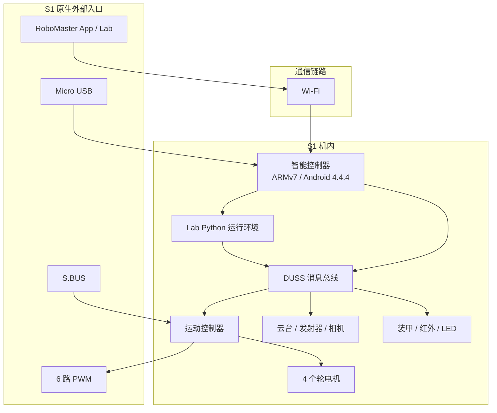
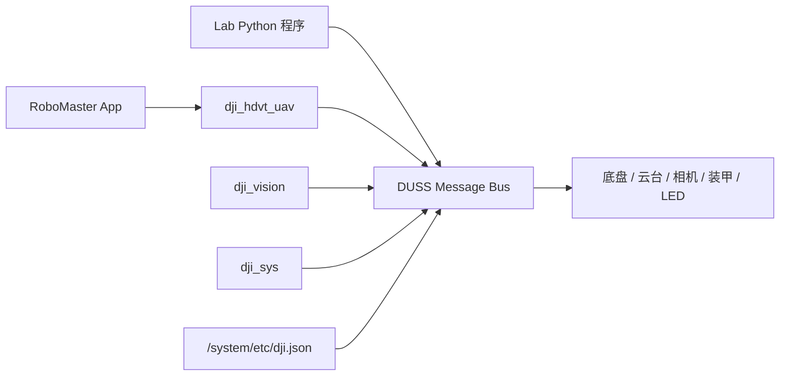
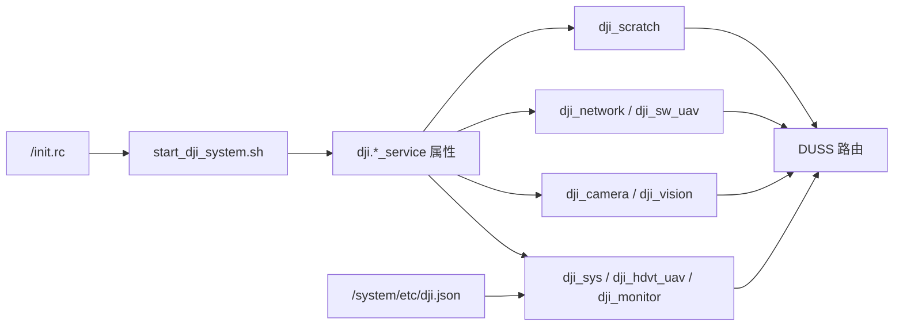
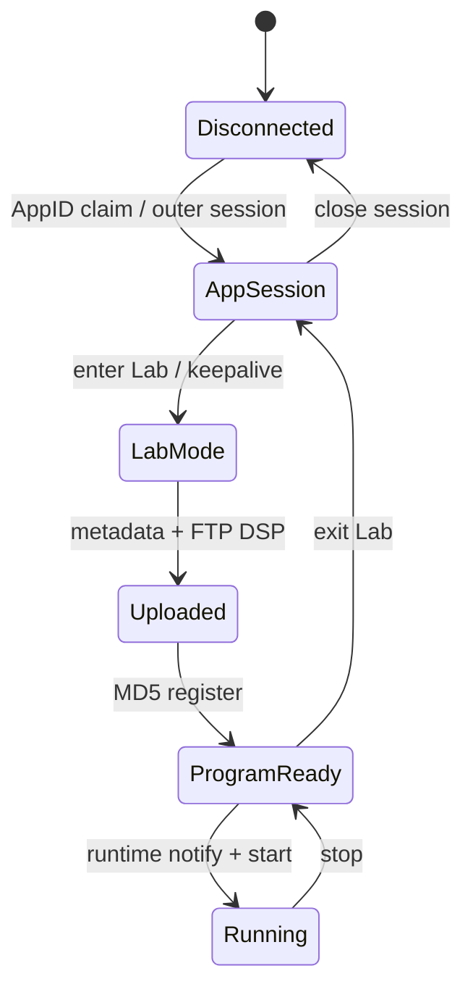
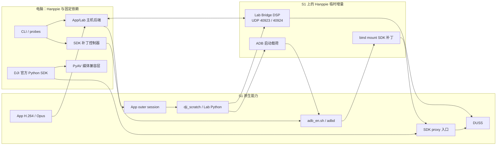
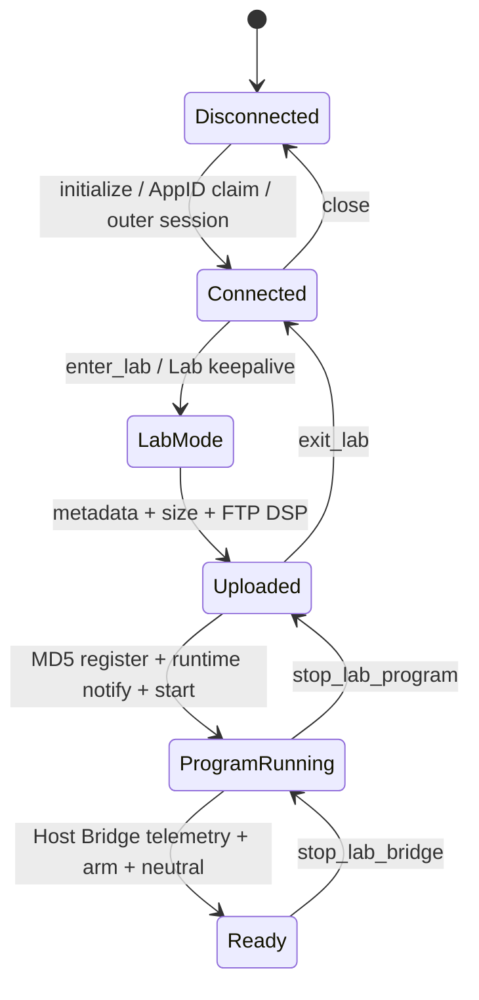
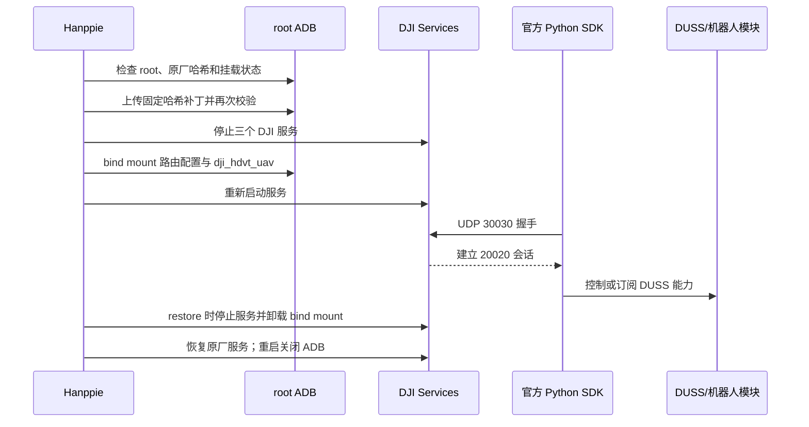
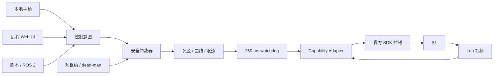

# RoboMaster S1 与 Hanppie 技术架构

> 文档性质：Hanppie 的长期技术事实源，不使用日期文件名。 
> 当前版本：1.2 
> 最后更新：2026-08-30 
> 已验证固件：RoboMaster S1 `00.06.0521`

本文持续记录 RoboMaster S1 的固有软硬件架构、通信机制和扩展边界，以及 Hanppie 在这些基础上增加的电脑控制能力。为避免把原机能力与项目改动混为一谈，二者按章节严格分开；按日期保存的调研和联调记录只作为证据，不替代本文。

## 证据标记

为避免把“代码中存在”误写成“真机可用”，本文使用以下标记：

| 标记 | 含义 |
| --- | --- |
| **实测** | 已在固件 `00.06.0521` 的 S1 上观察到协议结果或物理效果 |
| **代码** | 可由仓库内恢复代码或固定版本上游代码直接确认 |
| **官方** | 来自 DJI 手册、规格或官方 SDK |
| **推断** | 由多项证据推导，但尚未直接验证 |
| **待验证** | 接口或社区实现存在，但本项目尚未完成实机确认 |

能力结论至少区分四层：接口存在、命令被接受、遥测发生变化、物理效果得到确认。

证据标记只表示结论如何得到，不表示能力归谁所有；能力归属以第 1 章和所在章节为准。例如，“实测通过”既可能是原机 App/Lab 能力，也可能是 Hanppie 临时补丁后的项目结果。

## 1. 文档范围与归属

本文使用以下归属，章节中的“原生”“外部”和“项目”均按此定义：

| 归属 | 含义 | 主要章节 |
| --- | --- | --- |
| **S1 原生** | 出厂硬件、固件服务、DUSS、RoboMaster App/Lab 和机内 Python；即使没有 Hanppie 也存在 | 第 2～5 章 |
| **外部生态** | S.BUS 接收机、SocketCAN/vcan、ROS 2、DJI EP SDK 等可与 S1 相关但不属于 Hanppie 的技术 | 第 6 章 |
| **Hanppie 项目** | 本仓库增加、恢复、组合或规划的主机代码、机内载荷、临时补丁和安全策略 | 第 7 章 |

“仓库中保存了原机文件”不表示该文件由 Hanppie 创建；`runtime/` 和 `resources/` 中的恢复内容是分析 S1 的证据。反过来，Lab Bridge、ADB 启动载荷、SDK 临时 bind mount 和 PyAV 兼容层均为项目增量，不能写成 S1 出厂能力。

## 2. S1 原生整机架构

S1 不是一个由电脑直接驱动电机的外设。它内部已经包含智能控制器、运动控制器、云台/相机和多个执行器/传感模块；出厂软件通过 RoboMaster App/Lab、Wi-Fi 和机内服务控制这些模块。

图中只画出 S1 出厂存在的入口和模块，不包含 Hanppie、官方 EP SDK 兼容补丁或计划中的远程控制器。项目如何接入这些入口见第 7 章。

## 3. S1 原生硬件架构

### 3.1 主要模块

| 模块 | 主要职责 | 证据 |
| --- | --- | --- |
| 智能控制器 | Wi-Fi、USB、视频、视觉、App/Lab、Python 运行环境、外部 SDK 代理 | **实测/代码** |
| 运动控制器 | 底盘运动、电源和外部 PWM/S.BUS 接口 | **官方/代码** |
| 两轴云台 | 俯仰、偏航和工作模式 | **官方/代码** |
| 相机与媒体链路 | 720p H.264 图传，音频链路使用 Opus | **实测/官方 SDK 代码** |
| 四轮底盘 | M3508I 电机与麦克纳姆轮运动 | **官方** |
| 装甲与红外 | 击打、红外事件和灯效 | **官方/代码，事件待实测** |
| 智能电池 | 供电、电量和状态管理 | **官方；外部 SDK 电量值不可信** |

### 3.2 智能控制器

已连接设备显示智能控制器使用 ARMv7 平台，运行 Android 4.4.4/API 19，构建类型为 `userdebug`、`test-keys`。设备包含 Python、DJI 服务、BusyBox、ADB 相关脚本和 DUSS 路由配置。**实测/代码**

这解释了几个关键现象：

1. RoboMaster Lab 的 Python 实际运行在机器人内部，而不是手机或电脑上；
2. 机内 Python 可以通过本地 DUSS 总线调用底盘、云台、灯光等模块；
3. S1 与 EP 的底层模块高度复用，但对外开放的服务集合不同；
4. 外部电脑能否使用某套 DUSS 客户端，还取决于机内是否开放对应的会话和转发入口。

### 3.3 外部接口

| 接口 | 原生用途 | 原生边界 |
| --- | --- | --- |
| 智能控制器 Micro USB | RNDIS、Mass Storage、Bulk、ACM 等复合 USB；固件也包含 ADB 组件 | 量产启动后不保证开放 ADB |
| Wi-Fi AP/Station | RoboMaster App/Lab、媒体和机内网络服务 | S1 原厂不开放完整 EP SDK 入口 |
| S.BUS | 单向底盘、云台、模式和扭矩控制 | 没有相机和完整遥测 |
| 6 路 PWM | 外部执行器扩展 | 只提供 PWM 输出能力 |
| 模块 CAN/UART | 运动控制器、云台、装甲等内部模块互连 | 不是官方消费级扩展 API |
| 保留 UART/USB | 固件或硬件内部用途 | 官方没有提供稳定扩展契约 |

S.BUS 信号、5 V 和 GND 的方向必须按机身丝印和手册确认。内部 CAN 不是面向普通用户的即插即用接口；接线、供电、终端电阻和主动发帧均可能损坏硬件。

## 4. S1 原生机内软件架构

### 4.1 系统信息快照

下表只记录已经从真机、ADB 输出或固件文件确认的内容；没有把社区同型号信息当作本机事实。

| 信息项 | 固件 `00.06.0521` 的记录 | 证据 |
| --- | --- | --- |
| CPU/ABI | ARMv7，机内关键二进制为 ARM32 EABI5 | **实测/文件审计** |
| 操作系统 | Android `4.4.4`，API 19 | **实测** |
| 型号/产品 | `L1860` / `full_xw607_dz_ap0002_v4` | **实测** |
| DJI 平台 | `XW0607_1860AC01` | **代码：`dji.json`** |
| 构建 | `userdebug`、`test-keys`，构建日期 2022-10-27 | **实测** |
| 系统属性 | `ro.secure=1`、`ro.debuggable=1`；DJI init 服务以 root 用户运行 | **代码/实测** |
| Shell/基础工具 | Android `mksh`、BusyBox，包含 ADB 脚本和 `adbd` | **代码/实测** |
| Lab 解释器 | `/data/python_files/bin/python`；本轮没有保存精确 `--version`，恢复的机内代码以 Python 3.6 语法为兼容基线 | **代码，版本待验证** |
| 运行环境 | `DEVICE_TYPE=UAV`，DJI 启动脚本设置 `HOME=/data`，init 设置固定 `PYTHONPATH` | **代码** |
| 主要网络接口 | `iwlan0`；`usb0` 固定为 `192.168.1.10`；`rndis0` 固定为 `192.168.42.2` | **代码；Wi-Fi Station 实测** |
| USB 复合功能 | 原厂路径使用 RNDIS、Mass Storage、Bulk、ACM；调试路径额外加入 ADB | **代码/实测** |

`default.prop` 中出现 ADB 配置不表示量产启动后一定能连接 ADB。`start_dji_system.sh` 会根据启动参数和白名单决定是否执行 `adb_en.sh`；本机正常重启后 ADB 不可见。**代码/实测**

### 4.2 启动链与系统服务

机内使用 Android init 的属性触发模型：`/init.rc` 在启动阶段运行一次 `/system/bin/start_dji_system.sh`；该脚本完成分区检查、Wi-Fi/SDR 选择、USB 和网络配置、FTP 启动、音频配置、日志目录准备，再设置 `dji.*_service` 属性。init 根据属性启动或停止对应进程。**代码**

| init 服务 | 启动程序 | 启动条件与职责 | 证据 |
| --- | --- | --- | --- |
| `start_dji_system` | `/system/bin/start_dji_system.sh` | 启动阶段一次性编排 DJI 系统 | **代码** |
| `dji_monitor` | `/system/bin/dji_monitor -m` | 监控 DJI 进程；启动脚本把它与 `dji_sys`、`dji_hdvt_uav` 作为关键存活检查 | **代码** |
| `dji_sys` | `/system/bin/dji_sys` | 系统服务和 DUSS 路由核心之一 | **代码/推断** |
| `dji_hdvt_uav` | `/system/bin/dji_hdvt_uav -g` | App 网络会话、DUSS 外部传输和媒体相关入口 | **代码/实测** |
| `dji_hdvt_cls` | `/system/bin/dji_hdvt_uav` | 同一二进制的另一启动形态，原厂启动脚本设为关闭 | **代码** |
| `dji_camera` | `/system/bin/dji_camera` | 相机与媒体服务 | **代码/推断** |
| `dji_vision` | `/system/bin/dji_vision` | 视觉处理服务，原厂启动脚本启用 | **代码** |
| `dji_network` | `/system/bin/dji_network -t wifi -i 10 -t sdr -i 5` | 网络路由；Wi-Fi 模式启用、SDR 模式关闭 | **代码** |
| `dji_sw_uav` | `/system/bin/dji_sw_uav` | Wi-Fi 模式的软件传输服务 | **代码/推断** |
| `dji_scratch` | `/data/python_files/bin/python /data/dji_scratch/bin/dji_scratch.py` | 常驻 Lab/Scratch 管理器，接收程序、控制执行并转发日志 | **代码** |
| `dji_blackbox` | `/system/bin/dji_blackbox` | 黑匣子与日志归档 | **代码** |
| `dji_perception` | `/system/bin/dji_perception` | 可选感知服务；原厂启动脚本默认未启用 | **代码** |

这些 init 服务均声明为 `disabled`，含义是“不随 Android service class 自动启动”，不是永久禁用；它们由 `dji.*` 属性显式启动。**代码/实测**

启动脚本还启动匿名可写 FTP：`busybox tcpsvd -vE 0 21 busybox ftpd -w /ftp`。`/ftp` 是指向 `/data/ftp` 的符号链接，因此 FTP 21 暴露的是持久数据分区。该服务没有应用层认证，只应在可信隔离网络使用。**代码**

### 4.3 关键程序与文件

| 路径 | 原机职责 | 原生状态 |
| --- | --- | --- |
| `/init.rc` | DJI 服务定义、属性触发器、Lab 解释器入口、全局环境变量 | 系统启动配置 |
| `/system/bin/start_dji_system.sh` | DJI 系统启动编排、FTP/网络/USB/音频/日志初始化 | 原厂启动脚本 |
| `/system/etc/dji.json` | 平台、HAL、DUSS 服务及路由表 | 原厂路由配置 |
| `/system/bin/dji_hdvt_uav` | App 网络会话、DUSS 外部传输和媒体相关入口 | 原厂二进制 |
| `/system/bin/dji_sys`、`dji_vision`、`dji_camera` | 系统、视觉和媒体关键进程 | 原厂二进制 |
| `/data/dji_scratch/bin/dji_scratch.py` | init 实际启动的 Lab/Scratch 常驻管理器 | 持久数据分区中的原厂程序 |
| `/data/dji_scratch/src/robomaster/` | 机内 `rm_ctrl`、`rm_module`、DUSS 客户端等 Python 运行库 | Lab 原生运行库 |
| `/data/python_files/bin/python` | Lab/Scratch 固定 Python 解释器 | 固件随附解释器 |
| `/data/ftp/python/python_raw.dsp` | App/Lab 上传的 DSP 程序容器 | 每次上传覆盖；文件存在不代表正在运行 |
| `/system/bin/adb_en.sh`、`/sbin/adbd` | 原厂调试脚本和 ADB daemon | 固件包含，量产启动后不一定启用 |

备份中还保存了 `/data/dji/dji_scratch.py`，其内容是 Lab/Scratch 管理器实现；但 init 中确认的实际服务入口是 `/data/dji_scratch/bin/dji_scratch.py`，在没有进一步 inode/符号链接证据前，不把两者写成同一个活动文件。**代码，关系待验证**

### 4.4 DUSS 路由与模块

恢复的 [`event_client.py`](../src/hanppie/runtime/event_client.py) 使用 Android 抽象 Unix Datagram Socket，例如 `\0/duss/mb/0x...`。[`dji.json`](../src/hanppie/resources/dji.json) 描述服务、模块和路由关系。**代码**

Lab 系统客户端和用户脚本分别绑定类似 `\0/duss/mb/0x905`、`\0/duss/mb/0x906` 的本地地址，未命中专用路由时把消息发往默认代理 `\0/duss/mb/0x900`。路由器再按 receiver 映射到相机、视觉、系统或 `vt_air` 等本地进程。底盘、云台、电池、ESC、装甲和发射器等模块在原厂 `dji.json` 中主要经 `/dev/ttyS3`、`921600 baud` 的 DUSS V1 路由连接。**代码**

[`rm_module.py`](../src/hanppie/runtime/rm_module.py) 把底盘、云台、灯光、相机、视觉、声音、装甲等能力封装为 DUSS 消息；[`rm_ctrl.py`](../src/hanppie/runtime/rm_ctrl.py) 再提供面向 Lab 程序的高层控制对象。**代码**

仓库中的 `src/hanppie/runtime` 和 `resources/dji.json` 是从原机恢复并整理的分析副本，不是桌面 SDK，也不是 Hanppie 重新设计的协议实现。对这些副本所做的必要整理见第 7 章。

这说明“DUSS 总线”不是单根物理总线：在智能控制器内它表现为 Unix Datagram Socket 和消息路由，在控制器到下级模块之间又可以映射为 UART 等传输。内部 CAN 研究是另一层硬件路径，不能与这里的机内 DUSS 路由直接画等号。

### 4.5 S1 与 EP 的产品边界

DJI 官方 Python SDK 以 EP/EP Core 为正式对象。S1 拥有大量相同的 DUSS 命令和模块，但原厂状态没有对电脑开放完整的 EP SDK 代理。**官方/代码/实测**

实机重启后的原厂状态中，DJI 服务正常运行，但 UDP 30030 不监听，官方 SDK 握手超时。**实测** Hanppie 如何临时开放该入口及其改动范围见第 7.8 节。

## 5. S1 原生通信机制

本章只描述原厂固件、App/Lab 和机内模块已经具备的机制。Hanppie 对这些机制的复用方式从第 7 章开始记录。

### 5.1 DUSS 二进制消息

从机内运行库恢复的 DUSS V1 消息结构如下：

| 字段 | 作用 |
| --- | --- |
| `0x55` | 帧起始标记 |
| 版本与长度 | 表示协议版本和整帧长度 |
| CRC8 | 保护消息头 |
| sender / receiver | 编码后的模块地址 |
| sequence | 请求与响应关联 |
| command type | 请求、响应、是否需要 ACK |
| command set / command id | 能力类别与具体命令 |
| payload | 参数或遥测数据 |
| CRC16 | 保护完整消息 |

恢复的 [`duss_event_msg.py`](../src/hanppie/runtime/duss_event_msg.py) 负责打包和解包，[`duml_crc.py`](../src/hanppie/runtime/duml_crc.py) 实现 CRC8/CRC16。**代码**

DUSS 是多个传输上的共同消息语义，不等同于某个固定网口：智能控制器内使用抽象 Unix Datagram Socket，智能控制器与部分下级模块之间映射到 UART 等链路，App 会话又可在外层报文中承载 DUSS。

因此可以把结论概括为：**DUSS 是 S1 模块控制面的核心协议，但“能构造一帧 DUSS”不等于已经获得完整的电脑控制能力。**

| DUSS 已解决的部分 | 仍需额外解决的部分 |
| --- | --- |
| 模块地址、命令集/命令 ID、请求与 ACK、任务进度、遥测事件 | 外部客户端如何发现并占用会话 |
| 底盘、云台、灯光、装甲、相机配置等模块消息 | 外层 session、tick、sequence、channel 和 keepalive |
| 机内服务和下级模块之间的统一消息语义 | 工作模式切换、初始化序列、连续控制与失联停车 |
| 同一命令在不同物理传输上的路由基础 | DSP/音频文件传输、H.264/Opus 媒体数据和解码 |
| 用任意语言重新实现编解码的可能性 | 未公开 payload 的语义、固件差异和物理安全验证 |

Python 不是 DUSS 的组成部分。只要实现帧格式、CRC、地址、序列、ACK/任务状态和相应生命周期，就可以用 C、C++、Rust、Go 等语言收发 DUSS。Python 只是 RoboMaster Lab 和现有主机 SDK 采用的一种实现语言。

### 5.2 原生网络通道与端口

| 通道 | 连接/端口 | 原生作用 | 本机证据 |
| --- | --- | --- | --- |
| App 发现/AppID claim | Host UDP `45678` ↔ S1 UDP `56789` | 发现机器人、声明 8 字节 AppID | **实测可用** |
| App outer session | Host 默认 UDP `10609` ↔ S1 UDP `10607` | 包裹 DUSS、控制帧和通道数据，维护 session/tick | **实测可用** |
| Lab 程序文件 | 匿名 FTP/TCP `21` | 上传 DSP 到 `/python/python_raw.dsp` | **实测可用** |
| App 视频/音频 | S1 → Host UDP `40921` / `40922`，也可能由 outer channel 复用 | H.264 / Opus 媒体 | **视频实测可用；音频待验证** |
| ADB 组件 | USB 或 TCP `5555` | 固件维护和调试 | **固件存在；原厂正常重启后未开放** |

原厂 `dji.json` 还包含以下内部或条件路由。它们用于系统盘点，不应直接当作可访问 API：

| 配置端口 | 路由用途 | 配置状态/边界 |
| --- | --- | --- |
| TCP `9001` | `camera_sdr` 的 DMP 通道 | 路由启用，当前 Wi-Fi/App 会话是否直接使用待抓包确认 |
| TCP `20002` | `download_service` 到相机的下载通道 | Wi-Fi 路由启用 |
| `20000` / `20001` | `usb0` 上相机/下载内部通道 | 原厂表中相关路由关闭 |
| TCP `22350` | system service 到 PC 的通道 | 原厂表中关闭 |
| UDT `5555` | 相机/下载到固定 mobile/glass 地址的 UDT 通道 | 与 TCP 5555 ADB 无关 |
| `8905`–`8916`、`8919`、`8925` | 各 DJI 进程的 blackbox output port | 配置字段，未逐端口验证监听状态 |

端口号必须连同传输协议、会话角色和服务状态理解；端口出现在配置中不表示原厂启动后一定监听。

### 5.3 App/Lab 程序机制

“App/Lab”不是一套替代 DUSS 的单层控制协议，而是 S1 原生的分层机制：

- **App 传输层**：发现、AppID claim、outer session 和通道封装，外层报文可以承载 DUSS；
- **Lab 控制层**：通过 DUSS 切换 Lab 模式、提交程序元数据、注册并启动或停止程序；
- **FTP 文件层**：把 DSP 程序容器上传到 S1，文件内容不塞进普通 DUSS 控制帧；
- **机内执行层**：`dji_scratch` 使用固件内置 Python 和 DJI 控制对象执行用户程序。

AppID 是 App 日志中十进制标识按 8 字节小端序解释得到的 ASCII 值；设备实际值属于本地标识，不写入公开仓库。Host 先绑定 UDP `45678`，向 S1 UDP `56789` 发送 AppID 并确认广播/ACK，随后在本地 UDP `10609` 与 S1 UDP `10607` 之间建立 outer session。session、tick 以及 direct/control 序列属于每次连接的动态状态，不能固定重放一次抓包的头部。**代码/实测**

#### 5.3.1 DSP 程序容器

Lab 程序不是裸 `.py` 文件，而是 `.dsp` XML 容器，主要包含：

- `guid`、`sign`、标题、固件/App 版本条件等元数据；
- `code_type=python`；
- `<python_code><![CDATA[...]]></python_code>` 中的用户 Python；
- 可选 Scratch 描述和音频资源。

兼容客户端先发送 GUID、sign 和字节数等 DUSS 元数据，再以匿名 FTP 把文件写到 `/python/python_raw.dsp`。由于 `/ftp -> /data/ftp`，对应机内文件是 `/data/ftp/python/python_raw.dsp`。FTP 成功只证明文件已写入，不能证明程序已经注册或执行。**代码/实测**

#### 5.3.2 原生程序生命周期

| 阶段 | 原生行为 | 重要边界 |
| --- | --- | --- |
| 建立 App 会话 | AppID claim、outer session、接收循环 | 尚未进入 Lab |
| 进入 Lab | 切换工作模式并持续发送 Lab keepalive | keepalive 是运行状态的一部分 |
| 上传程序 | 发送 metadata/GUID/size，再经 FTP 写入 DSP | 文件写入不等于注册或启动 |
| 注册与启动 | 使用 MD5 注册，发送 runtime notify 和 start | 启动结果需由程序行为或事件确认 |
| 停止程序 | 发送脚本停止控制和运行时通知 | 不等于删除 DSP 文件 |
| 退出 Lab | 停止 Lab keepalive并恢复普通模式 | 不等于关闭基础 App socket |
| 关闭会话 | 结束接收循环和网络 socket | 应在机械归零和停止程序之后执行 |

程序文件位于 `/data`，退出 Lab 不会删除它；注册状态能否跨客户端重连或冷启动复用尚未实测，不能把文件存在、程序已注册和程序正在运行视为同一个状态。

#### 5.3.3 机内程序执行

`dji_scratch` 是常驻的 root Python 管理进程。恢复入口注册了脚本数据下载、下载完成、脚本控制和 heartbeat 等 DUSS 回调；实际的 `script_manage` 模块没有包含在公开恢复代码中，因此“如何从 DSP 生成具体临时文件和子进程”的最后一段实现仍待补证据。已确认的边界是：

1. init 用 `/data/python_files/bin/python` 启动 `/data/dji_scratch/bin/dji_scratch.py`；
2. 管理器解析 DSP 的 XML 和 `python_code`，根据控制消息创建、启动和停止用户脚本；
3. 用户程序在 DJI 注入的 `robot_ctrl`、`chassis_ctrl`、`gimbal_ctrl`、`rm_define` 等上下文中暴露 `start()`。

#### 5.3.4 机内 Python 兼容性

S1 Lab 程序受固件内固定解释器、标准库和 DJI 注入模块约束。当前恢复代码以 Python 3.6 语法作为兼容目标，但本轮没有保存机内解释器的精确 `--version`，仍需实机补录。这个约束只属于机内 Lab 实现，不属于 DUSS 协议本身；主机端或其他语言客户端的版本边界见第 7.5 节。

### 5.4 原生媒体路径

S1 的 App/Lab 路径会输出 H.264 视频和 Opus 音频。本机已从该路径解码出 `1280×720 yuv420p` 视频帧；音频尚未完成实测。**实测/代码**

## 6. 外部扩展机制与生态

本章中的技术可能连接或适配 S1，但它们不是 Hanppie 的发明，也不应视为 S1 机内软件的一部分。

### 6.1 S.BUS、PWM 与内部 CAN

| 机制 | 归属 | 可获得能力 | 主要边界 |
| --- | --- | --- | --- |
| S.BUS | S1 硬件原生入口 + 外部接收机 | 底盘、云台、模式、速度和底盘扭矩 | 单向控制，没有相机和完整遥测 |
| PWM | S1 硬件原生输出 | 驱动外部执行器 | 不是模块控制总线 |
| 内部 CAN/UART | S1 模块互连 | 深层模块控制和遥测研究 | 非公开扩展契约，电气与协议风险高 |

S.BUS 是遥控接收机常用的反相串行通道。S1 手册定义了对应通道，但外部接收机、信号转换和控制器需另行提供。信号、5 V 和 GND 方向必须按机身丝印和手册确认。

### 6.2 SocketCAN 与 vcan

- **SocketCAN** 是 Linux 将 CAN 控制器暴露为 socket 的统一 API，应用通过类似 `can0` 的接口读写 CAN 帧。
- **vcan** 是不连接真实硬件的虚拟 SocketCAN 接口，适合测试帧编码、过滤和状态机，但不能验证电气层或真实 S1 模块响应。

二者都是 Linux 主机侧的开发接口，不是 S1 固件服务。把 vcan 测试通过也不能证明 S1 CAN 接线、位速率、终端电阻或消息语义正确。

### 6.3 DJI EP SDK

DJI 官方 Python SDK 正式支持 EP/EP Core，不正式支持 S1。其网络服务和 Python 客户端都属于 DJI SDK 生态；S1 只是复用了部分模块和 DUSS 命令，原厂状态没有开放完整 SDK proxy。

| SDK 通道 | 连接/端口 | S1 原厂边界 |
| --- | --- | --- |
| 二进制 SDK | 握手 UDP `30030`，控制会话关联 UDP `20020` | 原厂重启后 30030 不监听 |
| 官方视频/音频 | TCP `40921` / `40922` | S1 的官方视频启动请求被拒绝；音频待验证 |
| 明文 SDK | TCP/UDP `40923`–`40926` | EP 协议存在，S1 待验证 |
| 二进制发现 | UDP `40927` | 官方 SDK 代码存在，S1 待验证 |

### 6.4 ROS 2 与 `robomaster_ros`

ROS 2 是机器人软件中连接驱动、控制、视觉、导航和 UI 的分布式中间件。节点通过 topic、service 和 action 交换数据；它不是机器人驱动，也不会自动获得 S1 没有开放的能力。

[`jeguzzi/robomaster_ros`](https://github.com/jeguzzi/robomaster_ros) 是 RoboMaster 的社区 ROS 2 驱动/集成项目，围绕 SDK 提供机器人节点，并连接手柄、相机、音频、里程计等 ROS 接口。它位于已有机器人通信后端之上，不修改 S1 固件，也不负责为原厂 S1 开放 EP SDK proxy。

## 7. Hanppie 项目实现与机制

**从本章开始才描述 Hanppie 所做的实现、改动和规划。**前文中的原机文件、协议和服务即使被本仓库引用，也不因此成为项目新增能力。

### 7.1 项目目标与边界

Hanppie 不替换整套 S1 固件，而是在保留原机控制器、相机、云台、底盘和安全机制的前提下，恢复或构建：

- 电脑直接连接，不依赖手机 App；
- Python 编程和可审计的协议探测；
- 有安全约束的本地或远程手柄控制；
- 视频与可信遥测；
- 可恢复、尽量不持久修改设备的维护路径；
- 为 ROS 2、Web UI 或自动化算法提供稳定适配层。

当前不以持久 root、替换启动链、提高发射能力或绕过机械安全限制为目标。

### 7.2 相对原机的改动清单

| 项目增量 | 发生位置 | 对原机做了什么 | 持久性/恢复方式 |
| --- | --- | --- | --- |
| 固定的 App/Lab 主机后端 | 电脑 | 实现 AppID、outer session 和 Lab 生命周期 | 不修改固件 |
| Hanppie Lab Bridge DSP | `/data/ftp/python/python_raw.dsp` | 上传白名单 JSON 控制与遥测程序 | 文件写入 `/data`；可停止或覆盖，不等于开机自启 |
| ADB 启动载荷 | Lab 用户程序 | 调用原机 `adb_en.sh` 并重启 `adbd` | 运行态变化；重启后关闭 |
| SDK 补丁暂存 | `/data/s1_sdk_test/` | 保存固定哈希的路由配置和 `dji_hdvt_uav` 补丁 | 文件可持续存在；删除目录可清理 |
| SDK bind mount | 运行中的 `/system/etc/dji.json`、`/system/bin/dji_hdvt_uav` | 临时覆盖运行视图，开放 EP SDK proxy | `restore` 卸载；重启自然回滚；不覆盖 `/system` 原文件 |
| DJI 服务重启 | S1 运行态 | 补丁启停时重启 `dji_sys`、`dji_hdvt_uav`、`dji_vision` | 仅当前运行周期 |
| PyAV 媒体兼容层 | 电脑 | 替代官方 SDK 缺失的 macOS `libmedia_codec` 扩展 | 不修改 S1，也不能改变 S1 命令支持情况 |
| `runtime/`、`resources/` 分析副本 | Git 仓库 | 保存恢复的原机运行库和配置供研究/测试 | 只影响仓库；不是部署到 S1 的新运行时 |

Hanppie 不修改 `/init.rc`、原厂启动脚本或 `/system` 持久文件。表中“写入 `/data`”与“开机自动生效”是两件事：补丁文件可以仍在磁盘上，但 bind mount、服务状态和 TCP 5555 ADB 都会随重启失效。

### 7.3 当前实现架构

项目当前采用混合后端：官方 SDK 路径提供已验证的控制命令和部分有效遥测；App/Lab 路径提供 S1 原生程序机制、已验证的 720p 视频和 S1 特有入口。两条路径的能力和失败模式不相同，不能把它们抽象成“同一个端口上的同一协议”。

### 7.4 包边界

| 路径 | 项目职责 |
| --- | --- |
| `cli.py` | 统一命令入口、后端选择和依赖提示 |
| `adb_bootstrap.py` | 通过 Lab 会话临时开启 ADB |
| `sdk_patch.py` | 检查、启用和恢复临时官方 SDK 服务 |
| `media_codec.py` | 官方 SDK 的 PyAV 媒体兼容层 |
| `probes/` | 单一目的、默认无机械运动的实机探针 |
| `payloads/` | 临时上传到 S1 的最小机内载荷 |
| `runtime/` | 恢复的 S1 Lab/DUSS 运行时参考；不作为桌面 SDK 重构 |
| `resources/` | 原机配置和非执行参考资源 |

### 7.5 后端隔离与 Python 边界

官方 SDK 和 App/Lab SDK 的 Python 包存在命名冲突，不能在同一个环境中可靠共存。项目通过 uv extras 和冲突声明显式切换：

- `task sync:lab`：安装固定提交的 App/Lab 后端；
- `task sync:official`：安装官方 SDK 的主机依赖和媒体兼容依赖；
- macOS 或 Python 3.9+ 通过 `HANPPIE_OFFICIAL_SDK_PATH` 加载固定提交的官方源码；
- Python 3.8 的 Linux/Windows x86_64 可以直接使用 DJI 官方 wheel。

| 运行位置 | 当前约束 | 原因 |
| --- | --- | --- |
| S1 机内 Lab 程序 | 固定机内解释器和 DJI 模块；项目载荷保持 Python 3.6 语法兼容 | 固件环境不可随主机升级；精确解释器版本仍待记录 |
| 电脑上的 Hanppie 核心 | Python 3.8+ | 项目自身工具链选择 |
| 电脑上的 LAB-SDK | Python 3.10+ | 固定上游 Host SDK 的声明和依赖 |
| 电脑上的 DJI 官方 SDK | 官方 wheel 只覆盖部分旧 Python/平台；固定源码可经兼容层运行于更新版本 | 官方发行物和依赖约束 |
| 非 Python 客户端 | 无 Python 约束 | 需要自行实现 App outer、SDK proxy 或机内 DUSS 客户端及生命周期 |

所以不是“只有 Lab Python 才有兼容性要求”，而是每个 Python 实现分别受其运行环境约束；这些约束都不属于 DUSS 协议本身。

### 7.6 Lab Bridge 与项目生命周期

Hanppie 在 S1 原生 Lab 生命周期之上上传一个项目自定义 DSP。该程序自行打开 Host → S1 UDP `40923` 和 S1 → Host UDP `40924`，以白名单 JSON method 接收控制意图并回传遥测。它再调用机内 controller API 生成 DUSS；这组 UDP/JSON 语义是 Hanppie/LAB-SDK 的桥接协议，不是 DJI 所有 Lab 程序天然具备的协议。

固定 LAB-SDK 中的 `Dc68Envelope` 实现 App outer session：每次连接生成 session 和 tick，并分别维护 direct/control 序列。Hanppie 通过它进入原生 Lab 生命周期，再增加 Bridge 就绪和机械归零状态：

| 项目操作 | 机内/主机发生的事情 | 重要边界 |
| --- | --- | --- |
| `initialize()` | AppID claim、outer session、接收循环 | 不进入 Lab，不上传程序 |
| `enter_lab()` | 归零控制状态，发送 Lab mode DUSS，每 `0.8 s` 续发 keepalive，再发送 Lab 参数与状态查询 | keepalive 是会话状态的一部分 |
| `upload_lab_bridge()` | 生成 DSP，发送 metadata/GUID/size，经 FTP 上传，保存 MD5 | 新上传会使主机侧“已注册”状态失效 |
| `start_lab_program()` | 初次以 MD5 注册，发送 metadata/runtime notify/start；同一对象中已注册时只发 start | 只启动机内程序，尚未证明 Bridge 可用 |
| `start_lab_bridge()` | 主机启动 UDP TX/RX，发送 probe，等待真实 telemetry，绑定当前 session，arm 后立即 neutral stop | telemetry 才是当前实现的就绪条件 |
| `stop_lab_bridge()` | 先发送全局 stop，再结束主机 UDP 进程 | **不会停止机内 Python 程序** |
| `stop_lab_program()` | 发送停止用 metadata 和 runtime notify，恢复 Lab keepalive | **不会自动关闭 Host Bridge** |
| `exit_lab()` | 停止 Lab keepalive，发送普通模式与 neutral control | 不删除已上传 DSP，也不关闭基础 socket |
| `close()` | 停 Host Bridge、尝试退出 Lab、关闭 App socket/thread | 当前实现**不会代替调用 `stop_lab_program()`** |

安全退出必须显式按“机械归零 → `stop_lab_bridge()` → `stop_lab_program()` → `exit_lab()` → `close()`”执行，并放在 `finally` 中。新连接按完整上传/注册流程处理，不假定旧注册状态可复用。

### 7.7 临时开启 ADB

[`adb_bootstrap.py`](../src/hanppie/adb_bootstrap.py) 复用原生 App/Lab 会话，上传仓库内置的最小程序：

1. 取得 Lab 会话并进入 Lab 模式；
2. 上传 [`enable_adb_standalone.py.txt`](../src/hanppie/payloads/enable_adb_standalone.py.txt)；
3. 机内程序调用原机已有的 `adb_en.sh`，设置 TCP 5555 并重启 `adbd`；
4. 主机等待 ADB 出现后才继续维护；
5. 完成维护后在线恢复服务并重启 S1，关闭无认证 root ADB。

项目没有向固件增加 `adbd`；它只利用原机已有但正常启动后未开放的组件。Lab Python 在测试设备上以 root 身份运行；`os.system()` 在该环境失败，而模块顶层的 `subprocess.Popen` 可执行系统命令。**实测**

### 7.8 临时官方 SDK 路径

[`sdk_patch.py`](../src/hanppie/sdk_patch.py) 不覆盖 `/system`：补丁先放在 `/data`，验证固定 SHA-256 后再 bind mount 到运行路径。`restore` 卸载它们并检查原厂哈希；设备重启也会自然回滚。补丁启用后 UDP 30030 开始监听，官方握手和 `Robot.initialize()` 成功。**代码/实测**

### 7.9 媒体兼容与混合后端

官方 SDK 的相机启动请求在数据传输前被 S1 拒绝，因此不能用“电脑端缺少解码库”解释该失败。项目继续使用原生 App/Lab 媒体路径取得已验证的 720p 视频。**实测**

[`media_codec.py`](../src/hanppie/media_codec.py) 用 PyAV 提供官方 SDK 所期望的 `libmedia_codec` 接口，解决 macOS 上缺少 DJI 原生扩展的问题；它只解决主机解码兼容性，不会让机器人接受不支持的相机命令。**代码/实测**

### 7.10 探针与质量边界

每个 `probe-*` 命令只回答一个问题，例如“能否握手”“是否有遥测”“能否取得视频帧”。探针默认不发送机械运动或发射指令，显式要求目标参数，打印机器可读结果，并在 `finally` 中退订、停流和关闭连接。

Hanppie 自行维护的主机代码由 Ruff、pytest、coverage 和 prek 检查。恢复的 `runtime` 保留原始结构，只进行必要的包导入调整；其协议关键路径通过 CRC 和消息往返测试覆盖。构建使用 uv 的锁文件生成 sdist 和 wheel。

### 7.11 当前能力矩阵

下表记录的是 **Hanppie 当前验证结果**，不是 S1 出厂能力表。

| 能力 | 后端 | 状态 | 说明 |
| --- | --- | --- | --- |
| App/Lab 会话 | Lab | **实测通过** | 无需 root |
| 机内 Lab Python | Lab | **实测通过** | 可上传、启动、停止 |
| 姿态回传 | Lab | **实测通过** | 已获得连续样本 |
| 720p 视频 | Lab | **实测通过** | `1280×720 yuv420p` |
| Lab 电量 | Lab | **不支持/未知** | 当前返回 `None` |
| root ADB | Lab + payload | **实测通过** | USB/TCP，重启关闭 |
| 官方低层握手 | 官方 + 临时补丁 | **实测通过** | 原厂状态失败符合预期 |
| `Robot.initialize()` | 官方 + 临时补丁 | **实测通过** | Python 3.8 与 3.14 |
| 固件/序列号/模式 | 官方 | **实测通过** | 身份数据有效 |
| 云台角度订阅 | 官方 | **实测通过** | 非零真实值 |
| LED | 官方 | **物理实测通过** | 亮绿和关闭 |
| 电量/IMU/ESC/底盘姿态 | 官方 | **回调但不可信** | 持续回传零 |
| 位置/速度 | 官方 | **待运动交叉验证** | 静止时为零 |
| 官方相机 | 官方 | **S1 拒绝** | 使用 Lab 视频替代 |
| 底盘运动 | 官方/S.BUS | **待安全实测** | 必须先完成 watchdog |
| 云台运动 | 官方/S.BUS | **待安全实测** | 先做小角度闭环 |
| 装甲/红外事件 | 官方/Lab | **待验证** | 代码存在 |
| 扬声器/视觉识别 | 官方/Lab | **待验证** | 代码存在 |
| 发射器 | 官方/Lab | **默认禁用** | 不进入普通控制路径 |

### 7.12 远程控制目标架构

远程控制不能让手柄、Web UI 或脚本直接调用 SDK 执行器。所有控制来源必须经过同一个安全仲裁器：

最低安全约束：

1. 控制源只能持有短期租约，必须持续续约；
2. 超过 250 ms 没有新意图时立即发送零速度；
3. 手柄断开、窗口失焦、网络中断或进程退出均进入停车状态；
4. 初次测试在车轮悬空条件下进行，平移和旋转严格限速；
5. 发射能力与驾驶解锁分离，并默认完全禁用；
6. 远程视频与控制延迟分别监控，视频卡顿不能阻塞停车命令；
7. S.BUS 若实现，应作为独立的人工接管优先级，而不是第二个无仲裁控制源。

### 7.13 安全与恢复模型

#### 7.13.1 网络安全

- TCP 5555 是无认证 root ADB，只能在隔离网络短时开放；
- 不通过公网、VPN Overlay 或路由器端口转发暴露 ADB/SDK；
- 不把真实凭据、个人文件或未脱敏备份放入 S1；
- 完成维护后先 `sdk restore`，再重启并确认 5555 拒绝连接。

#### 7.13.2 文件安全

- `enable` 只接受固定的已审计 SHA-256；
- 上传后在设备端再次计算哈希；
- 修改使用 `/data` 暂存和 bind mount，不覆盖 `/system`；
- 发现设备文件既不匹配原厂哈希，也不匹配补丁哈希时立即停止；
- 设备备份、厂商二进制和序列号日志不进入 Git。

#### 7.13.3 机械安全

- 自动化测试不执行机械动作；
- 首次底盘测试必须悬空车轮，首次云台测试只做小角度；
- 取出水弹并保持物理电源开关可触达；
- 不能以 API 返回成功代替物理方向、速度和停车验证。

## 8. 已知未知项与验证方法

| 问题 | 验证方法 | 完成条件 |
| --- | --- | --- |
| 官方底盘控制是否正确 | 悬空轮、低速短租约、立即归零 | ACK、轮速/物理方向、超时停车均正确 |
| 云台闭环是否正确 | 小角度动作并订阅真实角度 | 目标、遥测和物理角度一致 |
| 哪些 DDS 主题是真实数据 | 与 App/Lab 或外部测量交叉验证 | 非零变化与物理状态一致 |
| 官方声音/视觉是否兼容 | 一次只测一个能力并清理状态 | API、数据/事件和物理结果一致 |
| 装甲/红外事件格式 | 触发已知事件并记录 DUSS | 重复触发得到稳定字段 |
| 明文 SDK 是否可复用 | 临时服务下只发送无运动查询 | 能进入 command 模式并安全退出 |
| 机内 Python 精确版本与模块集 | root ADB 下记录解释器 `--version`、`sys.version`、`sys.path` 和模块探针 | 能区分解释器版本、DJI 注入模块和标准库边界 |
| 原厂启动后的完整进程/端口快照 | 冷启动后只读记录 `ps`、`getprop init.svc.*`、`netstat` 和 `/proc/net/unix` | 服务、PID、监听端口和 DUSS Unix socket 能互相对应 |
| DSP 文件和注册状态能否跨重启复用 | 上传无运动程序，分别测试退出 Lab、重连和冷启动 | 明确文件、注册、运行三个状态各自的持久边界 |
| `script_manage` 的实际执行流程 | 从设备备份模块并审计 DSP 解析、子进程创建和终止逻辑 | 找到用户 Python 文件路径、启动命令和信号处理 |
| 不同固件是否兼容 | 建立脱敏固件/哈希/能力矩阵 | 每个结论附固件和恢复结果 |
| 长时稳定性 | 重复冷启动和网络断连测试 | 10 次冷启动、30 分钟运行、断连停车通过 |

## 9. 文档维护规则

以下变化必须更新本文：

- 新确认或否定一项硬件能力；
- 新发现端口、消息格式、服务或模块关系；
- 修改 ADB、SDK 补丁、媒体或后端选择流程；
- 新增 S.BUS、CAN、ROS 2、远程控制等架构组件；
- 改变安全默认值、哈希验证或恢复步骤；
- 新固件实测结果改变当前能力矩阵。

更新时应：

1. 先确定事实属于 S1 原生、外部生态还是 Hanppie 项目，只修改对应章节；
2. 标记证据等级；
3. 把可复现命令和完整输出放入新的实测记录，而不是无限扩充本文；
4. 在下方更新日志追加一条摘要；
5. 检查中英文 README 中的事实性摘要是否需要同步。

第 2～5 章不得记录 Hanppie 的实现流程、文件修改策略或目标架构；第 7 章必须明确每项项目增量发生在电脑还是 S1、是否持久化以及如何恢复。跨层结论使用交叉引用，不在原生章节复制项目流程。

### 更新日志

| 日期 | 版本 | 变化 |
| --- | --- | --- |
| 2026-08-30 | 1.2 | 将 S1 原生事实、外部生态和 Hanppie 项目实现分层，集中记录项目改动、生命周期和恢复边界 |
| 2026-08-30 | 1.1 | 补充系统/启动服务/关键文件清单，明确 DUSS 的能力边界，并还原 App/Lab 分层协议和程序生命周期 |
| 2026-08-30 | 1.0 | 基于固件 `00.06.0521` 的两轮实测、恢复代码和固定上游 SDK，建立长期架构基线 |

## 参考与证据

- [真机联调与官方 SDK 恢复记录](./s1-live-debug-2026-08-29.md)
- [电脑控制与二次开发调研报告](./robomaster-s1-revival-report.md)
- [DJI RoboMaster S1 用户手册 v1.8](https://dl.djicdn.com/downloads/robomaster-s1/20220429UM/RoboMaster_S1_User_Manual_v1.8_EN.pdf)
- [DJI RoboMaster-SDK](https://github.com/dji-sdk/RoboMaster-SDK)
- [RoboMaster-S1-WiFi-SDK](https://github.com/tatsuyai713/RoboMaster-S1-WiFi-SDK)
- [jeguzzi/robomaster_ros](https://github.com/jeguzzi/robomaster_ros)
- [proroklab/robomaster_sdk_can](https://github.com/proroklab/robomaster_sdk_can)
