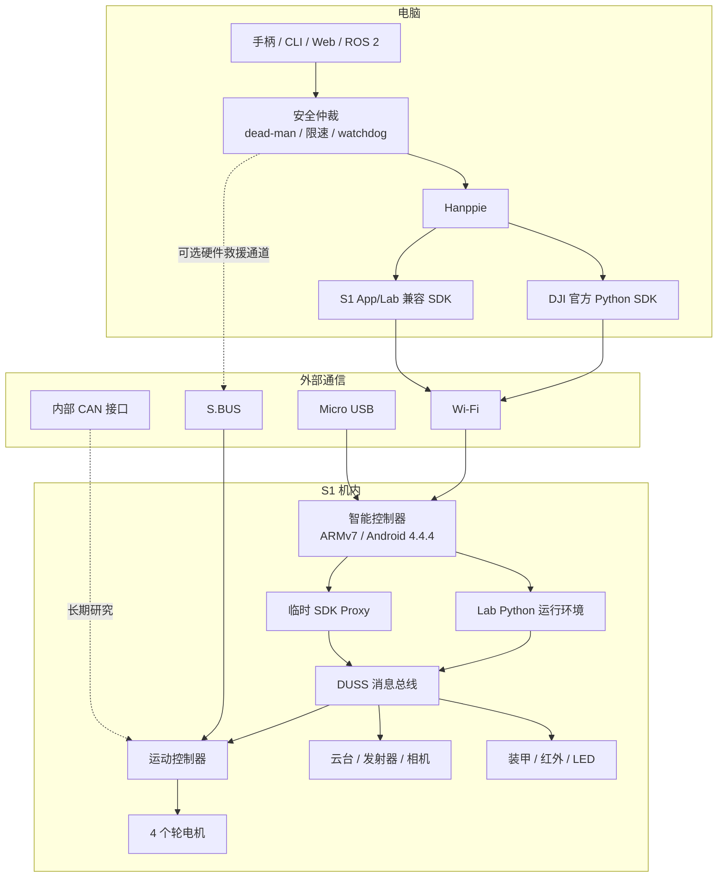
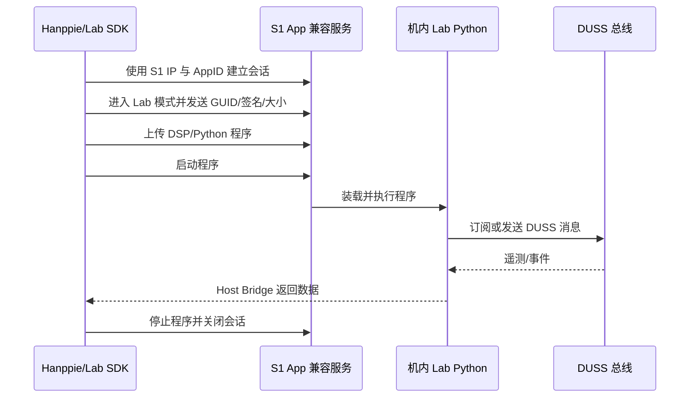
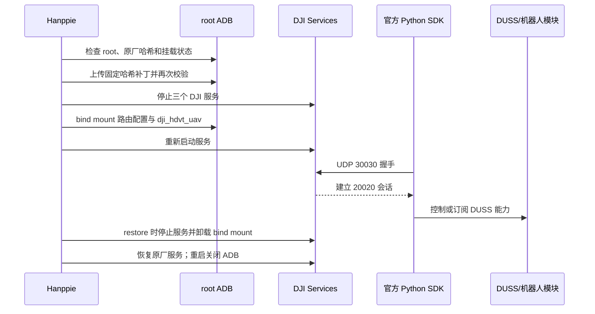
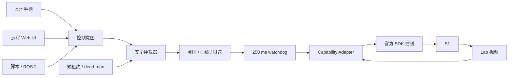

# RoboMaster S1 技术架构

> 文档性质：Hanppie 的长期技术事实源，不使用日期文件名。<br>
> 当前版本：1.0<br>
> 最后更新：2026-08-30<br>
> 已验证固件：RoboMaster S1 `00.06.0521`

本文持续记录 RoboMaster S1 的软硬件架构、通信机制、扩展边界，以及 Hanppie 如何恢复电脑编程能力。架构、协议、能力边界或实现流程发生变化时，必须在同一个变更中更新本文；按日期保存的调研和联调记录只作为证据，不替代本文。

## 证据标记

为避免把“代码中存在”误写成“真机可用”，本文使用以下标记：

| 标记 | 含义 |
| --- | --- |
| **实测** | 已在固件 `00.06.0521` 的 S1 上观察到协议结果或物理效果 |
| **代码** | 可由仓库内恢复代码或固定版本上游代码直接确认 |
| **官方** | 来自 DJI 手册、规格或官方 SDK |
| **推断** | 由多项证据推导，但尚未直接验证 |
| **待验证** | 接口或社区实现存在，但本项目尚未完成实机确认 |

能力结论至少区分四层：接口存在、命令被接受、遥测发生变化、物理效果得到确认。

## 1. 系统目标与边界

Hanppie 的目标不是替换整套 S1 固件，而是在保留原机控制器、相机、云台、底盘和安全机制的前提下，恢复以下能力：

- 电脑直接连接，不依赖手机 App；
- Python 编程和可审计的协议探测；
- 有安全约束的本地或远程手柄控制；
- 视频与可信遥测；
- 可恢复、尽量不持久修改设备的维护路径；
- 为 ROS 2、Web UI 或自动化算法提供稳定适配层。

当前不以持久 root、替换启动链、提高发射能力或绕过机械安全限制为目标。

## 2. 整机架构总览

S1 不是一个由电脑直接驱动电机的外设。它内部已经包含智能控制器、运动控制器、云台/相机和多个执行器/传感模块；电脑只是在某条入口上成为新的控制端。



当前推荐的是混合后端：

- 官方 SDK 负责已验证的控制命令和有效遥测；
- App/Lab 后端负责已验证的 720p 视频和 S1 特有路径；
- Hanppie 在两者之上统一能力、生命周期和安全策略；
- S.BUS 可在未来作为不依赖智能控制器的人工接管通道；
- CAN 接管只用于长期研究，不是当前恢复电脑控制的首选路径。

## 3. 硬件架构

### 3.1 主要模块

| 模块 | 主要职责 | 证据 |
| --- | --- | --- |
| 智能控制器 | Wi-Fi、USB、视频、视觉、App/Lab、Python 运行环境、外部 SDK 代理 | **实测/代码** |
| 运动控制器 | 底盘运动、电源和外部 PWM/S.BUS 接口 | **官方/代码** |
| 两轴云台 | 俯仰、偏航和工作模式 | **官方/代码** |
| 相机与媒体链路 | 720p H.264 图传，音频链路使用 Opus | **实测/官方 SDK 代码** |
| 四轮底盘 | M3508I 电机与麦克纳姆轮运动 | **官方** |
| 装甲与红外 | 击打、红外事件和灯效 | **官方/代码，事件待实测** |
| 智能电池 | 供电、电量和状态管理 | **官方；外部 SDK 电量值不可信** |

### 3.2 智能控制器

已连接设备显示智能控制器使用 ARMv7 平台，运行 Android 4.4.4/API 19，构建类型为 `userdebug`、`test-keys`。设备包含 Python、DJI 服务、BusyBox、ADB 相关脚本和 DUSS 路由配置。**实测/代码**

这解释了几个关键现象：

1. RoboMaster Lab 的 Python 实际运行在机器人内部，而不是手机或电脑上；
2. 机内 Python 可以通过本地 DUSS 总线调用底盘、云台、灯光等模块；
3. S1 与 EP 的底层模块高度复用，但对外开放的服务集合不同；
4. “让官方 SDK 支持 S1”的核心是恢复机器人侧入口，而不是重新设计全部控制指令。

### 3.3 外部接口

| 接口 | 用途 | 当前策略 |
| --- | --- | --- |
| 智能控制器 Micro USB | 复合 USB、维护；临时开启后可使用 ADB | 已用于恢复流程 |
| Wi-Fi AP/Station | App/Lab、视频、官方 SDK 和远程控制 | 当前主路径 |
| S.BUS | 单向底盘/云台/模式控制 | 未来人工接管和救援通道 |
| 6 路 PWM | 外部执行器扩展 | 尚未纳入 Hanppie |
| 模块 CAN | 运动控制器、云台、装甲等模块互连 | 只做被动研究或长期接管实验 |
| 保留 UART/USB | 官方未提供稳定消费级扩展契约 | 不依赖 |

S.BUS 信号、5 V 和 GND 的方向必须按机身丝印和手册确认。内部 CAN 不是面向普通用户的即插即用接口；接线、供电、终端电阻和主动发帧均可能损坏硬件。

## 4. 机内软件架构

```mermaid
flowchart LR
    APP[RoboMaster App]
    LABPROGRAM[Lab Python 程序]
    HDVT[dji_hdvt_uav]
    VISION[dji_vision]
    SYS[dji_sys]
    ROUTE[/system/etc/dji.json]
    MB[DUSS Message Bus]
    MODULES[底盘 / 云台 / 相机 / 装甲 / LED]

    APP --> HDVT
    LABPROGRAM --> MB
    HDVT --> MB
    VISION --> MB
    SYS --> MB
    ROUTE --> MB
    MB --> MODULES
```

### 4.1 DUSS 路由与模块

恢复的 [`event_client.py`](../src/hanppie/runtime/event_client.py) 使用 Android 抽象 Unix Datagram Socket，例如 `\0/duss/mb/0x...`。[`dji.json`](../src/hanppie/resources/dji.json) 描述服务、模块和路由关系。**代码**

[`rm_module.py`](../src/hanppie/runtime/rm_module.py) 把底盘、云台、灯光、相机、视觉、声音、装甲等能力封装为 DUSS 消息；[`rm_ctrl.py`](../src/hanppie/runtime/rm_ctrl.py) 再提供面向 Lab 程序的高层控制对象。**代码**

因此，`src/hanppie/runtime` 是恢复的**机内运行时参考**，不是桌面 SDK。Hanppie 只对它做包内相对导入等必要的互操作性整理，不把它当作常规主机业务代码重构。

### 4.2 S1 与 EP 的产品边界

DJI 官方 Python SDK 以 EP/EP Core 为正式对象。S1 拥有大量相同的 DUSS 命令和模块，但原厂状态没有对电脑开放完整的 EP SDK 代理。**官方/代码/实测**

实机重启后的原厂状态中，DJI 服务正常运行，但 UDP 30030 不监听，官方 SDK 握手超时；临时替换已审计的路由配置和 `dji_hdvt_uav` 后，30030 开始监听，官方握手和 `Robot.initialize()` 成功。**实测**

## 5. 通信机制

### 5.1 DUSS 二进制消息

仓库恢复代码展示的 DUSS V1 消息结构如下：

| 字段 | 作用 |
| --- | --- |
| `0x55` | 帧起始标记 |
| 版本与长度 | 表示协议版本和整帧长度 |
| CRC8 | 保护消息头 |
| sender / receiver | 编码后的模块地址 |
| sequence | 请求与响应关联 |
| command type | 请求、响应、是否需要 ACK |
| command set / command id | 能力类别与具体命令 |
| payload | 参数或遥测数据 |
| CRC16 | 保护完整消息 |

[`duss_event_msg.py`](../src/hanppie/runtime/duss_event_msg.py) 负责打包和解包，[`duml_crc.py`](../src/hanppie/runtime/duml_crc.py) 实现 CRC8/CRC16。离线测试包含已知 CRC 向量和消息往返。**代码/测试**

DUSS 是多个传输上的共同消息语义，不等同于某个固定网口：机内可以走 Unix Socket，官方 SDK 可以把同类命令封装在电脑与机器人之间的网络会话中。

### 5.2 外部通信通道

| 通道 | 连接/端口 | 作用 | S1 当前结论 |
| --- | --- | --- | --- |
| App/Lab 控制 | Wi-Fi，App 兼容会话 | Lab 管理、程序上传、S1 原生控制 | **实测可用** |
| Lab 程序文件 | FTP/程序上传协议 | 上传 DSP/Python 内容 | **实测可用** |
| Lab Host Bridge | UDP 数据桥 | 把机内订阅数据返回电脑 | **实测可用** |
| 官方二进制 SDK | 代理握手 UDP 30030，控制会话关联 20020 | 官方 Python API | **临时补丁后可用** |
| 官方视频 | TCP 40921 | H.264 视频 | **S1 请求被拒绝** |
| 官方音频 | TCP 40922 | Opus 音频 | **待验证** |
| 明文 SDK | TCP/UDP 40923–40926 | 命令、推送、事件、发现 | **待验证** |
| 二进制发现 | UDP 40927；旧实现也使用 45678 | 机器人发现 | **代码，S1 待验证** |
| ADB | USB 或临时 TCP 5555 | 诊断和临时维护 | **实测可用，重启关闭** |

端口是服务启动后的协议约定，不能据此假定原厂 S1 正在监听。

### 5.3 App/Lab 程序路径



AppID 是 App 日志中十进制标识按 8 字节小端序解释得到的 ASCII 值；设备实际值属于本地标识，不写入公开仓库。**实测**

### 5.4 临时开启 ADB

[`adb_bootstrap.py`](../src/hanppie/adb_bootstrap.py) 复用 App/Lab 会话，上传仓库内置的最小程序：

1. 取得 Lab 会话并进入 Lab 模式；
2. 上传 [`enable_adb_standalone.py.txt`](../src/hanppie/payloads/enable_adb_standalone.py.txt)；
3. 机内程序调用已有的 `adb_en.sh`，设置 TCP 5555，并重启 `adbd`；
4. 主机等待 ADB 出现后才继续维护；
5. 完成维护后在线恢复服务并重启 S1，关闭无认证 root ADB。

Lab Python 在测试设备上以 root 身份运行；`os.system()` 在该环境失败，而模块顶层的 `subprocess.Popen` 可执行系统命令。当前内置载荷远小于实测的 Lab DSP 大小边界。**实测**

### 5.5 临时官方 SDK 路径



[`sdk_patch.py`](../src/hanppie/sdk_patch.py) 不覆盖 `/system`：补丁先放在 `/data`，验证固定 SHA-256 后再 bind mount 到运行路径。`restore` 卸载它们并检查原厂哈希；设备重启也会自然回滚。**代码/实测**

### 5.6 视频与媒体

S1 的 App/Lab 媒体路径已经解码出 `1280×720 yuv420p` 帧。官方 SDK 的相机启动请求则在数据传输前被 S1 拒绝，因此不能用“电脑端缺少解码库”解释该失败。**实测**

[`media_codec.py`](../src/hanppie/media_codec.py) 用 PyAV 提供官方 SDK 所期望的 `libmedia_codec` 接口，解决 macOS 上缺少 DJI 原生扩展的问题；它只解决主机解码兼容性，不会让机器人接受不支持的相机命令。**代码/实测**

## 6. 扩展机制与取舍

| 扩展方式 | 可获得能力 | 风险 | Hanppie 定位 |
| --- | --- | ---: | --- |
| Lab Python | S1 原生模块、程序和部分遥测 | 低，临时程序 | 启动 ADB、研究 S1 特有协议 |
| 临时官方 SDK | 高层 Python 控制与部分 DDS | 中，需要 root 和服务替换 | 当前控制主路径 |
| App/Lab 视频 | S1 原生 720p 图传 | 低 | 当前视频主路径 |
| S.BUS | 底盘、云台、模式、扭矩开关 | 低到中，需电气桥接 | 未来独立人工接管 |
| PWM | 外部执行器 | 中 | 尚未纳入 |
| 内部 CAN | 深度模块接管和底层遥测 | 高 | 长期研究，先 vcan/被动抓包 |
| ROS 2 | 标准话题、服务、TF、导航生态 | 软件复杂度中等 | 直接控制稳定后的上层适配 |

### 6.1 S.BUS、SocketCAN 与 vcan

- **S.BUS** 是遥控接收机常用的反相串行通道。S1 手册定义了底盘、云台、模式、速度和底盘扭矩通道；它是单向控制，没有相机和完整遥测。
- **SocketCAN** 是 Linux 把 CAN 控制器暴露为 socket 的统一 API。应用通过类似 `can0` 的接口读写 CAN 帧。
- **vcan** 是不连接真实硬件的虚拟 SocketCAN 接口，适合测试帧编码、过滤和状态机，但不能验证电气层或真实 S1 模块响应。

当前 Wi-Fi 混合后端已经覆盖编程、控制入口和视频，因此不把 S.BUS/CAN 作为第一阶段依赖。S.BUS 的主要价值是独立于智能控制器的人工接管；CAN 的价值是长期协议研究。

### 6.2 ROS 2

ROS 2 是机器人软件中连接驱动、控制、视觉、导航和 UI 的分布式中间件。节点通过 topic、service 和 action 交换数据。`jeguzzi/robomaster_ros` 展示了 RoboMaster 的 ROS 2 驱动、手柄、相机、音频和里程计接口。

Hanppie 不直接依赖 ROS 2。只有在连接、重连、停车、视频和可信遥测稳定后，再把 capability adapter 暴露为 `cmd_vel`、相机 topic 和传感 topic，避免把 S1 的兼容缺口传播到整个 ROS 图。

## 7. Hanppie 的工作原理

### 7.1 包边界

| 路径 | 职责 |
| --- | --- |
| `cli.py` | 统一命令入口、后端选择和依赖提示 |
| `adb_bootstrap.py` | 通过 Lab 会话临时开启 ADB |
| `sdk_patch.py` | 检查、启用和恢复临时官方 SDK 服务 |
| `media_codec.py` | 官方 SDK 的 PyAV 媒体兼容层 |
| `probes/` | 单一目的、默认无机械运动的实机探针 |
| `payloads/` | 临时上传到 S1 的最小机内载荷 |
| `runtime/` | 恢复的 S1 Lab/DUSS 运行时参考 |
| `resources/` | 原始配置和非执行参考资源 |

### 7.2 后端隔离

官方 SDK 和 App/Lab SDK 的 Python 包存在命名冲突，不能在同一个环境中可靠共存。项目通过 uv extras 和冲突声明显式切换：

- `task sync:lab`：安装固定提交的 App/Lab 后端；
- `task sync:official`：安装官方 SDK 的主机依赖和媒体兼容依赖；
- macOS 或 Python 3.9+ 通过 `HANPPIE_OFFICIAL_SDK_PATH` 加载固定提交的官方源码；
- Python 3.8 的 Linux/Windows x86_64 可以直接使用 DJI 官方 wheel。

### 7.3 探针而不是隐式动作

每个 `probe-*` 命令只回答一个问题，例如“能否握手”“是否有遥测”“能否取得视频帧”。探针的原则是：

- 默认不发送机械运动或发射指令；
- 显式要求设备 IP、AppID、序列号或 ADB target；
- 打印机器可读的关键结果；
- 在 `finally` 中退订、停流和关闭连接；
- 失败时保留能力边界，而不是把返回 `True` 当作物理效果。

### 7.4 项目质量边界

Hanppie 自行维护的主机代码由 Ruff、pytest、coverage 和 prek 检查。恢复的 `runtime` 保留原始结构，只进行必要的包导入调整；其协议关键路径通过 CRC 和消息往返测试覆盖。构建使用 uv 的锁文件生成 sdist 和 wheel。

## 8. 当前能力矩阵

| 能力 | 后端 | 状态 | 说明 |
| --- | --- | --- | --- |
| App/Lab 会话 | Lab | **实测通过** | 无需 root |
| 机内 Lab Python | Lab | **实测通过** | 可上传、启动、停止 |
| 姿态回传 | Lab | **实测通过** | 已获得连续样本 |
| 720p 视频 | Lab | **实测通过** | `1280×720 yuv420p` |
| Lab 电量 | Lab | **不支持/未知** | 当前返回 `None` |
| root ADB | Lab + payload | **实测通过** | USB/TCP，重启关闭 |
| 官方低层握手 | 官方 + 临时补丁 | **实测通过** | 原厂状态失败符合预期 |
| `Robot.initialize()` | 官方 + 临时补丁 | **实测通过** | Python 3.8 与 3.14 |
| 固件/序列号/模式 | 官方 | **实测通过** | 身份数据有效 |
| 云台角度订阅 | 官方 | **实测通过** | 非零真实值 |
| LED | 官方 | **物理实测通过** | 亮绿和关闭 |
| 电量/IMU/ESC/底盘姿态 | 官方 | **回调但不可信** | 持续回传零 |
| 位置/速度 | 官方 | **待运动交叉验证** | 静止时为零 |
| 官方相机 | 官方 | **S1 拒绝** | 使用 Lab 视频替代 |
| 底盘运动 | 官方/S.BUS | **待安全实测** | 必须先完成 watchdog |
| 云台运动 | 官方/S.BUS | **待安全实测** | 先做小角度闭环 |
| 装甲/红外事件 | 官方/Lab | **待验证** | 代码存在 |
| 扬声器/视觉识别 | 官方/Lab | **待验证** | 代码存在 |
| 发射器 | 官方/Lab | **默认禁用** | 不进入普通控制路径 |

## 9. 远程控制目标架构

远程控制不能让手柄、Web UI 或脚本直接调用 SDK 执行器。所有控制来源必须经过同一个安全仲裁器：



最低安全约束：

1. 控制源只能持有短期租约，必须持续续约；
2. 超过 250 ms 没有新意图时立即发送零速度；
3. 手柄断开、窗口失焦、网络中断或进程退出均进入停车状态；
4. 初次测试在车轮悬空条件下进行，平移和旋转严格限速；
5. 发射能力与驾驶解锁分离，并默认完全禁用；
6. 远程视频与控制延迟分别监控，视频卡顿不能阻塞停车命令；
7. S.BUS 若实现，应作为独立的人工接管优先级，而不是第二个无仲裁控制源。

## 10. 安全与恢复模型

### 10.1 网络安全

- TCP 5555 是无认证 root ADB，只能在隔离网络短时开放；
- 不通过公网、VPN Overlay 或路由器端口转发暴露 ADB/SDK；
- 不把真实凭据、个人文件或未脱敏备份放入 S1；
- 完成维护后先 `sdk restore`，再重启并确认 5555 拒绝连接。

### 10.2 文件安全

- `enable` 只接受固定的已审计 SHA-256；
- 上传后在设备端再次计算哈希；
- 修改使用 `/data` 暂存和 bind mount，不覆盖 `/system`；
- 发现设备文件既不匹配原厂哈希，也不匹配补丁哈希时立即停止；
- 设备备份、厂商二进制和序列号日志不进入 Git。

### 10.3 机械安全

- 自动化测试不执行机械动作；
- 首次底盘测试必须悬空车轮，首次云台测试只做小角度；
- 取出水弹并保持物理电源开关可触达；
- 不能以 API 返回成功代替物理方向、速度和停车验证。

## 11. 已知未知项与验证方法

| 问题 | 验证方法 | 完成条件 |
| --- | --- | --- |
| 官方底盘控制是否正确 | 悬空轮、低速短租约、立即归零 | ACK、轮速/物理方向、超时停车均正确 |
| 云台闭环是否正确 | 小角度动作并订阅真实角度 | 目标、遥测和物理角度一致 |
| 哪些 DDS 主题是真实数据 | 与 App/Lab 或外部测量交叉验证 | 非零变化与物理状态一致 |
| 官方声音/视觉是否兼容 | 一次只测一个能力并清理状态 | API、数据/事件和物理结果一致 |
| 装甲/红外事件格式 | 触发已知事件并记录 DUSS | 重复触发得到稳定字段 |
| 明文 SDK 是否可复用 | 临时服务下只发送无运动查询 | 能进入 command 模式并安全退出 |
| 不同固件是否兼容 | 建立脱敏固件/哈希/能力矩阵 | 每个结论附固件和恢复结果 |
| 长时稳定性 | 重复冷启动和网络断连测试 | 10 次冷启动、30 分钟运行、断连停车通过 |

## 12. 文档维护规则

以下变化必须更新本文：

- 新确认或否定一项硬件能力；
- 新发现端口、消息格式、服务或模块关系；
- 修改 ADB、SDK 补丁、媒体或后端选择流程；
- 新增 S.BUS、CAN、ROS 2、远程控制等架构组件；
- 改变安全默认值、哈希验证或恢复步骤；
- 新固件实测结果改变当前能力矩阵。

更新时应：

1. 修改对应章节和能力矩阵；
2. 标记证据等级；
3. 把可复现命令和完整输出放入新的实测记录，而不是无限扩充本文；
4. 在下方更新日志追加一条摘要；
5. 检查中英文 README 中的事实性摘要是否需要同步。

### 更新日志

| 日期 | 版本 | 变化 |
| --- | --- | --- |
| 2026-08-30 | 1.0 | 基于固件 `00.06.0521` 的两轮实测、恢复代码和固定上游 SDK，建立长期架构基线 |

## 参考与证据

- [真机联调与官方 SDK 恢复记录](./s1-live-debug-2026-08-29.md)
- [电脑控制与二次开发调研报告](./robomaster-s1-revival-report.md)
- [DJI RoboMaster S1 用户手册 v1.8](https://dl.djicdn.com/downloads/robomaster-s1/20220429UM/RoboMaster_S1_User_Manual_v1.8_EN.pdf)
- [DJI RoboMaster-SDK](https://github.com/dji-sdk/RoboMaster-SDK)
- [RoboMaster-S1-WiFi-SDK](https://github.com/tatsuyai713/RoboMaster-S1-WiFi-SDK)
- [jeguzzi/robomaster_ros](https://github.com/jeguzzi/robomaster_ros)
- [proroklab/robomaster_sdk_can](https://github.com/proroklab/robomaster_sdk_can)
