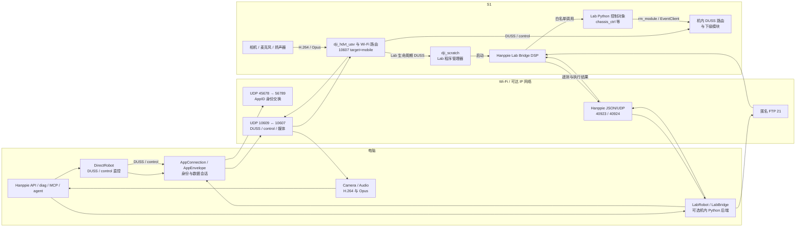
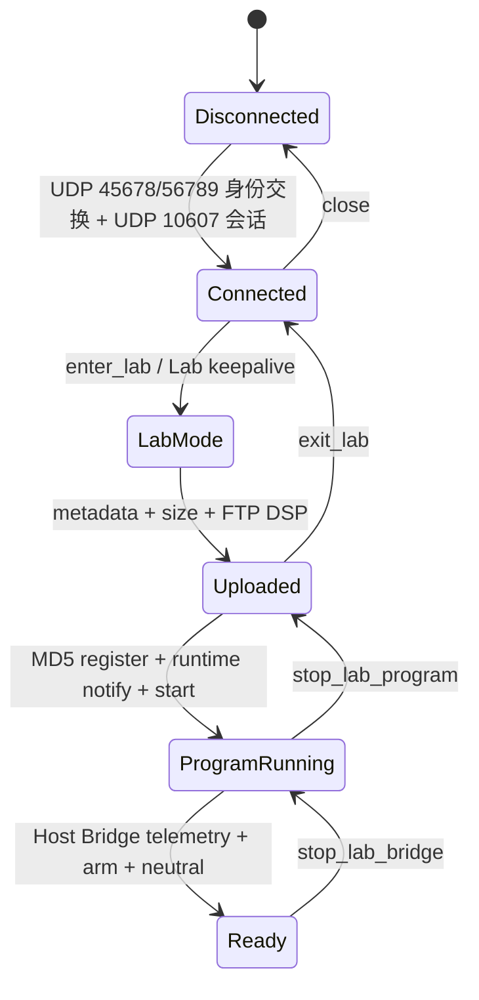
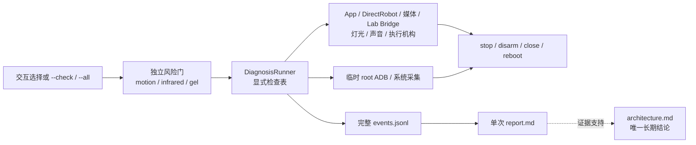

# Hanppie 技术架构

> 文档性质：Hanppie 当前实现、能力和安全边界的长期技术事实源。<br>
> 最后更新：2026-09-12<br>
> 已验证固件：RoboMaster S1 `00.06.0521`

本文只记录 Hanppie 当前增加、恢复或组合的主机代码、Kotlin 客户端、机内载荷、能力状态与安全策略。RoboMaster S1 原生硬件、固件、App/Lab、DUSS、协议调查和外部生态统一维护在 [RoboMaster S1 原生架构、协议与调查](./architecture-robomaster.md)。已废弃方案、旧命令、迁移过程和历史取舍由日期化记录与 Git 历史保存。

## 文档所有权

| 信息类型 | 权威位置 |
| --- | --- |
| Hanppie 代码结构、实现机制、能力矩阵和安全边界 | 本文 |
| S1 原生硬件、固件服务、协议、App/Lab 机制和外部生态 | [`architecture-robomaster.md`](./architecture-robomaster.md) |
| 视觉、交互、断点和组件规范 | [`DESIGN.md`](../DESIGN.md) |
| 安装、CLI 参数和开发命令 | 中英文 README、`hanppie --help` 和 `pyproject.toml` |
| 单次实机命令、原始输出、故障和测量值 | 日期化联调记录或 `diag` 自动报告 |
| 内置 SDK fork 来源 | [`src/robomaster/UPSTREAM.md`](../src/robomaster/UPSTREAM.md) |

自动生成的 `.hanppie/diagnosis/<timestamp>/`、`.hanppie/mcp/sessions/<session-id>/` 和 `.hanppie/agent/` 记录默认不进入 Git。真机结果改变能力结论时，只更新本文的能力矩阵并引用对应证据。

## 证据标记

为避免把“代码中存在”误写成“真机可用”，本文使用以下标记：

| 标记 | 含义 |
| --- | --- |
| **实测** | 已在固件 `00.06.0521` 的 S1 上观察到协议结果或物理效果 |
| **代码** | 可由仓库内恢复代码或固定版本上游代码直接确认 |
| **官方** | 来自 DJI 手册、规格或官方 SDK |
| **推断** | 由多项证据推导，但尚未直接验证 |
| **待验证** | 接口或社区实现存在，但本项目尚未完成实机确认 |

能力结论至少区分四层：接口存在、命令被接受、遥测发生变化、物理效果得到确认。

## 1. Hanppie 项目实现与机制

**本章只描述 Hanppie 所做的实现、改动和当前边界。** RoboMaster S1 原机文件、协议和服务统一见 [RoboMaster S1 原生架构、协议与调查](./architecture-robomaster.md)；它们即使被本仓库引用，也不因此成为项目新增能力。

### 1.1 项目目标与边界

Hanppie 不替换整套 S1 固件，而是在保留原机控制器、相机、云台、底盘和安全机制的前提下，恢复或构建：

- 电脑直接连接，不依赖手机 App；
- Python 编程和可审计的协议探测；
- 有安全约束的本地或远程手柄控制；
- 视频、双向音频与可信遥测；
- 可恢复、尽量不持久修改设备的维护路径；
- 为 ROS 2、Web UI 或自动化算法提供稳定适配层。

当前不以持久 root、替换启动链、提高发射能力或绕过机械安全限制为目标。

### 1.2 相对原机的改动清单

| 项目增量 | 发生位置 | 对原机做了什么 | 持久性/恢复方式 |
| --- | --- | --- | --- |
| 内置 S1 直连与 Lab 主机后端 | Git 仓库与电脑 | `src/hanppie/lab` 实现 UDP `45678/56789` 身份交换、UDP `10609/10607` 会话、DUSS/control 直控、Lab 生命周期、Bridge、视频和双向音频 | 随 Hanppie 安装；不修改固件；MIT |
| Typer/Rich CLI 与实机诊断 | Git 仓库与电脑 | 通过唯一 `diag` 命令执行完整诊断，生成完整 JSONL 日志和 Markdown 证据报告 | 只写本地 `.hanppie/diagnosis`；默认不进入 Git |
| `src/robomaster` SDK fork | Git 仓库与电脑 | 内置官方 `0.1.1.68`/`ff6646e` 的纯 Python 源码，保持 `robomaster` 导入路径；不是当前实机后端 | 随 Hanppie 安装；不修改 S1；Apache-2.0 |
| Hanppie Lab Bridge DSP | `/data/ftp/python/python_raw.dsp` | 上传白名单 JSON 控制与遥测程序 | 文件写入 `/data`；可停止或覆盖，不等于开机自启 |
| ADB 启动载荷 | Lab 用户程序 | 调用原机 `adb_en.sh` 并重启 `adbd` | 运行态变化；重启后关闭 |
| PyAV 媒体兼容层 | 电脑 | 替代官方 SDK 缺失的 macOS `libmedia_codec` 扩展 | 不修改 S1，也不能改变 S1 命令支持情况 |
| `runtime/`、`resources/` 分析副本 | Git 仓库 | 保存恢复的原机运行库和配置供研究/测试 | 只影响仓库；不是部署到 S1 的新运行时 |

Hanppie 不修改 `/init.rc`、原厂启动脚本或 `/system` 持久文件。Lab DSP 会写入 `/data`，但不等于开机自动运行；TCP 5555 ADB 只在诊断采集阶段临时启用，并由清理阶段重启设备关闭。

### 1.3 当前实现架构
#### 1.3.0 单体仓库与 Kotlin 多平台客户端

仓库包含 Python 工具链及独立的 Kotlin/Compose Android、桌面客户端。Android 直接运行共享协议代码，不需要电脑、Python 解释器或 MCP 服务。

| 路径 | 当前职责 |
| --- | --- |
| `androidApp` | 独立 Android 应用入口、系统显示模式、权限声明、APK 与真机 UI 测试；只依赖 `shared`，不依赖桌面应用 |
| `desktopApp` | 独立 Kotlin/JVM 应用入口、Compose application 生命周期及原生桌面打包；只依赖 `shared` |
| `shared` | KMP 共享 UI 库，无应用 `main` 或打包任务。`commonMain` 保存平台无关状态、接口、主题与 Compose Resources；`androidJvmMain` 在 Android/JVM 间共享 Navigation 3 路由、页面、会话和智能体；`androidMain` 与 `jvmMain` 提供各平台窗口/生命周期、文件选择、媒体、语音和凭据实现 |
| `packages/robot-core` | `commonMain` 实现 DUSS CRC、App 封包、广播解析、Lab DSP 容器和遥测；`jvmSharedMain` 在 Android/JVM 上复用 UDP、Apache Commons Net FTP、受约束的机内文件访问与 Lab 生命周期 |
| `src/hanppie`、`src/robomaster`、`tests` | 现有 Python 工具、SDK fork 和回归测试，不受客户端拆分影响 |

模块边界遵循 [KMP 官方推荐结构](https://kotlinlang.org/docs/multiplatform/multiplatform-project-recommended-structure.html)：平台应用入口依赖共享库，共享库不反向依赖应用。共享 UI 包名为 `cn.elonzh.hanppie.ui`，只向入口暴露 `AndroidWorkbench` 和 `DesktopWorkbench`；内部状态与控制器不因拆分而公开。一级页面与全屏驾驶舱使用 JetBrains Compose Multiplatform 发布的 Navigation 3 `NavKey`、可序列化 `NavBackStack` 和 `NavDisplay`；Android 配置变化与桌面重组共享同一路由实现，返回驾驶舱会弹出目的地而不是修改独立布尔状态。桌面共享库使用标准 `jvmMain` / `jvmTest`，跨 Android/JVM 的中间源集显式命名为 `androidJvmMain`。纯逻辑测试在 `commonTest`，JVM/UI 测试在共享库 `jvmTest`，Android instrumentation 在 `androidApp`；桌面启动及打包由 `desktopApp` 负责。协议库保留独立模块及其 `desktop` 目标。当前仅配置 Android/JVM 目标：UDP/FTP、同步资源格式化和部分智能体实现依赖 JVM，尚无 iOS target、Xcode 工程或 iOS 平台适配，不声明支持 iOS。

构建使用 Kotlin 2.4.10、Compose Multiplatform 1.12.0、Navigation 3 1.1.1、miuix 0.9.3、Compose Icons Lucide 2.2.1、Gradle 9.4.1、AGP 9.1.0，构建 JDK 21。通用工作台操作图标由 Lucide `ImageVector` 提供，Miuix `Icon` 负责着色和呈现；品牌与业务专用符号仍由 Compose Resources 管理。AGP 版本同时受构建依赖和 IDEA Android 插件支持范围约束，命令行构建通过不代表 IDE 同步兼容。Android `compileSdk=37`（Compose AAR 的最低编译要求）、`targetSdk=36`、`minSdk=26`；编译 SDK 不是手机必须运行的系统版本。客户端已接入 Koog 1.2.0 文字对话智能体，Android 支持系统语音输入，Android/桌面对话页支持回复朗读；未接入唤醒或手柄。Android 和桌面已接入机器人视频、麦克风下行播放，以及按住采集、松开发送的机器人扬声器短片对讲；对讲不是实时双工语音。

编译 SDK 使用显式 `release(37) { minorApiLevel = 0 }`，对应 SDK Manager 的 `platforms;android-37.0`。AGP 9.1.0 对此发出超出已测试 SDK 36.1 范围的警告；当前 APK/Lint 构建通过，未屏蔽该警告。IDEA 当前已验证的同步组合为 AGP 9.1.0 + Gradle 9.4.1，Wrapper 的 `distributionUrl` 固定该 Gradle 版本；版本升级必须同时验证 IDE 模型导入与命令行构建，不能仅根据 Problems Report 是否生成判断成功或失败。IDEA 同步完成且 Android 运行入口可用，不将此视为资源预览等全部 IDE 能力的验收。

桌面日志与对话列表通过平台 `DesktopListScrollbar` 接入 Compose Desktop 的 LazyListState 滚动条适配器，Android 实现为空，列表及其数据源仍由共享代码维护。

桌面 AWT 普通窗口最小为 320×480；操控窗口最小为 740×480，窄窗进入操控时调整为 1040×700，退出后恢复进入前尺寸。导航仅显示图标并保留语义名称。页面按可用宽度响应：小于 720 dp 使用底部导航，宽屏使用侧栏；设备、脚本、诊断、对话、设置五个入口共享实现。麦克风与发送采用相邻的 48 dp 图标按钮；模型配置、自动朗读和语音服务入口统一收纳于独立设置页，没有独立语音页。聊天草稿在页间切换时保留。Android 使用 edge-to-edge，并应用系统安全区和 IME Insets。设备页在未连接时呈现连接入口、电量、原生信号质量和脚本状态，连接后保留概览并提供进入遥控入口；IPv4/AppID 放在手动连接弹窗；原始遥测、日志和报文位于诊断页。脚本入口先呈现程序库，再进入顶部对齐的等宽编辑区；窄屏脚本卡片单列，宽屏按行排列，说明按需展开，操作按钮可换行。应用固定使用 Graphite Orange 浅色/深色色表，默认跟随系统显示模式；视觉与文案规范见 [DESIGN.md](../DESIGN.md)。

miuix 提供导航、按钮、输入框、卡片、开关和弹窗，`WorkbenchTheme` 统一设置 MiuixTheme，页面不使用 Material Design 组件。`LocalSquircleEnabled=false` 保持使用 miuix 标准圆角路径，避开 0.9.3 squircle shader 与 Compose 1.12.0 桌面 Skia 的 ABI 不兼容。脚本编辑器使用 Compose BasicTextField。设置语言使用下拉菜单，切换即时生效。

桌面入口在支持 AWT Taskbar 图标设置的平台上从 classpath 加载 `icons/hanppie.png` 并设置运行进程图标，覆盖 Gradle／IDE 开发启动；macOS Gradle 启动名为 Hanppie。Compose Window 使用资源库中的 `hanppie_app_icon.png`，原生安装包继续通过平台配置引用 PNG／ICO／ICNS。上述品牌资源均由品牌导出脚本生成。一级导航、普通页面、对话和遥控 HUD 的通用静态图标全部由 Compose Icons Lucide 提供，并通过唯一的 `WorkbenchGlyph` 语义映射交给 Miuix `Icon` 着色；资源库不再保存同义功能 SVG。准星叠层、可变信号条、摇杆和底盘相对相机朝向属于实时状态可视化，继续由 Compose Canvas 绘制。媒体请求仍统一经 `RemoteMediaController`，图标替换不更改请求或协议。

`AppearanceController` 只保存独立于连接与模型凭据的显示模式，支持跟随系统、浅色和深色，默认跟随系统。软件主题固定为 Graphite Orange，不再提供 miuix 原生、查派、海蓝、森林等预设或自定义色板；浅色/深色色表集中在 `HanppieDesignTokens.kt`，页面不动态派生主题。设置页只显示一个显示模式下拉行。显示模式以版本 2 的固定字段字符串保存到 Android `hanppie-ui` SharedPreferences / 桌面 `cn/elonzh/hanppie/ui` Java Preferences 的 `appearance` 键；读取版本 1 记录时只迁移其中的明暗模式并丢弃旧主题和自定义色值，缺失或无效记录使用默认值，不重建 ConsoleModel。Compose 系统明暗状态驱动跟随系统模式，Android 系统栏图标按当前背景亮度同步。设置页的全局“恢复默认”经过二次确认后同时恢复语言、显示模式、模型服务、自动朗读、控制参数、快捷键和 LED 状态色，并从平台凭据存储清除已保存的 API Key；环境变量覆盖保持生效但不会被重置操作复制进持久化配置。品牌头像、小标记和四种点阵表情通过 Compose Resources 共享；侧栏复用共享机器人头像，驾驶舱状态只显示一处点阵表情。设备页不绘制虚构的 S1 外形。`DevicePage` 将设备身份、连接动作、三项状态和现有页面入口分层呈现；宽屏连接动作限制为 260 dp 列，窄屏纵排。对话空状态使用共享品牌头像，脚本与诊断空状态使用 Lucide 文件图标。

对话通过 multiplatform-markdown-renderer 0.45.0 的无主题核心渲染，颜色与字阶来自 MiuixTheme，不依赖其 Material 适配模块，已完成消息使用 `rememberMarkdownState`；当前回复使用 `rememberStreamingMarkdownState`，将智能体累积字符串的新增后缀顺序追加到渲染器，每条新回复建立独立状态。Coil 3.5.0 与其 OkHttp 网络模块负责 Markdown 图片加载；机器人实时视频仍由平台视频解码器处理，不经 Coil。工具记录和待审批脚本保留原文，Markdown 不触发机器人执行。

**GUI 国际化：** Android 和桌面共享 Compose Resources：`commonMain/composeResources/values/strings.xml` 为英文默认资源，`values-zh/strings.xml` 为简体中文，调用使用生成的 `Res.string` 类型安全标识；参数采用标准 `%1$s` 格式。`Localization.kt` 只管理应用语言偏好，JVM/Android 适配层通过官方资源 API 加载每种语言并缓存，首次加载同步等待资源读取，后续界面和同步服务回调只查内存并格式化，不反查译文或用原文作资源键。连接/脚本实时状态保存资源标识和参数，聊天角色使用枚举，连接地址为独立字段，业务判断不依赖显示语言。设置提供跟随系统、简体中文、English，切换即时重组，不重建 ConsoleModel、机器人连接或清空编辑器/对话。语言选择分别保存到桌面 Java Preferences `cn/elonzh/hanppie/ui` 与 Android 私有 SharedPreferences `hanppie-ui`，不保存模型凭据。首次跟随系统，中文区域使用简体中文，其他语言使用英文；桌面启动时读取系统语言，Android 随配置变化更新。导航、驾驶舱、设置、脚本界面、确认框、语音提示、媒体状态及已知错误有双语显示；系统/设备提供的原始错误、报文、脚本源码、用户输入和历史消息保持原文，不做推测翻译。Android 应用名称使用原生 `values` / `values-zh` 资源，按系统资源语言显示。Gradle 插件及第三方依赖版本统一声明在 `gradle/libs.versions.toml`。

智能体每轮系统提示使用当前界面语言作为默认回复语言，用户可另行要求，不翻译或修改工具 ID 与脚本源码。Android 识别语言传入当前应用的 `zh-CN` / `en-US`，切换语言取消正在进行的识别和播报，并选择对应语言的离线 TTS voice；缺少语音包明确报错，不自动下载。桌面 TTS 仍使用系统配置的声音。语言选择恢复、占位符一致性、切换后编辑器保留、英文手机/桌面界面由离线测试覆盖；不以翻译工作声称修复 HyperOS 识别服务权限问题。

系统 TTS 通过 `SpeechEngine` 隔离：桌面 `SystemSpeech` 调用 macOS `say`、Windows `System.Speech` 或 Linux `spd-say --wait --pipe-mode`，文本通过 UTF-8 stdin 传递；Android `AndroidSpeech` 调用系统 `TextToSpeech`，选择当前语言的离线 voice，未配置可用声音时提示打开系统语音设置，不自动安装其他引擎。播报替换、结束、错误、停止和销毁均更新本应用状态；单次最多 4000 字符，不启动麦克风。桌面停止结束本应用子进程；Linux 服务端队列的实际停止效果尚未验证。

识别服务返回权限错误（9）时重新检查憨皮自身的录音权限：自身已授权则显示服务拒绝访问，不将服务错误解释为憨皮未授权。设置页的语音服务列表提供各提供商的应用详情入口，用户可检查该服务自身权限；应用不替其他服务授予权限。语音服务选择显示已选项；系统默认语音输入和系统朗读设置分别使用对应系统 Intent。应用内服务选择不等于系统默认配置：普通安装的非默认识别服务可能因系统后台录音限制返回错误 9，即使录音权限已授予；系统默认项缺失时该错误引导用户配置默认输入，不继续重复请求憨皮权限。

对话页使用手机麦克风的 `AndroidSpeechInput`（`SpeechInput` 接口）进行单次系统识别。首次点按显示系统服务可能联网处理声音的说明，然后按需请求 `RECORD_AUDIO`，不在启动时申请权限或录音。应用内显式选择的识别服务优先，并仅持久化其组件名；未选择时，API 31+ 本地识别服务可用则使用本地服务，否则解析有效的系统默认服务或唯一可用服务，通过组件名显式绑定 `RecognitionService`。没有可确定服务、存在多个服务但无默认项或已选服务被移除时，提示在设置页中选择，不轮流尝试录音、不更改系统全局默认设置；服务/语言不可用、拒绝权限、网络错误均显示原因。平台调用及销毁在主线程，每次录音创建独立代次以忽略旧回调；30 秒超时取消，结束录音后等待最终结果。部分结果仅预览，最终文字回填草稿并消费一次，用户确认后才发送给智能体。应用不保存或记录原始录音，Koog 只接收发送的文字。

`ReplySpeaker` 复用 `SpeechEngine`，可以手动朗读一条助手消息，或开启默认关闭的自动朗读来播放后续成功完成的回复；不自动朗读工具、源码、部分流或中断回复。Markdown 代码块转为提示语，链接只朗读标题，长回复按不超过 1000 UTF-16 单元的片段顺序播放，保留代理对完整性。新输入、开始录音、关闭自动朗读、手动停止、离开对话页或后台切换会取消剩余播放；旧播放任务不能停止替代它的新任务。切换页面/旋转不重播历史回复。TTS 遵循手机系统音频路由（包括外接耳机），机器人麦克风下行播放独立于此接口，不接入语音识别或对话；不是后台持续听取或主动唤醒实现。

语音相关离线测试覆盖空默认项、唯一/多个服务和失效偏好的服务选择，以及识别回填而不发送、完整回复自动朗读、页面返回不重播、分段及 Unicode 完整性、停止/替换队列和不可用引擎。小米 13 的语音入口、识别联网说明取消、键盘布局 instrumentation 测试通过，已查看真机截图；该自动测试不录音或播放声音。真实听写准确率、手机实际扬声器出声及两者回声干扰仍需人工验证，界面测试不能替代音频链路验收。

脚本库只管理两类软件对象：应用私有的“我的脚本”和随安装只读提供的预置脚本。我的脚本支持新建、导入、编辑、保存、重命名、删除和导出；名称限制为 1～64 个可见字符且不允许忽略大小写后重名。保存文件是带版本号的 JSON，源码与元数据一次原子替换，失败时不更新内存态；Android 位于应用私有 files 目录，桌面分别位于 macOS `~/Library/Application Support/Hanppie`、Windows `%APPDATA%/Hanppie`、Linux `$XDG_DATA_HOME/hanppie`（缺失时 `~/.local/share/hanppie`）。预置脚本不直接改写，选择后产生未关联脚本库的干净副本，只有源码实际变化时返回才确认放弃修改；保存后成为普通“我的脚本”。当前提供 12 个有限时长的主题节目，目录、名称、动作说明与独立 Python 源码统一由 `ScriptCatalog.kt` 和本地化资源维护。节目覆盖城市工作、角色表演、自然光景、舞蹈、旅行和剧情音效；音乐使用机器人内置音符模拟，剧情提示不代表真实感知，洒水场景不调用发射接口；云台与底盘动作在卡片上分别标识，运动预置先把机器人设为自由模式，避免继承云台跟随模式后偏航命令被固件拒绝，并在 `finally` 中发送对应停止命令。所有预置源码都使用 `def start()` 和已恢复的 S1 Lab Python 3.6.6 控制对象；好奇哨兵已在当前 S1 连续运行两次并自动完成，遥测 yaw 覆盖 `-35.8°～35.2°`，其他预置的完整物理效果仍需分别验收。

Android 外部 `.py` 导入/导出使用 Storage Access Framework，不申请全盘存储权限；桌面使用系统文件选择器。导出只是复制当前源码，不把软件私有脚本的未保存修改误标为已保存。编辑器顶部栏最左侧使用返回图标，Android 系统返回手势走同一返回逻辑；替换或离开实际修改过的源码需要确认，未修改的新建、导入、预置和已保存脚本直接返回。Activity 的 ViewModel 保留配置变化期间的文档、脚本库和会话模型。文档不写入系统 saved-state Bundle，不自动持久化草稿，进程被系统回收后未保存内容无法恢复。保存到脚本库以实际写入的源码快照更新，不把保存期间的新编辑标成已保存。

Android 的 `RobotNetwork` 只将发现/身份交换/会话 UDP 和 FTP 控制及数据套接字绑定至当前 Wi-Fi；不更改进程默认网络，云端模型走系统默认网络，机器人热点无互联网时仍需系统提供可用互联网连接（例如蜂窝数据）。发现期间持有 multicast lock。退到后台时停止本应用播报、取消对话及网络操作并关闭会话、释放锁；回前台不自动重连、不自动恢复执行。配置变化不触发后台断连。当前无后台常驻服务，不要求 HyperOS 关闭省电管理。关闭网络不保证任意机内 Python 脚本停止。

UDP 会话只接受指定机器人地址，身份交换与持久 App 会话复用同一核心；非遥控状态发送中性 control 帧，5 秒无匹配数据判定会话失联。遥控输入另外要求最近 500 ms 内收到过匹配数据，超过该时间即拒绝续租、清空输入并尝试发送 control neutral、底盘零轮速和云台零速。会话失联、显式断开和新会话建立完成时，各发送三组相同停止帧，组间隔 20 ms。

前台已建立的会话失联后，GUI 立即撤销遥控授权、清除输入和旧遥测，并以 `0.5/1/2/4/8 s`、上限 8 秒的退避持续重连同一目标。每次尝试重新完成身份交换和 App 会话握手；成功后先发送停止帧，再发布已连接状态并重建 Lab 控制器。重连不会恢复遥控授权，也不确认失联前的机内脚本状态；重连后再次运行仍会先上传当前源码。用户显式断开、应用退到后台或关闭应用会取消重连。停留在驾驶舱时，默认开启的视频随连接恢复。完全断开 Wi-Fi 或机器人失电时，主机停止帧无法送达；当前实现只能利用短租约、旧会话尽力发送和 S1 已观察到的会话失联行为，仍需按第 2 章覆盖更多断网场景做物理停车验收。

被动发现不主动接管。GUI 不把唯一的机内上传位置表现为程序管理；点击“运行脚本”本身就是执行意图，不再要求额外复选框。客户端先结束可能由旧客户端遗留的原生运行态，再把当前源码写入 `python/python_raw.dsp`，以 FTP 成功应答确认传输并完成 DSP MD5 注册，最后发送启动命令；再次运行其他脚本会覆盖该文件。客户端为每次运行生成随机标识，将源码中第一个顶层 `def start()` 改为内部入口，并注入唯一的 `start()` 包装器；包装器经已实机验证的 Lab 自定义消息通道依次报告 `STARTED`、`COMPLETED` 或 `FAILED`。收到匹配运行标识的结束事件后，客户端发送结束 metadata 和原生 runtime stop，清除单一槽位并把界面更新为完成或失败；旧运行的迟到事件不能结束新运行。普通脚本日志必须显式调用 `log_ctrl.print_msg(...)`，客户端不替换固件全局 `print`，也不把任意 stdout 推定为日志。点击运行后脚本页切换为独立运行界面，集中展示运行阶段、名称、耗时和本次运行保留的最近 200 条输出；日志可选择、自动跟随最新输出并占据主要剩余空间，手机竖屏采用上下布局，小屏横屏和宽屏采用状态、日志左右分栏。返回编辑器不停止脚本；其他一级页面在运行期间显示可点击的全局状态条、最近输出和停止入口，结束状态继续显示 8 秒。启动/停止命令的发送本身仍不是完成证据；失联时保留运行名称和输出但将状态标为未知。启动注册部分失败后禁止直接重试或覆盖上传，必须先结束可能的运行态。文件页可以枚举和下载 FTP 数据树，但不会把 DSP 文件存在推定为已注册或正在运行；`/python/python_raw.dsp` 作为 Lab 当前上传槽位禁止通过文件页上传覆盖、重命名或删除，切换遥控或重连后仍不保留可再次启动的上传态。

`RobotFileSystem` 为每次操作建立短生命周期的匿名 FTP 连接，使用被选中 Wi-Fi 的 socket factory、被动模式和二进制传输；逻辑绝对路径始终锚定在 FTP chroot，拒绝 `.`、`..`、斜杠、反斜杠、控制字符、非 ASCII 和超长名称，也不跟随列表中的符号链接进入目录。上传选择器取得的非 ASCII 名称会转换为可预测的 ASCII 名称，避免固件静默生成问号文件名。目录列表包含隐藏项并按“目录优先、名称排序”返回；上传和下载流式传输，不把整文件载入内存。同名上传使用 `name-2.ext` 等空闲名称，重命名不覆盖已有目标，目录删除只允许 FTP 服务确认的空目录，不提供递归删除。

实机对长度 `1/15/16/17/31/32/33/46` 字节的临时文件探测显示，FTP 存储的非空数据会稳定变为 `16/16/32/32/32/48/48/48` 字节；相同明文得到相同字节，标准 DSP AES-CBC 密钥和 IV 不能解开该层内容。零字节文件保持为空。由此，列表、目录和名称操作可按普通 FTP 语义管理，但 `RETR` 得到的是原始机内数据，不能宣称是上传明文的无损回读，也不能把扩展名视为可播放音频。快速打开仍作为内部排障快捷方式：先流式下载到应用私有缓存，再以只读 URI 或桌面系统关联交给外部应用；系统可能因内容不可识别而拒绝打开。Android 使用系统 Storage Access Framework，桌面使用原生文件对话框；缓存不是机内文件的同步副本。由于匿名 FTP 是可信隔离网内的维护接口，内部文件不与设备控制入口并列，而是作为诊断页 Miuix `TabRow` 的第四项；前三项仍为日志、遥测和报文。断开、失联、应用退到后台或关闭时取消当前文件操作并清除列表。FTP 成功只证明数据树变更，不等于音频已转换、DSP 已注册或程序已执行。**代码/离线 FTP 回环测试/实机**

**遥控与媒体：** `RemoteCommands` 移植 App 进入/退出序列；App 会话保持 50 Hz 中性 control 心跳，底盘非零速度使用独立 DUSS `3f:21` 的 `<fff>` 命令，目标为 `host2byte(3,6)=0xC3`；进入遥控时设置该模块 `3f:19=01`、`3f:28=00`。底盘全零（包括浮点负零）改发 `3f:20` 四个 int16 零转速，与恢复的 `ChassisCtrl._set_chassis_stop` 一致，避免车身速度零指令下持续的轮速输出。App `01:04` 心跳载荷保持 11 字节，不在其中发送底盘速度结构。云台采用 S1 `rm_module.Gimbal.set_accel_ctrl` 对应的 `04:0c` 七字节 `<hhhB>`：yaw、roll=0、pitch（0.1°/s）和控制字 `0xdc`；UI 向上/向右分别对应 pitch/yaw 正值。遥控期间以 50 Hz 发送当前输入或零速，进入遥控、松手、停止和租约过期持续发零。实机 15°/s、200 ms 右转约 3°；持续清零覆盖单个 UDP 停止包丢失，但不证明固件自身无漂移。

GUI 的 WASD 与左摇杆使用镜头坐标：云台相对底盘 yaw 为 θ 时，底盘速度为 `(forward*cosθ-right*sinθ, forward*sinθ+right*cosθ)`。角度来自既有云台周期订阅的 yaw 字段（布局和证据见 [RoboMaster 架构文档 5.3.5 节](./architecture-robomaster.md#535-macos-客户端静态分析边界)）；不使用 `heading_like` 或积分估算。协议角度可能超过 ±180°，按 ±360° 接收。每个 50 Hz 发送周期使用最新角度，超过 500 ms 未收到有效角度则平移、云台水平输入及跟随转向归零，俯仰控制仍可用。驾驶舱俯视图固定镜头朝屏幕上方，视野扇形和中央摄像头不旋转；单色四轮底盘（尖头轮廓表示车头）按 `-yaw` 旋转，数值表示底盘相对镜头的方向。没有订阅值时显示未知，不画假定朝向的底盘。底层 `AppSession.drive` 默认仍是底盘坐标，GUI 显式选择镜头坐标及软件联动。

触摸与键盘共用固定 20 Hz 输入循环，输入变化不重启协程；单次租约 250 ms，底盘过期归零。摇杆跟踪独立 pointer ID，中心死区默认 12%，松手/取消用 finally 归零。平移五档默认 0.25/0.45/0.65/0.85/1.0 m/s，旋转五档默认 30/60/90/120/150°/s，默认三档；数字行、数字小键盘以及左摇杆上方的五个触控按钮均直接选择 `1–5` 档。Q 为按车头方向原地逆时针、E 为按车头方向原地顺时针，底层 DUSS yaw 正值对应 E。斜向输入按向量长度归一化，不能超过当前档位速度；档位保留在 ConsoleModel 生命周期，失焦或离页清除按住状态。软件自动跟随修正自身上限为 60°/s，与人工 Q/E 输入相加后由底盘协议层按 ±150°/s 限制，不能截断三至五档人工原地旋转；云台灵敏度提供 15/30/45/60/90/120°/s、默认 90°/s。设置页可以修改五档平移/旋转速度、摇杆死区、云台灵敏度和每项控制快捷键；协议安全上限仍由设置校验和底层限幅保持。快捷键捕获在设置页内完成，重复绑定时交换旧绑定；Escape 始终保留返回驾驶舱并结束直控的安全语义。LED 状态色使用 Miuix 的 HSV 滑条选择，颜色预览实时更新，确认后写入待保存配置，取消不修改；只接受不透明 RGB。全部控制配置通过现有设置存储持久化；快捷键反序列化按已知动作名读取，忽略不再支持的动作而保留其他自定义设置。默认速率不是完整标定。点击“驾驶舱”本身是显式授权并开始建立直控通道，界面不再显示遥控启用或停控开关；进入后没有输入时持续发送零值，失焦、离页或后台立即归零并退出当前直控。桌面原生窗口的激活/失焦事件同步 `ConsoleModel.foregroundState`，驾驶舱在前台、获得页面焦点且连接有效时恢复直控；恢复时清空本地按键与摇杆，后台连接失效则在回到前台时重新启动已授权目标的重连。异步直控建立通过会话引用和撤销版本检查，失焦后完成的旧请求不能重新启用控制。模式切换与 Lab 上传互斥，回到 Lab 前退出直控。

驾驶舱通过已验证的 RM 公共 LED `09 / 3f:33` 固定亮灯模式显示本地控制状态：默认待机蓝、遥控绿、录像红、对讲紫；对讲优先于录像，录像优先于普通遥控，离开驾驶舱时尽力关闭这些状态灯。四种 RGB 色值均在设置页用 `#RRGGBB` 编辑并随控制配置持久化，非法草稿不进入配置。LED 更新使用有界合并队列，不占用 UI 或机器人接收线程；网络失效时只记录失败，不把已发送等同于肉眼可见。当前只有既有 `3f:33` ACK/短时灯光证据，本轮状态切换尚无实机连接，仍需现场确认所有装甲灯、优先级切换与离开关闭效果。

弹药默认红外，`G` 或弹药选择控件在红外/水弹之间切换，切换本身不发送设备命令；选择保留在当前 ConsoleModel 生命周期。空格与唯一开火按钮发射当前选择，动作键均忽略键盘长按重复。红外发送 120 ms 触发；水弹先用 RM 公共 LED `09 / 3f:33` 开启枪口开火通道，并向发射器模块 `0x17` 发送官方 `ProtoBlasterSetLed` 对应的 `3f:55 / 71ffffff0164006400` 可见白灯，再发送 S1 `rm_module.Gun.set_cmd_fire(0,1)` 对应的 `09 / 3f:51 / 01`；400 ms 后先关闭可见发射器灯，再关闭开火通道，取消和异常也尽力关闭。该序列不上传 Lab、不切换模式、不自动重试；Kotlin 回环测试确认两条灯效通道包围唯一单发命令。明确目标上的无发射测试已取得可见灯开/关命令返回码 0，仍需现场目视确认亮灭；弹丸实射需在清空弹匣或安全弹道下单独验收。

`R` 拍照，`Shift+R` 开始或停止录像，`M` 开启或关闭机器人麦克风的本地播放；快捷键和 HUD 图标通过同一个 `RemoteMediaController` 请求入口驱动平台媒体状态。`SpeakerInput.start` 的就绪回调只在首批 PCM 写入缓存后调用；界面区分准备麦克风和录音中，读取块为 20 ms，首块不丢弃。就绪回调用录音代次隔离，取消后的旧回调不能使新录音提前就绪。该边界有模拟输入测试，机器人实际播放首音仍需实机复测。`T` 按下时从系统默认麦克风采集 12 kHz、单声道、signed 16-bit PCM，最长 15 秒；松开后编码为 20 ms Opus 包并添加双字节小端长度前缀。桌面使用当前 FFmpeg 编码器，Android 使用系统 MediaCodec Opus 编码器；编码结果沿用已验证 Host PCM 上传协议，经 `3f:5f` 声明、`00:09` 分块、MD5 提交和 `3f:b3` 播放。对讲只在驾驶舱直控通道有效时开始，离页、失焦或失联会取消仍在采集的录音；它是松开发送的短片，不是低延迟实时对讲。Android 沿用按需申请的 `RECORD_AUDIO` 权限，桌面遵循系统麦克风授权。

当前 S1 实机上的桌面驾驶舱测试已覆盖默认三档、数字 `1–5` 选档、五档 Q/E 双向原地旋转、WASD、云台方向键和双摇杆，所有输入在释放或退出时归零。90°/s、200 ms 的云台水平脉冲让相对 yaw 从 −4.5° 变化到 +13.8°，停止后三秒的观测范围约 0.1°；这证明默认灵敏度的控制与遥测闭环可用，不构成各档精确角速度标定。底盘诊断另以 250 ms 租约覆盖六方向，强制结束控制进程后的恢复位置差为 0.0088 m，低于诊断上界 0.05 m。

软件联动沿用当前底盘/云台报文，不切换固件跟随模式：相对 yaw 超过 60°且用户继续向外转时开始同向底盘转向，60～90°线性增加权重，目标转速为云台输入两倍乘权重、限幅 ±60°/s；相对角度达到 230°时停止向外的云台输入，只由底盘转向释放余量。向内转动不触发跟随，松手、停止、租约/角度过期立即停止联动，不在空闲时追中。S1 云台 yaw 可控范围为 ±250°（[DJI 用户手册](https://dl.djicdn.com/downloads/robomaster-s1/20220429UM/RoboMaster_S1_User_Manual_v1.8_EN.pdf)）。双向短时实机测试在相对 yaw 约 ±70°时继续 ±15°/s 输入一秒，对地 yaw 与相对 yaw 之差分别变化约 +12.8°、−13.8°；两方向均完成松手归零检查，不等同于全角度或连续多圈验收。零轮速指令后 ESC 回传从持续同向十几至二十多 RPM 降为围绕零值波动，仍有单轮瞬时异常值；测试检查两秒各轮平均转速绝对值小于 8 RPM，不将该阈值等同于机械完全静止。纯水平转动及跟随期间对地 pitch 保持不变，相对底盘 pitch 有变化；尚需水平放置及现场观察排除支撑倾斜、机械微动，不能宣称所有路面上的起伏和怠转已经根治。

Android 和桌面通过同一 App UDP 会话接收 H.264（外层类型 2）和 Opus（DUSS `3f:1d`），接收线程只入有界队列。Android 视频经 Annex-B 分片拼接、按 slice 首宏块组装完整访问单元后交给 `MediaCodec` 输出到 `SurfaceView`；音频按 48 kHz 单声道解码后送 `AudioTrack`。桌面使用独立 FFmpeg 子进程：H.264 通过管道解码为 1280×720 BGRA 帧送 Compose/Skia，Opus 包由 `OpusOgg` 添加 Ogg 页、粒度位置与 CRC 后通过管道解码为 48 kHz 单声道 PCM16，送 Java Sound `SourceDataLine`。FFmpeg 由 PATH 或 `HANPPIE_FFMPEG` 定位，不包含在分发包。缺少解码器或队列溢出明确报错，不自动安装或降级。音视频解码生命周期独立，切换监听不重启桌面视频；关闭时终止本应用持有的子进程并回收线程和播放设备。桌面串流启动时仍可能显示局部绿色的首帧，后续连续画面恢复；首帧到达时间不能当作完整可用画面的延迟，启动画面质量尚未验收。

驾驶舱创建时默认请求视频，用户可显式关闭；监听仍由用户开启。离页释放解码器和本地音频播放；媒体启停使用有序队列并绑定原会话，避免旧请求影响新连接。音频没有已验证的独立设备端停止命令，静音只停止本地接收/播放，关闭会话结束串流。机器人麦克风下行与松开发送的短片上行相互独立，不构成实时双工通话。

拍照和录像只使用已经接收的机器人画面，不调用手机摄像头。机器人麦克风开启时，新开始的录像同时写入已经解码的 48 kHz 单声道音频；关闭麦克风时录像保持纯视频。录像期间固定开始时的音频模式并禁用麦克风切换，结束后才能重新选择，避免中途重建解码器破坏文件。Android 用 `PixelCopy` 从 `SurfaceView` 取得 JPEG；API 29 及以上写入 MediaStore 的 `Pictures/Hanppie`，API 26～28 写入应用外部文件目录。Android 录像等待缓存 SPS/PPS 后的下一个 IDR，将 SPS/PPS 作为 `csd-0/csd-1`、从视频样本剔除后写入 H.264 轨；麦克风 PCM 由系统 `MediaCodec` 编码为 AAC 轨，两轨按本地单调时钟从首个视频关键帧对齐，再由 `MediaMuxer` 写入 `Movies/Hanppie` MP4。桌面拍照用 Skia 把最新 BGRA 帧编码为 JPEG，保存到 `~/Pictures/Hanppie`；录像把已解码 BGRA 帧交给独立 FFmpeg `libx264` 子进程，麦克风 PCM 写入会话临时文件，结束时编码 AAC 并与视频合并，正常完成后原子移到 `~/Movies/Hanppie`。录音已请求但没有收到可写入音频时明确判为录像失败，不静默生成声称含音频的文件。文件名使用本地时间到毫秒；界面报告保存位置或明确错误。桌面 MP4 音视频轨由 FFmpeg 离线回归覆盖；Android MediaCodec/MediaStore/MediaMuxer 与真实 S1 音视频同步仍需实机验收。

设备连接成功后显示“开始操控”，断开或失联时返回设备页。遥控界面独立于主导航，Android 进入时请求传感器横屏，离开恢复先前方向；系统返回先回设备页。平台忽略方向请求的大屏/多窗口仍按可用区域布局。视频铺满背景，左下为底盘摇杆、五档，右下为弹药、直接发射和云台摇杆；中下区域保持无遮挡。顶部中间的深色 HUD 显示一处点阵状态、电量、Wi-Fi 质量和底盘/云台水平关系，左上只有返回及可能存在的脚本停止，右上是视频、监听、拍照、录像四个固定 48 dp 图标按钮。界面没有急停、停控、遥控启用或发射启用开关。快捷键提示只在实际 KeyDown 后以窄条显示，触摸隐藏，不依据屏幕宽度。释放手势、取消、失焦和离开遥控继续沿用归零逻辑；重新取得焦点时可以重建直控通道，但按键和摇杆均从全零状态开始。竖向窗口显示横屏提示并保持待机，方向请求被忽略时也不开放竖屏触摸控制。

已知 `48:08` 的 62 字节载荷提供电量及未标定浮点字段；电量大于 100 视为未知。诊断页不将未标定字段展示为可信位置/速度。云台角度以独立的类型化快照显示四个协议角度和原始状态字节，标记为“最近接收”，不与底盘原始字段互相覆盖；断开、失联或暂停连接时清除。Python Direct 保留原始值并提供角度属性，`diag` 的 direct 结果同时输出角度与状态字节。新增角度解析不改变遥控所用 yaw 的 ±360° 范围检查或 500 ms 过期归零。RoboMaster macOS 客户端的 `OnWiFiSignalQualityPush` 从 Wi-Fi `07:09` 推送载荷首字节生成 `DJIAirLinkSignalQuality`；GUI 因此只在收到合法帧时显示该无符号原生质量值和分级图标，不把它标成 dBm 或百分比，断线时清除。当前 S1 App 实机会话已持续收到该推送，独立协议测试的连续样本为 65，桌面驾驶舱样本为 61；数值仍不解释为 dBm 或百分比。Lab 自定义 `3f:a4` 消息是显式消息通道，并非任意脚本 stdout；GUI 的运行事件与日志约定以本节脚本生命周期说明为准。遥测 UI 采样为 10 Hz，与网络周期独立。诊断日志和报文仅保存在有界内存列表，启动不创建工作目录日志。

**对话智能体：** `ChatAgent` 使用 Koog `FunctionalAIAgent` 串行执行流式 LLM→工具→LLM 循环，每轮最多 8 次模型请求、总时限 120 秒（包含等待执行确认）、输出最多 4096 token。HTTP 使用显式 Ktor OkHttp 引擎，复用客户端连接池，不安装全轮自动重试或模型 fallback，关闭 OkHttp 连接失败自动重试。兼容接口采用 Chat Completions；地址、模型、密钥可配置，默认地址和模型来自 DTEmpower 当前配置（百炼兼容接口、`deepseek-v4-flash-0731`）。设置页显式“保存设置”持久化地址、模型、API Key 和自动朗读偏好，启动时在独立 IO 协程恢复；配置存取不随机器人连接暂停取消。Android 用 AndroidKeyStore 中不可导出的 AES-256 密钥进行 GCM 加密，私有 SharedPreferences 只保存随机 IV 与密文，禁止应用备份；桌面通过 java-keyring 使用 macOS Keychain、Windows Credential Manager 或 Linux Secret Service/KWallet 保存单个配置项。桌面 Java Preferences 仅记录是否曾保存；未保存时不访问密钥链。存储不可用或数据不可解密时明确报错，不降级为明文，不覆盖原数据；清空 API Key 后保存可移除配置中的旧密钥。系统凭据存储不等同于隔离同一登录用户下的其他程序，尤其开发时共享 JDK、未签名分发与 Linux 解锁后的密钥环。桌面环境变量可覆盖已保存值，只在显式保存时写入；不打包密钥、不落日志、不保存至 Android Bundle。Android 暂未接入 Codex OAuth。

每次用户输入创建新 run，并注入本会话已完成轮次的完整消息（含工具调用及结果），不将 Koog checkpoint 当作聊天历史。中断轮次记录已发生工具的结果/未知状态供下轮参考，不重放机内操作。上下文累计达到 100000 字符预算后要求新对话，不拆散工具调用和结果；对话可见记录最多 250 条，当前没有跨进程会话持久化。UI 显示可见文本流、工具过程、首字/本轮耗时，不展示模型内部推理；服务端异常仅显示异常类别或结构化 HTTP 状态码，正文与请求头不输出到 UI 或日志。

工具为 `robot_status`、`execute_lab_python(source)`、`stop_lab`，不按自然语言动作逐个硬编码。执行 Python 的位置是 S1 Lab 解释器而非手机/电脑。执行前在界面呈现完整源码，只有用户确认后才上传及启动；工具等待共享 `LabController` 的真实调用返回。对话期间禁止手动切换目标、上传和启动，设备操作用原子 busy 状态互斥；手动停止会先取消对话。取消 LLM 不等于停止机内脚本，失联/部分启动仍报告未知结果。系统提示包含已核验的底盘、水弹及 `rm_module.Mobile.custom_msg_send` 回报接口和受限加载方式；消息回报不是通用脚本完成事件。智能体没有视觉工具，不能回答实时观察环境的问题；不继承 Python 智能体的相机或媒体能力。

**验证边界：** 固定抓包向量、CRC/截断、DSP、遥测、回环 UDP、FTP、Lab 生命周期和桌面组件测试已通过；回环测试覆盖网络工厂用于身份/会话 UDP 以及 FTP 控制/数据连接，内部文件回环另覆盖目录列表、ASCII 名称转换、同名安全上传、流式下载、重命名、新建和非递归删除。共享页面有 393 dp 手机尺寸编辑、导航、对话、设置与内部文件截图检查，macOS 宽屏设备页、脚本页与内部文件页已实际渲染检查。Android APK、测试包与 lint 构建通过。小米 13 / HyperOS 3（Android 16、1080×2400、440 dpi）已有四页面导航及脚本编辑测试；新对话页通过显式 shell 启动 Activity 的 instrumentation 测试，已导出并检查输入法弹出时的对话与模型设置真机截图。原有 ActivityScenario 启动方式在该手机上仍出现等待，脚本旋转补充测试尚未通过。Koog 离线测试覆盖多轮上下文、工具结果、执行确认、取消和截断；百炼真实兼容接口测试覆盖两轮上下文及模拟状态工具调用；另有以下实机执行验证。当前 S1 已实测发现、FTP 根目录列举、临时目录创建、ASCII/非 ASCII 上传、下载、重命名、删除和清理；名称与内容边界按上一段记录，所有临时目录均确认清除。临时 root ADB 的调查均在结束时关闭 TCP 5555、重启设备并确认 App 广播恢复。小米 13 在同一 Wi-Fi 下已验证 Android 到 S1 的连接、H.264 硬件解码与 Surface 像素提取、Opus 解码和播放接口写入；本次没有可用物理 Android 手机，未在真机 App UI 内重复内部文件流程。真实兼容模型调用、界面确认、Lab 上传启动、机内自定义标记回传及停止/断开通过端到端测试。短时云台触摸和红外触发通过 UI 命令路径测试，但不能替代运动角度/红外命中的物理验收；底盘行驶、水弹实射、音频主观听感、Windows/Linux 桌面实机和机器人热点与蜂窝并行联网尚未完成验证。手机锁屏遮挡了该轮整页截图，机器人画面单独从 Surface 提取并检查。macOS TTS 已验证正常播报流程；手机默认引擎为小米系统引擎，但 Android 实际播报与 Windows/Linux TTS 尚未完成实测。CI 包含 Android APK/lint 和三平台桌面测试/打包配置，本次未运行远程 CI。

Android API 37 模拟器已安装运行当前 APK，页面测试覆盖语言切换、脚本编辑、诊断、对话和横屏保留未保存脚本，并检查稳定后的截图；系统旋转动画不受 Compose idle 控制，截图额外等待。测试包显式依赖 Espresso 3.7.0，避免传递依赖 3.5.0 调用失效的 InputManager 方法；Android CLI 的布局 instrumentation 与应用 instrumentation 不能同时占用 UiAutomation，运行页面测试前需停止前者。Emulator 37.1.11 的 Medium_Phone 在现有 SDK 命令行冷启动后，使用默认 NAT/DHCP（Wi-Fi 地址 10.0.2.16），无桥接、端口转发或应用代理，已通过 S1 FTP、App 会话、视频 Surface 像素提取、Opus 解码、短时云台触摸/方向键测试；当前数字 `1–5` 选档、Q/E 原地转向、信号质量和水弹灯效尚未做该轮模拟器/真机验收，也不含实际发射及轮速/姿态物理验收。截图存在首帧绿边，媒体显示尚未完整验收。该结果不替代小米手机验收，Android 产品不依赖电脑代理。

macOS 桌面实机测试覆盖 H.264 连续帧显示、Opus 解码与 Java Sound 写入、监听切换、WASD、键盘方向键和双摇杆、Esc 停止；测试默认不运动，遥控和 Lab 分别由独立环境变量授权，机械回归不发射弹药。真实兼容模型生成指定无运动脚本，经源码一致性核验后执行，并断言 S1 自定义标记回传，完成停止和断开。打包 `.app` 已实际启动检查设备发现、连接、持续视频、音频解码状态、电量显示和断开后视频子进程退出；固定主题及新版驾驶舱移除启停开关后的进入、失焦和重新取得焦点流程尚未做新一轮实机验收。音频主观听感及红外命中未做物理验收。FFmpeg 合成流测试覆盖 H.264/Opus 解码、Ogg CRC/页边界、缺失可执行文件错误和关闭状态；不将 macOS 结果外推为 Windows/Linux 实测。

回环测试覆盖 0xC3 载荷、250 ms 租约、持续云台零速、方向映射、相对角度转换与 500 ms 过期停止、水弹不上传 Lab；离线键盘测试覆盖轴选择和释放。`RemoteOrientationLiveTest` 是显式目标及运动授权才执行的云台测试，验证静置/松手后三秒角度范围小于一度及右转相对 yaw 增加。`DesktopLiveTest` 的机械分支使用真实时钟短时保持键盘和双摇杆输入；当前实机截图已核对上键抬镜头、下键落回及云台转过后朝镜头方向前进，尚不构成完整角度范围和路面条件下的坐标标定。Android 新版机械效果尚待复测。Python Direct 的控制编码未同步更改，其历史联调报告不能作为当前 GUI 方向正确的证据。

#### 1.3.1 Python 主路径

当前主路径是 **UDP `45678/56789` 身份交换 + UDP `10609/10607` App 数据会话 + `DirectRobot` 直接发送 DUSS/control**。底盘、云台速度、装甲灯、枪口灯、内置音效、红外触发、视频、麦克风和 Host PCM 都不上传 Lab 程序。Lab Bridge 保留为独立后端，用于验证原生 Lab 生命周期、运行机内 Python，以及承载尚未完成直连映射的空仓水弹测试。正常连接不经过 USB，也不调用内置的 `robomaster` SDK fork。**代码/实测**



各条通道的职责不同：

| 功能 | 实际路径 | 是否经过 Lab Bridge |
| --- | --- | --- |
| 发现、AppID 身份交换 | Host UDP `45678` → S1 UDP `56789` | 否 |
| 数据会话和电量 | Host UDP `10609` ↔ S1 UDP `10607`；`AppConnection`/`AppEnvelope` | 否 |
| 原生控制模式和 DUSS 遥测 | UDP `10607` 外层封包中的 DUSS/control → 机内路由 | 否 |
| 进入 Lab、程序注册、启动和停止 | UDP `10607` 外层封包中的 DUSS → `dji_scratch` | 否 |
| 上传 Lab DSP | FTP `21` | 否 |
| 底盘速度 | `DirectRobot` → App control channel，50 Hz 续发 | 否 |
| 云台速度 | `DirectRobot` → DUSS `0x04/0x69`，50 Hz 续发 | 否 |
| 装甲灯、枪口灯、内置音效 | `DirectRobot` → DUSS 请求，同序号 ACK | 否 |
| 红外触发 | App control channel；枪口灯和射击声分别使用 DUSS 请求 | 否 |
| 空仓水弹触发 | Host UDP `40923` JSON → Bridge DSP → Lab Python 控制对象 → DUSS | 是 |
| 姿态、位置、云台角度和命令结果 | Lab Python 控制对象 → Bridge DSP → Host UDP `40924` JSON | 是 |
| 视频、机身麦克风和 Host PCM 播放 | UDP `10609/10607` 中的 H.264、Opus 或媒体 DUSS | 否 |
| 诊断期间的系统信息 | Lab 一次性载荷开启 Wi-Fi TCP ADB `5555` | 否；细节见第 1.7 节 |

#### 1.3.2 Lab Bridge 的作用

UDP `10607` 入口的网络边界见 [RoboMaster 架构文档 5.1 节](./architecture-robomaster.md#51-duss-二进制消息)。访问 DUSS 或发送 control channel 本身不要求先上传 Bridge；`DirectRobot` 已通过该入口完成原生控制模式、连续遥测、底盘与云台速度、灯光、声音、红外触发和媒体能力。**代码/实测**

`AppConnection` 维护 AppID、session、tick、DUSS 序号和 50 Hz 发送循环。`DirectRobot.enter_control_mode()` 发送根据 App 报文恢复的模式初始化与订阅序列；需要响应的 DUSS 请求按发送序号等待 ACK，并检查返回码。底盘速度放入 control channel，云台速度作为周期 DUSS 发送；两类命令都要求主机显式 `arm()`，并由本地租约到期自动替换为 neutral/zero。`disarm()`、模式退出和连接关闭都会先归零。S1 固件 `00.06.0521` 上，两次在 5 秒租约仍有效时强制终止主机子进程、等待 1.5 秒再恢复会话，失联后的推定平面位移最大为 `0.014 m`；该结果支持原生会话失联停车，但不能给出精确制动时延，也未覆盖丢包、Wi-Fi 断开和 session 抢占。**代码/实测**

Lab Bridge 是另一条可选路径。它通过 RoboMaster Lab 生命周期启动一段机内 Python 程序，由它作为电脑和 Lab Python 控制对象之间的适配层：

Lab Bridge 具体负责：

1. 把电脑发来的白名单 JSON 控制意图转换为 `chassis_ctrl`、`gimbal_ctrl`、`led_ctrl`、`media_ctrl` 等 Lab Python 控制对象调用；
2. 通过这些对象使用 `rm_ctrl`、`rm_module` 和 `EventClient` 的机内 DUSS 执行链路，而不要求电脑完整重建每个模块的地址、命令、ACK 和订阅行为；
3. 维护随机 session、单调命令序号、显式 arm/disarm、速度上限和 `300 ms` 失联归零；
4. 回传遥测、最后执行命令、Lab Python 控制对象的返回结果和错误，使主机能区分“UDP 已发送”与“机内对象已调用”。

Bridge 的实际代价是一跳 Host JSON/UDP、机内 JSON 解析和 Python 调度，以及 DSP 上传、注册、启动和停止生命周期；它不是高频底层总线，也不是零开销抽象。当前实现以 `100 ms` 续发运动状态、以 `50 ms` 回传遥测，已经完成现有诊断序列，但尚未做端到端延迟和吞吐量基准，不能据此断言额外开销可以忽略，也没有必要把它当作长期访问 DUSS 的前置条件。

| 维度 | Host 直接使用 UDP `10607` DUSS/control | 当前 Lab Bridge |
| --- | --- | --- |
| 数据路径 | Host DUSS/control → `AppEnvelope` → UDP `10607` → 机内路由 | Host JSON → UDP `40923` → 机内 Python → Lab Python 控制对象 → DUSS |
| 部署与开销 | 不上传 DSP；少一层 JSON 和 Python 调度 | 需要 DSP 生命周期；多一次协议转换 |
| 能力来源 | 需要逐项恢复地址、命令、payload、ACK、订阅和控制状态 | 复用机内 `rm_ctrl.py` 高层对象 |
| 安全状态 | 主机显式 arm、速度限制、每条运动命令的短租约；进程异常退出已有位移上界证据 | 显式 arm、限速、序号和机内 `300 ms` 失联归零 |
| Hanppie 证据 | 底盘、云台、灯光、声音、红外和遥测已实测；部分字段语义及物理效果仍需外部测量 | 执行器、高层遥测、水弹空仓触发和机内 watchdog 已实测 |

所以 Bridge 不是 UDP `10607` 外层封包的重复实现，也不是通用 DUSS 透传器；它是机内高层 API 适配与独立安全层。当前已映射能力优先使用 `DirectRobot`，需要运行任意 Lab Python、高层角度/回中能力或尚未直连的水弹控制时仍使用 Bridge。两套后端不能同时占用同一 App 控制会话，`DeviceSession` 在切换前会归零并关闭上一后端。第 1.6 节只维护 Bridge 生命周期。

#### 1.3.3 为什么官方 SDK 不是当前控制后端

官方 SDK 的支持对象、端口、原厂 S1 失败边界和临时机器人端修改后的部分实测结果只在 [RoboMaster 架构文档 6.3 节](./architecture-robomaster.md#63-dji-ep-sdk) 维护。本节只说明它与当前 Hanppie 代码的关系。

| 层次 | 官方 SDK 路径 | Hanppie 当前实机路径 |
| --- | --- | --- |
| 机器人端入口 | EP SDK proxy UDP `30030` | S1 UDP `56789` / `10607`；可选 Lab 使用 FTP `21` 和 Bridge UDP `40923/40924` |
| 会话模型 | SDK route、SDK mode、heartbeat | AppID、`AppEnvelope` session/tick、Lab mode/keepalive |
| 执行器控制 | 主机 SDK DUSS → EP SDK 路由 | 主机 DUSS/control → App 外层封包 → S1 原厂移动端路由；未映射能力可经 Bridge |
| 机器人原厂可用性 | 原厂 S1 不开放所需 proxy | 直连所需入口是 S1 原厂功能；Bridge 是临时 Lab 程序 |
| 项目状态 | fork 可导入、可构建、可离线测试；不参与实机诊断 | 当前实机后端 |

`src/robomaster` 保留官方 API 和协议实现供独立维护和分析，但“仓库内有 SDK 包”不表示当前控制链路使用 SDK。端口号本身也不决定协议：Hanppie Bridge 在 `40923/40924` 上传输的是项目自定义 JSON/UDP，不是官方明文 SDK 或 Python SDK 的二进制会话。

UDP `10607` 直连与官方 SDK 是两件事：前者自行实现 `AppEnvelope`、DUSS/control 和会话状态；后者使用 EP SDK proxy 的路由协议。不能因为两条路径内部都承载 DUSS，就称前者为“使用官方 SDK”。

#### 1.3.4 网络与 USB 边界

当前 Hanppie 后端只接受 `conn_type="sta"` 和 `proto_type="udp"`：S1 以 Station 模式连入可信局域网，电脑可以通过同一网络的 Wi-Fi 或有线以太网访问它。自动发现依赖局域网广播；明确提供 S1 IP 和 AppID 时可以不依赖发现，但所有上述 UDP 端口和 FTP 仍必须双向可达。

| 场景 | 是否需要 USB | 说明 |
| --- | --- | --- |
| UDP `56789/10607` 会话、Lab 上传/启动、Bridge 控制、视频和双向音频 | 不需要 | 全部经 Wi-Fi/IP |
| `diag` 的系统信息采集 | 不需要 | 先经 Lab 一次性载荷开启 TCP ADB，再连接 `<robot-ip>:5555` |
| USB 线已插入 | 不会被当前后端使用 | 当前 `src/hanppie/lab` 没有 USB/RNDIS 控制传输 |
| Wi-Fi、UDP `10607` 或 Lab 功能不可用时的 root 维护或恢复 | 可能需要 | 只有固件当时已开放 USB ADB/RNDIS 时才能使用；插线本身不保证 ADB 可见 |
| 固件取证、镜像备份或底层救援 | 通常需要专用维护通道 | 不属于日常控制链路 |

官方 SDK 虽然定义了 `conn_type="rndis"`，它在 USB/RNDIS 上仍需要机器人端 SDK proxy `30030`；所以插入 USB 不能单独让 S1 兼容官方 SDK。**代码**

因此，无 USB 的局域网遥控在传输层已成立。**代码/实测** 跨互联网遥控不能直接暴露 UDP `56789/10607`、FTP、Bridge 或 ADB；实现状态和网络边界见第 1.12 节。

#### 1.3.5 Codex MCP 与持久 Host Python Worker

Hanppie 通过 `hanppie mcp serve` 提供本机 STDIO MCP 服务。服务公开 `get_python_context`、`get_connection_status`、`connect_robot`、`execute_python` 和 `disconnect_robot` 五个工具；连续对话状态仍由 Codex 维护，MCP 生命周期上下文持有一个 `PythonExecutor`，后者只创建一个长期运行的隔离 worker。`execute_python` 的 `robot_access` 默认为 `auto`，负责按需发现、连接并注入 `robot`；`reuse` 只复用现有连接，未连接时注入 `None`，不会发现或连接；`none` 始终注入 `None`，用于明确的 Host-only Python。兼容参数 `connect_robot=false` 映射为 `reuse`，不再同时承担“不要连接”和“不要提供现有 robot”两种语义。worker 在第一次 `connect_robot` 或 `robot_access=auto` 的调用中建立 App 会话，并在后续工具调用中复用当前 Direct 或 Lab 后端。**代码/离线测试**

未配置目标时，首次连接会被动收集 App 广播，过滤不可用的 `00000000` AppID；只有一个候选时自动选择，多于一个候选时拒绝猜测，没有候选时返回网络与显式目标提示。不连接机器人的 Host Python 调用不会触发发现。MCP 安装和启动参数不包含动作、红外或水弹权限门；显式 IP 与 AppID 只用于目标选择。发现和连接本身不执行机械动作。**代码/离线测试**

`execute_python` 在 worker 的电脑 Python 3.10 中为每次调用创建新的源码命名空间，注入 Direct/Lab 路由外观 `robot`、`time`、`sleep`、`output_dir`、`save_frame` 和 `checkpoint`；调用之间不保存 Python 变量，但保存 worker 和当前 App 连接。代码把最终值写入 `result`，MCP 返回标准输出、错误、结构化结果、阶段事件和制品路径。`checkpoint(name, **data)` 立即追加本次调用的 `events.jsonl`，所以后续源码失败时，已经完成的动作阶段仍会出现在错误响应和制品中。`get_python_context` 的 schema 版本为 2，返回 Hanppie/Python 版本、访问模式、当前受支持的 facade 签名和能力边界；其中底盘、云台速度加时长只表示开环速度命令，不宣称已实现精确角度或距离控制。MCP 工具结果中 `ok=false` 会转换为协议层工具错误，客户端收到 `isError=true`，完整执行结果仍先写入调用记录。**代码/离线测试**

底盘、云台、声音、红外、枪口灯和媒体等 Direct-only 能力按需使用 `DirectRobot`；`robot.fire_gel()` 与 `robot.fire("gel")` 会关闭 Direct 会话，完成 `LabRobot` 进入 Lab、上传并启动固定 Bridge 的生命周期，然后等待 arm 与 `blaster.fire_gel` 命令结果。Direct → Lab 完整生命周期失败时会清理本次未完成的 Lab 实例并最多执行两次，第二次前等待 `250 ms`；仍失败则尝试恢复调用前的 Direct 后端。连接状态中的 `transition.last` 保存来源、目标、尝试次数、耗时、错误和回滚结果。任意用户源码不会上传为机内 Lab 程序。**代码/离线测试，水弹能力本身已有实测**

同一后端在连续调用中复用：连续水弹调用不会重复上传 Bridge；共享的 `set_led` 保留当前后端，`robot.stop()`、`robot.chassis.stop()` 和 `robot.gimbal.stop()` 只停止当前后端，不会为了清理而打开或切换连接；只有调用当前后端不支持的能力时才切换。每次正常或异常返回都会归零并 disarm，但健康连接不会关闭；Direct 动作仍遵循 `DirectRobot` 自身的显式 `arm()` 和租约语义，Lab 水弹调用由路由层完成当前 session 的 arm 与命令确认。清理失败时 worker 主动断开。调用超时会强制结束整个 worker，App 连接随进程释放，下一次调用创建新 worker；显式 `disconnect_robot` 和 MCP 服务退出则执行 disarm、close。**代码/离线测试**

`MCPRecorder` 只计算默认路径，不在 MCP 进程启动时写文件；直到第一个 Hanppie 工具实际被调用，才创建 `.hanppie/mcp/sessions/<session-id>/`。因此客户端初始化、MCP 握手、列出工具以及从未调用工具便退出都不会在当前工作目录生成 `.hanppie`。激活后，`server.log` 记录服务、worker 生命周期和工具调用摘要，worker 的 stdout/stderr 也重定向到该文件，避免污染 STDIO MCP 协议；`calls.jsonl` 为每次工具调用写入同一 `call_id` 的 `started` 和 `completed` 两类结构化事件：前者立即保存工具名和完整参数，后者保存耗时、结果或异常。进程在调用中断时至少保留 `started`，不会让正在执行的调用从记录中消失。`calls/<run-id>/` 是 `execute_python` 的工作目录和制品目录，其中 `events.jsonl` 保存用户显式写入的阶段检查点。记录在校验参数前开始，因此被拒绝的调用也会留下异常；worker 超时结果会标为 error。每个已激活服务使用独立会话目录，避免多个 Codex 客户端共享同一日志文件。`get_python_context` 本身是一次工具调用，所以会激活记录并返回这些绝对路径；`--artifact-dir` 只改变整棵 MCP 数据根目录，默认值仍是 Git 忽略的 `.hanppie/mcp`。调用参数会原样保存 Python 源码，结果会保存 stdout、stderr 和结构化返回，因此这些文件属于可信本地执行记录，不做内容脱敏。**代码/离线测试**

`hanppie mcp install` 幂等写入 Codex 的 `mcp_servers.hanppie` 表，其他配置和 MCP 服务保持不变；已有不同配置时必须显式 `--replace`。user 范围优先使用显式 `--codex-home`，再使用 `CODEX_HOME`，否则使用跨平台用户主目录下的 `.codex/config.toml`；project 范围向上寻找 Git 或 Python 项目根并写入 `.codex/config.toml`。配置以当前 Python 解释器绝对路径和 `-m hanppie mcp serve` 参数启动，不依赖 shell 引号或 `codex` 可执行文件是否在 PATH，因此同一实现适用于 Windows、macOS、Linux 和 WSL 的本机 Codex。**代码/离线测试**

这是面向可信本地用户的任意 Python 代码执行入口，不是安全沙箱。Host Python 保留运行 MCP 服务的本机账户权限，可以导入模块、访问绝对路径或故意绕过预注入对象。MCP 只提供 STDIO，不监听网络，但仍不能交给不可信调用方。当前没有跨进程控制源仲裁；运行实机控制时不得同时运行 `diag`、另一个 Hanppie MCP、RoboMaster App 或其他控制程序。**代码边界**

#### 1.3.6 唤醒词、连续对话与 LangGraph 智能体

`hanppie agent run --prompt TEXT`（简写 `-p`）直接调用同一 LangGraph 与 Python 执行器，不经过唤醒门控，不初始化麦克风、转写模型或语音播放。重复 `--prompt` 按顺序共享内存会话和持久机器人连接；跨进程不保存上下文。每轮等待模型与工具完成，任一工具报错或达到工具轮数上限即停止后续 prompt 并返回退出码 1，正常完成返回 0，中断返回 130；退出时关闭连接。文本在实际执行时以 `user.prompt` 写入 `.hanppie/agent/sessions`，回复包含工具结果和阶段耗时。文本模式忽略音频选项，包括 `--tts`。**代码/离线测试**

延迟链路当前为串行的「断句 → 转写 → 模型规划 → 工具执行 → 模型续接 → 完整回复播报」。断句静音默认 `480 ms`，本地 Whisper 使用 `beam_size=1`；中文识别准确率与速度仍需现场测量。模型生成的瞬时状态设置不应添加演示性等待；`disarm` 是解除运动使能，不是关闭灯光或撤销用户要求的最终状态。工具执行完成立即输出终端回执，不等待模型总结，但回执不代表整个复合任务完成。当前仍收齐 SSE 完整响应后才执行代码或播报，未实现流式首句播报、播报打断、执行期间监听或并行转写。**代码/文本实机测试，语音端到端未验证**

`latency` 保存 `transcription`、`speech_playback`、`input_to_reply_ready`、`input_to_delivery_complete`。文本起点是接受 prompt；麦克风起点是最后一个达到能量阈值的音频块回调时间，包含其后断句、转写和回复，不包含此前说话时长；它是 VAD 估计，不是声学首声测量。`assistant.reply.timings` 分开记录模型规划、工具、模型续接；观察工具只计本地取图并返回 `capture_ms`。Codex 模型 metrics 记录首 SSE 事件、首个文本/工具参数 delta（后端有发才记录）、首个完整工具项、输入/输出 token 数。`execution.progress` 的 `tool_dispatch`/`tool_complete` 使用从 LangGraph 调用开始的相对时间；派发不等于真实电机启动，不得据此宣称首动作延迟。当前没有传感器级首动作时间戳、声学首声指标或 P95 保证。**代码/离线计时测试/文本实测**

Codex 请求默认显式使用 `--reasoning-effort low`；不支持的强度由后端报错，不静默降级。`--model-timeout` 默认 30 秒，是 SDK 网络操作超时，不是整轮硬截止时间。完成事件后停止读取并关闭 SSE 资源；网络错误不自动重试，避免隐藏尾延迟。`--codex-model` 控制规划及普通续接，`--codex-vision-model` 控制带图片的续接，默认跟随规划模型；因此文本模型必须搭配支持图像的视觉模型才能观察。默认规划模型仍为 Sol；Spark 可以显式选择，但短基准的速度优势不等于复杂机器人任务质量已达标。**代码/模型与灯光实测**

`hanppie agent run` 是一个常驻电脑进程。它从电脑系统麦克风读取 16 kHz 单声道 PCM，以本地能量 VAD 保留短前滚并把连续音频切成最长受限的单句 WAV；单句随后交给所选授权模式的转写器。`WakeWordGate` 在转写文本中匹配“小憨批”或配置的别名：休眠时忽略没有唤醒词的结果，命中后进入有期限的活动窗口，窗口内后续句子不必重复唤醒词；只有唤醒词时回复“我在”，模型调用 `sleep_session` 或活动窗口超时后重新等待唤醒。这里的唤醒不是声学关键词模型。TTS 播放期间不同时采集下一句，减少自身回复造成的回声触发。**代码/离线测试**

`--auth` 有 `auto`、`codex` 和 `api-key` 三种取值。`auto` 在存在显式 OpenAI client 或 `OPENAI_API_KEY` 时选择 `api-key`，否则选择 `codex`。`hanppie agent login` 自己执行 ChatGPT Codex device-code OAuth：向 `auth.openai.com` 申请用户码、轮询授权码并交换 access/refresh token；它不安装、启动或调用 Codex CLI/App Server，也不导入 `~/.codex/auth.json`。凭据原子写入 `HANPPIE_HOME/auth.json` 或默认的 `~/.hanppie/auth.json`，POSIX 文件权限为 `0600`；刷新时接受服务端轮换后的 refresh token，`agent logout` 只删除 Hanppie 自己的凭据。**代码/离线协议测试**

Codex 模式用 access token 直接请求 `https://chatgpt.com/backend-api/codex/responses`，携带当前 JWT 中的 ChatGPT account id 和 consumer Codex 请求头。该端点要求 `input` 列表与 SSE 流式响应；Hanppie 从 `response.output_text.delta` 和 `response.output_item.done` 重建结果，遇到 HTTP 401 时强制刷新 token 后只重试一次。每次请求明确传 `store=false`，默认模型为 `gpt-5.6-sol`，`--codex-model` 可以覆盖。这里使用的是当前 ChatGPT Codex 消费者后端协议，不是 OpenAI Platform 的公共 Responses API；它不需要 Platform API key，但兼容性依赖当前 consumer endpoint。**代码/离线协议测试/真实无工具与工具回合验证**

Codex 模式用 CPU `faster-whisper` 的 int8 模型在本机转写，每句使用临时 WAV 并在完成后删除；首次按模型名使用时由 faster-whisper 下载模型到其用户缓存。休眠期 VAD 人声不离开本机，只有接受唤醒后的指令文本进入 Codex。回复通过 macOS `say`、Linux `spd-say`/`espeak` 或 Windows PowerShell `System.Speech` 的可用系统实现播报，找不到系统 TTS 时启动失败并提示使用 `--no-tts`。API key 模式保留 OpenAI transcription、Responses/vision 和 TTS；该模式的 VAD 人声在唤醒匹配前先发送到转写 API。**代码/离线测试**

连续对话由 LangGraph `StateGraph`、内存 checkpointer 和同一 `thread_id` 维护；API key 模式用 OpenAI Responses 的 `previous_response_id` 串联模型上下文。Codex 模式不保存或恢复远端 response/thread，而是在 Hanppie 内存中按会话记录用户输入、模型 output item 和工具结果，每次直连请求都重放当前会话的完整 Responses input。每个新唤醒会话使用新 thread，会话状态不在程序重启后恢复。模型可以直接回答普通问题，也只能选择三个稳定工具：`execute_robot_python` 负责所有可组合的机器人动作、`observe_surroundings` 负责相机画面与视觉理解、`sleep_session` 结束当前活动会话。这一边界避免为“前进、转圈、灯光、拍照”等动作分别增加模型工具；新增且已进入 `RobotFacade` 的能力会通过同一个 Python 上下文供模型组合。工具循环限制最大轮数并关闭并行工具调用，连续执行仍复用 `PythonExecutor` 的单 worker 和当前 App 连接。**代码/离线测试/真实工具回合验证**

语音模型产生的 Python 与可信 MCP 源码使用同一 Host worker，但调用前多一层 AST 策略：拒绝 import、动态执行和文件内置函数、私有/dunder 属性、函数或类定义以及未注入的全局名字，要求源码实际使用 `robot`。它允许局部变量、循环、分支、`robot` facade、`time`、`sleep` 和 `checkpoint`，所以一个工具调用可以表达完整动作序列。这个策略只缩小模型误用面，不是抵抗恶意源码的强沙箱；语音智能体不能作为不可信远程代码入口。动作代码仍必须显式 `robot.arm()`，并在 `finally` 中 stop/disarm；活动会话中的“停止、停下、别动”由本地快速路径直接对已有连接执行 stop/disarm，不等待大模型。**代码/离线测试**

“观察附近”先通过确定的 Host Python 程序启动 S1 视频，收到首帧后预热 1.2 秒，再读取 newest 帧、保存 JPEG 并保证停流，再将该图像交给所选模式的视觉模型。首帧可能仅部分刷新且 `is_corrupt=false`，因此不直接用于观察；预热后仍无帧或标记损坏时返回错误，不上传。固定预热不是所有网络条件下的图像完整性保证。返回语义严格限定为当前前向相机画面，不把单帧描述成完整 360 度环境；环顾需要模型显式组合底盘或云台动作与多次观察。Codex 或 OpenAI 的对话规划与图像理解仍依赖网络；电脑和 S1 之间的控制链路仍是局域网 App/Lab 会话。Codex 模式在电脑扬声器使用系统 TTS，API key 模式播放 24 kHz signed 16-bit PCM 的 AI 合成语音；当前都不使用 S1 扬声器播报。**文本 CLI 状态/灯光/运动及单图模型往返已实测；语音端到端未验证，预热后的图片未再次上传模型**

观察工具只返回本地图片，不单独请求模型；gateway 在工具续接中附加该图片并选择视觉模型，单次普通观察为「规划 → 拍照 → 视觉回答」两次模型请求。Codex 图片只加入这一次续接请求，不留在文本模型的重放历史中；后续追问依据视觉回答文本，重新检查图像细节需要再次观察。API key 模式的历史仍由 `previous_response_id` 串联。两请求路由及图片不重放由离线测试覆盖，当前未再次上传私人照片做新路径实测。**代码/离线测试**

`AgentRecorder` 只在首次接受唤醒词或执行文本 prompt 后创建 `.hanppie/agent/sessions/<session-id>/events.jsonl`，保存接受的文本、最终回复和工具结果；休眠背景转写不保存。本智能体内部的 PythonExecutor 制品位于 `.hanppie/agent/runtime/`，同样保持首次实际调用才创建目录。仅启动、等待和退出不会污染项目目录。记录可能包含用户语音转写、模型生成源码、相机图像和机器人返回，应作为本机敏感运行记录管理。**代码/离线测试**

### 1.4 包边界

| 路径 | 项目职责 |
| --- | --- |
| `cli.py` | 静态声明 `diag`、`mcp` 与 `agent` 子命令，负责诊断交互、服务参数和 Codex 配置安装 |
| `agent/audio.py`、`agent/service.py` | 电脑麦克风 VAD、OpenAI/本地转写、OpenAI/系统语音、授权路由、唤醒词活动窗口、连续监听和惰性会话记录 |
| `agent/graph.py`、`agent/gateway.py`、`agent/codex.py`、`agent/codex_auth.py` | LangGraph 会话状态、OpenAI Platform/Codex consumer Responses 工具循环、device-code OAuth、内存会话历史、相机图像理解和机器人规划提示 |
| `agent/policy.py`、`agent/tools.py` | 模型生成 Python 的 AST 边界、持久执行器适配、确定性相机采集和本地停止快速路径 |
| `diagnosis/model.py` | 诊断目录、配置、结果模型和风险门 |
| `diagnosis/discovery.py` | 被动发现并解析 S1 App 广播 |
| `diagnosis/session.py` | App 直连、Lab、临时 ADB 的互斥连接依赖和最终清理 |
| `diagnosis/failsafe.py` | 在独立进程中建立长租约运动，强制结束进程并测量失联后的位移上界 |
| `diagnosis/checks.py` | 灯光、麦克风、扬声器、视频、底盘、云台、发射和系统检查实现 |
| `diagnosis/recorder.py` | 完整 JSONL 事件和单次 Markdown 报告 |
| `diagnosis/runner.py` | 按依赖执行检查、汇总状态和保证清理 |
| `lab/app.py`、`lab/protocol.py` | 项目自有 AppID、`AppEnvelope`、DUSS/control 收发、ACK 等待与短租约发送循环 |
| `lab/direct.py` | 不上传 DSP 的 `DirectRobot`，维护原生控制模式及当前直连能力映射 |
| `lab/robot.py`、`lab/bridge.py` | Lab 程序生命周期和可选 UDP/JSON Bridge 后端 |
| `lab/camera.py`、`lab/audio.py` | UDP `10607` 会话中的视频、麦克风和 Host PCM 媒体实现，两套机器人后端共用 |
| `media_codec.py` | 官方 SDK 的 PyAV 媒体兼容层 |
| `mcp/server.py`、`mcp/executor.py`、`mcp/worker.py`、`mcp/runtime.py` | STDIO 工具、生命周期、持久隔离 worker、连接复用、Host Python 上下文和清理 |
| `mcp/install.py` | 保留现有 TOML 内容并跨平台安装 user 或 project 范围的 Codex MCP 配置 |
| `mcp/recorder.py` | 为每个 MCP 服务会话保存运行日志、完整工具调用 JSONL 和 Python 调用制品目录 |
| `payloads/` | 临时上传到 S1 的最小机内载荷 |
| `runtime/` | 恢复的 S1 Lab/DUSS 运行时参考；不作为桌面 SDK 重构 |
| `resources/` | 原机配置和非执行参考资源 |
| `src/robomaster/` | 从 DJI SDK 固定提交导入的纯 Python fork；保留官方 API，由 Hanppie 针对 S1 维护 |

### 1.5 SDK 打包与 Python 边界

Hanppie 的单个 wheel 同时包含 `hanppie` 和 `robomaster` 两个顶层包，`uv_build` 显式构建这两个 module。官方示例保持以下导入接口：

```python
from robomaster import robot
```

`uv sync` 同时安装 `src/hanppie/lab`。该包是 Hanppie 自行维护的 UDP `45678/56789`、UDP `10609/10607`、`DirectRobot` 和 RoboMaster Lab 主机实现，仓库不包含外部 S1 Wi-Fi/LAB-SDK 源码或运行时依赖；参考列表中的社区实现只用于核对报文字段和互操作行为。

| 运行位置 | 当前约束 | 原因 |
| --- | --- | --- |
| S1 机内 Lab 程序 | Python 3.6.6 和固件内 DJI 模块 | 固件环境不可随主机升级；项目载荷同时做 3.6 语法与真机执行测试 |
| 电脑上的 Hanppie 与内置 SDK fork | Python 3.10 | 开发、CI 和发布验证基线 |
| MCP Host 持久 worker | Python 3.10 | 使用当前 Hanppie 环境；连接跨调用复用，每次调用使用新命名空间，不保存解释器变量 |
| 语音智能体 Host 进程 | Python 3.10 | 电脑麦克风/扬声器、本地 VAD、LangGraph 内存状态；可选 Codex OAuth + 本地 ASR/系统 TTS 或 OpenAI API；机器人调用复用 MCP 的持久 worker 实现 |
| 非 Python 客户端 | 无 Python 约束 | 需要自行实现 UDP `10607` 外层封包、SDK proxy 或机内 DUSS 客户端及生命周期 |

所以不是“只有 Lab Python 才有兼容性要求”，而是每个 Python 实现分别受其运行环境约束；这些约束都不属于 DUSS 协议本身。

### 1.6 Lab Bridge 与项目生命周期

Hanppie 在 S1 原生 Lab 生命周期之上上传一个项目自定义 DSP。该程序自行打开 Host → S1 UDP `40923` 和 S1 → Host UDP `40924`，以白名单 JSON method 接收控制意图并回传遥测。它再调用 `chassis_ctrl`、`gimbal_ctrl` 等 Lab Python 控制对象，由 `rm_ctrl`、`rm_module` 和 `EventClient` 生成并发送 DUSS；这组 UDP/JSON 语义是 Hanppie Lab Bridge 协议，不是 DJI 所有 Lab 程序天然具备的协议。

`lab/protocol.py` 中的 `AppEnvelope` 实现 UDP `10607` 外层封包：每次连接生成 session 和 tick，分别维护 direct/control 序列，并根据机器人回包更新发送窗口。`lab/robot.py` 在这条原生生命周期上增加 Bridge 就绪和机械归零状态：



| 项目操作 | 机内/主机发生的事情 | 重要边界 |
| --- | --- | --- |
| `initialize()` | UDP `45678/56789` 身份交换、UDP `10609/10607` session/tick、接收循环 | 不进入 Lab，不上传程序 |
| `enter_lab()` | 归零控制状态，发送 Lab mode DUSS，每 `0.8 s` 续发 keepalive，再发送 Lab 参数与状态查询 | keepalive 是会话状态的一部分 |
| `upload_lab_bridge()` | 生成 DSP，发送 metadata/GUID/size，经 FTP 上传，保存 MD5 | 新上传会使主机侧“已注册”状态失效 |
| `start_lab_program()` | 初次以 MD5 注册，发送 metadata/runtime notify/start；同一对象中已注册时只发 start | 只启动机内程序，尚未证明 Bridge 可用 |
| `start_lab_bridge()` | 主机启动 UDP TX/RX，在超时窗口内重复 stop/session probe，收到当前 session telemetry 后重复 arm + neutral，直到遥测确认命令序号和 `armed=true` | Lab 启动 ACK 早于用户程序 UDP socket 就绪；单发 UDP probe 不可靠 |
| `stop_lab_bridge()` | 发送 disarm/stop，再结束主机 UDP 收发线程并重建干净 Bridge 对象 | **不会停止机内 Python 程序** |
| `stop_lab_program()` | 发送停止用 metadata 和 runtime notify，恢复 Lab keepalive | **不会自动关闭 Host Bridge** |
| `exit_lab()` | 停止 Lab keepalive，发送普通模式与 neutral control | 不删除已上传 DSP，也不关闭基础 socket |
| `close()` | 依次停 Bridge、尽力停止已启动程序、退出 Lab，再关闭 App socket/thread | 用于异常清理；显式生命周期仍更容易定位失败步骤 |

安全退出必须显式按“机械归零 → `stop_lab_bridge()` → `stop_lab_program()` → `exit_lab()` → `close()`”执行，并放在 `finally` 中。新连接按完整上传/注册流程处理，不假定旧注册状态可复用。

主机 Bridge 为每次实例生成随机 session ID，并为命令维护单调序号；机内程序拒绝零 session、旧序号和未 arm 的机械命令。底盘或云台速度命令会由主机每 `100 ms` 续租，机内在默认 `300 ms` 没有收到新命令时归零；换 session 和 disarm 也会立即停止机械运动。LED、遥测选择和非机械媒体操作不要求 arm，底盘、云台、模式切换和发射器均要求 arm。遥测还回传 chassis/gimbal active、最后处理的命令、结果和错误，区分“UDP 已发送”和“机内 Lab Python 控制对象调用成功”。

机内载荷必须分别通过 Python 3.6 语法检查和固件真机执行测试；前者不能替代后者。当前载荷在关键控制分支中使用显式循环和普通比较，并由底盘、云台与失联归零回归验证实际执行。具体故障定位过程保存在[真机回归记录](./s1-live-regression-2026-08-30.md)。

这些措施只解决误包、旧包和主机失联，不构成密码学认证。UDP `45678/56789`、UDP `10609/10607`、匿名 FTP 和 Bridge UDP 都是未加密链路；能进入同一可信网段的第三方仍可能监听、伪造或抢占 session。项目只支持可信隔离局域网，不应通过公网、端口转发或 VPN Overlay 暴露这些端口。

### 1.7 临时开启 ADB

诊断会话复用 UDP `45678/56789` 身份交换、UDP `10609/10607` 数据会话和 RoboMaster Lab 生命周期，上传仓库内置的最小程序：

1. 取得 Lab 会话并进入 Lab 模式；
2. 上传 [`enable_adb_standalone.py.txt`](../src/hanppie/payloads/enable_adb_standalone.py.txt)；
3. 机内程序调用原机已有的 `adb_en.sh`，设置 TCP 5555 并重启 `adbd`；
4. 主机轮询到 ADB 进入 `device` 状态后才采集系统信息；
5. 最终清理重启 S1、断开主机 ADB，并确认 TCP 5555 已关闭。

项目没有向固件增加 `adbd`；它只利用原机已有但正常启动后未开放的组件。Lab Python 在测试设备上以 root 身份运行；`os.system()` 在该环境失败，而模块顶层的 `subprocess.Popen` 可执行系统命令。**实测**

在固件 `00.06.0521` 上，主机侧 `adb reboot` 的返回和 TCP transport 关闭都不能证明系统已经完成重启。清理流程通过 root shell 恢复 `service.adb.tcp.port=-1`，再从设备端执行 `reboot`；App 广播重新出现且真实目标地址的 TCP 5555 持续关闭后，才判定清理成功。**实测**

### 1.8 内置 SDK fork 的边界

SDK 与当前实机后端的连接边界只在第 1.3.3 节维护。本节只定义代码关系：`src/robomaster` 保存官方 Python API 形态，通过导入、构建和离线测试；`DirectRobot` 与 `LabRobot` 都不继承、不包装、也不委托 `robomaster.robot.Robot`。

### 1.9 媒体兼容与混合后端

内置 SDK fork 的相机启动请求在数据传输前被 S1 拒绝，因此不能用“电脑端缺少解码库”解释该失败。当前媒体后端使用 UDP `10607` 数据会话取得已验证的 720p 视频。**实测**

[`media_codec.py`](../src/hanppie/media_codec.py) 用 PyAV 提供官方 SDK 所期望的 `libmedia_codec` 接口，解决 macOS 上缺少 DJI 原生扩展的问题；它只解决主机解码兼容性，不会让机器人接受不支持的相机命令。**代码/实测**

机身麦克风不经过官方 EP SDK proxy。Hanppie 在已经建立的 UDP `10609/10607` session 中发送 DUSS `cmdset=0x3F, cmdid=0x1E, payload=01` 请求音频，随后从 `cmdset=0x3F, cmdid=0x1D` 回包取得 Opus payload，再由 PyAV 解码并重采样为 48 kHz、单声道、signed 16-bit PCM。固件 `00.06.0521` 已连续返回可解码的 20 ms 音频帧；当前只确认了开始请求，未确认独立的停止请求，因此 `stop_audio_stream()` 只停止主机接收，关闭 UDP `10607` session 才终止设备侧流。**实测/代码**

扬声器有两条已经分开验证的直连路径。固件内置音效通过 DUSS `0x3F/0x1A` 请求播放，诊断依次调用音阶 `0x107` 和射击声 `0x102`；两项均取得同序号、返回码为零的 ACK，机身麦克风测得的最大 RMS 相对基线提高约 `14.95` 倍。Host 音频路径接收 12 kHz、单声道、signed 16-bit PCM，按 20 ms 帧编码为带双字节小端长度前缀的 Opus 数据；随后用 DUSS `0x3F/0x5F` 声明传输 ID、分块数和总长度，以 `0x00/0x09` 上传不超过 960 字节的分块，再用 `0x3F/0x5F` 提交编码数据 MD5，最后通过 `0x3F/0xB3` 触发播放。诊断在独立 UDP `10607` session 中播放 1 秒低音量 440 Hz 合成音，播放后才重新请求麦克风流；本次实测中，目标频率幅度相对独立基线提高 `8.27` 倍。`LabAudio.play_pcm()` 只是沿用既有类名，实际只依赖 `AppConnection`，`DirectRobot` 与 `LabRobot` 均可使用。`agent` 已采集电脑系统麦克风用于外部 ASR，并由电脑扬声器播放 TTS；`diag` 仍未把电脑麦克风接入 S1 的 Host PCM 远程对讲，也未处理 DSP 自定义音频资源。**实测/代码**

### 1.10 CLI、完整诊断与质量边界

`hanppie diag` 是实机验证与调试入口。Typer 静态声明命令和类型化参数，Rich 负责项目选择、风险确认、进度和结果表。

诊断项目按依赖顺序执行：广播发现 → App 会话与电量 → 原生直控模式与 DUSS 遥测 → 视频 → 机身麦克风 → Host PCM 与内置音效 → Lab/Bridge → 红绿蓝白装甲灯循环 → 枪口常亮/开火灯效 → 底盘六方向 → 失联停止 → 云台四方向 → 红外/水弹 → 临时 ADB → 机内信息 → 清理。麦克风流没有已验证的独立停止命令，因此扬声器检查会先采集基线，再关闭并重开 App 会话；新会话先上传和触发 Host 音频，随后才重新请求麦克风流采集测试音尾段，避免双向音频状态互相干扰。Lab 检查需要切换到 `LabRobot`；随后的直连检查会先完整停止 Lab 程序并重新建立 `DirectRobot` 会话。只选择后置项目时，会话层建立必要的前置连接，但报告只把用户选择的项目列为诊断结果。机内信息包含 Android 构建属性、Python 版本、关键进程、init service 状态、TCP/UDP 与 Unix socket、相关挂载、关键文件元数据和已知固件哈希分类。



无选项的非交互运行采用标准非机械集合：发现、App、原生直控遥测、视频、机身麦克风、扬声器、Lab、装甲灯循环、枪口灯、ADB 和系统信息。它会临时改变 ADB 运行态并在末尾重启关闭；底盘、失联停止和云台共用 `--allow-motion`，红外和水弹分别要求 `--allow-infrared` 和 `--allow-gel`。交互模式逐类确认，拒绝任一确认就不会开始运行。诊断不提供保留 root ADB 或跳过最终安全清理的选项。

每项检查把主机发送、DUSS ACK、Lab Python 控制对象结果、遥测变化和外部物理效果分开记录。麦克风检查只记录 PCM 格式、帧长、peak 和 RMS，不保存原始语音；扬声器检查用机身麦克风记录声学回环，并额外计算 440 Hz 测试信号相对基线的频率分量，而不只依赖容易受环境瞬态影响的整体音量。装甲灯、枪口灯和内置音效要求相同 DUSS 序号的成功 ACK。底盘依次以 `±0.15 m/s`、`±15°/s` 测试 `x/y/z` 六方向；云台以 `±15°/s` 测试 pitch/yaw 四方向。每个直连运动命令持有 `250 ms` 主机租约，`AppConnection` 以 50 Hz 续发，到期自动改发 neutral 或移除云台周期命令，检查结束再显式 `disarm()`。

失联停止检查在独立子进程中建立 5 秒底盘租约，确认位置已变化后由父进程发送 `SIGTERM`，不允许子进程执行 Python 清理；父进程被动监听旧会话 1.5 秒，再建立恢复会话读取同一开机周期的位置。该检查只证明失联后累计位移没有超过设定上界，不宣称已测得具体停车时延。红外触发使用原生 control channel，射击声与枪口闪光分别要求 DUSS ACK；空仓水弹仍由 Bridge 组合执行并回传三个 Lab Python 控制对象结果。两者都不能代替外部红外接收或有弹丸物理发射证据。无论检查成功或异常，最终清理都会停止机械运动、关闭装甲灯和两种枪口灯、disarm、停止 Lab 并关闭 UDP `10607` session；只有 Lab 路径具备已验证的云台回中命令。临时 ADB 开启时，清理先把 TCP port property 恢复为 `-1`，再从设备 shell 发起重启；只有重新收到 RoboMaster App 身份广播并连续确认真实机器人目标的 TCP 5555 保持关闭，清理才通过。

报告器原样保存本次运行中的 IP、AppID、MAC、ADB target、临时 DSP 摘要、命令输出和检查证据，不包含任何替换或过滤逻辑。唯一存储边界是输出目录 `.hanppie/diagnosis` 默认由 Git 忽略；报告标题明确其“单次证据”性质，能力是否从接口存在提升为命令通过、遥测通过或物理通过，仍只在第 1.11 节维护。

Hanppie 自行维护的主机代码由 Ruff、pytest、coverage 和 prek 检查。恢复的 `runtime` 与从 Apache-2.0 上游导入的 `src/robomaster` 保留接近来源的结构，不做无关格式化；前者覆盖 CRC 和消息往返，后者覆盖官方导入 API、版本、媒体 fallback、许可证和 wheel 内容。构建使用 uv 的锁文件生成同时包含两个顶层包的 sdist 和 wheel。

### 1.11 当前能力矩阵

下表记录的是 **Hanppie 当前验证结果**，不是 S1 出厂能力表。

`src/hanppie/lab` 是项目独立维护的 S1 App 直连与 Lab 实现，已通过固定报文向量、模拟生命周期、Python 3.6 载荷语法、wheel 安装和固件 `00.06.0521` 真机回归。

| 能力 | 后端 | 状态 | 说明 |
| --- | --- | --- | --- |
| S1 App 数据会话 | Direct + Lab 共用 | **实测通过** | 无需 root；UDP `45678/56789` 身份交换、UDP `10609/10607` session/tick 和动态窗口均由项目实现 |
| 原生控制模式 | Direct | **实测通过** | 不上传 Lab 程序；模式初始化后持续收到 DUSS `0x48/0x08` 底盘与云台遥测 |
| 机内 Lab Python | 内置 Lab | **实测通过** | 生成、FTP 上传、注册、启动、停止和重复清理通过 |
| 姿态回传 | 内置 Lab | **实测通过** | 当前 Bridge 连续返回位置、姿态和云台角度 |
| 原生 `0x48/0x08` 遥测 | Direct | **报文与变化实测通过，部分字段语义待确认** | 已分离 62 字节底盘报文和 11 字节云台报文；电量、两项推定平面位置和四项云台 raw 值可重复变化，其他 float 不命名为速度或姿态 |
| 720p 视频 | Direct + Lab 共用 | **实测通过** | `1280×720 yuv420p`，可正常停流 |
| GUI 本地照片与录像 | App 客户端 | **桌面含音频离线测试通过；Android 与 S1 实流待验证** | 已显示画面可保存 JPEG；Android 将 H.264 与机器人麦克风 AAC 封装为 MP4，桌面通过 FFmpeg 编码画面并复用机器人麦克风音频 |
| 机身麦克风 | Direct + Lab 共用 | **实测通过** | UDP `10607` 外层封包中请求并接收 Opus，连续解码为 48 kHz 单声道 signed 16-bit PCM |
| Lab Bridge 安全状态 | 内置 Lab | **实测通过** | session/序号、arm 确认、命令结果、续租和 300 ms 失联归零 |
| Lab Bridge 底盘 | 内置 Lab | **完整低速序列实测通过** | `±0.15 m/s` 前后左右与 `±15°/s` 双向旋转均获 `chassis_ctrl` 返回成功，遥测增量方向对应，每步 watchdog 停车 |
| Lab Bridge 云台 | 内置 Lab | **完整低速序列实测通过** | pitch/yaw `±15°/s` 四方向均获确认，遥测变化约 `4.3～4.6°`，watchdog 停止并回中至 `0°` |
| Direct 底盘速度 | Direct control | **六方向低速序列实测通过** | `±0.15 m/s` 前后左右与 `±15°/s` 旋转均已在实机执行，250 ms 租约后归零并取得位置变化；control channel 没有逐帧 ACK，物理方向与速度仍需外部测量 |
| Direct 云台速度 | Direct DUSS | **四方向低速序列实测通过** | DUSS `0x04/0x69` 以 50 Hz 续发，250 ms 租约后发送零速；四项原生 raw 遥测发生方向相关变化，角度含义和回中命令尚未映射 |
| Direct 进程失联停止 | Direct control | **位移上界两次实测通过** | 5 秒租约中强制终止主机，1.5 秒后恢复会话；两次失联后推定平面位移最大 `0.014 m`，小于诊断上界 `0.05 m`；未得到精确时延，其他断网场景待验证 |
| App 电量 | Direct + Lab 共用 | **可解析但稳定性不足** | 同一设备的诊断曾返回 `26`、`0` 和 `87`；`1～100` 可作为当次有效候选，`0` 必须明确标记为不可信 |
| root ADB | Lab + payload | **实测通过** | 临时 TCP root ADB；设备端 shell 重启、App 广播恢复后确认 5555 保持关闭 |
| 内置 `robomaster` fork | Python 包 | **离线可用，未纳入当前诊断** | 保持官方导入接口；原厂 S1 不直接开放其所需的 EP SDK proxy |
| Codex MCP Python 执行 | Host Direct + Lab | **STDIO、持久 worker、安装与离线生命周期测试通过，未做对话实机回归** | 目标发现、Direct/Lab 按能力切换、跨调用后端复用、新命名空间、结果/制品、超时重启和逐调用 disarm 已有离线测试；经 Codex 对话发起的实机动作仍需单独验证 |
| 唤醒词连续对话智能体 | Host LangGraph + Direct/Lab | **实现、离线工具循环与 Codex OAuth 真实直连回合通过，未做端到端实机回归** | 电脑 VAD、转写后唤醒、活动窗口连续对话、Codex OAuth consumer Responses 或 OpenAI Platform Responses、生成代码策略、停止快速路径、两类 TTS 和惰性记录已接入；麦克风权限、相机视觉、S1 动作与多轮语音组合仍需实机验证 |
| LED | Direct DUSS | **完整 ACK 序列通过** | `0x3F/0x33` 红、绿、蓝、白和关闭均取得成功 ACK；尚未记录外部视觉确认 |
| 扬声器内置音效 | Direct DUSS | **DUSS ACK 与物理声学回环通过** | `0x3F/0x1A` 的音阶和射击声均取得成功 ACK；协议和声学证据见第 1.9 节 |
| Host PCM 到扬声器 | Direct + Lab 共用 | **物理声学回环实测通过** | 编码、传输、会话隔离和声学证据见第 1.9 节 |
| 电脑系统麦克风采集 | Host sounddevice | **实现与离线分段测试通过，未做本机权限回归** | 16 kHz 单声道 PCM、本地能量 VAD、前滚、静音结束和最长句限制已接入；不同系统的设备选择、麦克风授权和环境阈值需现场调节 |
| DSP 自定义音频资源 | 未实现 | **待实现/验证** | DSP `audio-list` 与自定义音效 ID 的上传、维护和播放尚未实现 |
| 枪口灯 | Direct DUSS | **完整 ACK 与外部视觉观察通过** | `0x3F/0x33` 常亮与开火灯效的点亮/关闭均取得成功 ACK；完整回归时由现场操作者确认枪口灯产生可见反应 |
| 装甲/红外事件 | 未接入当前后端 | **待验证** | 上游 SDK 和机内 `rm_ctrl.py` 存在相关定义；UDP `10607` 或 Bridge 事件链路尚未接入 |
| 视觉理解 | Host 外部视觉模型 + S1 相机 | **实现与离线适配测试通过，未做端到端实机回归** | 确定性读取当前 newest 视频帧并送视觉模型，返回范围限定为当前前向画面；不使用 S1 原生目标识别，也未实现建图或自动环境扫描 |
| 红外发射 | Direct control + DUSS | **原生触发与枪口可见效果已执行** | control channel 发出 120 ms 触发；枪口闪光和射击声取得成功 ACK，现场操作者确认枪口灯产生可见反应；光学编码与外部红外接收仍未验证，见 [RoboMaster 架构文档 5.5 节](./architecture-robomaster.md#55-红外发射与命中链路) |
| 水弹发射 | 内置 Lab | **空仓控制与机械击发动作通过，已接入 MCP** | 枪口闪光、射击声和空仓单次发射三个结果均成功，现场操作者确认出现水弹击发机械动作；MCP 已通过固定 Lab/Bridge 生命周期接入并有离线切换测试，尚未做 MCP 对话实机回归 |

### 1.12 远程控制当前边界

当前仓库只支持电脑和 S1 位于同一可信、可双向访问的 IP 网络。主直控路径只使用 UDP `45678/56789` 完成身份交换，并通过 UDP `10609/10607` 传输数据、媒体、DUSS 和 control；它不要求 USB、FTP 或 Lab Bridge。可选 Lab 路径额外使用 FTP `21` 和 Bridge UDP `40923/40924`。**代码/实测**

语音智能体的 Codex 模式在本机转写和播报，只在唤醒后通过互联网把文本、工具结果及观察帧发送给 Codex；模型文件首次下载仍需要网络。API key 模式还会把 VAD 切分的有声 WAV 发送给转写模型，并可把回复发送给语音合成模型。该出站模型调用不是 S1 的远程控制入口，但属于音频、文本、图像和设备结果的数据出境边界。部署者必须自行选择合适的授权模式和数据策略；两种模式的对话/视觉都依赖外部模型服务，所以当前不提供完全离线的智能体。**代码边界**

当前增加了只在本机工作的 STDIO MCP Python 入口、局域网广播自动发现和 MCP 生命周期内的 App 连接复用，但仍没有远程网关、身份验证、加密会话、Web UI、手柄输入、跨进程控制源仲裁或公网传输实现，因此项目当前不具备跨互联网远程控制能力。上述 S1 和 Bridge 端口均不得直接暴露到公网、路由器端口转发或 VPN Overlay。

局域网程序控制已经具备 `DirectRobot` API 和 MCP 生命周期内的持续连接，但持续连接不提供持续运动租约，也不等于完整遥控器。MCP 不能协调另一个进程或 App；接入手柄、键盘、Web 或 ROS 2 时，输入仍必须经过跨输入源的单一控制仲裁层，维护当前控制源、显式 arm、速度限制、短租约、断连 neutral 和紧急停止。当前 250 ms 主机租约、MCP worker 超时终止与一次进程异常退出位移测试只能作为底层证据，不能替代远程网关的认证、加密、心跳、速率限制和多控制源抢占策略。

### 1.13 安全与恢复模型

#### 1.13.1 网络安全

- TCP 5555 是无认证 root ADB，只能在隔离网络短时开放；
- 不通过公网、VPN Overlay 或路由器端口转发暴露 ADB；
- 不把真实凭据、个人文件或设备备份放入 S1；
- `diag` 最终清理必须重启设备、断开主机 ADB 并确认 5555 拒绝连接。
- MCP 只使用本机 STDIO，不提供网络监听；不得把代码执行入口转接给不可信或公网调用方。
- Codex 授权模式由 Hanppie 独立保存 OAuth token 并直连 ChatGPT consumer Responses 后端，不调用 Codex CLI/App Server；其休眠阶段语音在本机转写，唤醒后的文本、工具结果和观察图像会发给该后端。API key 模式还会把休眠阶段的 VAD 有声片段发给 OpenAI Platform 转写 API；使用前应确认环境中的隐私和数据策略。

#### 1.13.2 文件安全

- 诊断只读取关键文件元数据和哈希，不通过 ADB 修改 `/system`；
- Lab Bridge 与 ADB 启动载荷只使用仓库内置资源，不接受任意外部载荷路径；
- MCP Host Python 是用户明确要求的可信代码执行入口，不是文件系统沙箱；相对输出统一进入 `.hanppie/mcp`，但绝对路径仍具有本机账户权限；
- 模型生成的语音智能体 Python 有额外 AST 策略但不是强沙箱；会话文本、工具结果和相机图片统一进入 `.hanppie/agent`，不得把智能体暴露给不可信远程输入；
- 设备备份、厂商二进制和序列号日志不进入 Git。

#### 1.13.3 机械安全

- 自动化测试默认不执行机械动作；实机诊断只有在显式选择且打开对应风险门后才执行；
- 底盘测试必须悬空车轮，或放在已清空且无跌落风险的水平地面；云台只做低速小角度；
- 取出水弹并保持物理电源开关可触达；
- Direct 机械调用必须先进入控制模式并显式 `arm()`；运动命令必须带短租约，停止、异常和后端切换都先发送 neutral/zero；
- 失联停止检查使用独立进程和低速横移，只有确认动作前已有位置变化才允许判定结果；
- 不能以 API 返回成功代替物理方向、速度和停车验证。

## 2. 已知未知项与验证方法

| 问题 | 验证方法 | 完成条件 |
| --- | --- | --- |
| Direct 底盘速度与位置标定 | 用外部距离和方向测量与 `0x48/0x08` 推定位置交叉验证 | 六方向速度、坐标轴、比例和主动停车都达到可量化误差界限 |
| Direct 云台角度、动作和回中 | 恢复角度任务与回中命令，并用外部角度或 Lab 高层角度交叉验证 raw 字段 | 任务 ACK、目标角度、物理角度和回中一致 |
| Direct 能否在更多失联场景替代 Bridge | 分别丢弃网络报文、抢占 App session、断开 Wi-Fi 并测量真实停车时延 | 所有场景在规定时间内物理停车，重连后先归零且不存在旧控制状态 |
| Direct 能力覆盖 | 继续验证水弹、装甲事件、视觉订阅、定距动作与模式切换 | 每项都有固定报文、响应或事件、固件版本和实机结果 |
| Android 与 S1 实流录制 | 在目标 Android 版本和真实 S1 音视频流上录制、停止、切后台并回放 | MP4 音视频时间戳连续，可解码，权限拒绝和中断均可恢复 |
| 系统麦克风与对讲生命周期 | 在 Android 和桌面分别验证授权、设备切换、采集失败、背压和断连 | 每种失败路径都释放采集资源并允许再次按住对讲 |
| 长时稳定性 | 重复冷启动和网络断连测试 | 10 次冷启动、30 分钟运行、断连停车通过 |

## 3. 文档维护规则

以下变化必须更新本文：

- Kotlin 模块边界、共享源集、平台适配或应用生命周期变化；
- Hanppie 后端、协议适配、媒体、智能体、MCP 或诊断流程变化；
- 能力矩阵中的实现或验证状态变化；
- 安全默认值、控制租约、文件边界或恢复策略变化。

更新时应标记证据等级，把可复现命令和完整输出放入日期化实测记录，只用现在时描述当前实现和边界。RoboMaster S1 原生硬件、固件、协议调查和外部生态只在 [RoboMaster S1 原生架构、协议与调查](./architecture-robomaster.md) 维护；跨层结论使用链接，不复制另一份需要同步的正文。README 只维护安装和用法，不复制能力矩阵。

## 参考与证据

- [RoboMaster S1 原生架构、协议与调查](./architecture-robomaster.md)
- [视觉与交互规范](../DESIGN.md)
- [Kotlin Multiplatform 官方推荐结构](https://kotlinlang.org/docs/multiplatform/multiplatform-project-recommended-structure.html)
- [真机联调与官方 SDK 恢复记录](./s1-live-debug-2026-08-29.md)
- [内置 S1 网络与 Lab 后端真机回归记录](./s1-live-regression-2026-08-30.md)
- [AppEnvelope 直控真机联调记录](./s1-direct-control-2026-08-31.md)
