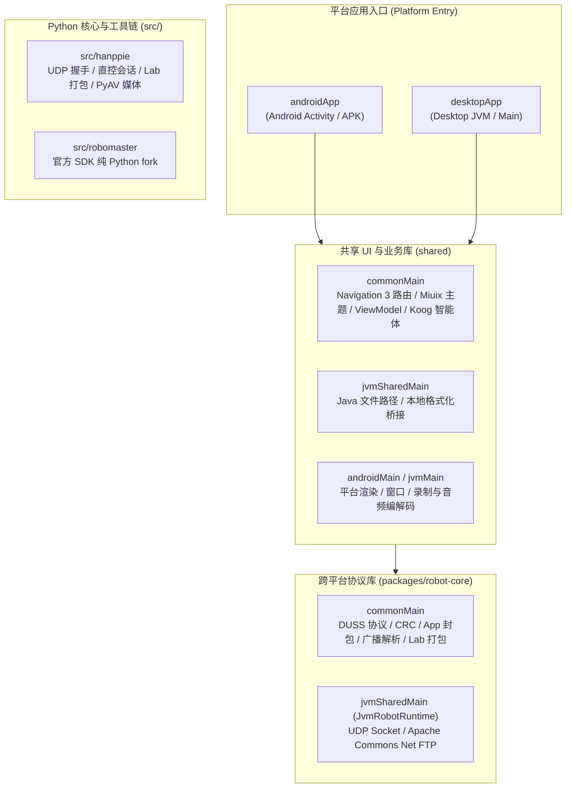
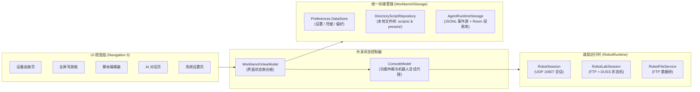
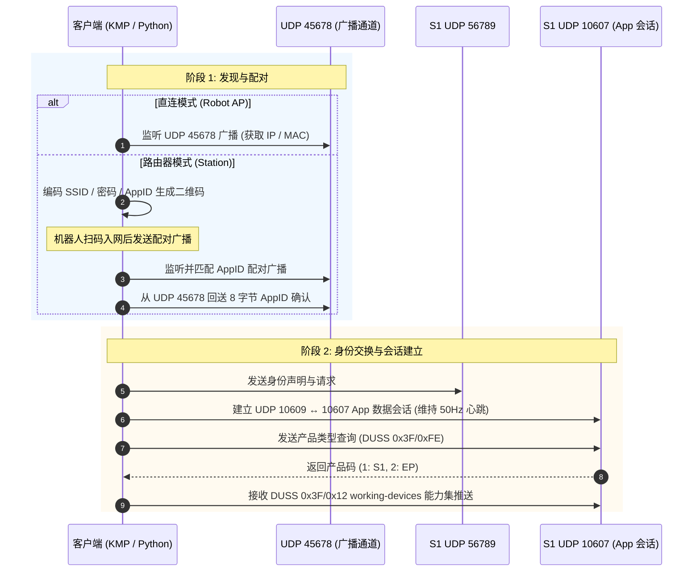
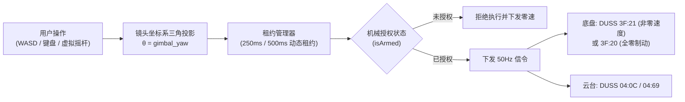
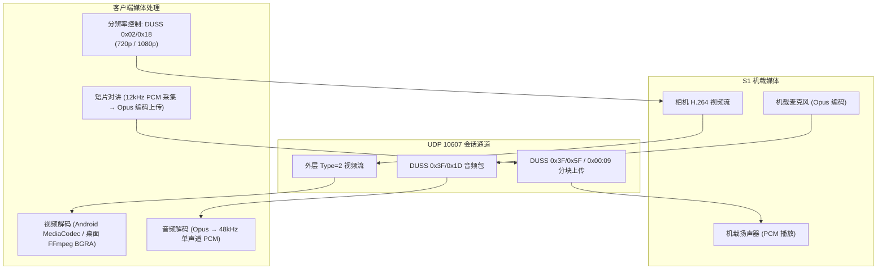
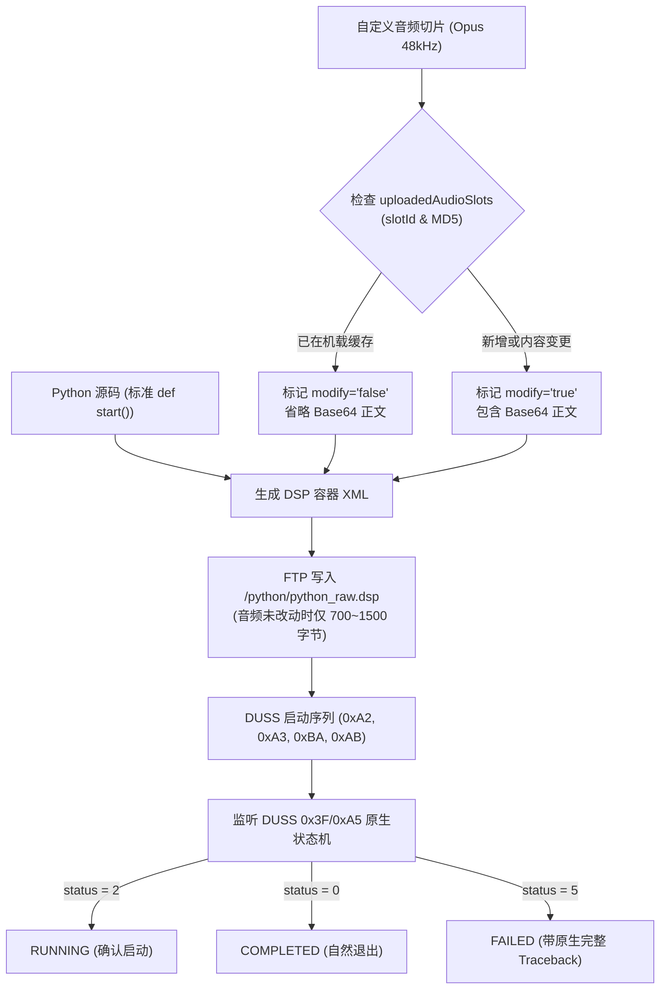
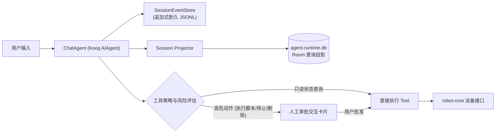
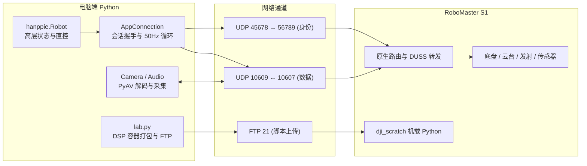
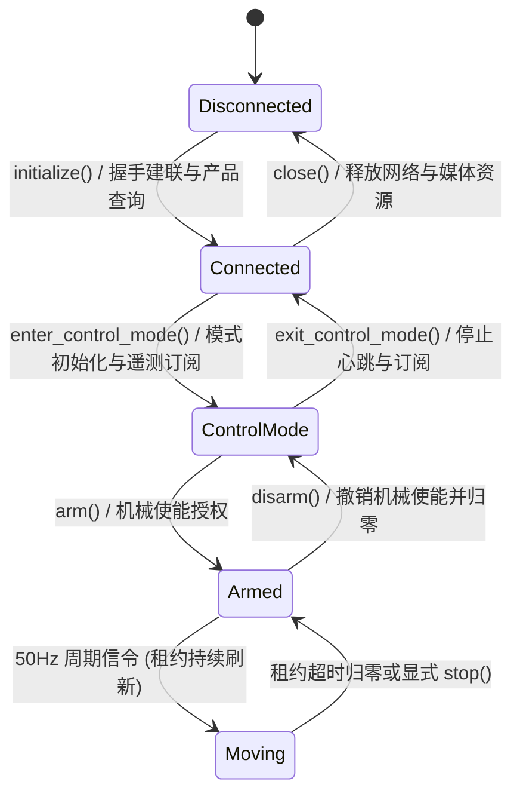

# Hanppie 技术架构

> 文档性质：Hanppie 当前实现、核心架构、系统机制与安全边界的技术事实源。 
> 最后更新：2026-09-22 
> 已验证设备：RoboMaster S1，固件 `00.06.0521`

本文记录 Hanppie 当前增加、恢复或组合的主机代码、Kotlin 多平台客户端、机内载荷、能力状态与安全策略。RoboMaster
S1
原生硬件、固件、App/Lab、DUSS、协议调查和外部生态统一维护在 [RoboMaster S1 原生架构、协议与调查](./architecture-robomaster.md)
。已废弃方案、旧命令、迁移过程和历史取舍由日期化联调记录与 Git 历史保存。

## 文档所有权

| 信息类型                            | 权威位置                                                          |
|---------------------------------|---------------------------------------------------------------|
| Hanppie 代码结构、实现机制、能力矩阵和安全边界     | 本文                                                            |
| S1 原生硬件、固件服务、协议、App/Lab 机制和外部生态 | [`architecture-robomaster.md`](./architecture-robomaster.md)  |
| 视觉、交互与产品设计规范                    | [`DESIGN.md`](../DESIGN.md)                                   |
| 安装、CLI 参数和开发命令                  | 中英文 README、`pyproject.toml` 和 `Taskfile.yml`                  |
| 单次实机命令、原始输出、故障和测量值              | 日期化联调记录                                                       |
| 内置 SDK fork 来源与上游提交             | [`src/robomaster/UPSTREAM.md`](../src/robomaster/UPSTREAM.md) |

## 证据标记

为严格区分“代码实现”与“真机可用”，本文使用以下标记：

| 标记      | 含义                                   |
|---------|--------------------------------------|
| **实测**  | 已在固件 `00.06.0521` 的 S1 上观察到协议结果或物理效果 |
| **代码**  | 可由仓库内恢复代码或固定版本上游代码直接确认               |
| **官方**  | 来自 DJI 手册、规格说明或官方 SDK 文档             |
| **推断**  | 由多项证据推导，但尚未直接验证                      |
| **待验证** | 接口或社区实现存在，但本项目尚未完成实机确认               |

能力结论严格遵循四层校验体系：接口存在 → 命令被接受 → 遥测发生变化 → 物理效果得到确认。

---

## 1. Hanppie 项目实现与机制

### 1.1 项目目标与边界

Hanppie 不替换整套 S1 固件，而是在保留原机控制器、相机、云台、底盘和安全机制的前提下，恢复并构建：

- **免手机 App 直连**：电脑与移动端直接与机器人建立原生协议会话；
- **全能力协议控制**：Python 工具链与 KMP 客户端均支持可审计的原生报文与 DUSS 直控；
- **带安全约束的操纵**：支持键盘与虚拟摇杆控制，具备租约超时自动归零与机械使能保护；
- **低延迟音视频流**：实时视频流（720p/1080p）、机载麦克风下行与短片对讲上行；
- **机载 Lab 脚本支持**：纯 Python 3.6 离线容器打包、秒级增量部署与原生生命周期跟踪；
- **嵌入式对话智能体**：基于 Koog 的对话模型驱动，具备人工审批与工具安全防线。

项目当前**不以**持久 root、替换启动链、提高发射功率或绕过机械安全限制为目标。

设备兼容性按协议入口和能力组合建模，不硬编码单一实机型号。通用客户端、会话、发现结果和 Host API 只表达
RoboMaster 机器人及其可用能力；型号专属差异隔离在具体协议层。当前全部实机结论来自 S1 `00.06.0521`；EP 与
S1 的底层模块复用关系见[原生架构 4.5 节](./architecture-robomaster.md#45-s1-与-ep-的产品边界)。

---

### 1.2 相对原机的改动清单

| 项目增量                       | 发生位置                        | 对原机做了什么                                                                  | 持久性/恢复方式                |
|----------------------------|-----------------------------|--------------------------------------------------------------------------|-------------------------|
| 原生直连与 Lab 控制后端             | Git 仓库与控制终端                 | 实现 UDP `45678/56789` 握手、UDP `10609/10607` 会话、DUSS/control 直控、Lab 部署与音视频流 | 随应用安装；不修改固件             |
| `src/robomaster` SDK fork  | Git 仓库与控制终端                 | 内置官方 `0.1.1.68`/`ff6646e` 纯 Python 源码，保持 `robomaster` 导入兼容；非实机控制主干       | 随应用安装；不修改 S1；Apache-2.0 |
| PyAV 媒体兼容层                 | 控制终端                        | 替代官方 SDK 缺失的 macOS `libmedia_codec` 扩展                                   | 不修改 S1，仅为主机软解           |
| `assets/s1-system/` 原机参考系统 | Git 仓库（`assets/s1-system/`） | 保存逆向恢复的原机库、脚本与配置供参考；不随发布包打包                                              | 只影响仓库；不部署至 S1           |
| 官方基准固件归档                   | `assets/firmware/`          | 归档官方最终完整固件 `00.06.0521.tar`（Git LFS），提供恢复基底                              | Git LFS 存储；不修改实机；原厂二进制  |

Hanppie 不修改 `/init.rc`、原厂启动脚本或 `/system` 分区。Lab DSP 上传写入临时目录 `/data`，不随开机自启。

---

### 1.3 当前实现架构

#### 1.3.1 多平台工程组织与模块划分

仓库采用 Kotlin Multiplatform (KMP) 跨平台架构与 Python 工具链并行的单体结构：

- **`packages/robot-core`**：独立 KMP 协议模块，根包为 `cn.elonzh.hanppie.robot`。按 `protocol`、
  `product`、`session`、`lab`、`remote`、`media`、`telemetry`、`files` 分工。`commonMain` 实现纯 Kotlin
  逻辑（DUSS 封包、CRC8/16、DSP 打包、遥测解析等）；`jvmSharedMain` 通过 `JvmRobotRuntime` 组合平台 UDP 与
  FTP 实现。
- **`shared`**：共享 UI 库，根包为 `cn.elonzh.hanppie.ui`。采用 shared-first
  原则，所有界面、导航、ViewModel、本地持久化与智能体逻辑均位于共享层；平台 source set（`androidMain`、
  `jvmMain`）仅提供平台能力注入（如 Android `MediaCodec`、桌面 FFmpeg 管道、文件选择器适配等）。
- **`androidApp` / `desktopApp`**：无业务逻辑的轻量平台入口，负责宿主初始化、窗口管理与应用打包。
- **`src/hanppie`**：纯 Python 实现的高性能直接控制与 Lab 脚本部署库，提供与 KMP 核心对等的协议能力。

---

#### 首页三维展示

首页在共享层 `ui/robot/scene` 使用 Filament KMP 0.5.0 渲染三维场景，支持触摸拖动、双指缩放、
鼠标滚轮、方向键和 Home 键重置镜头。场景铺满整个首页容器，首页不显示侧边或底部导航条，移除首页独立标题栏、
固定场景高度、模型说明文字和重置按钮；连接操作、设备名称和关键状态覆盖在场景上。
场景复用官方 App 原始机器人网格、UV、装配、材质与车库环境，在同一个三维空间中渲染纹理地面、
环境物件、反射与实际投影。素材来源与转换方式见下述文档。场景是只读观察器，不持有控制接口。连接、电量和信号来自
同一 `ConsoleState`；首页仅展示连接方式与电量，不展示信号强度或脚本运行状态。诊断入口位于连接状态弹窗的机器人标题右侧，连接配置也统一从弹窗进入。脚本反馈保留在工作页面。模型优先按在线组件选择外观，型号仅作为外观提示，不作为协议能力白名单；
未知产品使用基础底盘示意。素材来源、坐标与再生成方式唯一维护在
[机器人展示素材](../assets/robot-scene/README.md)。

云台展示使用 `GimbalTelemetry.yawDegrees/pitchDegrees` 相对角度，经 100 ms 插值驱动 GLB 独立
关节通道。状态聚合记录该帧接收时间；超过 1 秒未更新时保持最近姿态，通过无障碍状态语义报告更新暂停。缺失或非法
角度显示等待状态，断开连接清空姿态与时间。底盘方向使用独立 DDS 的 `ChassisAttitude.yawDegrees`；四轮使用独立 ESC 编码器角度，
以原始装配转轴驱动模型，分别记录接收时间和实时、暂停或等待状态。角度跨圈使用最短路径插值，
不根据控制命令或速度假造转动。底盘 pitch/roll、IMU、LED 颜色及机械臂动作尚不驱动模型。
未标定的 `headingLike/raw` 不驱动世界轨迹。
机械臂当前仅展示外观，不声称已取得关节遥测。

App 会话建立时使用已验证的 10Hz 云台、底盘姿态及 ESC DDS 订阅；主题与报文字段见
[原生协议说明](architecture-robomaster.md#535-macos-客户端静态分析边界)。普通只读主页不调用
`enterRemote()`，不发送速度、回中或发射指令。普通会话持续推送及小幅 yaw/pitch 运动后的
传感器至 GPU 联动已经实机验证，记录见
[首页验证记录](home-scene-validation-2026-09-22.md#透明材质与实机联动复核)。
底盘小角度转向及四轮编码器至 GPU 的链路也已验证；全行程物理角度精度和全部传感器覆盖仍不在验证结论内。

点击“开始操控”后，`RobotExperience` 在同一个容器内协调三维场景、视频与控制层，
不再通过独立驾驶舱导航页面搬移视频。已连接、处于前台且没有脚本可能执行的首页预热视频，持续解码并保留最新帧，不积累历史回放队列。
预热不进入遥控、不监听音频、不录像；离开首页、进入后台、断线或脚本开始时释放媒体。
用户点击后才准备遥控模式；此时控制输入仍被阻断。
准备期间保持首页展示视角，主按钮显示“正在准备画面…”。最近 500 ms 内有可用解码帧后才启动约 1.35 秒的运镜；
运镜开始 1 秒后同步启动 600 ms 视频融合，保证镜头到位时视频已经接入，再用 400 ms 渐显控制 UI。
准备期间不显示独立退出按钮，系统返回仍可取消。
桌面连续收到 8 帧可用画面后报告就绪。FFmpeg 丢弃损坏包并严格处理解码错误；
按输出帧元数据与解码诊断屏蔽受损帧及依赖它的后续帧，直到无解码错误的完整帧内图像（I 帧）恢复显示，期间保留上一张可用画面。
Android 当前仍使用已渲染帧回调，尚未验证此轮过渡。
模式准备或视频等待各有 5 秒上限；未就绪则留在首页并提示重试，不强制切入黑屏驾驶舱。
普通首页只预热视频，不进入遥控；可交互后才接受驾驶输入。退出后继续预热，关闭监听并结束录像。
退出先归零输入，同时开始 220 ms 控制 UI 淡出、600 ms 视频淡出与 1.15 秒反向运镜；
场景覆盖视频后退出遥控，解码器继续为首页预热。三维资源保持加载，避免返回时空白重建。
用户取消、断线、宿主进入后台会终止进入流程；离开页面则释放媒体并退出遥控。
运镜跟随当前云台与底盘展示角度，不发送物理回中指令；虚拟镜头位置和视场角用于视觉过渡，未经过实机光学标定。
Android 验证须等用户明确确认功能完整后再进行，规则见 AGENTS.md；当前过渡修订先验证桌面。

横屏设计边界见 [设计规范](../DESIGN.md#布局与自适应)。Android 主 Activity 请求 `sensorLandscape`；
当前 targetSdk 36 使用 `PROPERTY_COMPAT_ALLOW_RESTRICTED_RESIZABILITY` 保留大屏方向限制。
[Android 官方说明](https://developer.android.com/about/versions/17/changes/ff-restrictions-ignored)明确 targetSdk 37 起大屏会忽略该限制，
因此升级目标 SDK 时必须重新验证系统方向行为，不能宣称所有系统窗口均可强制锁定。桌面默认 1120×658 横向窗口，最小尺寸为 740×480。
渲染资源随页面和宿主生命周期释放；Android 使用可参与界面合成的纹理表面，左右横屏翻转由 Activity 配置变化处理。
模型、车库与环境反射均加载后才通过无障碍语义报告就绪；任一加载
失败保留连接操作并提供重试。布局与状态测试替换 GPU 表面，
`HANPPIE_GPU_TESTS=1` 启用真实 GPU 图像测试。桌面使用 JDK 25 工具链和随包运行时，并按目标系统选取
Filament 原生库；该版本上游提供 macOS arm64、Windows x64、Linux x64/arm64 原生包。
Android 使用官方 Filament OpenGL ES 后端。桌面 Compose 集成包含 GPU 像素回读，性能结论需要限定
到实际运行的设备、视口与分辨率。

#### 1.3.2 客户端架构与分层设计

客户端采用标准的 MVVM / MVI 分层架构，共享层维持单一状态聚合：

- **状态管理**：`WorkbenchViewModel` 作为双端共同的顶层状态所有者，管理导航栈、编辑草稿与文件交互；
  `ConsoleModel` 负责连接生命周期、遥控、脚本运行与智能体对话之间的跨模块仲裁。
- **统一存储模型 (`WorkbenchStorage`)**：
    1. **配置存储**：基于 Preferences DataStore，保存模型 API Key、控制参数、语言、显示模式、持久 AppID
       及路由器配置；
    2. **脚本库**：基于本地文件系统目录树的 `DirectoryScriptRepository`。将脚本存为独立目录（含
       `manifest.json`、`script.py` 及 `audio/` Opus 音频文件），废除中间数据库形式化分层；
    3. **智能体存储**：`AgentRuntimeStorage` 组合独立的追加式 JSONL 文件存储与 Room 3 查询投影库（
       `agent-runtime.db`）。

---

#### 1.3.3 网络拓扑与连接生命周期

客户端支持两种原厂网络拓扑，底层协议会话逻辑完全共享：

- **自动恢复与容错**：连接中断后自动进入未连接态，清除活动控制租约与遥控授权；非控制状态发送中性心跳帧，会话持续
  5 秒无数据判定失联并自动触发归零保护。

---

#### 1.3.4 遥控操纵、镜头坐标系与安全联动

遥控操纵依托 50 Hz App control channel 和原生 DUSS 报文，具备多层机械与算法安全防线：

- **镜头坐标系联动**：当云台相对底盘夹角为 $\theta$ 时，用户输入的平移向量经过三角投影转换为底盘物理坐标系速度：
  $$\begin{pmatrix} v_{forward\_robot} \\ v_{right\_robot} \end{pmatrix} = \begin{pmatrix} \cos\theta & -\sin\theta \\ \sin\theta & \cos\theta \end{pmatrix} \begin{pmatrix} v_{forward\_camera} \\ v_{right\_camera} \end{pmatrix}$$
- **云台-底盘智能跟随**：当云台相对角度超过 60° 且用户继续转动时，底盘同向旋转辅助释放机械限位（上限
  60°/s）；云台达到 230° 极限时停止向外输入。
- **失控保护与被动制动**：
    1. 运动指令必须具备有效租约（250 ms）；租约到期自动下发停止帧；
    2. 底盘静止必须使用专用 4 轴转速全零命令（DUSS `3F:20`），避免浮点零带来的怠速转动；
    3. 窗口失焦、切后台或会话失联时，客户端立即注销遥控授权并下发连续停止包。

---

#### 1.3.5 媒体流管线与音视频交互

Hanppie 构建了端到端的音视频交互管线，无需官方闭源动态库：

- **流媒体与分辨率协商**：图传分辨率由 DUSS `0x02/0x18` 控制，支持 720p 与 1080p 动态切换；
- **扬声器与短片对讲**：扬声器音量由 DUSS `0x3F/0x1B` 统一调节；支持按住录音、松开发送的 Opus
  短片对讲传输，在机内通过 DUSS `0x3F/0xB3` 触发播放。

---

#### 1.3.6 机载 Lab 脚本与增量 DSP 部署

Hanppie 采用纯原生方式打包与管理机内离线 Python 3.6 算法：

- **秒级增量上传机制**：通过槽位与 MD5 追踪已上传音频。未变更的音频在 DSP 中仅保留元数据节点并省略
  Base64 内容，将上传耗时缩短至数十毫秒；
- **原生生命周期驱动**：废除源码插桩与正则篡改，原样上传用户代码，完全由固件原厂 `0x3F/0xA5`
  状态机接管执行、完成与异常 Traceback 追踪。

---

#### 1.3.7 智能体运行时架构

Hanppie 嵌入基于 Koog 的对话智能体运行时，以 **Agent Session** 作为聚合根：

- **耐久事件源架构**：每个 Session 独立维护一个 JSONL 文件作为唯一事实源，具备严格的进程锁、文件锁、末事件游标检查与
  fsync 机制；Room SQLite 数据库仅作为可全量重建的高速查询投影；
- **确定性工具注册表**：组合八个具名 class-based Koog
  工具（状态查询、技能读取、脚本库增删查改、脚本执行与停止），高危机械与文件副作用必须经过持久化审批卡片确认。

---

#### 1.3.8 Python 直控与工具链

Python 主干是独立轻量的控制通道，完全复现原生 App 协议栈：

| 功能通道        | 网络协议与路径                               | 说明                        |
|-------------|---------------------------------------|---------------------------|
| 发现与身份握手     | Host UDP `45678` → S1 UDP `56789`     | 确认会话认领与连接绑定               |
| App 数据与遥测会话 | Host UDP `10609` ↔ S1 UDP `10607`     | 维持 50Hz 双向心跳，接收 10Hz 遥测推送 |
| 底盘控制        | App control channel (50Hz 周期续发)       | 具备短租约校验与零速制动              |
| 云台控制        | DUSS `0x04/0x69` (50Hz 周期续发)          | 具备短租约校验与自动归零              |
| 装甲灯、枪口灯、音效  | DUSS 请求 / 同序号 ACK 应答                  | 确定性双向报文交互                 |
| 视频与机载麦克风    | UDP `10607` (H.264 外层 Type=2 / Opus)  | PyAV 解码与实时呈现              |
| 机载 Lab 算法部署 | 匿名 FTP `21` (`python/python_raw.dsp`) | 离线 Python 3.6.6 容器打包与上传   |

---

#### 1.3.9 原生直连与机载 Lab 程序的职责边界

- **原生直连 (Direct Control)**：基于 UDP `10607` 会话，直接向机载底盘、云台、发射机构与外设下发信令并收取遥测，
  **无需向机内上传任何常驻脚本**；
- **机载 Lab 程序**：仅用于需要脱离主机通信、在机载系统（Android 4.4 / Python 3.6.6）本地闭环运行的离线算法。早期过渡方案
  Lab Bridge 已彻底删除。

---

#### 1.3.10 为什么官方 SDK 不是当前控制后端

| 维度        | 官方 DJI SDK 路径                    | Hanppie 原生直连路径                       |
|-----------|----------------------------------|--------------------------------------|
| 机器人端入口    | EP SDK proxy (UDP `30030`)       | 原生 App 控制端口 (UDP `56789` / `10607`)  |
| 会话模型      | SDK route / SDK mode / heartbeat | AppID 握手 / AppEnvelope 会话机制          |
| 原厂 S1 兼容性 | **原厂 S1 不开放 SDK proxy 端口**       | **S1 出厂自带且默认开放**                     |
| 项目代码定位    | `src/robomaster` 仅作源码参考与离线分析     | `src/hanppie` 与 `robot-core` 为唯一控制主干 |

---

#### 1.3.11 网络与传输边界

- 后端仅需 Station 模式（局域网）或 AP 直连模式下的 IP 网络双向互通；
- 控制、视频与音频均在 Wi-Fi 局域网上完成，**日常控制不需要连接 USB 线**；
- USB 仅在固件维护、底层镜像备份或故障救援时作为 ADB/RNDIS 通道使用。

---

### 1.4 包边界

| 路径                     | 核心职责                                      |
|------------------------|-------------------------------------------|
| `packages/robot-core/` | 跨平台协议核心（DUSS 编解码、会话维护、Lab 打包、遥测解析、FTP 抽象） |
| `shared/`              | 跨平台 UI、ViewModel、本地存储聚合、Koog 智能体与媒体管道     |
| `androidApp/`          | Android 宿主入口、权限配置与原生打包                    |
| `desktopApp/`          | 桌面 JVM 宿主入口与多平台分发打包                       |
| `src/hanppie/`         | Python 核心协议与直接控制库                         |
| `src/robomaster/`      | 官方 Python SDK 纯源码归档与导入兼容层                 |
| `assets/s1-system/`    | 逆向提取的原机系统文件与参考脚本（不随包分发）                   |
| `assets/firmware/`     | 官方基准固件包归档（Git LFS 存储）                     |

---

### 1.5 SDK 打包与 Python 边界

- `pyproject.toml` 构建产物同时包含 `hanppie` 与 `robomaster` 两个顶层包；
- **运行环境约束**：
    - S1 机载 Lab 环境固定为 Python 3.6.6；
    - 主机端 Python 开发与 CI 基准为 Python 3.10+；
    - Kotlin 跨平台层使用纯 Kotlin/JVM 实现，无 Python 运行时依赖。

---

### 1.6 原生直连与 Robot 状态生命周期

客户端状态机严格管理生命周期与机械权限：

| 状态操作                   | 核心行为                           | 安全边界              |
|------------------------|--------------------------------|-------------------|
| `initialize()`         | 建立 UDP 身份握手与 App 基础数据会话        | 仅建立通信，不产生动作       |
| `enter_control_mode()` | 发送控制模式序列，启动 10Hz 遥测订阅与 50Hz 心跳 | 机械控制的前置必要条件       |
| `arm()`                | 标记机械使能有效，清零当前速度寄存器             | 未 arm 状态下丢弃所有运动命令 |
| `drive_speed()`        | 写入平移与旋转速度，刷新 250ms 租约          | 租约到期底层自动归零        |
| `disarm()`             | 立即撤销授权，发送 neutral/stop 停止帧     | 软件急停主干操作          |
| `close()`              | 终止音视频流，发送停止序列并关闭 Socket        | 保证对端连接彻底释放        |

---

### 1.7 内置 SDK fork 的边界

`src/robomaster` 保留官方 API 结构供离线测试与代码参考。Hanppie 的核心 `Robot` 控制器不继承、不包装、亦不委托官方
SDK。

---

### 1.8 媒体兼容与编解码

- **视频流**：相机视频流采用 H.264 格式，分辨率通过 DUSS `0x02/0x18` 在 720p 与 1080p 间切换。Android
  端通过 `MediaCodec` 硬解至 `SurfaceView`；桌面端通过 FFmpeg 软解为 BGRA 帧提供给 Compose/Skia 渲染；
- **音频下行**：机身麦克风音频通过 DUSS `0x3F/0x1E` 请求，S1 返回 Opus 编码流（DUSS `0x3F/0x1D`），解码为
  48 kHz 单声道 PCM 后输出至系统音频；
- **音频上行（对讲）**：本地麦克风采集音频并编码为 20ms Opus 帧，通过 DUSS `0x3F/0x5F` 与 `0x00/0x09`
  分块传输至 S1 扬声器播放；扬声器音量由 DUSS `0x3F/0x1B` 统一同步。

---

### 1.9 质量保证与测试边界

1. **静态分析与代码规范**：Python 端强制要求类型注解、相对路径导入及显式静态 `__all__` 声明；使用
   `ruff` 与 `prek` 门禁；
2. **自动化测试**：覆盖协议封包、CRC 校验、产品识别、DSP 容器构建及媒体编解码，核心逻辑要求 70% 以上覆盖率；
3. **分层构建验证**：Kotlin 模块通过 Gradle 运行协议测试、JVM 单元测试及 Android APK 构建。

---

### 1.10 当前能力矩阵

下表总结 Hanppie 当前的技术实现与实测验证状态：

| 能力分类        | 核心模块                                    | 验证状态        | 架构说明                                           |
|-------------|-----------------------------------------|-------------|------------------------------------------------|
| S1 App 会话握手 | `AppConnection` / `packages/robot-core` | **实测通过**    | UDP `45678/56789` 身份交换与 UDP `10609/10607` 会话维持 |
| 原生直接控制      | `Robot` / `packages/robot-core`         | **实测通过**    | 50Hz 周期控制与底盘/云台零速制动                            |
| 机载 Lab 脚本部署 | `hanppie.lab` / `RobotLabSession`       | **实测通过**    | XML 容器构建、秒级增量 Opus 缓存上传及原生状态机监听                |
| 实时遥测订阅      | `Robot` / `packages/robot-core`         | **实测通过**    | 10Hz 解析电量、姿态角及底盘/云台原始遥测                        |
| 实时视频与分辨率切换  | `Camera` / `RemoteMediaController`      | **实测通过**    | 720p/1080p DUSS 动态协商与双端流畅解码呈现                  |
| 机身麦克风下行     | `Audio` / `RemoteMediaController`       | **实测通过**    | Opus 解码为 48kHz 单声道 PCM 播放                      |
| 扬声器短片对讲     | `Audio` / `RemoteMediaController`       | **实测通过**    | 本地 Opus 编码、分块传输与机载原厂播放序列                       |
| 扬声器音量调节     | `Robot` / `ConsoleModel`                | **实测通过**    | DUSS `0x3F/0x1B` 设置与 `0x3F/0x1C` 查询            |
| 发射机构与灯效     | `Robot` / `ConsoleModel`                | **实测通过**    | 红外发射脉冲、水弹发射时序与装甲/枪口 LED 状态控制                   |
| 智能体安全对话     | `ChatAgent` / Koog Runtime              | **代码/离线验证** | 耐久 JSONL 事件源、高危动作人工审批及工具安全执行闭环                 |
| 官方 SDK 导入兼容 | `src/robomaster`                        | **离线代码验证**  | 保留官方导入接口，不参与实机直接控制                             |

---

### 1.11 远程控制当前边界

- 目前所有验证均基于局域网或 AP 点对点连接；
- 项目不提供公网网关、中继隧道或跨外网控制安全审计；
- **禁止**直接将机器人 UDP 端口或 FTP 端口暴露于公网、端口映射或无鉴权的虚拟专网。

---

### 1.12 安全与恢复模型

1. **机械安全**：
    - 自动化测试默认禁止机械动作；
    - 底盘测试必须悬空车轮或置于水平安全地面；
    - 运动命令必须附加短租约（250ms），会话中断或异常必须触发底层自动归零与 disarm。
2. **网络与凭证安全**：
    - Wi-Fi 凭证与模型 API Key 仅保存在本地私有 DataStore，绝不写入日志、诊断上报或 Session 历史；
    - 禁止在机载文件系统中残留私有凭据或明文密钥。
3. **固件基底恢复**：
    - 仓库在 `assets/firmware/` 归档已校验的原厂固件包 `00.06.0521.tar`，仅作为灾难恢复与校验的技术基底，不参与日常自动更新。

---

## 2. 已知未知项与验证方法

| 课题          | 验证方法                           | 验收目标                    |
|-------------|--------------------------------|-------------------------|
| 底盘物理速度与位移标定 | 外部物理标尺与原生 `0x48/0x08` 推定数据交叉比对 | 建立精确的平移与旋转物理量化比例        |
| 云台物理角度闭环    | 结合外部测量核对四个 raw 角度值在全机械行程中的线性度  | 确认物理角度映射与稳定回中逻辑         |
| 极端断网失联制动表现  | 模拟硬拔天线、瞬时丢包与 Session 抢占场景      | 确保各场景下机器人均能在规定租约内实现物理停车 |
| 移动端真实录制性能   | 在多样化 Android 实机上测试持续录制与音画同步    | 保证多分辨率下连续录制无断流与音画漂移     |

---

## 3. 文档维护规则

以下场景必须同步更新本文：

1. Kotlin 多平台模块边界、核心依赖或应用架构发生调整；
2. 机器人协议封包、通信端口、会话生命周期或安全租约发生变更；
3. 媒体管线或 Lab 脚本部署机制发生变动；
4. 能力矩阵中的实现或验证状态发生迁移。

更新时严禁将单次调试日志、微观 UI 数值或代码演进流水账混入本文。原生 S1 固件与硬件调查统一维护在 [
`architecture-robomaster.md`](./architecture-robomaster.md)。

---

## 参考与证据

- [RoboMaster S1 原生架构、协议与调查](./architecture-robomaster.md)
- [视觉、交互与产品设计规范](../DESIGN.md)
- [智能体运行时技术方案](./agent-runtime-plan.md)
- [对话智能体产品设计](./conversation-agent-product-design.md)
- [真机联调与官方 SDK 恢复记录](./s1-live-debug-2026-08-29.md)
- [AppEnvelope 直控真机联调记录](./s1-direct-control-2026-08-31.md)
