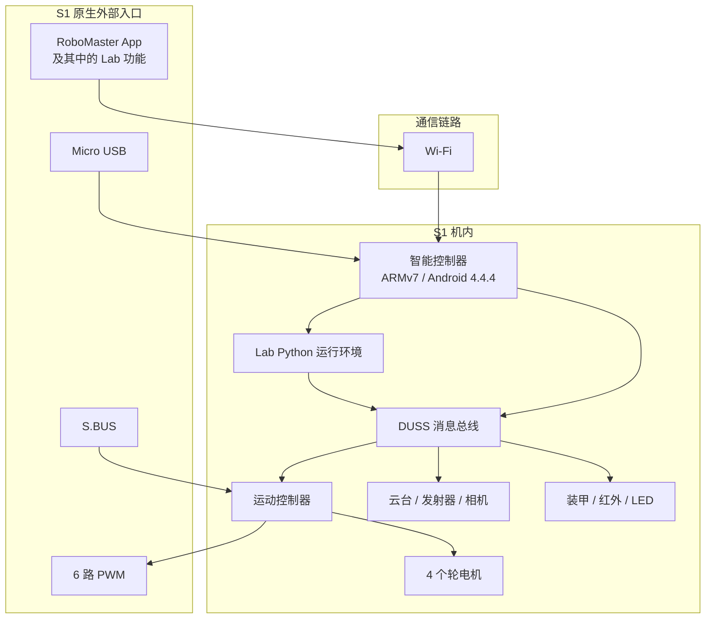
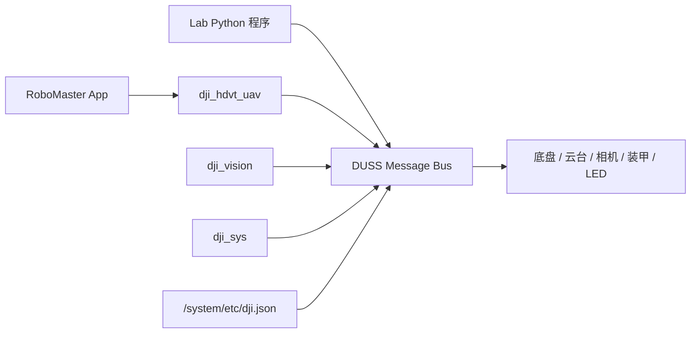
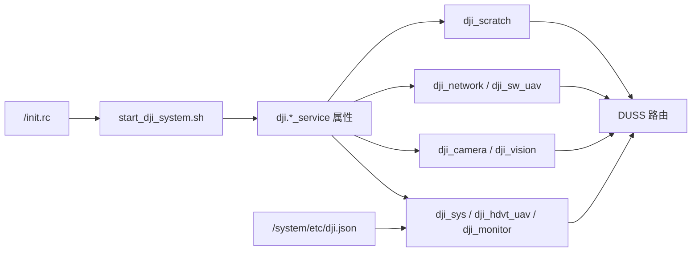
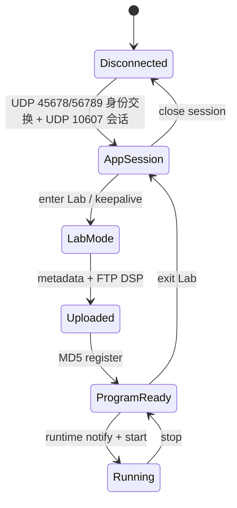
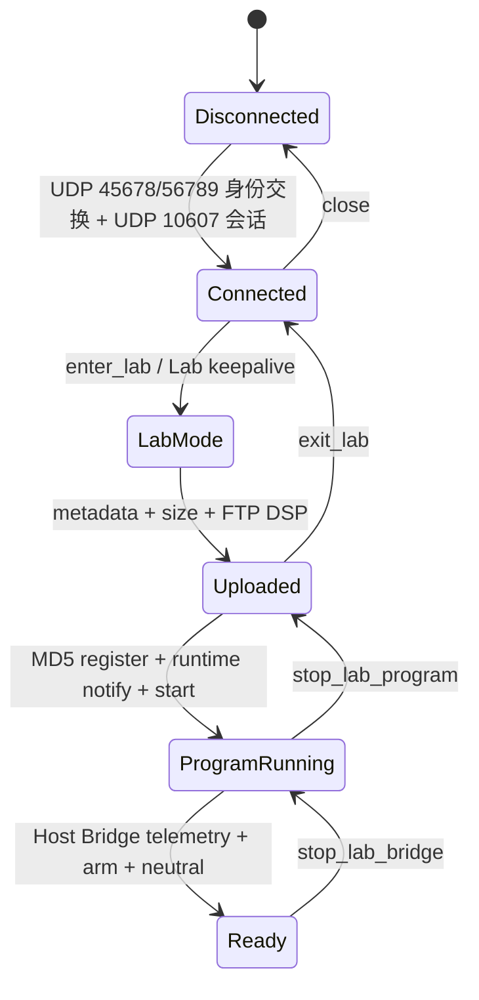
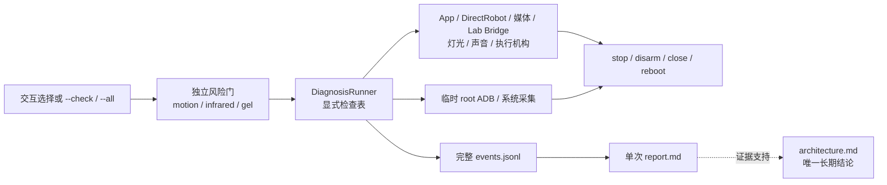

# RoboMaster S1 与 Hanppie 技术架构

> 文档性质：Hanppie 的长期技术事实源，不使用日期文件名。<br>
> 最后更新：2026-08-30<br>
> 已验证固件：RoboMaster S1 `00.06.0521`

本文只记录 RoboMaster S1 的当前固有架构、通信和扩展边界，以及 Hanppie 当前增加的电脑控制能力。原机能力与项目实现按章节严格分开；已被替代的方案、旧命令、迁移过程和开发取舍不进入正文，按日期保存的调研、联调记录与 Git 历史负责保存这些信息。

## 文档所有权

同一结论只在一个位置维护。引用可以重复出现，但不得复制一份需要同步更新的结论表。

| 信息类型 | 权威位置 | 其他文档如何处理 |
| --- | --- | --- |
| 当前架构、协议、端口语义、能力状态、项目机制和安全边界 | 本文 | 只链接到本文的具体章节 |
| 安装、CLI 参数和开发命令 | 中英文 README、`hanppie --help` 和 `pyproject.toml` | 本文只解释机制，不复制完整用法 |
| 单次实机命令、原始输出、故障和测量值 | 日期化联调记录或 `diag` 自动报告 | 作为证据保留，不宣称“当前状态”，也不因后续变化回写 |
| 前期路线比较与外部生态调研 | `robomaster-s1-revival-report.md` | 标记为历史调研；采用后的当前方案回到本文 |
| 已废弃实现、旧命令、迁移过程和历史取舍 | 日期化联调记录与 Git 历史 | 不进入本文正文 |
| 内置 SDK fork 来源 | `src/robomaster/UPSTREAM.md` | 其他位置只引用 |

自动生成的 `.hanppie/diagnosis/<timestamp>/` 诊断证据和 `.hanppie/mcp/sessions/<session-id>/` MCP 运行记录默认不进入 Git。真机结果改变能力结论时，更新本文并引用相应证据；当前能力矩阵只在本文维护。

## 证据标记

为避免把“代码中存在”误写成“真机可用”，本文使用以下标记：

| 标记 | 含义 |
| --- | --- |
| **实测** | 已在固件 `00.06.0521` 的 S1 上观察到协议结果或物理效果 |
| **代码** | 可由仓库内恢复代码或固定版本上游代码直接确认 |
| **官方** | 来自 DJI 手册、规格或官方 SDK |
| **推断** | 由多项证据推导，但尚未直接验证 |
| **待验证** | 接口或社区实现存在，但本项目尚未完成实机确认 |

能力结论至少区分四层：接口存在、命令被接受、遥测发生变化、物理效果得到确认。

证据标记只表示结论如何得到，不表示能力归谁所有；能力归属以第 1 章和所在章节为准。例如，“实测通过”既可能是原机 RoboMaster App 或 Lab 功能，也可能是 Hanppie 增加后的项目结果。

## 1. 文档范围与归属

本文使用以下归属，章节中的“原生”“外部”和“项目”均按此定义：

| 归属 | 含义 | 主要章节 |
| --- | --- | --- |
| **S1 原生** | 出厂硬件、固件服务、DUSS、RoboMaster App、Lab 功能和机内 Python；即使没有 Hanppie 也存在 | 第 2～5 章 |
| **外部生态** | S.BUS 接收机、SocketCAN/vcan、ROS 2、DJI EP SDK 等可与 S1 相关但不属于 Hanppie 的技术 | 第 6 章 |
| **Hanppie 项目** | 本仓库增加、恢复、组合或规划的主机代码、机内载荷、临时补丁和安全策略 | 第 7 章 |

“仓库中保存了原机文件”不表示该文件由 Hanppie 创建；`runtime/` 和 `resources/` 中的恢复内容是分析 S1 的证据。Lab Bridge、ADB 启动载荷和 PyAV 兼容层均为项目增量，不能写成 S1 出厂能力。

### 1.1 术语来源与实际对象

本文同时涉及 DJI 产品名称、原厂程序、逆向得到的网络封包和 Hanppie 自有组件。它们不是同一层概念：

| 名称 | 名称来源 | 本文实际指向 |
| --- | --- | --- |
| RoboMaster App | DJI 产品名称 | 手机端应用；与 S1 的身份交换使用 Host UDP `45678` 和 S1 UDP `56789`，后续数据会话通常使用 Host UDP `10609` 和 S1 UDP `10607` |
| RoboMaster Lab | DJI App 中的功能名称 | 创建和运行 `.dsp` 程序；机内由 `/data/dji_scratch/bin/dji_scratch.py` 管理，文件经 FTP `21` 上传，生命周期命令通过 DUSS 发送 |
| `AppEnvelope` | Hanppie 代码名称，不是 DJI 官方术语 | [`lab/protocol.py`](../src/hanppie/lab/protocol.py) 对 UDP `10607` 报文中、位于 DUSS 或媒体数据之外的 session、tick、direct/control channel 等字段的封装；字段来自固定 App 抓包并经实机互操作验证 |
| DUSS | 原厂代码和协议常量中的名称 | 具有 sender、receiver、sequence、command set、command id、payload 和 CRC 的消息；机内由 Unix Datagram Socket 路由，并可经 UART 或 UDP `10607` 外层封包承载 |
| Lab Python 控制对象 | 本文对机内对象的统称，不是独立协议名称 | Lab 程序上下文中的 `robot_ctrl`、`chassis_ctrl`、`gimbal_ctrl`、`led_ctrl`、`media_ctrl` 等对象；对应恢复的 `rm_ctrl.py` 高层类 |
| Hanppie Lab Bridge | Hanppie 项目名称 | 上传到 `/data/ftp/python/python_raw.dsp` 的项目程序；Host → S1 UDP `40923` 接收 JSON，S1 → Host UDP `40924` 回传 JSON |
| DJI 官方 Python SDK | DJI 发布的软件包 | 电脑上的 `robomaster` 包；`Robot.initialize()` 依赖机器人端 EP SDK 服务，详细边界见第 6.3 节 |

`App/Lab` 和 `App UDP` 都不代表一套协议或一个进程。本文描述具体链路时直接写 RoboMaster App、Lab 功能、机内程序、传输协议和端口；“外层封包”只表示 `AppEnvelope` 对应的 UDP `10607` 报文结构。

## 2. S1 原生整机架构

S1 不是一个由电脑直接驱动电机的外设。它内部已经包含智能控制器、运动控制器、云台/相机和多个执行器/传感模块；出厂软件通过 RoboMaster App、Lab 功能、Wi-Fi 和机内服务控制这些模块。



图中只画出 S1 出厂存在的入口和模块，不包含 Hanppie、官方 EP SDK 兼容补丁或计划中的远程控制器。项目如何接入这些入口见第 7 章。

## 3. S1 原生硬件架构

### 3.1 主要模块

| 模块 | 主要职责 | 证据 |
| --- | --- | --- |
| 智能控制器 | Wi-Fi、USB、视频、视觉、RoboMaster App、Lab Python 运行环境和固件内网络服务 | **实测/代码** |
| 运动控制器 | 底盘运动、电源和外部 PWM/S.BUS 接口 | **官方/代码** |
| 两轴云台 | 俯仰、偏航和工作模式 | **官方/代码** |
| 相机与媒体链路 | 720p H.264 图传，音频链路使用 Opus | **实测/官方 SDK 代码** |
| 四轮底盘 | M3508I 电机与麦克纳姆轮运动 | **官方** |
| 装甲与红外 | 击打、红外事件和灯效 | **官方/代码，事件待实测** |
| 智能电池 | 供电、电量和状态管理 | **官方；外部 SDK 电量值不可信** |

### 3.2 智能控制器

已连接设备显示智能控制器使用 ARMv7 平台，运行 Android 4.4.4/API 19，构建类型为 `userdebug`、`test-keys`。设备包含 Python、DJI 服务、BusyBox、ADB 相关脚本和 DUSS 路由配置。**实测/代码**

这解释了几个关键现象：

1. RoboMaster Lab 的 Python 实际运行在机器人内部，而不是手机或电脑上；
2. 机内 Python 可以通过本地 DUSS 总线调用底盘、云台、灯光等模块；
3. S1 与 EP 的底层模块高度复用，但对外开放的服务集合不同；
4. 外部电脑能否使用某套 DUSS 客户端，还取决于机内是否开放对应的会话和转发入口。

### 3.3 外部接口

| 接口 | 原生用途 | 原生边界 |
| --- | --- | --- |
| 智能控制器 Micro USB | RNDIS、Mass Storage、Bulk、ACM 等复合 USB；固件也包含 ADB 组件 | 量产启动后不保证开放 ADB |
| Wi-Fi AP/Station | RoboMaster App、Lab 功能、媒体和机内网络服务 | S1 原厂不开放完整 EP SDK 入口 |
| S.BUS | 单向底盘、云台、模式和扭矩控制 | 没有相机和完整遥测 |
| 6 路 PWM | 外部执行器扩展 | 只提供 PWM 输出能力 |
| 模块 CAN/UART | 运动控制器、云台、装甲等内部模块互连 | 不是官方消费级扩展 API |
| 保留 UART/USB | 固件或硬件内部用途 | 官方没有提供稳定扩展契约 |

S.BUS 信号、5 V 和 GND 的方向必须按机身丝印和手册确认。内部 CAN 不是面向普通用户的即插即用接口；接线、供电、终端电阻和主动发帧均可能损坏硬件。

## 4. S1 原生机内软件架构



### 4.1 系统信息快照

下表只记录已经从真机、ADB 输出或固件文件确认的内容；没有把社区同型号信息当作本机事实。

| 信息项 | 固件 `00.06.0521` 的记录 | 证据 |
| --- | --- | --- |
| CPU/ABI | ARMv7，机内关键二进制为 ARM32 EABI5 | **实测/文件审计** |
| 操作系统 | Android `4.4.4`，API 19 | **实测** |
| 型号/产品 | `L1860` / `full_xw607_dz_ap0002_v4` | **实测** |
| DJI 平台 | `XW0607_1860AC01` | **代码：`dji.json`** |
| 构建 | `userdebug`、`test-keys`，构建日期 2022-10-27 | **实测** |
| 系统属性 | `ro.secure=1`、`ro.debuggable=1`；DJI init 服务以 root 用户运行 | **代码/实测** |
| Shell/基础工具 | Android `mksh`、BusyBox，包含 ADB 脚本和 `adbd` | **代码/实测** |
| Lab 解释器 | `/data/python_files/bin/python`，Python `3.6.6`，GCC 4.8.3 构建 | **实测** |
| 运行环境 | `DEVICE_TYPE=UAV`，DJI 启动脚本设置 `HOME=/data`，init 设置固定 `PYTHONPATH` | **代码** |
| 主要网络接口 | `iwlan0`；`usb0` 固定为 `192.168.1.10`；`rndis0` 固定为 `192.168.42.2` | **代码；Wi-Fi Station 实测** |
| USB 复合功能 | 原厂路径使用 RNDIS、Mass Storage、Bulk、ACM；调试路径额外加入 ADB | **代码/实测** |

`default.prop` 中出现 ADB 配置不表示量产启动后一定能连接 ADB。`start_dji_system.sh` 会根据启动参数和白名单决定是否执行 `adb_en.sh`；本机正常重启后 ADB 不可见。**代码/实测**

### 4.2 启动链与系统服务

机内使用 Android init 的属性触发模型：`/init.rc` 在启动阶段运行一次 `/system/bin/start_dji_system.sh`；该脚本完成分区检查、Wi-Fi/SDR 选择、USB 和网络配置、FTP 启动、音频配置、日志目录准备，再设置 `dji.*_service` 属性。init 根据属性启动或停止对应进程。**代码**



| init 服务 | 启动程序 | 启动条件与职责 | 证据 |
| --- | --- | --- | --- |
| `start_dji_system` | `/system/bin/start_dji_system.sh` | 启动阶段一次性编排 DJI 系统 | **代码** |
| `dji_monitor` | `/system/bin/dji_monitor -m` | 监控 DJI 进程；启动脚本把它与 `dji_sys`、`dji_hdvt_uav` 作为关键存活检查 | **代码** |
| `dji_sys` | `/system/bin/dji_sys` | 系统服务和 DUSS 路由核心之一 | **代码/推断** |
| `dji_hdvt_uav` | `/system/bin/dji_hdvt_uav -g` | App 网络会话、DUSS 外部传输和媒体相关入口 | **代码/实测** |
| `dji_hdvt_cls` | `/system/bin/dji_hdvt_uav` | 同一二进制的另一启动形态，原厂启动脚本设为关闭 | **代码** |
| `dji_camera` | `/system/bin/dji_camera` | 相机与媒体服务 | **代码/推断** |
| `dji_vision` | `/system/bin/dji_vision` | 视觉处理服务，原厂启动脚本启用 | **代码** |
| `dji_network` | `/system/bin/dji_network -t wifi -i 10 -t sdr -i 5` | 网络路由；Wi-Fi 模式启用、SDR 模式关闭 | **代码** |
| `dji_sw_uav` | `/system/bin/dji_sw_uav` | Wi-Fi 模式的软件传输服务 | **代码/推断** |
| `dji_scratch` | `/data/python_files/bin/python /data/dji_scratch/bin/dji_scratch.py` | 常驻 Lab/Scratch 管理器，接收程序、控制执行并转发日志 | **代码** |
| `dji_blackbox` | `/system/bin/dji_blackbox` | 黑匣子与日志归档 | **代码** |
| `dji_perception` | `/system/bin/dji_perception` | 可选感知服务；原厂启动脚本默认未启用 | **代码** |

这些 init 服务均声明为 `disabled`，含义是“不随 Android service class 自动启动”，不是永久禁用；它们由 `dji.*` 属性显式启动。**代码/实测**

启动脚本还启动匿名可写 FTP：`busybox tcpsvd -vE 0 21 busybox ftpd -w /ftp`。`/ftp` 是指向 `/data/ftp` 的符号链接，因此 FTP 21 暴露的是持久数据分区。该服务没有应用层认证，只应在可信隔离网络使用。**代码**

### 4.3 关键程序与文件

| 路径 | 原机职责 | 原生状态 |
| --- | --- | --- |
| `/init.rc` | DJI 服务定义、属性触发器、Lab 解释器入口、全局环境变量 | 系统启动配置 |
| `/system/bin/start_dji_system.sh` | DJI 系统启动编排、FTP/网络/USB/音频/日志初始化 | 原厂启动脚本 |
| `/system/etc/dji.json` | 平台、HAL、DUSS 服务及路由表 | 原厂路由配置 |
| `/system/bin/dji_hdvt_uav` | App 网络会话、DUSS 外部传输和媒体相关入口 | 原厂二进制 |
| `/system/bin/dji_sys`、`dji_vision`、`dji_camera` | 系统、视觉和媒体关键进程 | 原厂二进制 |
| `/data/dji_scratch/bin/dji_scratch.py` | init 实际启动的 Lab/Scratch 常驻管理器 | 持久数据分区中的原厂程序 |
| `/data/dji_scratch/src/robomaster/` | 机内 `rm_ctrl`、`rm_module`、DUSS 客户端等 Python 运行库 | Lab 原生运行库 |
| `/data/python_files/bin/python` | Lab/Scratch 固定 Python 解释器 | 固件随附解释器 |
| `/data/ftp/python/python_raw.dsp` | RoboMaster Lab 上传的 DSP 程序容器 | 每次上传覆盖；文件存在不代表正在运行 |
| `/system/bin/adb_en.sh`、`/sbin/adbd` | 原厂调试脚本和 ADB daemon | 固件包含，量产启动后不一定启用 |

备份中还保存了 `/data/dji/dji_scratch.py`，其内容是 Lab/Scratch 管理器实现；但 init 中确认的实际服务入口是 `/data/dji_scratch/bin/dji_scratch.py`，在没有进一步 inode/符号链接证据前，不把两者写成同一个活动文件。**代码，关系待验证**

### 4.4 DUSS 路由与模块

恢复的 [`event_client.py`](../src/hanppie/runtime/event_client.py) 使用 Android 抽象 Unix Datagram Socket，例如 `\0/duss/mb/0x...`。[`dji.json`](../src/hanppie/resources/dji.json) 描述服务、模块和路由关系。**代码**

Lab 系统客户端和用户脚本分别绑定类似 `\0/duss/mb/0x905`、`\0/duss/mb/0x906` 的本地地址，未命中专用路由时把消息发往默认代理 `\0/duss/mb/0x900`。路由器再按 receiver 映射到相机、视觉、系统或 `vt_air` 等本地进程。底盘、云台、电池、ESC、装甲和发射器等模块在原厂 `dji.json` 中主要经 `/dev/ttyS3`、`921600 baud` 的 DUSS V1 路由连接。**代码**

[`rm_module.py`](../src/hanppie/runtime/rm_module.py) 把底盘、云台、灯光、相机、视觉、声音、装甲等能力封装为 DUSS 消息；[`rm_ctrl.py`](../src/hanppie/runtime/rm_ctrl.py) 再提供面向 Lab 程序的高层控制对象。**代码**

仓库中的 `src/hanppie/runtime` 和 `resources/dji.json` 是从原机恢复并整理的分析副本，不是桌面 SDK，也不是 Hanppie 重新设计的协议实现。对这些副本所做的必要整理见第 7 章。

这说明“DUSS 总线”不是单根物理总线：在智能控制器内它表现为 Unix Datagram Socket 和消息路由，在控制器到下级模块之间又可以映射为 UART 等传输。内部 CAN 研究是另一层硬件路径，不能与这里的机内 DUSS 路由直接画等号。

### 4.5 S1 与 EP 的产品边界

DJI 官方 Python SDK 以 EP/EP Core 为正式对象。S1 拥有大量相同的 DUSS 命令和模块，但原厂状态没有对电脑开放完整的 EP SDK 代理。**官方/代码/实测**

实机重启后的原厂状态中，DJI 服务正常运行，但 UDP 30030 不监听，官方 SDK 握手超时。**实测** 这是 S1 的原厂能力边界；项目后端选择见第 7.3.2 节。

## 5. S1 原生通信机制

本章只描述原厂固件、RoboMaster App、Lab 功能和机内模块已经具备的机制。Hanppie 对这些机制的复用方式从第 7 章开始记录。

### 5.1 DUSS 二进制消息

从机内运行库恢复的 DUSS V1 消息结构如下：

| 字段 | 作用 |
| --- | --- |
| `0x55` | 帧起始标记 |
| 版本与长度 | 表示协议版本和整帧长度 |
| CRC8 | 保护消息头 |
| sender / receiver | 编码后的模块地址 |
| sequence | 请求与响应关联 |
| command type | 请求、响应、是否需要 ACK |
| command set / command id | 能力类别与具体命令 |
| payload | 参数或遥测数据 |
| CRC16 | 保护完整消息 |

恢复的 [`duss_event_msg.py`](../src/hanppie/runtime/duss_event_msg.py) 负责打包和解包，[`duml_crc.py`](../src/hanppie/runtime/duml_crc.py) 实现 CRC8/CRC16。**代码**

DUSS 是多个传输上的共同消息语义，不等同于某个固定网口：智能控制器内使用抽象 Unix Datagram Socket，智能控制器与部分下级模块之间映射到 UART 等链路，App 会话又可在外层报文中承载 DUSS。

S1 的 Wi-Fi 侧没有在原厂路由表中暴露一个接受“裸 DUSS V1 帧”的通用网络 socket。原厂 `dji.json` 把 `iwlan0` UDP `10607` 配置为 `target=mobile`、`protocol=sw_v2_proto` 的服务路由；`dji_hdvt_uav` 是这条外部传输链中的关键原厂进程，但当前证据没有把每个 socket fd 逐一归属到具体 PID。客户端先完成 UDP `45678/56789` 的 AppID 身份交换，再在 UDP `10609/10607` 上维护 session 和 tick，把完整 DUSS 帧放入 direct channel。Hanppie 将这层非官方公开的封包命名为 `AppEnvelope`。因此“电脑直接与 DUSS 通信”在工程上可以实现，但准确链路是“Host → UDP `10607` 外层封包中的 DUSS → 机内 DUSS 路由”，不是“Host → 裸 DUSS 端口”。同一会话还有用于连续底盘控制的 control channel，不能假设所有能力都只需调用同一种 `send_duss()`。**代码/外部实现/实测**

因此可以把结论概括为：**DUSS 是 S1 模块控制面的核心协议，但“能构造一帧 DUSS”不等于已经获得完整的电脑控制能力。**

| DUSS 已解决的部分 | 仍需额外解决的部分 |
| --- | --- |
| 模块地址、命令集/命令 ID、请求与 ACK、任务进度、遥测事件 | 外部客户端如何发现并占用会话 |
| 底盘、云台、灯光、装甲、相机配置等模块消息 | 外层 session、tick、sequence、channel 和 keepalive |
| 机内服务和下级模块之间的统一消息语义 | 工作模式切换、初始化序列、连续控制与失联停车 |
| 同一命令在不同物理传输上的路由基础 | DSP/音频文件传输、H.264/Opus 媒体数据和解码 |
| 用任意语言重新实现编解码的可能性 | 未公开 payload 的语义、固件差异和物理安全验证 |

Python 不是 DUSS 的组成部分。只要实现帧格式、CRC、地址、序列、ACK/任务状态和相应生命周期，就可以用 C、C++、Rust、Go 等语言收发 DUSS。Python 只是 RoboMaster Lab 和现有主机 SDK 采用的一种实现语言。

### 5.2 原生网络通道与端口

| 通道 | 连接/端口 | 原生作用 | 本机证据 |
| --- | --- | --- | --- |
| RoboMaster App 身份交换 | Host UDP `45678` ↔ S1 UDP `56789` | 发现机器人、声明 8 字节 AppID | **实测可用；处理进程待 fd 级确认** |
| UDP `10607` 数据会话 | Host 默认 UDP `10609` ↔ S1 UDP `10607` | 用 `AppEnvelope` 所指的外层字段包裹 DUSS、控制帧和媒体数据，维护 session/tick | **实测可用；原厂路由见 `dji.json`** |
| Lab 程序文件 | 匿名 FTP/TCP `21` | 上传 DSP 到 `/python/python_raw.dsp` | **实测可用** |
| 视频/音频 | 复用 UDP `10609` ↔ `10607` | 视频 channel `0x02`；音频 DUSS `0x3F/0x1D`；H.264 / Opus | **视频与音频均实测可用** |
| 通用裸 DUSS 网络入口 | 未发现 | 原厂路由配置没有把机内抽象 Unix Datagram Socket 或 UART DUSS 路由直接暴露给网络客户端 | **代码** |
| ADB 组件 | USB 或 TCP `5555` | 固件维护和调试 | **固件存在；原厂正常重启后未开放** |

原厂 `dji.json` 还包含以下内部或条件路由。它们用于系统盘点，不应直接当作可访问 API：

| 配置端口 | 路由用途 | 配置状态/边界 |
| --- | --- | --- |
| TCP `9001` | `camera_sdr` 的 DMP 通道 | 路由启用，当前 Wi-Fi/App 会话是否直接使用待抓包确认 |
| TCP `20002` | `download_service` 到相机的下载通道 | Wi-Fi 路由启用 |
| `20000` / `20001` | `usb0` 上相机/下载内部通道 | 原厂表中相关路由关闭 |
| TCP `22350` | system service 到 PC 的通道 | 原厂表中关闭 |
| UDT `5555` | 相机/下载到固定 mobile/glass 地址的 UDT 通道 | 与 TCP 5555 ADB 无关 |
| `8905`–`8916`、`8919`、`8925` | 各 DJI 进程的 blackbox output port | 配置字段，未逐端口验证监听状态 |

端口号必须连同传输协议、会话角色和服务状态理解；端口出现在配置中不表示原厂启动后一定监听。

### 5.3 RoboMaster App 与 Lab 程序机制

RoboMaster App 是手机应用，Lab 是该应用中的程序功能；两者不共同构成一套名为“App/Lab”的协议。实际链路由以下机制组成：

- **身份交换**：Host UDP `45678` 与 S1 UDP `56789` 交换广播和 8 字节 AppID；
- **数据会话**：Host UDP `10609` 与 S1 UDP `10607` 交换带 session/tick 的外层封包，其中可以承载 DUSS、control channel 和媒体；
- **Lab 生命周期**：通过上述 UDP `10607` 会话中的 DUSS 切换 Lab 模式、提交程序元数据、注册并启动或停止程序；
- **FTP 文件层**：把 DSP 程序容器上传到 S1，文件内容不塞进普通 DUSS 控制帧；
- **机内执行层**：`/data/dji_scratch/bin/dji_scratch.py` 使用固件内置 Python 管理用户程序，程序通过注入的 Lab Python 控制对象调用机内 DUSS。

AppID 是 RoboMaster App 日志中十进制标识按 8 字节小端序解释得到的 ASCII 值；设备实际值属于本地标识，不写入公开仓库。session、tick 以及 direct/control 序列属于每次 UDP `10607` 连接的动态状态，不能固定重放一次抓包的头部。**代码/实测**

#### 5.3.1 DSP 程序容器

Lab 程序不是裸 `.py` 文件，而是 `.dsp` XML 容器，主要包含：

- `guid`、`sign`、标题、固件/App 版本条件等元数据；
- `code_type=python`；
- `<python_code><![CDATA[...]]></python_code>` 中的用户 Python；
- 可选 Scratch 描述和音频资源。

兼容客户端先发送 GUID、sign 和字节数等 DUSS 元数据，再以匿名 FTP 把文件写到 `/python/python_raw.dsp`。由于 `/ftp -> /data/ftp`，对应机内文件是 `/data/ftp/python/python_raw.dsp`。FTP 成功只证明文件已写入，不能证明程序已经注册或执行。**代码/实测**

#### 5.3.2 原生程序生命周期



| 阶段 | 原生行为 | 重要边界 |
| --- | --- | --- |
| 建立网络会话 | UDP `45678/56789` 身份交换、UDP `10609/10607` session/tick 和接收循环 | 尚未进入 Lab |
| 进入 Lab | 切换工作模式并持续发送 Lab keepalive | keepalive 是运行状态的一部分 |
| 上传程序 | 发送 metadata/GUID/size，再经 FTP 写入 DSP | 文件写入不等于注册或启动 |
| 注册与启动 | 使用 MD5 注册，发送 runtime notify 和 start | 启动结果需由程序行为或事件确认 |
| 停止程序 | 发送脚本停止控制和运行时通知 | 不等于删除 DSP 文件 |
| 退出 Lab | 停止 Lab keepalive并恢复普通模式 | 不等于关闭基础 App socket |
| 关闭会话 | 结束接收循环和网络 socket | 应在机械归零和停止程序之后执行 |

程序文件位于 `/data`，退出 Lab 不会删除它；注册状态能否跨客户端重连或冷启动复用尚未实测，不能把文件存在、程序已注册和程序正在运行视为同一个状态。

#### 5.3.3 机内程序执行

`dji_scratch` 是常驻的 root Python 管理进程。恢复入口注册了脚本数据下载、下载完成、脚本控制和 heartbeat 等 DUSS 回调；实际的 `script_manage` 模块没有包含在公开恢复代码中，因此“如何从 DSP 生成具体临时文件和子进程”的最后一段实现仍待补证据。已确认的边界是：

1. init 用 `/data/python_files/bin/python` 启动 `/data/dji_scratch/bin/dji_scratch.py`；
2. 管理器解析 DSP 的 XML 和 `python_code`，根据控制消息创建、启动和停止用户脚本；
3. 用户程序在 DJI 注入的 `robot_ctrl`、`chassis_ctrl`、`gimbal_ctrl`、`rm_define` 等上下文中暴露 `start()`。

本文所称“Lab Python 控制对象”就是第 3 点中的这些全局对象，不是电脑 SDK，也不是新的网络协议。恢复代码给出了从高层方法到 DUSS 的完整下半段；由于 `script_manage` 未恢复，对象在用户脚本进程中的具体实例化与注入语句仍待确认。

以底盘速度控制为例：

```text
chassis_ctrl.move_with_speed(x, y, z)
→ rm_ctrl.ChassisCtrl.move_with_speed()
→ rm_ctrl.ChassisCtrl._set_chassis_speed()
→ rm_module.Chassis.set_move_speed()
→ duss_event_msg.EventMsg 打包 receiver/cmdset/cmdid/payload/CRC
→ event_client.EventClient.send_msg()
→ Android 抽象 Unix Datagram Socket
→ dji.json DUSS 路由
→ /dev/ttyS3 上的下级底盘模块
```

`gimbal_ctrl`、`led_ctrl`、`media_ctrl` 等对象采用相同分层：`rm_ctrl.py` 负责参数检查、模式、动作和状态，`rm_module.py` 选择模块地址与命令并构造 DUSS，`event_client.py` 负责发送、ACK、异步事件和任务进度。**代码**

#### 5.3.4 机内 Python 兼容性

S1 Lab 程序受固件内固定的 Python `3.6.6`、标准库和 DJI 注入模块约束。root ADB 直接启动解释器时，默认 `site` 初始化会因 Android 的 root UID 没有 passwd 记录而报 `getpwuid(): uid not found: 0`；使用 `-S` 可完成 `sys`、`socket`、`json`、`select`、`threading` 和 `_thread` 探针。Lab 程序由 `dji_scratch` 提供自己的运行环境，不能用 root shell 直接执行的结果代替 Lab 执行结果。这个约束只属于机内 Lab 实现，不属于 DUSS 协议本身；主机端或其他语言客户端的版本边界见第 7.5 节。

### 5.4 原生媒体路径

S1 会在 UDP `10607` 数据会话中输出 H.264 视频和 Opus 音频。本机已解码出 `1280×720 yuv420p` 视频帧，以及 48 kHz、单声道、signed 16-bit PCM 音频帧。这里描述的是 S1 原生媒体能力；Hanppie 如何请求、分流和解码见第 7.9 节。**实测/代码**

### 5.5 红外发射与命中链路

S1 的红外能力至少包含三层，不能把其中任意一层统称为“红外编码”：

| 层次 | 当前已知内容 | 当前边界 |
| --- | --- | --- |
| App/主机触发 | RoboMaster App 的 control channel 可触发一次红外发射；公开 SDK 还定义了 DUSS `0x3F/0x51` 发射请求，其中 `type=1` 表示红外 | 这是发给机器人控制系统的命令，不是枪口发出的光学波形 |
| 机内命中事件 | 公开 SDK 定义了 DUSS `0x3F/0x02` 装甲命中事件和 `0x3F/0x10` 红外命中事件；后者解出 `skill_id`、`role_id`、接收设备和接收引脚 | 这是接收器和固件处理后的机内事件，不能据此反推空气中的位编码 |
| 光学链路 | 官方只公开窄红外单元在室内约 `6 m` 有效、发射区域随距离约为 `10°～40°`，以及广角红外单元在室内约 `3 m`、覆盖 `360°` | 当前官方手册、编程指南和公开 SDK 均未给出载波频率、脉冲宽度、帧头、位序、重复规则或校验算法 |

因此当前没有经过证据验证的“手机红外码”。普通家电遥控码即使被 S1 接收器感知，也不能证明其等价于另一台 S1 的红外弹；需要先采集 S1 枪口的原始光学波形，再结合机内命中事件验证。**官方/代码；光学编码待实测**

## 6. 外部扩展机制与生态

本章中的技术可能连接或适配 S1，但它们不是 Hanppie 的发明，也不应视为 S1 机内软件的一部分。

### 6.1 S.BUS、PWM 与内部 CAN

| 机制 | 归属 | 可获得能力 | 主要边界 |
| --- | --- | --- | --- |
| S.BUS | S1 硬件原生入口 + 外部接收机 | 底盘、云台、模式、速度和底盘扭矩 | 单向控制，没有相机和完整遥测 |
| PWM | S1 硬件原生输出 | 驱动外部执行器 | 不是模块控制总线 |
| 内部 CAN/UART | S1 模块互连 | 深层模块控制和遥测研究 | 非公开扩展契约，电气与协议风险高 |

S.BUS 是遥控接收机常用的反相串行通道。S1 手册定义了对应通道，但外部接收机、信号转换和控制器需另行提供。信号、5 V 和 GND 方向必须按机身丝印和手册确认。

### 6.2 SocketCAN 与 vcan

- **SocketCAN** 是 Linux 将 CAN 控制器暴露为 socket 的统一 API，应用通过类似 `can0` 的接口读写 CAN 帧。
- **vcan** 是不连接真实硬件的虚拟 SocketCAN 接口，适合测试帧编码、过滤和状态机，但不能验证电气层或真实 S1 模块响应。

二者都是 Linux 主机侧的开发接口，不是 S1 固件服务。把 vcan 测试通过也不能证明 S1 CAN 接线、位速率、终端电阻或消息语义正确。

### 6.3 DJI EP SDK

DJI 官方 Python SDK 正式支持 EP/EP Core，不正式支持 S1。其网络服务和 Python 客户端都属于 DJI SDK 生态；S1 只是复用了部分模块和 DUSS 命令，原厂状态没有开放完整 SDK proxy。

“官方 SDK 对 S1 有没有作用”必须按使用方式回答：

| 使用方式 | 当前结论 | 已有证据 |
| --- | --- | --- |
| 在原厂 S1 上直接运行 `robomaster.robot.Robot.initialize()` | **不可用** | 原厂 UDP `30030` 不监听，握手超时 |
| 给 S1 临时换入带 EP SDK handler 的非官方 `dji_hdvt_uav` 和路由配置 | **部分可用，但不是完整兼容** | 固件 `00.06.0521` 已实测初始化、版本/序列号/模式、真实云台角度和顶部 LED；电量、IMU、ESC、底盘姿态等主题返回不可信零值，官方相机启动被拒绝。单次证据见[真机联调记录](./s1-live-debug-2026-08-29.md#48-官方-sdk-最终验证) |
| 把官方 SDK 当作协议和 API 参考 | **有用** | `src/robomaster` 提供 DUSS 消息、模块命令、DDS 和高层 API 形态；复用到原厂 S1 时仍需替换 EP 连接层，并逐项验证 payload 和行为 |

因此，官方 SDK 不是原厂 S1 的即插即用电脑后端，也不能据此宣布“完全没有作用”。它在修改机器人端服务后已有部分真机能力，在源码层也能复用协议定义；当前 Hanppie 实机后端是否调用它是另一项项目事实，见第 7.3.2 节。

| SDK 通道 | 连接/端口 | S1 原厂边界 |
| --- | --- | --- |
| 二进制 SDK | 握手 UDP `30030`，控制会话关联 UDP `20020` | 原厂重启后 30030 不监听 |
| 官方视频/音频 | TCP `40921` / `40922` | S1 的官方视频启动请求被拒绝；音频待验证 |
| 明文 SDK | TCP/UDP `40923`–`40926` | EP 协议存在，S1 待验证 |
| 二进制发现 | UDP `40927` | 官方 SDK 代码存在，S1 待验证 |

### 6.4 ROS 2 与社区实现

ROS 2 是机器人软件中连接驱动、控制、视觉、导航和 UI 的分布式中间件。节点通过 topic、service 和 action 交换数据；它不是机器人驱动，也不会自动获得 S1 没有开放的能力。

[`jeguzzi/robomaster_ros`](https://github.com/jeguzzi/robomaster_ros) 是 RoboMaster 的社区 ROS 2 驱动/集成项目，围绕 `robomaster` Python 接口提供机器人节点，并连接手柄、相机、音频、里程计等 ROS 接口。它位于已有机器人通信后端之上，不修改 S1 固件，也不负责为原厂 S1 开放 EP SDK proxy。

“代码导入名是 `robomaster`”不等于“运行的是 DJI 官方 SDK”。相关项目的实际关系如下：

| 项目 | 是否使用 DJI 官方 Python SDK 运行时 | 实际作用和边界 |
| --- | --- | --- |
| [`jeguzzi/robomaster_ros`](https://github.com/jeguzzi/robomaster_ros) 上游 | **是，使用其维护的 [`jeguzzi/RoboMaster-SDK`](https://github.com/jeguzzi/RoboMaster-SDK) fork** | 驱动源码直接创建 `robomaster.robot.Robot()`；安装说明要求该 fork。这个 SDK fork 仍以 EP 为对象，没有为原厂 S1 增加 UDP `10607` 会话实现 |
| [`tatsuyai713/RoboMaster-S1-WiFi-SDK`](https://github.com/tatsuyai713/RoboMaster-S1-WiFi-SDK) 的 SOLO backend | **否** | 自行实现 UDP `45678/56789` 身份交换、UDP `10609/10607` 外层封包、DUSS 和 control channel，电脑直接与 S1 通信；提供同名 `robomaster` 兼容接口，目前仍属于实验性实现且执行器覆盖不完整 |
| 同一项目的 LAB backend | **否** | 自行实现 Lab 上传和机内 JSON bridge，同样提供同名 `robomaster` 兼容接口 |
| [`proroklab/robomaster_sdk_can`](https://github.com/proroklab/robomaster_sdk_can) | **否** | C++ 直接使用 CAN/SocketCAN 控制可达模块；不经过官方 Python SDK，也不是完整智能控制器/App 功能替代品 |

因此，不能只看 ROS 驱动中的 `import robomaster` 判断实际后端。`jeguzzi/robomaster_ros` 上游默认确实使用官方 SDK fork；S1 Wi-Fi 项目配套的 ROS 集成则让自有 SOLO/LAB 包提供同名接口，ROS 层没有因此变成官方 SDK 的 S1 支持。

## 7. Hanppie 项目实现与机制

**从本章开始才描述 Hanppie 所做的实现、改动和规划。** 前文中的原机文件、协议和服务即使被本仓库引用，也不因此成为项目新增能力。

### 7.1 项目目标与边界

Hanppie 不替换整套 S1 固件，而是在保留原机控制器、相机、云台、底盘和安全机制的前提下，恢复或构建：

- 电脑直接连接，不依赖手机 App；
- Python 编程和可审计的协议探测；
- 有安全约束的本地或远程手柄控制；
- 视频、双向音频与可信遥测；
- 可恢复、尽量不持久修改设备的维护路径；
- 为 ROS 2、Web UI 或自动化算法提供稳定适配层。

当前不以持久 root、替换启动链、提高发射能力或绕过机械安全限制为目标。

### 7.2 相对原机的改动清单

| 项目增量 | 发生位置 | 对原机做了什么 | 持久性/恢复方式 |
| --- | --- | --- | --- |
| 内置 S1 直连与 Lab 主机后端 | Git 仓库与电脑 | `src/hanppie/lab` 实现 UDP `45678/56789` 身份交换、UDP `10609/10607` 会话、DUSS/control 直控、Lab 生命周期、Bridge、视频和双向音频 | 随 Hanppie 安装；不修改固件；MIT |
| Typer/Rich CLI 与实机诊断 | Git 仓库与电脑 | 通过唯一 `diag` 命令执行完整诊断，生成完整 JSONL 日志和 Markdown 证据报告 | 只写本地 `.hanppie/diagnosis`；默认不进入 Git |
| `src/robomaster` SDK fork | Git 仓库与电脑 | 内置官方 `0.1.1.68`/`ff6646e` 的纯 Python 源码，保持 `robomaster` 导入路径；不是当前实机后端 | 随 Hanppie 安装；不修改 S1；Apache-2.0 |
| Hanppie Lab Bridge DSP | `/data/ftp/python/python_raw.dsp` | 上传白名单 JSON 控制与遥测程序 | 文件写入 `/data`；可停止或覆盖，不等于开机自启 |
| ADB 启动载荷 | Lab 用户程序 | 调用原机 `adb_en.sh` 并重启 `adbd` | 运行态变化；重启后关闭 |
| PyAV 媒体兼容层 | 电脑 | 替代官方 SDK 缺失的 macOS `libmedia_codec` 扩展 | 不修改 S1，也不能改变 S1 命令支持情况 |
| `runtime/`、`resources/` 分析副本 | Git 仓库 | 保存恢复的原机运行库和配置供研究/测试 | 只影响仓库；不是部署到 S1 的新运行时 |

Hanppie 不修改 `/init.rc`、原厂启动脚本或 `/system` 持久文件。Lab DSP 会写入 `/data`，但不等于开机自动运行；TCP 5555 ADB 只在诊断采集阶段临时启用，并由清理阶段重启设备关闭。

### 7.3 当前实现架构

当前主路径是 **UDP `45678/56789` 身份交换 + UDP `10609/10607` App 数据会话 + `DirectRobot` 直接发送 DUSS/control**。底盘、云台速度、装甲灯、枪口灯、内置音效、红外触发、视频、麦克风和 Host PCM 都不上传 Lab 程序。Lab Bridge 保留为独立后端，用于验证原生 Lab 生命周期、运行机内 Python，以及承载尚未完成直连映射的空仓水弹测试。正常连接不经过 USB，也不调用内置的 `robomaster` SDK fork。**代码/实测**

```mermaid
flowchart LR
    subgraph HOST["电脑"]
        ENTRY["Hanppie API / diag"]
        APPHOST["AppConnection / AppEnvelope<br/>身份与数据会话"]
        DIRECTHOST["DirectRobot<br/>DUSS / control 直控"]
        BRIDGEHOST["LabRobot / LabBridge<br/>可选机内 Python 后端"]
        MEDIAHOST["Camera / Audio<br/>H.264 与 Opus"]
    end

    subgraph NETWORK["Wi-Fi / 可达 IP 网络"]
        IDNET["UDP 45678 → 56789<br/>AppID 身份交换"]
        DATANET["UDP 10609 ↔ 10607<br/>DUSS / control / 媒体"]
        FTP["匿名 FTP 21"]
        BRIDGENET["Hanppie JSON/UDP<br/>40923 / 40924"]
    end

    subgraph ROBOT["S1"]
        HDVT["dji_hdvt_uav 与 Wi-Fi 路由<br/>10607 target=mobile"]
        DSP["Hanppie Lab Bridge DSP"]
        SCRATCH["dji_scratch<br/>Lab 程序管理器"]
        LABOBJ["Lab Python 控制对象<br/>chassis_ctrl 等"]
        DUSS["机内 DUSS 路由<br/>与下级模块"]
        MEDIA["相机 / 麦克风 / 扬声器"]
    end

    ENTRY --> DIRECTHOST --> APPHOST --> IDNET
    APPHOST --> DATANET --> HDVT
    DIRECTHOST -->|"DUSS / control"| APPHOST
    ENTRY --> BRIDGEHOST --> APPHOST
    BRIDGEHOST --> FTP --> DSP
    HDVT -->|"Lab 生命周期 DUSS"| SCRATCH -->|"启动"| DSP
    HDVT -->|"DUSS / control"| DUSS
    BRIDGEHOST --> BRIDGENET --> DSP
    DSP -->|"白名单调用"| LABOBJ -->|"rm_module / EventClient"| DUSS
    DSP -->|"遥测与执行结果"| BRIDGENET --> BRIDGEHOST
    MEDIA -->|"H.264 / Opus"| HDVT --> DATANET --> MEDIAHOST --> ENTRY
```



各条通道的职责不同：

| 功能 | 实际路径 | 是否经过 Lab Bridge |
| --- | --- | --- |
| 发现、AppID 身份交换 | Host UDP `45678` → S1 UDP `56789` | 否 |
| 数据会话和电量 | Host UDP `10609` ↔ S1 UDP `10607`；`AppConnection`/`AppEnvelope` | 否 |
| 原生控制模式和 DUSS 遥测 | UDP `10607` 外层封包中的 DUSS/control → 机内路由 | 否 |
| 进入 Lab、程序注册、启动和停止 | UDP `10607` 外层封包中的 DUSS → `dji_scratch` | 否 |
| 上传 Lab DSP | FTP `21` | 否 |
| 底盘速度 | `DirectRobot` → App control channel，50 Hz 续发 | 否 |
| 云台速度 | `DirectRobot` → DUSS `0x04/0x69`，50 Hz 续发 | 否 |
| 装甲灯、枪口灯、内置音效 | `DirectRobot` → DUSS 请求，同序号 ACK | 否 |
| 红外触发 | App control channel；枪口灯和射击声分别使用 DUSS 请求 | 否 |
| 空仓水弹触发 | Host UDP `40923` JSON → Bridge DSP → Lab Python 控制对象 → DUSS | 是 |
| 姿态、位置、云台角度和命令结果 | Lab Python 控制对象 → Bridge DSP → Host UDP `40924` JSON | 是 |
| 视频、机身麦克风和 Host PCM 播放 | UDP `10609/10607` 中的 H.264、Opus 或媒体 DUSS | 否 |
| 诊断期间的系统信息 | Lab 一次性载荷开启 Wi-Fi TCP ADB `5555` | 否；细节见第 7.7 节 |

#### 7.3.1 Lab Bridge 的作用

UDP `10607` 入口的网络边界见第 5.1 节。访问 DUSS 或发送 control channel 本身不要求先上传 Bridge；`DirectRobot` 已通过该入口完成原生控制模式、连续遥测、底盘与云台速度、灯光、声音、红外触发和媒体能力。**代码/实测**

`AppConnection` 维护 AppID、session、tick、DUSS 序号和 50 Hz 发送循环。`DirectRobot.enter_control_mode()` 发送根据 App 报文恢复的模式初始化与订阅序列；需要响应的 DUSS 请求按发送序号等待 ACK，并检查返回码。底盘速度放入 control channel，云台速度作为周期 DUSS 发送；两类命令都要求主机显式 `arm()`，并由本地租约到期自动替换为 neutral/zero。`disarm()`、模式退出和连接关闭都会先归零。S1 固件 `00.06.0521` 上，两次在 5 秒租约仍有效时强制终止主机子进程、等待 1.5 秒再恢复会话，失联后的推定平面位移最大为 `0.014 m`；该结果支持原生会话失联停车，但不能给出精确制动时延，也未覆盖丢包、Wi-Fi 断开和 session 抢占。**代码/实测**

Lab Bridge 是另一条可选路径。它通过 RoboMaster Lab 生命周期启动一段机内 Python 程序，由它作为电脑和 Lab Python 控制对象之间的适配层：

Lab Bridge 具体负责：

1. 把电脑发来的白名单 JSON 控制意图转换为 `chassis_ctrl`、`gimbal_ctrl`、`led_ctrl`、`media_ctrl` 等 Lab Python 控制对象调用；
2. 通过这些对象使用 `rm_ctrl`、`rm_module` 和 `EventClient` 的机内 DUSS 执行链路，而不要求电脑完整重建每个模块的地址、命令、ACK 和订阅行为；
3. 维护随机 session、单调命令序号、显式 arm/disarm、速度上限和 `300 ms` 失联归零；
4. 回传遥测、最后执行命令、Lab Python 控制对象的返回结果和错误，使主机能区分“UDP 已发送”与“机内对象已调用”。

Bridge 的实际代价是一跳 Host JSON/UDP、机内 JSON 解析和 Python 调度，以及 DSP 上传、注册、启动和停止生命周期；它不是高频底层总线，也不是零开销抽象。当前实现以 `100 ms` 续发运动状态、以 `50 ms` 回传遥测，已经完成现有诊断序列，但尚未做端到端延迟和吞吐量基准，不能据此断言额外开销可以忽略，也没有必要把它当作长期访问 DUSS 的前置条件。

| 维度 | Host 直接使用 UDP `10607` DUSS/control | 当前 Lab Bridge |
| --- | --- | --- |
| 数据路径 | Host DUSS/control → `AppEnvelope` → UDP `10607` → 机内路由 | Host JSON → UDP `40923` → 机内 Python → Lab Python 控制对象 → DUSS |
| 部署与开销 | 不上传 DSP；少一层 JSON 和 Python 调度 | 需要 DSP 生命周期；多一次协议转换 |
| 能力来源 | 需要逐项恢复地址、命令、payload、ACK、订阅和控制状态 | 复用机内 `rm_ctrl.py` 高层对象 |
| 安全状态 | 主机显式 arm、速度限制、每条运动命令的短租约；进程异常退出已有位移上界证据 | 显式 arm、限速、序号和机内 `300 ms` 失联归零 |
| Hanppie 证据 | 底盘、云台、灯光、声音、红外和遥测已实测；部分字段语义及物理效果仍需外部测量 | 执行器、高层遥测、水弹空仓触发和机内 watchdog 已实测 |

所以 Bridge 不是 UDP `10607` 外层封包的重复实现，也不是通用 DUSS 透传器；它是机内高层 API 适配与独立安全层。当前已映射能力优先使用 `DirectRobot`，需要运行任意 Lab Python、高层角度/回中能力或尚未直连的水弹控制时仍使用 Bridge。两套后端不能同时占用同一 App 控制会话，`DeviceSession` 在切换前会归零并关闭上一后端。第 7.6 节只维护 Bridge 生命周期。

#### 7.3.2 为什么官方 SDK 不是当前控制后端

官方 SDK 的支持对象、端口、原厂 S1 失败边界和临时机器人端修改后的部分实测结果只在第 6.3 节维护。本节只说明它与当前 Hanppie 代码的关系。

| 层次 | 官方 SDK 路径 | Hanppie 当前实机路径 |
| --- | --- | --- |
| 机器人端入口 | EP SDK proxy UDP `30030` | S1 UDP `56789` / `10607`；可选 Lab 使用 FTP `21` 和 Bridge UDP `40923/40924` |
| 会话模型 | SDK route、SDK mode、heartbeat | AppID、`AppEnvelope` session/tick、Lab mode/keepalive |
| 执行器控制 | 主机 SDK DUSS → EP SDK 路由 | 主机 DUSS/control → App 外层封包 → S1 原厂移动端路由；未映射能力可经 Bridge |
| 机器人原厂可用性 | 原厂 S1 不开放所需 proxy | 直连所需入口是 S1 原厂功能；Bridge 是临时 Lab 程序 |
| 项目状态 | fork 可导入、可构建、可离线测试；不参与实机诊断 | 当前实机后端 |

`src/robomaster` 保留官方 API 和协议实现供独立维护和分析，但“仓库内有 SDK 包”不表示当前控制链路使用 SDK。端口号本身也不决定协议：Hanppie Bridge 在 `40923/40924` 上传输的是项目自定义 JSON/UDP，不是官方明文 SDK 或 Python SDK 的二进制会话。

UDP `10607` 直连与官方 SDK 是两件事：前者自行实现 `AppEnvelope`、DUSS/control 和会话状态；后者使用 EP SDK proxy 的路由协议。不能因为两条路径内部都承载 DUSS，就称前者为“使用官方 SDK”。

#### 7.3.3 网络与 USB 边界

当前 Hanppie 后端只接受 `conn_type="sta"` 和 `proto_type="udp"`：S1 以 Station 模式连入可信局域网，电脑可以通过同一网络的 Wi-Fi 或有线以太网访问它。自动发现依赖局域网广播；明确提供 S1 IP 和 AppID 时可以不依赖发现，但所有上述 UDP 端口和 FTP 仍必须双向可达。

| 场景 | 是否需要 USB | 说明 |
| --- | --- | --- |
| UDP `56789/10607` 会话、Lab 上传/启动、Bridge 控制、视频和双向音频 | 不需要 | 全部经 Wi-Fi/IP |
| `diag` 的系统信息采集 | 不需要 | 先经 Lab 一次性载荷开启 TCP ADB，再连接 `<robot-ip>:5555` |
| USB 线已插入 | 不会被当前后端使用 | 当前 `src/hanppie/lab` 没有 USB/RNDIS 控制传输 |
| Wi-Fi、UDP `10607` 或 Lab 功能不可用时的 root 维护或恢复 | 可能需要 | 只有固件当时已开放 USB ADB/RNDIS 时才能使用；插线本身不保证 ADB 可见 |
| 固件取证、镜像备份或底层救援 | 通常需要专用维护通道 | 不属于日常控制链路 |

官方 SDK 虽然定义了 `conn_type="rndis"`，它在 USB/RNDIS 上仍需要机器人端 SDK proxy `30030`；所以插入 USB 不能单独让 S1 兼容官方 SDK。**代码**

因此，无 USB 的局域网遥控在传输层已成立。**代码/实测** 跨互联网遥控不能直接暴露 UDP `56789/10607`、FTP、Bridge 或 ADB；实现状态和网络边界见第 7.12 节。

#### 7.3.4 Codex MCP 与持久 Host Python Worker

Hanppie 通过 `hanppie mcp serve` 提供本机 STDIO MCP 服务。服务公开 `get_python_context`、`get_connection_status`、`connect_robot`、`execute_python` 和 `disconnect_robot` 五个工具；连续对话状态仍由 Codex 维护，MCP 生命周期上下文持有一个 `PythonExecutor`，后者只创建一个长期运行的隔离 worker。`execute_python` 的 `robot_access` 默认为 `auto`，负责按需发现、连接并注入 `robot`；`reuse` 只复用现有连接，未连接时注入 `None`，不会发现或连接；`none` 始终注入 `None`，用于明确的 Host-only Python。兼容参数 `connect_robot=false` 映射为 `reuse`，不再同时承担“不要连接”和“不要提供现有 robot”两种语义。worker 在第一次 `connect_robot` 或 `robot_access=auto` 的调用中建立 App 会话，并在后续工具调用中复用当前 Direct 或 Lab 后端。**代码/离线测试**

未配置目标时，首次连接会被动收集 App 广播，过滤不可用的 `00000000` AppID；只有一个候选时自动选择，多于一个候选时拒绝猜测，没有候选时返回网络与显式目标提示。不连接机器人的 Host Python 调用不会触发发现。MCP 安装和启动参数不包含动作、红外或水弹权限门；显式 IP 与 AppID 只用于目标选择。发现和连接本身不执行机械动作。**代码/离线测试**

`execute_python` 在 worker 的电脑 Python 3.10 中为每次调用创建新的源码命名空间，注入 Direct/Lab 路由外观 `robot`、`time`、`sleep`、`output_dir`、`save_frame` 和 `checkpoint`；调用之间不保存 Python 变量，但保存 worker 和当前 App 连接。代码把最终值写入 `result`，MCP 返回标准输出、错误、结构化结果、阶段事件和制品路径。`checkpoint(name, **data)` 立即追加本次调用的 `events.jsonl`，所以后续源码失败时，已经完成的动作阶段仍会出现在错误响应和制品中。`get_python_context` 的 schema 版本为 2，返回 Hanppie/Python 版本、访问模式、当前受支持的 facade 签名和能力边界；其中底盘、云台速度加时长只表示开环速度命令，不宣称已实现精确角度或距离控制。MCP 工具结果中 `ok=false` 会转换为协议层工具错误，客户端收到 `isError=true`，完整执行结果仍先写入调用记录。**代码/离线测试**

底盘、云台、声音、红外、枪口灯和媒体等 Direct-only 能力按需使用 `DirectRobot`；`robot.fire_gel()` 与 `robot.fire("gel")` 会关闭 Direct 会话，完成 `LabRobot` 进入 Lab、上传并启动固定 Bridge 的生命周期，然后等待 arm 与 `blaster.fire_gel` 命令结果。Direct → Lab 完整生命周期失败时会清理本次未完成的 Lab 实例并最多执行两次，第二次前等待 `250 ms`；仍失败则尝试恢复调用前的 Direct 后端。连接状态中的 `transition.last` 保存来源、目标、尝试次数、耗时、错误和回滚结果。任意用户源码不会上传为机内 Lab 程序。**代码/离线测试，水弹能力本身已有实测**

同一后端在连续调用中复用：连续水弹调用不会重复上传 Bridge；共享的 `set_led` 保留当前后端，`robot.stop()`、`robot.chassis.stop()` 和 `robot.gimbal.stop()` 只停止当前后端，不会为了清理而打开或切换连接；只有调用当前后端不支持的能力时才切换。每次正常或异常返回都会归零并 disarm，但健康连接不会关闭；Direct 动作仍遵循 `DirectRobot` 自身的显式 `arm()` 和租约语义，Lab 水弹调用由路由层完成当前 session 的 arm 与命令确认。清理失败时 worker 主动断开。调用超时会强制结束整个 worker，App 连接随进程释放，下一次调用创建新 worker；显式 `disconnect_robot` 和 MCP 服务退出则执行 disarm、close。**代码/离线测试**

`MCPRecorder` 只计算默认路径，不在 MCP 进程启动时写文件；直到第一个 Hanppie 工具实际被调用，才创建 `.hanppie/mcp/sessions/<session-id>/`。因此客户端初始化、MCP 握手、列出工具以及从未调用工具便退出都不会在当前工作目录生成 `.hanppie`。激活后，`server.log` 记录服务、worker 生命周期和工具调用摘要，worker 的 stdout/stderr 也重定向到该文件，避免污染 STDIO MCP 协议；`calls.jsonl` 为每次工具调用写入同一 `call_id` 的 `started` 和 `completed` 两类结构化事件：前者立即保存工具名和完整参数，后者保存耗时、结果或异常。进程在调用中断时至少保留 `started`，不会让正在执行的调用从记录中消失。`calls/<run-id>/` 是 `execute_python` 的工作目录和制品目录，其中 `events.jsonl` 保存用户显式写入的阶段检查点。记录在校验参数前开始，因此被拒绝的调用也会留下异常；worker 超时结果会标为 error。每个已激活服务使用独立会话目录，避免多个 Codex 客户端共享同一日志文件。`get_python_context` 本身是一次工具调用，所以会激活记录并返回这些绝对路径；`--artifact-dir` 只改变整棵 MCP 数据根目录，默认值仍是 Git 忽略的 `.hanppie/mcp`。调用参数会原样保存 Python 源码，结果会保存 stdout、stderr 和结构化返回，因此这些文件属于可信本地执行记录，不做内容脱敏。**代码/离线测试**

`hanppie mcp install` 幂等写入 Codex 的 `mcp_servers.hanppie` 表，其他配置和 MCP 服务保持不变；已有不同配置时必须显式 `--replace`。user 范围优先使用显式 `--codex-home`，再使用 `CODEX_HOME`，否则使用跨平台用户主目录下的 `.codex/config.toml`；project 范围向上寻找 Git 或 Python 项目根并写入 `.codex/config.toml`。配置以当前 Python 解释器绝对路径和 `-m hanppie mcp serve` 参数启动，不依赖 shell 引号或 `codex` 可执行文件是否在 PATH，因此同一实现适用于 Windows、macOS、Linux 和 WSL 的本机 Codex。**代码/离线测试**

这是面向可信本地用户的任意 Python 代码执行入口，不是安全沙箱。Host Python 保留运行 MCP 服务的本机账户权限，可以导入模块、访问绝对路径或故意绕过预注入对象。MCP 只提供 STDIO，不监听网络，但仍不能交给不可信调用方。当前没有跨进程控制源仲裁；运行实机控制时不得同时运行 `diag`、另一个 Hanppie MCP、RoboMaster App 或其他控制程序。**代码边界**

### 7.4 包边界

| 路径 | 项目职责 |
| --- | --- |
| `cli.py` | 静态声明 `diag` 与 `mcp` 子命令，负责诊断交互、MCP 服务参数和 Codex 配置安装 |
| `diagnosis/model.py` | 诊断目录、配置、结果模型和风险门 |
| `diagnosis/discovery.py` | 被动发现并解析 S1 App 广播 |
| `diagnosis/session.py` | App 直连、Lab、临时 ADB 的互斥连接依赖和最终清理 |
| `diagnosis/failsafe.py` | 在独立进程中建立长租约运动，强制结束进程并测量失联后的位移上界 |
| `diagnosis/checks.py` | 灯光、麦克风、扬声器、视频、底盘、云台、发射和系统检查实现 |
| `diagnosis/recorder.py` | 完整 JSONL 事件和单次 Markdown 报告 |
| `diagnosis/runner.py` | 按依赖执行检查、汇总状态和保证清理 |
| `lab/app.py`、`lab/protocol.py` | 项目自有 AppID、`AppEnvelope`、DUSS/control 收发、ACK 等待与短租约发送循环 |
| `lab/direct.py` | 不上传 DSP 的 `DirectRobot`，维护原生控制模式及当前直连能力映射 |
| `lab/robot.py`、`lab/bridge.py` | Lab 程序生命周期和可选 UDP/JSON Bridge 后端 |
| `lab/camera.py`、`lab/audio.py` | UDP `10607` 会话中的视频、麦克风和 Host PCM 媒体实现，两套机器人后端共用 |
| `media_codec.py` | 官方 SDK 的 PyAV 媒体兼容层 |
| `mcp/server.py`、`mcp/executor.py`、`mcp/worker.py`、`mcp/runtime.py` | STDIO 工具、生命周期、持久隔离 worker、连接复用、Host Python 上下文和清理 |
| `mcp/install.py` | 保留现有 TOML 内容并跨平台安装 user 或 project 范围的 Codex MCP 配置 |
| `mcp/recorder.py` | 为每个 MCP 服务会话保存运行日志、完整工具调用 JSONL 和 Python 调用制品目录 |
| `payloads/` | 临时上传到 S1 的最小机内载荷 |
| `runtime/` | 恢复的 S1 Lab/DUSS 运行时参考；不作为桌面 SDK 重构 |
| `resources/` | 原机配置和非执行参考资源 |
| `src/robomaster/` | 从 DJI SDK 固定提交导入的纯 Python fork；保留官方 API，由 Hanppie 针对 S1 维护 |

### 7.5 SDK 打包与 Python 边界

Hanppie 的单个 wheel 同时包含 `hanppie` 和 `robomaster` 两个顶层包，`uv_build` 显式构建这两个 module。官方示例保持以下导入接口：

```python
from robomaster import robot
```

`uv sync` 同时安装 `src/hanppie/lab`。该包是 Hanppie 自行维护的 UDP `45678/56789`、UDP `10609/10607`、`DirectRobot` 和 RoboMaster Lab 主机实现，仓库不包含外部 S1 Wi-Fi/LAB-SDK 源码或运行时依赖；参考列表中的社区实现只用于核对报文字段和互操作行为。

| 运行位置 | 当前约束 | 原因 |
| --- | --- | --- |
| S1 机内 Lab 程序 | Python 3.6.6 和固件内 DJI 模块 | 固件环境不可随主机升级；项目载荷同时做 3.6 语法与真机执行测试 |
| 电脑上的 Hanppie 与内置 SDK fork | Python 3.10 | 开发、CI 和发布验证基线 |
| MCP Host 持久 worker | Python 3.10 | 使用当前 Hanppie 环境；连接跨调用复用，每次调用使用新命名空间，不保存解释器变量 |
| 非 Python 客户端 | 无 Python 约束 | 需要自行实现 UDP `10607` 外层封包、SDK proxy 或机内 DUSS 客户端及生命周期 |

所以不是“只有 Lab Python 才有兼容性要求”，而是每个 Python 实现分别受其运行环境约束；这些约束都不属于 DUSS 协议本身。

### 7.6 Lab Bridge 与项目生命周期

Hanppie 在 S1 原生 Lab 生命周期之上上传一个项目自定义 DSP。该程序自行打开 Host → S1 UDP `40923` 和 S1 → Host UDP `40924`，以白名单 JSON method 接收控制意图并回传遥测。它再调用 `chassis_ctrl`、`gimbal_ctrl` 等 Lab Python 控制对象，由 `rm_ctrl`、`rm_module` 和 `EventClient` 生成并发送 DUSS；这组 UDP/JSON 语义是 Hanppie Lab Bridge 协议，不是 DJI 所有 Lab 程序天然具备的协议。

`lab/protocol.py` 中的 `AppEnvelope` 实现 UDP `10607` 外层封包：每次连接生成 session 和 tick，分别维护 direct/control 序列，并根据机器人回包更新发送窗口。`lab/robot.py` 在这条原生生命周期上增加 Bridge 就绪和机械归零状态：



| 项目操作 | 机内/主机发生的事情 | 重要边界 |
| --- | --- | --- |
| `initialize()` | UDP `45678/56789` 身份交换、UDP `10609/10607` session/tick、接收循环 | 不进入 Lab，不上传程序 |
| `enter_lab()` | 归零控制状态，发送 Lab mode DUSS，每 `0.8 s` 续发 keepalive，再发送 Lab 参数与状态查询 | keepalive 是会话状态的一部分 |
| `upload_lab_bridge()` | 生成 DSP，发送 metadata/GUID/size，经 FTP 上传，保存 MD5 | 新上传会使主机侧“已注册”状态失效 |
| `start_lab_program()` | 初次以 MD5 注册，发送 metadata/runtime notify/start；同一对象中已注册时只发 start | 只启动机内程序，尚未证明 Bridge 可用 |
| `start_lab_bridge()` | 主机启动 UDP TX/RX，在超时窗口内重复 stop/session probe，收到当前 session telemetry 后重复 arm + neutral，直到遥测确认命令序号和 `armed=true` | Lab 启动 ACK 早于用户程序 UDP socket 就绪；单发 UDP probe 不可靠 |
| `stop_lab_bridge()` | 发送 disarm/stop，再结束主机 UDP 收发线程并重建干净 Bridge 对象 | **不会停止机内 Python 程序** |
| `stop_lab_program()` | 发送停止用 metadata 和 runtime notify，恢复 Lab keepalive | **不会自动关闭 Host Bridge** |
| `exit_lab()` | 停止 Lab keepalive，发送普通模式与 neutral control | 不删除已上传 DSP，也不关闭基础 socket |
| `close()` | 依次停 Bridge、尽力停止已启动程序、退出 Lab，再关闭 App socket/thread | 用于异常清理；显式生命周期仍更容易定位失败步骤 |

安全退出必须显式按“机械归零 → `stop_lab_bridge()` → `stop_lab_program()` → `exit_lab()` → `close()`”执行，并放在 `finally` 中。新连接按完整上传/注册流程处理，不假定旧注册状态可复用。

主机 Bridge 为每次实例生成随机 session ID，并为命令维护单调序号；机内程序拒绝零 session、旧序号和未 arm 的机械命令。底盘或云台速度命令会由主机每 `100 ms` 续租，机内在默认 `300 ms` 没有收到新命令时归零；换 session 和 disarm 也会立即停止机械运动。LED、遥测选择和非机械媒体操作不要求 arm，底盘、云台、模式切换和发射器均要求 arm。遥测还回传 chassis/gimbal active、最后处理的命令、结果和错误，区分“UDP 已发送”和“机内 Lab Python 控制对象调用成功”。

机内载荷必须分别通过 Python 3.6 语法检查和固件真机执行测试；前者不能替代后者。当前载荷在关键控制分支中使用显式循环和普通比较，并由底盘、云台与失联归零回归验证实际执行。具体故障定位过程保存在[真机回归记录](./s1-live-regression-2026-08-30.md)。

这些措施只解决误包、旧包和主机失联，不构成密码学认证。UDP `45678/56789`、UDP `10609/10607`、匿名 FTP 和 Bridge UDP 都是未加密链路；能进入同一可信网段的第三方仍可能监听、伪造或抢占 session。项目只支持可信隔离局域网，不应通过公网、端口转发或 VPN Overlay 暴露这些端口。

### 7.7 临时开启 ADB

诊断会话复用 UDP `45678/56789` 身份交换、UDP `10609/10607` 数据会话和 RoboMaster Lab 生命周期，上传仓库内置的最小程序：

1. 取得 Lab 会话并进入 Lab 模式；
2. 上传 [`enable_adb_standalone.py.txt`](../src/hanppie/payloads/enable_adb_standalone.py.txt)；
3. 机内程序调用原机已有的 `adb_en.sh`，设置 TCP 5555 并重启 `adbd`；
4. 主机轮询到 ADB 进入 `device` 状态后才采集系统信息；
5. 最终清理重启 S1、断开主机 ADB，并确认 TCP 5555 已关闭。

项目没有向固件增加 `adbd`；它只利用原机已有但正常启动后未开放的组件。Lab Python 在测试设备上以 root 身份运行；`os.system()` 在该环境失败，而模块顶层的 `subprocess.Popen` 可执行系统命令。**实测**

在固件 `00.06.0521` 上，主机侧 `adb reboot` 的返回和 TCP transport 关闭都不能证明系统已经完成重启。清理流程通过 root shell 恢复 `service.adb.tcp.port=-1`，再从设备端执行 `reboot`；App 广播重新出现且真实目标地址的 TCP 5555 持续关闭后，才判定清理成功。**实测**

### 7.8 内置 SDK fork 的边界

SDK 与当前实机后端的连接边界只在第 7.3.2 节维护。本节只定义代码关系：`src/robomaster` 保存官方 Python API 形态，通过导入、构建和离线测试；`DirectRobot` 与 `LabRobot` 都不继承、不包装、也不委托 `robomaster.robot.Robot`。

### 7.9 媒体兼容与混合后端

内置 SDK fork 的相机启动请求在数据传输前被 S1 拒绝，因此不能用“电脑端缺少解码库”解释该失败。当前媒体后端使用 UDP `10607` 数据会话取得已验证的 720p 视频。**实测**

[`media_codec.py`](../src/hanppie/media_codec.py) 用 PyAV 提供官方 SDK 所期望的 `libmedia_codec` 接口，解决 macOS 上缺少 DJI 原生扩展的问题；它只解决主机解码兼容性，不会让机器人接受不支持的相机命令。**代码/实测**

机身麦克风不经过官方 EP SDK proxy。Hanppie 在已经建立的 UDP `10609/10607` session 中发送 DUSS `cmdset=0x3F, cmdid=0x1E, payload=01` 请求音频，随后从 `cmdset=0x3F, cmdid=0x1D` 回包取得 Opus payload，再由 PyAV 解码并重采样为 48 kHz、单声道、signed 16-bit PCM。固件 `00.06.0521` 已连续返回可解码的 20 ms 音频帧；当前只确认了开始请求，未确认独立的停止请求，因此 `stop_audio_stream()` 只停止主机接收，关闭 UDP `10607` session 才终止设备侧流。**实测/代码**

扬声器有两条已经分开验证的直连路径。固件内置音效通过 DUSS `0x3F/0x1A` 请求播放，诊断依次调用音阶 `0x107` 和射击声 `0x102`；两项均取得同序号、返回码为零的 ACK，机身麦克风测得的最大 RMS 相对基线提高约 `14.95` 倍。Host 音频路径接收 12 kHz、单声道、signed 16-bit PCM，按 20 ms 帧编码为带双字节小端长度前缀的 Opus 数据；随后用 DUSS `0x3F/0x5F` 声明传输 ID、分块数和总长度，以 `0x00/0x09` 上传不超过 960 字节的分块，再用 `0x3F/0x5F` 提交编码数据 MD5，最后通过 `0x3F/0xB3` 触发播放。诊断在独立 UDP `10607` session 中播放 1 秒低音量 440 Hz 合成音，播放后才重新请求麦克风流；本次实测中，目标频率幅度相对独立基线提高 `8.27` 倍。`LabAudio.play_pcm()` 只是沿用既有类名，实际只依赖 `AppConnection`，`DirectRobot` 与 `LabRobot` 均可使用；Hanppie CLI 尚不采集电脑系统麦克风，也未处理 DSP 自定义音频资源。**实测/代码**

### 7.10 CLI、完整诊断与质量边界

`hanppie diag` 是实机验证与调试入口。Typer 静态声明命令和类型化参数，Rich 负责项目选择、风险确认、进度和结果表。

诊断项目按依赖顺序执行：广播发现 → App 会话与电量 → 原生直控模式与 DUSS 遥测 → 视频 → 机身麦克风 → Host PCM 与内置音效 → Lab/Bridge → 红绿蓝白装甲灯循环 → 枪口常亮/开火灯效 → 底盘六方向 → 失联停止 → 云台四方向 → 红外/水弹 → 临时 ADB → 机内信息 → 清理。麦克风流没有已验证的独立停止命令，因此扬声器检查会先采集基线，再关闭并重开 App 会话；新会话先上传和触发 Host 音频，随后才重新请求麦克风流采集测试音尾段，避免双向音频状态互相干扰。Lab 检查需要切换到 `LabRobot`；随后的直连检查会先完整停止 Lab 程序并重新建立 `DirectRobot` 会话。只选择后置项目时，会话层建立必要的前置连接，但报告只把用户选择的项目列为诊断结果。机内信息包含 Android 构建属性、Python 版本、关键进程、init service 状态、TCP/UDP 与 Unix socket、相关挂载、关键文件元数据和已知固件哈希分类。



无选项的非交互运行采用标准非机械集合：发现、App、原生直控遥测、视频、机身麦克风、扬声器、Lab、装甲灯循环、枪口灯、ADB 和系统信息。它会临时改变 ADB 运行态并在末尾重启关闭；底盘、失联停止和云台共用 `--allow-motion`，红外和水弹分别要求 `--allow-infrared` 和 `--allow-gel`。交互模式逐类确认，拒绝任一确认就不会开始运行。诊断不提供保留 root ADB 或跳过最终安全清理的选项。

每项检查把主机发送、DUSS ACK、Lab Python 控制对象结果、遥测变化和外部物理效果分开记录。麦克风检查只记录 PCM 格式、帧长、peak 和 RMS，不保存原始语音；扬声器检查用机身麦克风记录声学回环，并额外计算 440 Hz 测试信号相对基线的频率分量，而不只依赖容易受环境瞬态影响的整体音量。装甲灯、枪口灯和内置音效要求相同 DUSS 序号的成功 ACK。底盘依次以 `±0.15 m/s`、`±15°/s` 测试 `x/y/z` 六方向；云台以 `±15°/s` 测试 pitch/yaw 四方向。每个直连运动命令持有 `250 ms` 主机租约，`AppConnection` 以 50 Hz 续发，到期自动改发 neutral 或移除云台周期命令，检查结束再显式 `disarm()`。

失联停止检查在独立子进程中建立 5 秒底盘租约，确认位置已变化后由父进程发送 `SIGTERM`，不允许子进程执行 Python 清理；父进程被动监听旧会话 1.5 秒，再建立恢复会话读取同一开机周期的位置。该检查只证明失联后累计位移没有超过设定上界，不宣称已测得具体停车时延。红外触发使用原生 control channel，射击声与枪口闪光分别要求 DUSS ACK；空仓水弹仍由 Bridge 组合执行并回传三个 Lab Python 控制对象结果。两者都不能代替外部红外接收或有弹丸物理发射证据。无论检查成功或异常，最终清理都会停止机械运动、关闭装甲灯和两种枪口灯、disarm、停止 Lab 并关闭 UDP `10607` session；只有 Lab 路径具备已验证的云台回中命令。临时 ADB 开启时，清理先把 TCP port property 恢复为 `-1`，再从设备 shell 发起重启；只有重新收到 RoboMaster App 身份广播并连续确认真实机器人目标的 TCP 5555 保持关闭，清理才通过。

报告器原样保存本次运行中的 IP、AppID、MAC、ADB target、临时 DSP 摘要、命令输出和检查证据，不包含任何替换或过滤逻辑。唯一存储边界是输出目录 `.hanppie/diagnosis` 默认由 Git 忽略；报告标题明确其“单次证据”性质，能力是否从接口存在提升为命令通过、遥测通过或物理通过，仍只在第 7.11 节维护。

Hanppie 自行维护的主机代码由 Ruff、pytest、coverage 和 prek 检查。恢复的 `runtime` 与从 Apache-2.0 上游导入的 `src/robomaster` 保留接近来源的结构，不做无关格式化；前者覆盖 CRC 和消息往返，后者覆盖官方导入 API、版本、媒体 fallback、许可证和 wheel 内容。构建使用 uv 的锁文件生成同时包含两个顶层包的 sdist 和 wheel。

### 7.11 当前能力矩阵

下表记录的是 **Hanppie 当前验证结果**，不是 S1 出厂能力表。

`src/hanppie/lab` 是项目独立维护的 S1 App 直连与 Lab 实现，已通过固定报文向量、模拟生命周期、Python 3.6 载荷语法、wheel 安装和固件 `00.06.0521` 真机回归。

| 能力 | 后端 | 状态 | 说明 |
| --- | --- | --- | --- |
| S1 App 数据会话 | Direct + Lab 共用 | **实测通过** | 无需 root；UDP `45678/56789` 身份交换、UDP `10609/10607` session/tick 和动态窗口均由项目实现 |
| 原生控制模式 | Direct | **实测通过** | 不上传 Lab 程序；模式初始化后持续收到 DUSS `0x48/0x08` 底盘与云台遥测 |
| 机内 Lab Python | 内置 Lab | **实测通过** | 生成、FTP 上传、注册、启动、停止和重复清理通过 |
| 姿态回传 | 内置 Lab | **实测通过** | 当前 Bridge 连续返回位置、姿态和云台角度 |
| 原生 `0x48/0x08` 遥测 | Direct | **报文与变化实测通过，部分字段语义待确认** | 已分离 62 字节底盘报文和 11 字节云台报文；电量、两项推定平面位置和四项云台 raw 值可重复变化，其他 float 不命名为速度或姿态 |
| 720p 视频 | Direct + Lab 共用 | **实测通过** | `1280×720 yuv420p`，可正常停流 |
| 机身麦克风 | Direct + Lab 共用 | **实测通过** | UDP `10607` 外层封包中请求并接收 Opus，连续解码为 48 kHz 单声道 signed 16-bit PCM |
| Lab Bridge 安全状态 | 内置 Lab | **实测通过** | session/序号、arm 确认、命令结果、续租和 300 ms 失联归零 |
| Lab Bridge 底盘 | 内置 Lab | **完整低速序列实测通过** | `±0.15 m/s` 前后左右与 `±15°/s` 双向旋转均获 `chassis_ctrl` 返回成功，遥测增量方向对应，每步 watchdog 停车 |
| Lab Bridge 云台 | 内置 Lab | **完整低速序列实测通过** | pitch/yaw `±15°/s` 四方向均获确认，遥测变化约 `4.3～4.6°`，watchdog 停止并回中至 `0°` |
| Direct 底盘速度 | Direct control | **六方向低速序列实测通过** | `±0.15 m/s` 前后左右与 `±15°/s` 旋转均已在实机执行，250 ms 租约后归零并取得位置变化；control channel 没有逐帧 ACK，物理方向与速度仍需外部测量 |
| Direct 云台速度 | Direct DUSS | **四方向低速序列实测通过** | DUSS `0x04/0x69` 以 50 Hz 续发，250 ms 租约后发送零速；四项原生 raw 遥测发生方向相关变化，角度含义和回中命令尚未映射 |
| Direct 进程失联停止 | Direct control | **位移上界两次实测通过** | 5 秒租约中强制终止主机，1.5 秒后恢复会话；两次失联后推定平面位移最大 `0.014 m`，小于诊断上界 `0.05 m`；未得到精确时延，其他断网场景待验证 |
| App 电量 | Direct + Lab 共用 | **可解析但稳定性不足** | 同一设备的诊断曾返回 `26`、`0` 和 `87`；`1～100` 可作为当次有效候选，`0` 必须明确标记为不可信 |
| root ADB | Lab + payload | **实测通过** | 临时 TCP root ADB；设备端 shell 重启、App 广播恢复后确认 5555 保持关闭 |
| 内置 `robomaster` fork | Python 包 | **离线可用，未纳入当前诊断** | 保持官方导入接口；原厂 S1 不直接开放其所需的 EP SDK proxy |
| Codex MCP Python 执行 | Host Direct + Lab | **STDIO、持久 worker、安装与离线生命周期测试通过，未做对话实机回归** | 目标发现、Direct/Lab 按能力切换、跨调用后端复用、新命名空间、结果/制品、超时重启和逐调用 disarm 已有离线测试；经 Codex 对话发起的实机动作仍需单独验证 |
| LED | Direct DUSS | **完整 ACK 序列通过** | `0x3F/0x33` 红、绿、蓝、白和关闭均取得成功 ACK；尚未记录外部视觉确认 |
| 扬声器内置音效 | Direct DUSS | **DUSS ACK 与物理声学回环通过** | `0x3F/0x1A` 的音阶和射击声均取得成功 ACK；协议和声学证据见第 7.9 节 |
| Host PCM 到扬声器 | Direct + Lab 共用 | **物理声学回环实测通过** | 编码、传输、会话隔离和声学证据见第 7.9 节 |
| 电脑系统麦克风采集 | 未实现 | **项目外围待实现** | 设备后端已接受 12 kHz 单声道 PCM；CLI 尚未接入 macOS/Linux 音频输入和权限生命周期 |
| DSP 自定义音频资源 | 未实现 | **待实现/验证** | DSP `audio-list` 与自定义音效 ID 的上传、维护和播放尚未实现 |
| 枪口灯 | Direct DUSS | **完整 ACK 与外部视觉观察通过** | `0x3F/0x33` 常亮与开火灯效的点亮/关闭均取得成功 ACK；完整回归时由现场操作者确认枪口灯产生可见反应 |
| 装甲/红外事件 | 未接入当前后端 | **待验证** | 上游 SDK 和机内 `rm_ctrl.py` 存在相关定义；UDP `10607` 或 Bridge 事件链路尚未接入 |
| 视觉识别 | 未接入当前后端 | **待验证** | 上游 SDK 和机内 `rm_ctrl.py` 存在相关定义；UDP `10607` 或 Bridge 视觉链路尚未接入 |
| 红外发射 | Direct control + DUSS | **原生触发与枪口可见效果已执行** | control channel 发出 120 ms 触发；枪口闪光和射击声取得成功 ACK，现场操作者确认枪口灯产生可见反应；光学编码与外部红外接收仍未验证，见第 5.5 节 |
| 水弹发射 | 内置 Lab | **空仓控制与机械击发动作通过，已接入 MCP** | 枪口闪光、射击声和空仓单次发射三个结果均成功，现场操作者确认出现水弹击发机械动作；MCP 已通过固定 Lab/Bridge 生命周期接入并有离线切换测试，尚未做 MCP 对话实机回归 |

### 7.12 远程控制当前边界

当前仓库只支持电脑和 S1 位于同一可信、可双向访问的 IP 网络。主直控路径只使用 UDP `45678/56789` 完成身份交换，并通过 UDP `10609/10607` 传输数据、媒体、DUSS 和 control；它不要求 USB、FTP 或 Lab Bridge。可选 Lab 路径额外使用 FTP `21` 和 Bridge UDP `40923/40924`。**代码/实测**

当前增加了只在本机工作的 STDIO MCP Python 入口、局域网广播自动发现和 MCP 生命周期内的 App 连接复用，但仍没有远程网关、身份验证、加密会话、Web UI、手柄输入、跨进程控制源仲裁或公网传输实现，因此项目当前不具备跨互联网远程控制能力。上述 S1 和 Bridge 端口均不得直接暴露到公网、路由器端口转发或 VPN Overlay。

局域网程序控制已经具备 `DirectRobot` API 和 MCP 生命周期内的持续连接，但持续连接不提供持续运动租约，也不等于完整遥控器。MCP 不能协调另一个进程或 App；接入手柄、键盘、Web 或 ROS 2 时，输入仍必须经过跨输入源的单一控制仲裁层，维护当前控制源、显式 arm、速度限制、短租约、断连 neutral 和紧急停止。当前 250 ms 主机租约、MCP worker 超时终止与一次进程异常退出位移测试只能作为底层证据，不能替代远程网关的认证、加密、心跳、速率限制和多控制源抢占策略。

### 7.13 安全与恢复模型

#### 7.13.1 网络安全

- TCP 5555 是无认证 root ADB，只能在隔离网络短时开放；
- 不通过公网、VPN Overlay 或路由器端口转发暴露 ADB；
- 不把真实凭据、个人文件或设备备份放入 S1；
- `diag` 最终清理必须重启设备、断开主机 ADB 并确认 5555 拒绝连接。
- MCP 只使用本机 STDIO，不提供网络监听；不得把代码执行入口转接给不可信或公网调用方。

#### 7.13.2 文件安全

- 诊断只读取关键文件元数据和哈希，不通过 ADB 修改 `/system`；
- Lab Bridge 与 ADB 启动载荷只使用仓库内置资源，不接受任意外部载荷路径；
- MCP Host Python 是用户明确要求的可信代码执行入口，不是文件系统沙箱；相对输出统一进入 `.hanppie/mcp`，但绝对路径仍具有本机账户权限；
- 设备备份、厂商二进制和序列号日志不进入 Git。

#### 7.13.3 机械安全

- 自动化测试默认不执行机械动作；实机诊断只有在显式选择且打开对应风险门后才执行；
- 底盘测试必须悬空车轮，或放在已清空且无跌落风险的水平地面；云台只做低速小角度；
- 取出水弹并保持物理电源开关可触达；
- Direct 机械调用必须先进入控制模式并显式 `arm()`；运动命令必须带短租约，停止、异常和后端切换都先发送 neutral/zero；
- 失联停止检查使用独立进程和低速横移，只有确认动作前已有位置变化才允许判定结果；
- 不能以 API 返回成功代替物理方向、速度和停车验证。

## 8. 已知未知项与验证方法

| 问题 | 验证方法 | 完成条件 |
| --- | --- | --- |
| Direct 底盘速度与位置标定 | 用外部距离/方向测量与 `0x48/0x08` 推定位置交叉验证 | 六方向速度、坐标轴、比例和主动停车都达到可量化误差界限 |
| Direct 云台角度、动作和回中 | 恢复角度任务与回中命令，并用外部角度或 Lab 高层角度交叉验证 raw 字段 | 任务 ACK/状态、目标角度、物理角度和回中一致 |
| Direct 能否在更多失联场景替代 Bridge | 分别丢弃网络报文、抢占 App session、断开 Wi-Fi；测量真实停车时延 | 所有场景在规定时间内物理停车，重连后先归零且不存在旧控制状态 |
| Direct 能力覆盖 | 继续验证水弹、装甲事件、视觉订阅、定距动作与模式切换 | 每项都有固定报文、响应/事件、固件版本和实机结果 |
| `0x48/0x08` 其余字段语义 | 同时记录 Direct raw、Lab 高层遥测和外部运动基准 | 每个字段的类型、单位、坐标系和更新频率可重复对应 |
| 哪些 DDS 主题是真实数据 | 与 UDP `10607`/Lab 遥测或外部测量交叉验证 | 非零变化与物理状态一致 |
| 电脑系统麦克风如何接入远程对讲 | 使用有界队列把系统音频回调与 `LabAudio.play_pcm()` 解耦 | 权限、断连、背压和停止生命周期均通过 |
| 红外光学载波与帧编码 | 用宽带光电二极管和示波器/逻辑分析仪测载波，再用适配不同载波的解调接收器采集包络；对多次 S1 发射做对齐、差分和重放 | 稳定复现载波、帧头、位宽、位序、重复和校验，并由 S1 命中事件确认重放有效 |
| 装甲/红外事件格式 | 触发已知事件并记录 DUSS | 重复触发得到稳定字段 |
| 明文 SDK 是否可复用 | 临时服务下只发送无运动查询 | 能进入 command 模式并安全退出 |
| 原厂启动后的完整进程/端口快照 | 冷启动后只读记录 `ps`、`getprop init.svc.*`、`netstat` 和 `/proc/net/unix` | 服务、PID、监听端口和 DUSS Unix socket 能互相对应 |
| DSP 文件和注册状态能否跨重启复用 | 上传无运动程序，分别测试退出 Lab、重连和冷启动 | 明确文件、注册、运行三个状态各自的持久边界 |
| `script_manage` 的实际执行流程 | 从设备备份模块并审计 DSP 解析、子进程创建和终止逻辑 | 找到用户 Python 文件路径、启动命令和信号处理 |
| 不同固件是否兼容 | 建立固件/哈希/能力矩阵 | 每个结论附固件和恢复结果 |
| 长时稳定性 | 重复冷启动和网络断连测试 | 10 次冷启动、30 分钟运行、断连停车通过 |

## 9. 文档维护规则

以下变化必须更新本文：

- 新确认或否定一项硬件能力；
- 新发现端口、消息格式、服务或模块关系；
- 修改 ADB、媒体或后端选择流程；
- 新增 S.BUS、CAN、ROS 2、远程控制等架构组件；
- 改变安全默认值、哈希验证或恢复步骤；
- 新固件实测结果改变当前能力矩阵。

更新时应：

1. 先确定事实属于 S1 原生、外部生态还是 Hanppie 项目，只修改对应章节；
2. 标记证据等级；
3. 把可复现命令和完整输出放入新的实测记录，而不是无限扩充本文；
4. 只用现在时描述当前事实和边界，不解释已废弃方案、旧命令或迁移过程；
5. 历史取舍保存在日期化记录或 Git 历史中，不在正文维护版本演进；
6. README 只在安装或命令用法变化时更新，不复制本文的能力结论。

第 2～5 章不得记录 Hanppie 的实现流程、文件修改策略或目标架构；第 7 章必须明确每项项目增量发生在电脑还是 S1、是否持久化以及如何恢复。跨层结论使用交叉引用，不在原生章节复制项目流程。

## 参考与证据

- [真机联调与官方 SDK 恢复记录](./s1-live-debug-2026-08-29.md)
- [内置 S1 网络与 Lab 后端真机回归记录](./s1-live-regression-2026-08-30.md)
- [AppEnvelope 直控真机联调记录](./s1-direct-control-2026-08-31.md)
- [电脑控制与二次开发调研报告](./robomaster-s1-revival-report.md)
- [DJI RoboMaster S1 用户手册 v1.8](https://dl.djicdn.com/downloads/robomaster-s1/20220429UM/RoboMaster_S1_User_Manual_v1.8_EN.pdf)
- [DJI RoboMaster S1 产品规格与支持](https://www.dji.com/support/product/robomaster-s1)
- [DJI RoboMaster S1 编程指南](https://www.dji.com/robomaster-s1/programming-guide)
- [DJI RoboMaster-SDK](https://github.com/dji-sdk/RoboMaster-SDK)
- [Android `ConsumerIrManager` API](https://developer.android.com/reference/android/hardware/ConsumerIrManager)
- [RoboMaster-S1-WiFi-SDK](https://github.com/tatsuyai713/RoboMaster-S1-WiFi-SDK)（仅作固定提交的行为参考，未作为依赖或源码来源）
- [jeguzzi/robomaster_ros](https://github.com/jeguzzi/robomaster_ros)
- [proroklab/robomaster_sdk_can](https://github.com/proroklab/robomaster_sdk_can)
