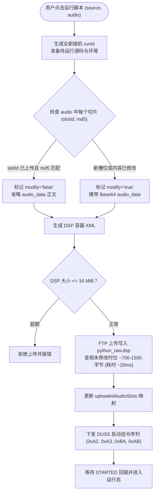
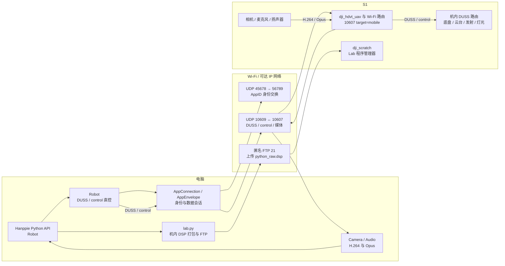
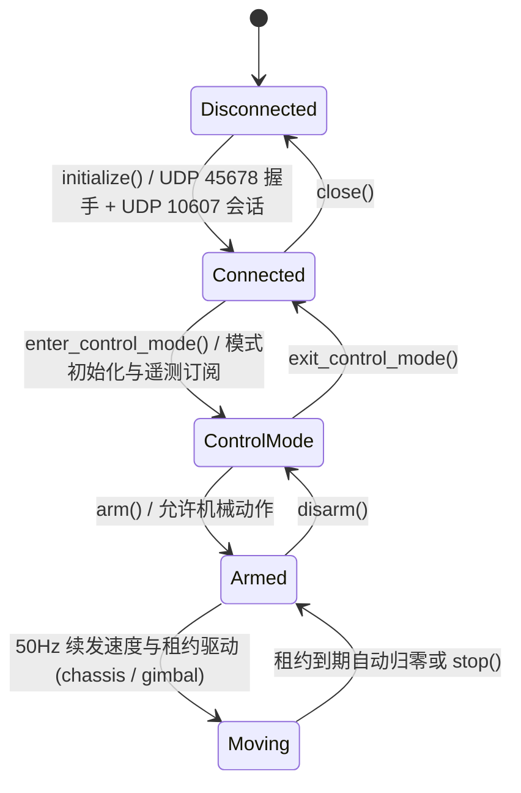

# Hanppie 技术架构

> 文档性质：Hanppie 当前实现、能力和安全边界的长期技术事实源。<br>
> 最后更新：2026-09-13<br>
> 已验证设备：RoboMaster S1，固件 `00.06.0521`

本文只记录 Hanppie 当前增加、恢复或组合的主机代码、Kotlin 客户端、机内载荷、能力状态与安全策略。RoboMaster S1 原生硬件、固件、App/Lab、DUSS、协议调查和外部生态统一维护在 [RoboMaster S1 原生架构、协议与调查](./architecture-robomaster.md)。已废弃方案、旧命令、迁移过程和历史取舍由日期化记录与 Git 历史保存。

## 文档所有权

| 信息类型 | 权威位置 |
| --- | --- |
| Hanppie 代码结构、实现机制、能力矩阵和安全边界 | 本文 |
| S1 原生硬件、固件服务、协议、App/Lab 机制和外部生态 | [`architecture-robomaster.md`](./architecture-robomaster.md) |
| 视觉、交互、断点和组件规范 | [`DESIGN.md`](../DESIGN.md) |
| 安装、CLI 参数和开发命令 | 中英文 README、`pyproject.toml` 和 `Taskfile.yml` |
| 单次实机命令、原始输出、故障和测量值 | 日期化联调记录 |
| 内置 SDK fork 来源 | [`src/robomaster/UPSTREAM.md`](../src/robomaster/UPSTREAM.md) |

本地运行时生成的临时记录与缓存默认不进入 Git。真机结果改变能力结论时，只更新本文的能力矩阵并引用对应证据。

## 证据标记

为避免把“代码中存在”误写成“真机可用”，本文使用以下标记：

| 标记 | 含义 |
| --- | --- |
| **实测** | 已在固件 `00.06.0521` 的 S1 上观察到协议结果或物理效果 |
| **代码** | 可由仓库内恢复代码或固定版本上游代码直接确认 |
| **官方** | 来自 DJI 手册、规格或官方 SDK |
| **推断** | 由多项证据推导，但尚未直接验证 |
| **待验证** | 接口或社区实现存在，但本项目尚未完成实机确认 |

能力结论至少区分四层：接口存在、命令被接受、遥测发生变化、物理效果得到确认。

## 1. Hanppie 项目实现与机制

**本章只描述 Hanppie 所做的实现、改动和当前边界。** RoboMaster S1 原机文件、协议和服务统一见 [RoboMaster S1 原生架构、协议与调查](./architecture-robomaster.md)；它们即使被本仓库引用，也不因此成为项目新增能力。

### 1.1 项目目标与边界

Hanppie 不替换整套 S1 固件，而是在保留原机控制器、相机、云台、底盘和安全机制的前提下，恢复或构建：

- 电脑直接连接，不依赖手机 App；
- Python 编程和可审计的协议探测；
- 有安全约束的本地或远程手柄控制；
- 视频、双向音频与可信遥测；
- 可恢复、尽量不持久修改设备的维护路径；
- 为 ROS 2、Web UI 或自动化算法提供稳定适配层。

当前不以持久 root、替换启动链、提高发射能力或绕过机械安全限制为目标。

设备兼容性按协议入口和能力组合建模，不维护以当前实机型号为唯一成员的封闭支持列表。通用客户端、会话、发现结果和 Host API 只表达 RoboMaster 机器人及其可用能力；型号专属的报文、服务和安全差异留在具体后端并标记证据来源。当前全部实机结论来自 S1 `00.06.0521`，因此只能声明 S1 验证范围；EP 与 S1 的底层模块复用关系见[原生架构 4.5 节](./architecture-robomaster.md#45-s1-与-ep-的产品边界)，但 Hanppie 尚未对 EP 完成发现、会话、执行器、媒体和安全回归，不据此声明 EP 已受支持，也不在通用代码中排除它。

客户端把网络发现、产品型号和组件能力作为三个不同阶段处理。UDP `45678` 广播只产生 IP、MAC、AppID 与配对状态，不猜测型号；App 数据会话建立时，既有初始化序列会发送 DUSS `0x3F/0xFE`、payload `00` 的只读产品查询，Kotlin `RobotProductProtocol` 与 Python `product.py` 只接受 `attr=0xC0` 有效响应中的显式产品码：`1` 为 S1、`2` 为 EP，其余保持 `UNKNOWN`，查询缺失或报文不完整时同样保持未知，不使用固件版本、上次选择或 S1 默认值兜底。DUSS `attr=0x00`、`0x3F/0x12` 的 working-devices push 独立更新 `RobotCapabilities`：保存每个 16 位设备 ID 及其未解释的附加值，已确认 ID 映射为组件，未知 ID 和附加值原样保留，不能由型号代替组件存在性判断。Kotlin 设备页只在当前会话收到明确型号后显示 `RoboMaster S1` 或 `RoboMaster EP`，断开、失联和新连接开始时恢复通用 `RoboMaster`；Python `AppConnection.product` 对每次会话执行相同的重置和更新。原厂机制与消息证据见[原生架构 5.3 节](./architecture-robomaster.md#53-robomaster-app-与-lab-程序机制)。**代码/S1 实机**

### 1.2 相对原机的改动清单

| 项目增量 | 发生位置 | 对原机做了什么 | 持久性/恢复方式                            |
| --- | --- | --- |-------------------------------------|
| 内置 S1 直连与 Lab 主机后端 | Git 仓库与电脑 | `src/hanppie` 实现 UDP `45678/56789` 身份交换、UDP `10609/10607` 会话、DUSS/control 直控、Lab 部署、视频和双向音频 | 随 Hanppie 安装；不修改固件                  |
| `src/robomaster` SDK fork | Git 仓库与电脑 | 内置官方 `0.1.1.68`/`ff6646e` 的纯 Python 源码，保持 `robomaster` 导入路径；不是当前实机后端 | 随 Hanppie 安装；不修改 S1；Apache-2.0      |
| PyAV 媒体兼容层 | 电脑 | 替代官方 SDK 缺失的 macOS `libmedia_codec` 扩展 | 不修改 S1，也不能改变 S1 命令支持情况              |
| `assets/s1-system/` 原机参考系统 | Git 仓库（`assets/s1-system/`） | 按系统原始绝对路径保存恢复的原机运行库、启动脚本与配置供研究/测试；已剥离出 `src/hanppie`，不随包打包分发 | 只影响仓库；不是部署到 S1 的新运行时                |
| 官方基准固件归档 | `assets/firmware/` | 归档官方最终完整固件 `00.06.0521.tar`（Git LFS）与清单，提供整机恢复基底 | Git LFS 存储；不修改实机；原厂二进制              |

Hanppie 不修改 `/init.rc`、原厂启动脚本或 `/system` 持久文件。Lab DSP 会写入 `/data`，但不等于开机自动运行。

### 1.3 当前实现架构
#### 1.3.0 单体仓库与 Kotlin 多平台客户端

仓库包含 Python 工具链及独立的 Kotlin/Compose Android、桌面客户端。Android 直接运行共享协议代码，不需要电脑、Python 解释器或 MCP 服务。

| 路径 | 当前职责 |
| --- | --- |
| `androidApp` | 独立 Android 应用入口、权限声明、FileKit 初始化、APK 与真机 UI 测试；只依赖 `shared`，不依赖桌面应用 |
| `desktopApp` | 独立 Kotlin/JVM 应用入口、FileKit 初始化、Compose application 生命周期及原生桌面打包；只依赖 `shared` |
| `shared` | KMP 共享 UI 库，无应用 `main` 或打包任务。`commonMain` 保存 Navigation 3 路由、全部页面、`WorkbenchViewModel`、`ConsoleModel`、DataStore/Room/文件存储容器、FileKit 文件流程、设置/脚本/机器人文件控制器、主题、Compose Resources、模型配置和 Koog 对话智能体；`jvmSharedMain` 只保存 Android/JVM 共同需要的 Java 文件路径、区域化资源和本地日期格式桥接；`androidMain` 与 `jvmMain` 保留窗口或 Activity 接入、媒体、语音、网络绑定、存储/区域 actual 和各自的 Ktor 客户端初始化 |
| `packages/robot-core` | 独立 KMP 协议模块，以 `cn.elonzh.hanppie.robot` 为根包并按 `protocol`、`product`、`session`、`lab`、`remote`、`media`、`telemetry`、`files` 分责；`commonMain` 实现 DUSS CRC、App 封包、广播解析、产品与组件能力解析、Lab 运行前临时 DSP 打包、遥控/媒体载荷与遥测，并声明机器人会话、Lab、文件服务、文件路径和流式 `Source`/`Sink` 契约；`jvmSharedMain` 以 `JvmRobotRuntime` 组合 UDP、Apache Commons Net FTP 和 Lab JVM 实现供 Android/JVM 共用 |
| `src/hanppie`、`src/robomaster`、`tests` | 精简后的 Python 核心通信与直控/Lab 库、SDK fork 及核心回归测试 |

模块边界遵循 [KMP 官方推荐结构](https://kotlinlang.org/docs/multiplatform/multiplatform-project-recommended-structure.html)：平台应用入口依赖共享库，共享库不反向依赖应用。共享 UI 以 `cn.elonzh.hanppie.ui` 为根包，按职责分为 `app`、`design`、`i18n`、`settings`、`scripts`、`chat`、`speech` 及 `robot.device`、`robot.diagnostics`、`robot.files`、`robot.remote`；测试 source set 镜像生产包，平台 `actual` 与对应 `expect` 位于同一能力包。共享库只向入口暴露 `app` 中的工作台和平台初始化函数，内部状态与控制器不因分包而公开，也不保留旧根包转发类型。一级页面与全屏驾驶舱使用 JetBrains Compose Multiplatform 发布的 Navigation 3 `NavKey`、可序列化 `NavBackStack` 和 `NavDisplay`；Android 配置变化与桌面重组共享同一路由实现，返回驾驶舱会弹出目的地而不是修改独立布尔状态。跨 Android/JVM 的中间源集显式命名为 `jvmSharedMain`，其中每个实现都实际依赖 Java/JVM；不再用中间源集承载可编译为 Kotlin common 的代码。纯逻辑测试在 `commonTest`，JVM/UI 测试在共享库 `jvmTest`，Android instrumentation 在 `androidApp`；桌面启动及打包由 `desktopApp` 负责。当前仅配置 Android/JVM 目标，尚无 iOS target、Xcode 工程或 iOS 平台适配，因此不声明支持 iOS；共享协调器只依赖 `RobotRuntime`，具体 UDP/FTP、Lab 上传、媒体、语音和文件路径仍由目标平台实现。

`WorkbenchViewModel` 是 Android 与桌面的共同界面状态所有者，持有共享 `ConsoleController`、编辑文档、显示模式、文件错误和全部 FileKit 操作，并用 `viewModelScope` 管理异步任务。共享 `ConsoleModel` 负责连接、脚本运行、对话与遥控之间的跨功能仲裁，只通过 robot-core 的 `RobotRuntime`、`RobotSession`、`RobotLabSession` 和 `RobotFileService` 契约访问机器人；`JvmRobotRuntime` 是当前 Android/桌面的具体组合。`RobotFilesController` 独立拥有机器人文件服务、操作任务和文件页状态，上传下载使用 `kotlinx.io` 流，不暴露 Java Stream。Android 由 Activity 的 `ViewModelStoreOwner` 保留配置变化期间的同一实例；桌面用 Lifecycle 2.11 的独立根 `LifecycleOwner` 包住 `rememberViewModelStoreOwner`，建立随窗口组合创建和销毁的作用域。ViewModel 清理时按确定顺序关闭机器人会话、平台资源、Room 数据库和 DataStore scope。生产构造必须注入 `SettingsStore`、`ScriptRepository`、`RobotRuntime` 和平台 HTTP 客户端工厂，内存实现只位于测试源码，不存在运行时存储降级路径。

`WorkbenchStorage` 是 composition root，不是智能体存储本身。它为应用设置创建 Preferences DataStore，为脚本和预置提供基于本地目录树的 `DirectoryScriptRepository`（存储根目录下划分为 `scripts/` 与 `presets/`，每个脚本包含 `manifest.json`、`script.py` 以及可选的 `audio/*.opus`），并以显式数据库路径和事件目录组合独立的 `AgentRuntimeStorage`。运行时只通过 `SessionHistory` 暴露 Agent Session，内部 `agent-runtime.db` 保存可重建投影，`filesDir/agent-runtime/sessions` 保存权威 JSONL。Room 3 使用 KSP 仅为 Agent 运行时生成单一数据库实现（`agent-runtime.db`），脚本库已彻底废弃 SQLite/Room 并移除旧 `hanppie.db` 与相关 schema，Android/JVM 统一使用 Bundled SQLite 驱动。DataStore 管模型服务、API Key、控制参数、语言、显示模式、Android 识别服务组件名，以及连接用稳定 AppID、路由器 SSID/密码和最多八台最近机器人；Session 事件不保存 API Key。FileKit 统一 Android/JVM 的脚本导入导出、机器人文件上传下载和调用系统默认应用打开文件，平台工作台不再重复维护 Activity Result、ContentResolver、AWT FileDialog、Desktop 或自有 FileProvider 流程。`ConsoleModel` 在应用组合边界直接构造八个 class-based Koog Tool 并形成一个 `ToolRegistry`，`ChatAgent` 接收该 registry 及技能目录提示生成函数；工具审批、执行开始和超时由 run-scoped Koog environment feature 处理，不存在逐项工具参数转发或自定义 `HanppieToolEnvironment`。kotlin-logging 记录存储、文件和智能体操作的原始异常；agent run 的 `runId` 贯穿日志、JSONL 终态事件与 SQLite run 投影，未产生 run 的初始化和 Session 管理操作使用独立操作 ID。对话命令准入和界面可操作性共同读取单一 `ChatPhase`，不存在隐藏的第二份运行锁；被拒绝的操作返回失败。终端用户不显示无法查询的关联 ID；本机日志保留原始异常、完整 cause chain 和 traceback，失败终态也把完整异常写入 JSONL 与 SQLite 投影，不增加脱敏异常包装器。

`ConsoleModel` 启动后只自动执行一次无动作连接：在平台选定的当前 Wi-Fi 上监听 UDP `45678`，以 MAC 和最近顺序匹配已连接设备；没有可用广播时依次尝试最近地址和原厂直连协议默认地址 `192.168.2.1`。广播包内嵌 IP 在网络切换时可能陈旧，连接目标以 UDP 来源地址为准。成功后更新最近 IP、MAC 和拓扑并清除瞬时发现结果；失败或会话失联后保持未连接，只有用户点击自动连接、完成配网或使用诊断页手动连接才再次尝试，窗口激活不会触发发现或重连。扫描结果和历史设备只作为内部候选，不形成面向用户的设备列表；模式选择只用于首次配置、主动换机和切换拓扑，不参与日常连接。路由器配网使用持久 AppID 生成二维码，收到配对广播后先建立 UDP `10609/10607` App 会话，再从 Host UDP `45678` 向广播来源端口回送原始 8 字节 AppID；直连即使没有广播也会尝试默认地址。这些连接操作不会进入遥控模式或产生机械动作。**代码/官方 App 静态实现；实机待复验**

构建使用 Kotlin 2.4.10、Compose Multiplatform 1.12.0、Lifecycle 2.11.0、Navigation 3 1.1.1、Room 3.0.3、SQLite 2.7.1、DataStore 1.2.1、FileKit 0.14.1、kotlinx-io 0.9.0、kotlin-logging 8.0.4、miuix 0.9.3、Compose Icons Lucide 2.2.1、Gradle 9.6.0、AGP 9.4.0，构建 JDK 21。Room 编译器使用 KSP 2.3.12。共享并发标志使用 Kotlin 标准库 `kotlin.concurrent.atomics`，协程任务串行化使用 Channel/Flow，不引入 atomicfu。通用工作台操作图标由 Lucide `ImageVector` 提供，Miuix `Icon` 负责着色和呈现；品牌与业务专用符号仍由 Compose Resources 管理。AGP 版本同时受构建依赖和 IDEA Android 插件支持范围约束，命令行构建通过不代表 IDE 同步兼容。Android `compileSdk=37`、`targetSdk=36`、`minSdk=26`；编译 SDK 不是手机必须运行的系统版本。客户端已接入 Koog 1.2.0 文字对话智能体，Android 保留系统语音输入；KMP 客户端的回复朗读、自动朗读及系统 TTS 配置已删除，未接入唤醒或手柄。Android 和桌面已接入机器人视频、麦克风下行播放，以及按住采集、松开发送的机器人扬声器短片对讲；这些机器人音频能力不属于回复 TTS，对讲不是实时双工语音。

编译 SDK 使用显式 `release(37) { minorApiLevel = 0 }`，对应 SDK Manager 的 `platforms;android-37.0`。Wrapper 的 `distributionUrl` 固定 Gradle 9.6.0；当前 AGP 9.4.0 组合已通过命令行 KMP、Android APK 和 Android 测试包编译，IDEA 模型导入仍需单独验证，不能由命令行结果外推。

桌面日志与对话列表通过平台 `DesktopListScrollbar` 接入 Compose Desktop 的 LazyListState 滚动条适配器，Android 实现为空，列表及其数据源仍由共享代码维护。桌面常驻对话侧栏占满对话页可用高度，记录列表在侧栏内部滚动；窄屏历史弹层保持内容自适应并设置最大高度，两种布局不共享错误的内容高度策略。

连接页在共享 UI 中区分两种原生网络拓扑：直连模式下机器人作为 Wi-Fi AP，终端先在系统设置中加入机器人热点；路由器模式下机器人和终端加入同一局域网。直连模式复用 `RobotRuntime.discover()` 的 UDP `45678` 广播发现；路由器模式由共享层使用 `RouterProvisioning` 按机器人协议编码 SSID、密码、持久 AppID 和国家码，再由 QRose 渲染本地二维码。用户开始等待后，`RobotRuntime.waitForRouterPairing()` 在 UDP `45678` 接收与该 AppID 匹配的机器人配对广播，客户端以报文真实来源地址建立同一个 `AppSession`，最后由 `acknowledgeRouterPairing()` 从 Host UDP `45678` 向来源端点回送 AppID。两种模式不复制协议会话、遥控或媒体实现，也不按当前 S1 地址硬编码目标。

路由器 Wi-Fi 名称和密码保存在应用私有 DataStore，以便再次配网时预填；不会进入日志、诊断、SavedState 或界面明文展示。输入按协议字段的 UTF-8 字节数校验，SSID 为 1–32 字节，WPA/WPA2-PSK 密码为 8–31 字节。Android 只把机器人 UDP/FTP socket 绑定到当前 Wi-Fi `Network`，不会把模型 HTTP 客户端切到机器人热点；桌面入口按操作系统打开网络设置。Hanppie 不替机器人切换机身 AP/Station 物理开关，也不依赖 RoboMaster 官方 App。IPv4/AppID 手工输入只在设备诊断中作为开发和故障排查入口，不出现在设备页或普通连接指引。

桌面 AWT 普通窗口最小为 320×480；操控窗口最小为 740×480，窄窗进入操控时调整为 1040×700，退出后恢复进入前尺寸。导航仅显示图标并保留语义名称。页面按可用宽度响应：小于 720 dp 使用底部导航，宽屏使用侧栏；设备、脚本、诊断、对话、设置五个入口共享实现。麦克风与发送采用相邻的 48 dp 图标按钮；模型配置和 Android 语音识别服务入口统一收纳于独立设置页，没有独立语音页。设置页按通用、模型服务、控制、状态灯颜色和快捷键提供分类入口；窄窗口进入独立详情并通过页面返回或系统返回回到分类，宽窗口采用分类列表与详情双栏。双栏需要容纳 240 dp 分类栏、480 dp 表单和 16 dp 间距，前两项随字体缩放；调整窗口不丢失当前分类和模型层配置草稿。通用偏好即时持久化，其余详情底部固定“保存设置”按钮，仍通过原有 SettingsController 保存模型与控制配置；全局恢复默认入口位于分类列表底部。对话页在小于 840 dp 时通过有界且随内容收紧的弹层显示历史列表，达到 840 dp 时显示占满可用高度的 280 dp 固定侧栏并让记录在内部滚动。“新对话”入口位于列表标题区；新建、重命名和永久删除均为共享 UI，列表项只显示一个紧凑操作菜单；删除不再弹二次确认，菜单里选中即删除。“新对话”只把界面聚焦到一个没有上下文的空输入框，不落库；会话在发送第一条消息的那一刻才创建并以该消息命名，删除当前会话后同样回到空输入框而不是新建会话；对话记录每项只占一行（标题单行省略，不再显示最近消息预览），标题就是用户发送的第一条消息（按单行截断到 24 字），客户端不让模型生成标题（该尝试已移除）；改名会同时刷新界面持有的会话列表（历史上只有手动重命名刷新列表，标题改在库里却没进界面）；聊天草稿在页间切换时保留。用户消息靠右、随内容收缩并限制最大宽度，assistant Markdown 在主内容区直接排版，不使用气泡或角色名称。Android 使用 edge-to-edge，并应用系统安全区和 IME Insets。设备页未连接时只呈现自动连接及“添加或更换机器人”恢复入口，连接中不显示不可操作按钮；连接后只呈现当前机器人、就绪状态、遥控入口和三项状态，不显示扫描结果、历史记录、地址或重复工作区入口。直连/路由器模式选择与分步指引仅用于新增或切换机器人；IPv4/AppID 只放在诊断页的手动连接弹窗，原始遥测、日志和报文也位于诊断页。脚本入口先呈现程序库，再进入顶部对齐的等宽编辑区；窄屏脚本卡片单列，宽屏按行排列，说明按需展开，操作按钮可换行。脚本页把操作按对象分层，而不是把同级图标平铺一排：运行/停止是编辑区上方操作栏右端的主操作，操作栏左侧只保留保存、自定义音频、“监控”（仅当画面没有内联显示时才出现）和“更多操作”；重命名是名称旁的迷你图标（标题与图标作为一组占满剩余宽度，图标紧跟文字、连接状态始终贴右边缘，且不是 48 dp 工具栏按钮；音频条目同理），导入、导出和删除收进“更多操作”弹窗，删除脚本的行只写动作名并在点击后立即执行，不再叠加二次确认弹窗（管理本身已需要长按 + 选择菜单两级意图）。程序库卡片不再有任何按钮、箭头或能力标签（“本地”这类标签已删除，它没有区分作用）：点击整行打开程序，重命名与删除通过长按执行，桌面端另支持鼠标右键（`secondaryClick` 是 expect/actual：桌面接 `PointerMatcher.mouse(Secondary)`，Android 为 no-op，触摸端由长按覆盖），卡片只呈现名称与更新时间。监控面板把实时画面放在上、电量/信号/云台状态条放在下，不显示报文计数（无操作价值，且长度变化会让状态条换行）；自定义音频同样以弹窗管理，音频条目左侧为垂直拖拽手柄与试听播放按钮，重命名铅笔紧邻名称，右侧为删除按钮。应用固定使用 Graphite Orange 浅色/深色色表，默认跟随系统显示模式；视觉与文案规范见 [DESIGN.md](../DESIGN.md)。

miuix 提供导航、按钮、输入框、卡片、开关和弹窗，`WorkbenchTheme` 统一设置 MiuixTheme，页面不使用 Material Design 组件。`LocalSquircleEnabled=false` 保持使用 miuix 标准圆角路径，避开 0.9.3 squircle shader 与 Compose 1.12.0 桌面 Skia 的 ABI 不兼容。脚本编辑器使用 Compose BasicTextField。设置语言使用下拉菜单，切换即时生效。默认服务商与默认模型是 DashScope 的 `qwen3.8-flash`（`ModelSettings` 默认值即维护目录的首个条目，有测试固定）；设置页提供“思考深度”（跟随模型默认 / 关闭思考 / 低 / 中 / 高）：非默认档以 OpenAI 兼容的 `reasoning_effort` 只作用于真实对话请求，默认档不发送该字段以保持服务商原生行为；连接测试不发起聊天补全，因此与这一参数无关。DashScope 对 `reasoning_effort` 的接受情况尚未实测，属于未验证边界。模型服务分组按“服务商 → API 地址 → API Key → 模型 ID → 思考深度”排列，模型只有一个“模型 ID”字段（不再有重复展示同一 ID 的下拉行）：字段旁的按钮打开可输入的模型列表，即时过滤内置目录、已获取的远端目录与当前值，并在展开时才按当前配置异步获取远端目录；设置页初始化、应用启动和供应商切换不请求目录。未填写 API Key 时不创建 HTTP 客户端，目录失败保留手动模型输入；“测试连接”是独立的显式两步检查（本地校验、目录），只验证鉴权通过且接口正常响应，不负责驱动选择器状态。它不探测流式文本、不发起聊天补全、不强加工具调用或思考相关参数：为了“适配”思考模式而给探针加 `auto` 工具选择或思考预算，等于让测试改写模型请求行为。结果只以一行“连接正常”或一条失败原因呈现，阶段明细、异常堆栈与探针内部细节属于诊断信息，只写日志、不呈现给用户；模型信息用简短摘要（名称、上下文与最大输出、可读的能力标签）展示，不列出 `temperature`、`openai.completions` 这类传输层标识。

桌面入口在支持 AWT Taskbar 图标设置的平台上从 classpath 加载 `icons/hanppie.png` 并设置运行进程图标，覆盖 Gradle／IDE 开发启动；macOS Gradle 启动名为 Hanppie。Compose Window 使用资源库中的 `hanppie_app_icon.png`，原生安装包继续通过平台配置引用 PNG／ICO／ICNS；其裁剪运行时显式包含 DataStore 外部 protobuf 所需的 `jdk.unsupported`。macOS 分发包固定使用 `cn.elonzh.hanppie.desktop` bundle ID，并在最终 `Info.plist` 声明 `NSLocalNetworkUsageDescription`；AppID 身份声明若在系统权限决策期间收到 `NoRouteToHostException`，只在原有四秒声明窗口内重试，窗口内从未成功发送则保留该错误并终止连接。上述品牌资源均由品牌导出脚本生成。一级导航、普通页面、对话和遥控 HUD 的通用静态图标全部由 Compose Icons Lucide 提供，并通过唯一的 `WorkbenchGlyph` 语义映射交给 Miuix `Icon` 着色；资源库不再保存同义功能 SVG。准星叠层、可变信号条、摇杆和底盘相对相机朝向属于实时状态可视化，继续由 Compose Canvas 绘制。媒体请求仍统一经 `RemoteMediaController`，图标替换不更改请求或协议。

`AppearanceController` 只保存独立于连接与模型配置的显示模式，支持跟随系统、浅色和深色，默认跟随系统。软件主题固定为 Graphite Orange，不再提供 miuix 原生、查派、海蓝、森林等预设或自定义色板；浅色/深色色表集中在 `HanppieDesignTokens.kt`，页面不动态派生主题。设置页只显示一个显示模式下拉行。显示模式以 `SYSTEM`、`LIGHT` 或 `DARK` 保存到共享 Preferences DataStore；不存在记录时使用初始值，无效值直接报告加载失败，不读取或迁移旧平台偏好。Compose 系统明暗状态驱动跟随系统模式，Android 系统栏图标按当前背景亮度同步。设置页的全局“恢复默认”经过二次确认后同时恢复语言、显示模式、模型服务、控制参数、快捷键和 LED 状态色，并从 DataStore 清除已保存的 API Key；旧设置中的 `autoRead` 字段由宽容解码明确忽略，不会阻止启动。环境变量覆盖保持生效但不会被重置操作复制进持久化配置。品牌头像、小标记和四种点阵表情通过 Compose Resources 共享；侧栏复用共享机器人头像，驾驶舱状态只显示一处点阵表情。设备页使用 RoboMaster 家族身份，不把当前验证型号写成固定产品类型，也不绘制虚构的具体机器人外形。`DevicePage` 将设备身份、日常操作和连接后状态分层呈现；宽屏操作限制为 260 dp 列，窄屏纵排，扫描候选与历史机器人从不渲染。对话空状态使用共享品牌头像，脚本与诊断空状态使用 Lucide 文件图标。

对话通过 multiplatform-markdown-renderer 0.45.0 的无主题核心渲染，颜色与字阶来自 MiuixTheme，不依赖其 Material 适配模块，已完成消息使用 `rememberMarkdownState`；当前回复使用 `rememberStreamingMarkdownState`，将智能体累积字符串的新增后缀顺序追加到渲染器，每条新回复建立独立状态。`multiplatform-markdown-renderer-code` 为 fenced code 和 code block 提供按语言标识的语法高亮；普通回复、流式回复与脚本审批复用同一组件配置。消息列表使用末尾锚点和不受 250 条可见记录上限影响的用户消息 revision，在新 Session、用户消息持久化后及仍处于跟随状态的流式内容增长后等待下一帧布局并定位到底部；用户向历史方向滚动会暂停跟随，回到底部或再次发送时恢复。Coil 3.5.0 与其 OkHttp 网络模块负责 Markdown 图片加载；机器人实时视频仍由平台视频解码器处理，不经 Coil。工具 Call/Result 的原始字段保存在 Session 事件中；对话页默认显示本地化状态和结构化摘要，主动展开后才按字段显示完整参数与结果。待审批脚本保留并展示原文，Markdown 不触发机器人执行。

**GUI 国际化：** Android 和桌面共享 Compose Resources：`commonMain/composeResources/values/strings.xml` 为英文默认资源，`values-zh/strings.xml` 为简体中文，调用使用生成的 `Res.string` 类型安全标识；参数采用标准 `%1$s` 格式。`Localization.kt` 保存完整 BCP-47 系统语言标签，并在 commonMain 通过 Compose `Locale` 解析语言；当前产品规则将所有 `zh` 标签映射到简体中文，其他语言映射到英文。Android 和桌面的 Locale、资源加载及本地日期格式分别由 `actual` 入口接入，Java Locale 只存在于 `jvmSharedMain`，加载指定资源后恢复原进程 Locale，不永久修改 JVM 全局默认值。每种语言首次同步加载并缓存，后续界面和同步服务回调只查内存并格式化，不反查译文或用原文作资源键。连接/脚本实时状态保存资源标识和参数，聊天角色使用枚举，连接地址为独立字段，业务判断不依赖显示语言。设置提供跟随系统、简体中文、English，切换即时重组，不重建 ConsoleModel、机器人连接或清空编辑器/对话。语言选择与模型配置由共享 Preferences DataStore 中的独立键保存；不存在语言记录时跟随系统，无效值明确报错。桌面启动时传入完整系统语言标签，Android 随配置变化更新。导航、驾驶舱、设置、脚本界面、确认框、语音提示、媒体状态及已知错误有双语显示；系统/设备提供的原始错误、报文、脚本源码、用户输入和历史消息保持原文，不做推测翻译。Android 应用名称使用原生 `values` / `values-zh` 资源，按系统资源语言显示。Gradle 插件及第三方依赖版本统一声明在 `gradle/libs.versions.toml`。

智能体每轮系统提示使用当前界面语言作为默认回复语言，用户可另行要求，不翻译或修改工具 ID 与脚本源码。Android 识别语言传入当前应用的 `zh-CN` / `en-US`，切换语言会取消正在进行的识别。语言选择恢复、占位符一致性、切换后编辑器保留、英文手机/桌面界面由离线测试覆盖；不以翻译工作声称修复 HyperOS 识别服务权限问题。

识别服务返回权限错误（9）时重新检查憨皮自身的录音权限：自身已授权则显示服务拒绝访问，不将服务错误解释为憨皮未授权。设置页的语音服务列表提供各提供商的应用详情入口，用户可检查该服务自身权限；应用不替其他服务授予权限。语音服务选择显示已选项，系统默认语音输入设置使用对应系统 Intent。应用内服务选择不等于系统默认配置：普通安装的非默认识别服务可能因系统后台录音限制返回错误 9，即使录音权限已授予；系统默认项缺失时该错误引导用户配置默认输入，不继续重复请求憨皮权限。

对话页使用手机麦克风的 `AndroidSpeechInput`（`SpeechInput` 接口）进行单次系统识别。首次点按显示系统服务可能联网处理声音的说明，然后按需请求 `RECORD_AUDIO`，不在启动时申请权限或录音。应用内显式选择的识别服务优先，并仅通过共享 Preferences DataStore 持久化其组件名；未选择时，API 31+ 本地识别服务可用则使用本地服务，否则解析有效的系统默认服务或唯一可用服务，通过组件名显式绑定 `RecognitionService`。没有可确定服务、存在多个服务但无默认项或已选服务被移除时，提示在设置页中选择，不轮流尝试录音、不更改系统全局默认设置；服务/语言不可用、拒绝权限、网络错误均显示原因。平台调用及销毁在主线程，每次录音创建独立代次以忽略旧回调；30 秒超时取消，结束录音后等待最终结果。部分结果仅预览，最终文字回填草稿并消费一次，用户确认后才发送给智能体。应用不保存或记录原始录音，Koog 只接收发送的文字。

KMP 客户端不提供助手回复朗读。`SpeechEngine`、`ReplySpeaker`、`AndroidSpeech`、`SystemSpeech`、自动朗读设置、Android TTS service query 和系统 TTS 设置入口均已删除；Android 语音输入、机器人麦克风下行、机器人扬声器短片对讲以及 Python `hanppie agent` 的独立 TTS 不受影响。

语音相关离线测试覆盖空默认项、唯一/多个服务和失效偏好的服务选择，以及识别回填而不发送、导航时取消和旧 `autoRead` 设置兼容。小米 13 的语音入口、识别联网说明取消、键盘布局 instrumentation 测试通过，已查看真机截图；该自动测试不录音。真实听写准确率仍需人工验证，界面测试不能替代音频链路验收。

脚本库管理应用私有的“我的脚本”和随应用打包提供的预置脚本。我的脚本与预置脚本彻底采用同一套基于文件系统目录树的存取逻辑（`DirectoryScriptRepository`），每个脚本存为一个独立目录，包含 `manifest.json`（仅保留名称、简介与创建/更新时间戳，不维护 `nameEn`/`summaryEn` 等硬编码多语言冗余字段）、`script.py`（Python 源码）以及可选的 `audio/<slot>_<name>.opus` 资源。预置同步时校验并清理目录中非当前的孤立/陈旧音频文件，`ScriptBundle.load` 与音频库在加载与保存时统一按槽位 `id` 强校验去重并按序归一化，彻底根除预置升级或复制副本导致的槽位编号冲突与播放态联动缺陷。我的脚本存储于应用私有目录 `scripts/<id>/`，支持新建、导入、编辑、保存、重命名、删除和导出；名称限制为 1～64 个可见字符且不允许忽略大小写后重名。脚本库列表按创建时间（`createdAtEpochMillis`）降序排列，新创建或新导入的脚本排在最前。预置脚本解包同步于 `presets/<id>/`，首次启动或更新时自 Compose Resources 自动同步至应用目录，查询与枚举完全复用普通脚本的目录遍历契约（`ScriptBundle.list`）。预置脚本只读不可直接改写，在界面打开时产生未关联的草稿副本，修改后保存成为普通“我的脚本”，预置携带的音频切片同步拷贝至新脚本目录中。此前基于 Room 3 的 SQLite 存储（`hanppie.db`）与旧 `.dsp` 预置打包格式已全量废弃并删除，彻底消除了将开发态脚本封装为中间二进制容器再逆向解析的形式化开销。当前提供 13 个有限时长的主题节目，覆盖城市工作、角色表演、自然光景、周五狂欢舞（Beck Martin《Friday Night》神曲复刻）、旅行和剧情音效；机内 Lab Python 环境中全局 `time` 是固件注入的 `RobotTools` 对象，不支持 `time.time()`，节拍与延时必须使用 `time.sleep()`；运行日志与多行堆栈在控制台中完整展示，排除了单行截断；运动预置先把机器人设为自由模式，并在 `finally` 中发送对应停止命令。所有预置源码都使用 `def start()` 和已恢复的 S1 Lab Python 3.6.6 控制对象，彻底消融任何形式化分层与私有辅助函数，直接直调原厂原生 API（`log_ctrl.print_msg`、`led_ctrl.set_led`、`media_ctrl.play_sound` 等），避免私有方言误导和机载全局命名空间污染。

外部 `.py` 导入/导出和机器人文件上传/下载统一调用 FileKit；Android 由 FileKit 使用系统文档选择器且不申请全盘存储权限，桌面使用平台原生选择器。打开机器人文件先下载到 FileKit 缓存目录，再由 FileKit 调用系统默认应用；Android 使用依赖自带的受限 Provider，不再声明项目自有 FileProvider。导出只是复制当前源码，不把软件私有脚本的未保存修改误标为已保存。编辑器顶部栏最左侧使用返回图标，Android 系统返回手势走同一返回逻辑；替换或离开实际修改过的源码需要确认，未修改的新建、导入、预置和已保存脚本直接返回。共享 `WorkbenchViewModel` 保留配置变化或桌面重组期间的文档、脚本库和会话模型。文档不写入系统 saved-state Bundle，不自动持久化草稿，进程被系统回收后未保存内容无法恢复。保存到脚本库以实际写入的源码快照更新，不把保存期间的新编辑标成已保存。

Android 的 `RobotNetwork` 只将发现/身份交换/会话 UDP 和 FTP 控制及数据套接字绑定至当前 Wi-Fi；不更改进程默认网络，云端模型走系统默认网络，机器人热点无互联网时仍需系统提供可用互联网连接（例如蜂窝数据）。发现期间持有 multicast lock。退到后台时停止本应用播报、取消对话及网络操作并关闭会话、释放锁；回前台保持未连接，等待用户再次发起连接。配置变化不触发后台断连。当前无后台常驻服务，不要求 HyperOS 关闭省电管理。关闭网络不保证任意机内 Python 脚本停止。

UDP 会话只接受指定机器人地址，身份交换与持久 App 会话复用同一核心；发现、身份交换和 App 会话握手在每轮最多 200 ms 的 UDP 接收后检查协程取消，初始化命令间隔使用可取消挂起，后台切换或用户取消不必等待完整的 3～4 秒发现/身份期限。非遥控状态发送中性 control 帧，5 秒无匹配数据判定会话失联。遥控输入另外要求最近 500 ms 内收到过匹配数据，超过该时间即拒绝续租、清空输入并尝试发送 control neutral、底盘零轮速和云台零速。会话失联、显式断开和新会话建立完成时，各发送三组相同停止帧，组间隔 20 ms。

前台已建立的会话失联后，GUI 立即撤销遥控授权、清除输入和旧遥测，并保持未连接，不在后台持续重试。桌面窗口失焦会立即归零并撤销遥控授权；重新激活窗口时，仅当原会话仍有效且用户仍停留在驾驶舱，界面才重新建立遥控通道，连接已经失效时不会新建会话。用户下一次主动连接成功后会先发送停止帧，再发布已连接状态并重建 Lab 控制器；这不会恢复旧遥控授权，也不确认失联前的机内脚本状态。完全断开 Wi-Fi 或机器人失电时，主机停止帧无法送达；当前实现只能利用短租约、旧会话尽力发送和 S1 已观察到的会话失联行为，仍需按第 2 章覆盖更多断网场景做物理停车验收。

被动发现不主动接管。GUI 不把唯一的机内上传位置表现为程序管理；点击“运行脚本”本身就是执行意图，不再要求额外复选框。客户端先结束可能由旧客户端遗留的原生运行态，再把当前未修改的原始源码写入 `python/python_raw.dsp`，以 FTP 成功应答确认传输并完成 DSP MD5 注册，最后发送启动命令；再次运行其他脚本会覆盖该文件。Hanppie 完全消融了历史上的 Python 源码插桩，用户编写的代码原样打包上传，不在客户端进行正则重命名或静态禁止 `import`。程序生命周期完全由 S1 固件原生 DUSS `0x3F / 0xA5`（`DUSS_MB_CMD_RM_SCRIPT_BLOCK_STATUS_PUSH`）状态机驱动：`status=2` 且携带 32 字符 Hex GUID 时确认启动（`STARTED`）并转入 `RUNNING`；脚本自然执行完毕退出时固件主动推送 `status=0`（GUID 归零），客户端确认完成（`COMPLETED`）；脚本抛出未捕获异常时固件主动推送 `status=5` 并携带 GUID 及机内完整的原生 Traceback 文本，客户端据此判定 `FAILED`。`0x3F / 0xA4` 仅作为普通用户脚本日志通道（`log_ctrl.print_msg`），彻底与执行生命周期解耦。对话请求在物化模型响应前会修复工具调用的异常形状（部分 OpenAI 兼容端点，含 DashScope，在流式返回里给出残缺的工具调用帧）：只在首个增量里出现的工具名会被补回完整帧，否则调用会以 `Tool with name '' not found` 在工具注册表处中断整轮对话；参数内容为空时替换为空对象 `{}`，否则物化响应会把空文档当 JSON 解析并以 `unexpected end of the input` 中断；自始至终没有给出工具名的帧视为流中的幻影调用，连同其增量一并丢弃，让该轮保留模型已产生的文本。回填、参数替换与丢弃都写日志（含工具名、id 与 index）供排查，不在界面上暴露这类帧级细节。以上三种行为都有离线测试固定。发送启动命令后 10 秒内没有收到匹配当前 GUID 的 `STARTED` 时，界面从“等待启动”转为“状态未知”并提供停止入口，不自动重试或覆盖可能已经执行的脚本。控制台始终显示可复制的脚本 32 位 GUID 标识，并记录主机侧上传确认、DSP MD5、启动序列和超时窗口内收到的数据帧/Lab 帧数量；agent 工具结果也带回该 GUID 标识，使 Session 事件可以关联到脚本运行。收到匹配运行标识的结束或失败事件后，客户端发送结束 metadata 和原生 runtime stop，清除单一槽位并把界面更新为完成或失败；当运行失败（FAILED）时，客户端将机载固件原生上报的 Traceback 文本分发并追加至脚本运行消息（`scriptMessages`），同时记入主控制台日志流（`logs`）；运行面板的状态栏在失败时允许多行展示并支持选中文本复制，运行日志展示完整的多行错误堆栈，彻底解决此前因单行截断导致排查困难的问题；旧运行的迟到事件不能结束新运行。普通脚本日志显式调用 `log_ctrl.print_msg(...)`，客户端不替换固件全局 `print`，也不把任意 stdout 推定为日志。运行不再切换页面：控制台内联在脚本页，展示运行阶段、名称、耗时、运行标识和本次运行保留的最近 200 条输出，日志可选择、自动跟随最新输出并占据该面板的主要剩余空间，窄屏位于编辑器下方、宽屏位于编辑器右侧；短横屏窗口给控制台更大的高度份额，避免日志被状态行挤成零高度。返回或编辑不停止脚本；其他一级页面在运行期间显示可点击全局运行状态条、最近输出和停止入口，结束状态继续显示 8 秒。启动/停止命令的发送本身仍不是完成证据：停止命令发送成功后运行状态标为“未确认”，全局运行状态条持续显示未获得机内停止确认直到下一次运行，且不阻塞下一次运行或进入驾驶舱，也不再提供第二次停止入口；失联时保留运行名称和输出但将状态标为未知。启动注册部分失败后禁止直接重试或覆盖上传，必须先结束可能的运行态。文件页可以枚举和下载 FTP 数据树，但不会把 DSP 文件存在推定为已注册或正在运行；`/python/python_raw.dsp` 作为 Lab 当前上传槽位禁止通过文件页上传覆盖、重命名或删除，切换遥控或重连后仍不保留可再次启动的上传态。

脚本自定义音频属于已保存的脚本目录（`audio/<slot>_<name>.opus`），随程序在运行前动态打包进临时 DSP 上传，不是机内媒体库。导入只接受主机文件，由平台能力解码（桌面 FFmpeg，Android `MediaExtractor`/`MediaCodec`），统一为 DSP 容器要求的 48 kHz 单声道 20 ms 帧，再编码成带双字节小端长度前缀的 Opus；时长直接通过 Opus 数据包帧数（`frameCount * 20 ms`）动态计算，杜绝元数据与实际音频的时长漂移。编号取 0..9 的首个空位，名称取文件名并截断到 64 字符，超过 50 MB 的原始输入在任何解码之前被拒绝。运行脚本时把 `<audio-list>` 渲染进 DSP：每个节点写 id、name、`type="opus"`、整数秒 duration、base64 正文的 MD5 前 8 位与 `modify` 标志，未缓存资源正文放在 base64 CDATA 中，已缓存资源省略正文以实现增量极速上传（详见下文）。上传前用 `LabProgram.MAX_DSP_BYTES`（已通过实机 16 MiB 阶梯测试验证并设为 16 MiB 主机安全上限）拒绝超额组合，校验发生在任何协议帧之前，超额时保留脚本与音频、只报错不静默截断。脚本中直接通过 `media_ctrl.play_sound(rm_define.media_custom_audio_N)` 语句播放对应槽位的自定义音频。自定义音频管理面板提供跨平台音频试听播放器（`LabAudioPlayer`）：桌面端基于 Java Sound (`SourceDataLine`) 与 FFmpeg 解码，Android 端基于系统原生 `MediaCodec` 与 `AudioTrack` 进行 48 kHz 单声道 PCM16 播放，支持播放、暂停、恢复与停止，并在 UI 上呈现微进度条与播放进度；音频切片支持通过左侧手柄进行指针垂直拖拽实时排序，重排后 0..9 槽位连续重新分配，通过 `DirectoryScriptRepository.replaceAllAudio` 实现音频切片文件与 manifest 的原子同步与持久化。**代码/离线测试/S1 实机**

**自定义音频容量与秒级增量上传：**
在 S1 采用的 12 kbps 单声道 Opus 编码下，Base64 膨胀后每秒音频仅占约 2.1 KB。实机阶梯压力分析（已验证 256KB、512KB、1MB、2MB、4MB、8MB 与 16.6MB 上传与执行）表明，FTP 传输、DUSS `0x3F/0xA1` 的 32 位载荷长度字段以及 S1 Android 4.4 `/data` 分区在 16 MiB 级别下均顺畅运作。`LabProgram.MAX_DSP_BYTES`（16 MiB）可容纳超过 130 分钟（2 小时以上）的音频总时长，远超机器人单次电池续航（约 20～35 分钟），单音频或全套音频在实际表演和任务中均完全不受播放时长约束。预置节目《周五狂欢舞》（`friday-disco`）在槽位 0 加载 88.16 秒完整原声长音轨 `0_friday_night.opus`（132.8 KB，4408 帧），开场单次触发 `media_ctrl.play_sound(rm_define.media_custom_audio_0)` 作为连续贯穿始终的 BGM，动作精准对齐 88.16 秒音乐时间轴与经典舞台梗点，无需分段切片拼接，彻底杜绝切音断帧与声画漂移风险；机内 10 个独立槽位回归其原生设计职责，用于承载不同状态的独立音效与交互台词。

为消除大体积音频重复传输导致的执行延迟，Hanppie 采用仿原厂机制的**音频分离增量上传**：
1. **槽位与摘要跟踪**：`LabController` 内部维护会话级已上传槽位映射 `uploadedAudioSlots: Map<Int, String>`（`slotId -> audioMd5`）。
2. **增量 XML 打包**：打包 DSP 时，`labAudioListXml` 检查各音频切片的槽位与 MD5。若当前槽位已在机载生效，则输出 `<audio id="X" name="..." type="opus" duration="..." md5="..." modify="false"></audio>` 并**彻底省略 `<audio_data>` 正文**；若为首次上传、槽位内容变更或新增切片，则输出 `modify="true"` 并携带 Base64 正文。
3. **秒级轻量上传**：当音频无变动时（即使 Python 代码发生修改或调试重跑），生成的 DSP 体积从数百 KB 骤降至约 700～1500 字节，FTP 传输在数十毫秒内完成。
4. **生命周期原生健壮**：每次运行依然生成全新且唯一的随机 `runId`，走标准严谨的 FTP 上传、MD5 注册与 DUSS 启动握手流程，不破坏原有生命周期与事件匹配机制，彻底杜绝日志串线与过期机载幽灵执行。会话断开或退出 Lab 模式时立即清空槽位记录。**代码/离线测试/S1 实机**



脚本页把运行监控分成两块共享面板：控制台（运行阶段卡 + 日志）与监控（状态条 + 实时画面）。控制台在编辑器打开时始终存在，宽屏放右侧 380 dp 栏、窄屏放编辑器下方；未打开脚本时只在存在非空闲运行状态（含最近一次已完成/失败结果）时出现，使顶栏运行状态条的点击总落在能看到该次运行的位置。宽屏在右侧同时内联监控面板：可用高度不小于 520 dp 时显示实时画面（状态条在其下方），否则只留状态条，此时操作栏才提供“监控”入口；窄屏不常驻监控，状态条与画面都在“监控”弹窗里。两种方式都复用驾驶舱的 `RobotVideo`，进入时才建立媒体、离开即停止，不会新建媒体通道。监控与音频弹窗都提供显式关闭按钮，手机也能确定退出。**代码/离线 UI 测试**

共享 `RobotFilePath` 维护 FTP chroot 内的路径、保留槽位和 ASCII 命名规则；JVM `RobotFileSystem` 只负责具体 Apache Commons Net 传输。每次操作建立短生命周期的匿名 FTP 连接，使用被选中 Wi-Fi 的 socket factory、被动模式和二进制传输；逻辑绝对路径始终锚定在 FTP chroot，拒绝 `.`、`..`、斜杠、反斜杠、控制字符、非 ASCII 和超长名称，也不跟随列表中的符号链接进入目录。上传选择器取得的非 ASCII 名称会转换为可预测的 ASCII 名称，避免固件静默生成问号文件名。目录列表包含隐藏项并按“目录优先、名称排序”返回；上传和下载通过 common `Source`/`Sink` 流式传输，不把整文件载入内存。同名上传使用 `name-2.ext` 等空闲名称，重命名不覆盖已有目标，目录删除只允许 FTP 服务确认的空目录，不提供递归删除。

实机对长度 `1/15/16/17/31/32/33/46` 字节的临时文件探测显示，FTP 存储的非空数据会稳定变为 `16/16/32/32/32/48/48/48` 字节；相同明文得到相同字节，标准 DSP AES-CBC 密钥和 IV 不能解开该层内容。零字节文件保持为空。由此，列表、目录和名称操作可按普通 FTP 语义管理，但 `RETR` 得到的是原始机内数据，不能宣称是上传明文的无损回读，也不能把扩展名视为可播放音频。快速打开仍作为内部排障快捷方式：先流式下载到应用私有缓存，再以只读 URI 或桌面系统关联交给外部应用；系统可能因内容不可识别而拒绝打开。Android 使用系统 Storage Access Framework，桌面使用原生文件对话框；缓存不是机内文件的同步副本。由于匿名 FTP 是可信隔离网内的维护接口，内部文件不与设备控制入口并列，而是作为诊断页 Miuix `TabRow` 的第四项；前三项仍为日志、遥测和报文。断开、失联、应用退到后台或关闭时取消当前文件操作并清除列表。FTP 成功只证明数据树变更，不等于音频已转换、DSP 已注册或程序已执行。**代码/离线 FTP 回环测试/实机**

**遥控与媒体：** `RemoteCommands` 移植 App 进入/退出序列；App 会话保持 50 Hz 中性 control 心跳，底盘非零速度使用独立 DUSS `3f:21` 的 `<fff>` 命令，目标为 `host2byte(3,6)=0xC3`；进入遥控时设置该模块 `3f:19=01`、`3f:28=00`。底盘全零（包括浮点负零）改发 `3f:20` 四个 int16 零转速，与恢复的 `ChassisCtrl._set_chassis_stop` 一致，避免车身速度零指令下持续的轮速输出。App `01:04` 心跳载荷保持 11 字节，不在其中发送底盘速度结构。云台采用 S1 `rm_module.Gimbal.set_accel_ctrl` 对应的 `04:0c` 七字节 `<hhhB>`：yaw、roll=0、pitch（0.1°/s）和控制字 `0xdc`；UI 向上/向右分别对应 pitch/yaw 正值。遥控期间以 50 Hz 发送当前输入或零速，进入遥控、松手、停止和租约过期持续发零。实机 15°/s、200 ms 右转约 3°；持续清零覆盖单个 UDP 停止包丢失，但不证明固件自身无漂移。

GUI 的 WASD 与左摇杆使用镜头坐标：云台相对底盘 yaw 为 θ 时，底盘速度为 `(forward*cosθ-right*sinθ, forward*sinθ+right*cosθ)`。角度来自既有云台周期订阅的 yaw 字段（布局和证据见 [RoboMaster 架构文档 5.3.5 节](./architecture-robomaster.md#535-macos-客户端静态分析边界)）；不使用 `heading_like` 或积分估算。协议角度可能超过 ±180°，按 ±360° 接收。每个 50 Hz 发送周期使用最新角度，超过 500 ms 未收到有效角度则平移、云台水平输入及跟随转向归零，俯仰控制仍可用。驾驶舱俯视图固定镜头朝屏幕上方，视野扇形和中央摄像头不旋转；单色四轮底盘（尖头轮廓表示车头）按 `-yaw` 旋转，数值表示底盘相对镜头的方向。没有订阅值时显示未知，不画假定朝向的底盘。底层 `AppSession.drive` 默认仍是底盘坐标，GUI 显式选择镜头坐标及软件联动。

触摸与键盘共用固定 20 Hz 输入循环，输入变化不重启协程；单次租约 250 ms，底盘过期归零。摇杆跟踪独立 pointer ID，中心死区默认 12%，松手/取消用 finally 归零。平移五档默认 0.25/0.45/0.65/0.85/1.0 m/s，旋转五档默认 30/60/90/120/150°/s，默认三档；数字行、数字小键盘以及左摇杆上方的五个触控按钮均直接选择 `1–5` 档。Q 为按车头方向原地逆时针、E 为按车头方向原地顺时针，底层 DUSS yaw 正值对应 E。斜向输入按向量长度归一化，不能超过当前档位速度；档位保留在 ConsoleModel 生命周期，失焦或离页清除按住状态。软件自动跟随修正自身上限为 60°/s，与人工 Q/E 输入相加后由底盘协议层按 ±150°/s 限制，不能截断三至五档人工原地旋转；云台灵敏度提供 15/30/45/60/90/120°/s、默认 90°/s。设置页可以修改五档平移/旋转速度、摇杆死区、云台灵敏度和每项控制快捷键；协议安全上限仍由设置校验和底层限幅保持。快捷键捕获在设置页内完成，重复绑定时交换旧绑定；Escape 始终保留返回驾驶舱并结束直控的安全语义。LED 状态色使用 Miuix 的 HSV 滑条选择，颜色预览实时更新，确认后写入待保存配置，取消不修改；只接受不透明 RGB。全部控制配置通过现有设置存储持久化；快捷键反序列化按已知动作名读取，忽略不再支持的动作而保留其他自定义设置。默认速率不是完整标定。点击“驾驶舱”本身是显式授权并开始建立直控通道，界面不再显示遥控启用或停控开关；进入后没有输入时持续发送零值，失焦、离页或后台立即归零并退出当前直控。桌面原生窗口的激活/失焦事件同步 `ConsoleModel.foregroundState`，驾驶舱在前台、获得页面焦点且连接有效时恢复直控；恢复时清空本地按键与摇杆，后台连接失效则在回到前台时重新启动已授权目标的重连。异步直控建立通过会话引用和撤销版本检查，失焦后完成的旧请求不能重新启用控制。模式切换与 Lab 上传互斥，回到 Lab 前退出直控。

驾驶舱通过已验证的 RM 公共 LED `09 / 3f:33` 固定亮灯模式显示本地控制状态：默认待机蓝、遥控绿、录像红、对讲紫；对讲优先于录像，录像优先于普通遥控，离开驾驶舱时尽力关闭这些状态灯。四种 RGB 色值均在设置页用 `#RRGGBB` 编辑并随控制配置持久化，非法草稿不进入配置。LED 更新使用有界合并队列，不占用 UI 或机器人接收线程；网络失效时只记录失败，不把已发送等同于肉眼可见。当前只有既有 `3f:33` ACK/短时灯光证据，本轮状态切换尚无实机连接，仍需现场确认所有装甲灯、优先级切换与离开关闭效果。

弹药默认红外，`G` 或弹药选择控件在红外/水弹之间切换，切换本身不发送设备命令；选择保留在当前 ConsoleModel 生命周期。空格键与界面准星开火按钮支持点击单发和按住连射，松开立即停止。红外单次触发发送 120 ms 脉冲，按住时以 200 ms 为周期持续脉冲（120 ms 触发与 80 ms 中位间隔）；水弹单次通过枪口开火通道、`3f:55` 白色发射指示灯和 `09 / 3f:51` 单发命令并在 400 ms 后复位灯效，按住时以串行 400 ms 安全周期连续击发，水弹发射由专有发射锁保护而不占用全局任务忙状态，发射期间不阻断底盘与云台驱动。取消、失焦、离页或失联时立即停止连发并使机械和灯效安全复位。该序列不上传 Lab、不切换模式、不自动重试；Kotlin 回环测试确认两条灯效通道包围单发命令。明确目标上的无发射测试已取得可见灯开/关命令返回码 0，仍需现场目视确认亮灭；弹丸实射需在清空弹匣或安全弹道下单独验收。

`R` 拍照，`Shift+R` 开始或停止录像，`M` 开启或关闭机器人麦克风的本地播放；快捷键和 HUD 图标通过同一个 `RemoteMediaController` 请求入口驱动平台媒体状态。Android 与桌面输入共用 `BoundedPcmCapture` 管理采集状态、15 秒上限和资源释放；设备创建、启动或读取失败会退出录音状态并释放已经取得的设备，随后允许重新开始。`SpeakerInput.start` 的就绪回调只在首批 PCM 写入缓存后调用；界面区分准备麦克风和录音中，读取块为 20 ms，首块不丢弃。就绪回调用录音代次隔离，取消后的旧回调不能使新录音提前就绪。模拟输入测试覆盖创建失败后的重试，机器人实际播放首音仍需实机复测。`T` 按下时从系统默认麦克风采集 12 kHz、单声道、signed 16-bit PCM，最长 15 秒；松开后编码为 20 ms Opus 包并添加双字节小端长度前缀。桌面使用当前 FFmpeg 编码器，编码进程限时 10 秒，超时或取消时销毁子进程并回收标准流；Android 使用系统 MediaCodec Opus 编码器。编码结果沿用已验证 Host PCM 上传协议，经 `3f:5f` 声明、`00:09` 分块、MD5 提交和 `3f:b3` 播放。对讲只在驾驶舱直控通道有效时开始，离页、失焦或失联会取消仍在采集或编码的录音；它是松开发送的短片，不是低延迟实时对讲。Android 沿用按需申请的 `RECORD_AUDIO` 权限，桌面遵循系统麦克风授权。

当前 S1 实机上的桌面驾驶舱测试已覆盖默认三档、数字 `1–5` 选档、五档 Q/E 双向原地旋转、WASD、云台方向键和双摇杆，所有输入在释放或退出时归零。90°/s、200 ms 的云台水平脉冲让相对 yaw 从 −4.5° 变化到 +13.8°，停止后三秒的观测范围约 0.1°；这证明默认灵敏度的控制与遥测闭环可用，不构成各档精确角速度标定。底盘诊断另以 250 ms 租约覆盖六方向，强制结束控制进程后的恢复位置差为 0.0088 m，低于诊断上界 0.05 m。

软件联动沿用当前底盘/云台报文，不切换固件跟随模式：相对 yaw 超过 60°且用户继续向外转时开始同向底盘转向，60～90°线性增加权重，目标转速为云台输入两倍乘权重、限幅 ±60°/s；相对角度达到 230°时停止向外的云台输入，只由底盘转向释放余量。向内转动不触发跟随，松手、停止、租约/角度过期立即停止联动，不在空闲时追中。S1 云台 yaw 可控范围为 ±250°（[DJI 用户手册](https://dl.djicdn.com/downloads/robomaster-s1/20220429UM/RoboMaster_S1_User_Manual_v1.8_EN.pdf)）。双向短时实机测试在相对 yaw 约 ±70°时继续 ±15°/s 输入一秒，对地 yaw 与相对 yaw 之差分别变化约 +12.8°、−13.8°；两方向均完成松手归零检查，不等同于全角度或连续多圈验收。零轮速指令后 ESC 回传从持续同向十几至二十多 RPM 降为围绕零值波动，仍有单轮瞬时异常值；测试检查两秒各轮平均转速绝对值小于 8 RPM，不将该阈值等同于机械完全静止。纯水平转动及跟随期间对地 pitch 保持不变，相对底盘 pitch 有变化；尚需水平放置及现场观察排除支撑倾斜、机械微动，不能宣称所有路面上的起伏和怠转已经根治。

Android 和桌面通过同一 App UDP 会话接收 H.264（外层类型 2）和 Opus（DUSS `3f:1d`），接收线程只入有界队列。Android 视频经 Annex-B 分片拼接、按 slice 首宏块组装完整访问单元后交给 `MediaCodec` 输出到 `SurfaceView`；音频按 48 kHz 单声道解码后送 `AudioTrack`。桌面使用独立 FFmpeg 子进程：H.264 通过管道解码为 1280×720 BGRA 帧送 Compose/Skia，Opus 包由 `OpusOgg` 添加 Ogg 页、粒度位置与 CRC 后通过管道解码为 48 kHz 单声道 PCM16，送 Java Sound `SourceDataLine`。FFmpeg 由 PATH 或 `HANPPIE_FFMPEG` 定位，不包含在分发包。缺少解码器或队列溢出明确报错，不自动安装或降级。音视频解码生命周期独立，切换监听不重启桌面视频；关闭时终止本应用持有的子进程并回收线程和播放设备。桌面串流启动时仍可能显示局部绿色的首帧，后续连续画面恢复；首帧到达时间不能当作完整可用画面的延迟，启动画面质量尚未验收。

驾驶舱创建时默认请求视频，用户可显式关闭；监听仍由用户开启。离页释放解码器和本地音频播放；媒体启停使用有序队列并绑定原会话，避免旧请求影响新连接。音频没有已验证的独立设备端停止命令，静音只停止本地接收/播放，关闭会话结束串流。机器人麦克风下行与松开发送的短片上行相互独立，不构成实时双工通话。

拍照和录像只使用已经接收的机器人画面，不调用手机摄像头。机器人麦克风开启时，新开始的录像同时写入已经解码的 48 kHz 单声道音频；关闭麦克风时录像保持纯视频。录像期间固定开始时的音频模式并禁用麦克风切换，结束后才能重新选择，避免中途重建解码器破坏文件。Android 用 `PixelCopy` 从 `SurfaceView` 取得 JPEG；API 29 及以上写入 MediaStore 的 `Pictures/Hanppie`，API 26～28 写入应用外部文件目录。Android 录像等待缓存 SPS/PPS 后的下一个 IDR，将 SPS/PPS 作为 `csd-0/csd-1`、从视频样本剔除后写入 H.264 轨；麦克风 PCM 由系统 `MediaCodec` 编码为 AAC 轨，两轨按本地单调时钟从首个视频关键帧对齐，再由 `MediaMuxer` 写入 `Movies/Hanppie` MP4。桌面拍照用 Skia 把最新 BGRA 帧编码为 JPEG，保存到 `~/Pictures/Hanppie`；录像把已解码 BGRA 帧交给独立 FFmpeg `libx264` 子进程，麦克风 PCM 写入会话临时文件，结束时编码 AAC 并与视频合并，正常完成后原子移到 `~/Movies/Hanppie`。录音已请求但没有收到可写入音频时明确判为录像失败，不静默生成声称含音频的文件。文件名使用本地时间到毫秒；界面报告保存位置或明确错误。桌面 MP4 音视频轨由 FFmpeg 离线回归覆盖；Android MediaCodec/MediaStore/MediaMuxer 与真实 S1 音视频同步仍需实机验收。

设备连接成功后显示“开始操控”，断开或失联时返回设备页。遥控界面独立于主导航，Android 进入时请求传感器横屏，离开恢复先前方向；系统返回先回设备页。平台忽略方向请求的大屏/多窗口仍按可用区域布局。视频铺满背景，左下为底盘摇杆、五档，右下为弹药、直接发射和云台摇杆；中下区域保持无遮挡。顶部中间的深色 HUD 显示一处点阵状态、电量、Wi-Fi 质量和底盘/云台水平关系，左上只有返回及可能存在的脚本停止，右上是视频、监听、拍照、录像四个固定 48 dp 图标按钮。界面没有急停、停控、遥控启用或发射启用开关。快捷键提示只在实际 KeyDown 后以窄条显示，触摸隐藏，不依据屏幕宽度。释放手势、取消、失焦和离开遥控继续沿用归零逻辑；重新取得焦点时可以重建直控通道，但按键和摇杆均从全零状态开始。竖向窗口显示横屏提示并保持待机，方向请求被忽略时也不开放竖屏触摸控制。

已知 `48:08` 的 62 字节载荷提供电量及未标定浮点字段；电量大于 100 视为未知。诊断页不将未标定字段展示为可信位置/速度。云台角度以独立的类型化快照显示四个协议角度和原始状态字节，标记为“最近接收”，不与底盘原始字段互相覆盖；断开、失联或暂停连接时清除。Python `Robot` 保留原始值并提供角度属性，实测遥测结果同时输出角度与状态字节。新增角度解析不改变遥控所用 yaw 的 ±360° 范围检查或 500 ms 过期归零。RoboMaster macOS 客户端的 `OnWiFiSignalQualityPush` 从 Wi-Fi `07:09` 推送载荷首字节生成 `DJIAirLinkSignalQuality`；GUI 因此只在收到合法帧时显示该无符号原生质量值和分级图标，不把它标成 dBm 或百分比，断线时清除。当前 S1 App 实机会话已持续收到该推送，独立协议测试的连续样本为 65，桌面驾驶舱样本为 61；数值仍不解释为 dBm 或百分比。Lab 自定义 `3f:a4` 消息是显式消息通道，并非任意脚本 stdout；GUI 的运行事件与日志约定以本节脚本生命周期说明为准。遥测 UI 采样为 10 Hz，与网络周期独立。诊断日志和报文仅保存在有界内存列表，启动不创建工作目录日志。

**对话渲染：** 服务端返回的可读推理通过 Koog `ReasoningDelta`/`ReasoningComplete` 流式接收，完成帧替换同段增量，正文为空时展示推理摘要，不展示加密载荷；完成后沿现有 `MessageEvent` 保存 `MessagePart.Reasoning`，历史读取恢复为独立思考条目。推理分片直接拼接，仅保留服务端文本本身的空格和换行。思考过程使用无背景的紧凑单行入口，默认收起，展开正文最高 240 dp 并在内部滚动；折叠状态下的推理增量不触发对话追底，取消或切换会话清空流式推理。消息使用惰性列表；桌面滚动条保留已测量的消息高度，未测量项使用固定估值，拖动期间冻结坐标和滑块长度，并暂停自动跟随。用户滚回底部或发送新消息后恢复跟随。自动跟随仅由消息内容更新触发，工具卡片展开、收起和惰性测量不触发追底；从脚本编辑返回时恢复原列表位置与展开状态。工具详情在滚出屏幕后保留展开状态，已测量的 Markdown 在重新解析期间保留高度，避免空占位吞掉恢复的像素偏移；滚动条每次普通拖动定位只执行一次列表跳转，避免先测量再跳转引起的重复布局。Markdown 表头和单元格完整换行，宽表继续支持横向滚动。工具调用使用无外框的紧凑行展示业务摘要：各工具的业务内容使用独立渲染函数，未知工具保留通用详情。脚本列表、读取和保存结果可跳转到当前脚本编辑器，导航栈保留对话来源，编辑器返回键与系统返回回到对话；替换未保存的编辑内容前沿用放弃修改确认，跳转按结果中的 ID 定位，重命名不影响入口；已删除条目报告不可用，缺少 ID 的旧记录仅展示内容、不按名称猜测目标。机器人状态展示连接、遥测、运行阶段与近期消息；启动和停止命令发送成功不等于机内开始或结束。成功调用的参数和完整结果按需展开，工具错误默认展开且可手动收起；Python 源码块与编辑器共用顺序词法高亮，其他语言使用 Markdown 库的默认高亮，技能正文按 Markdown 渲染；未知工具、旧 JSON 结构及纯文本历史保留通用详情展示。

**智能体运行时：** 聚合根称为 Agent Session，不称 Conversation；产品界面仍可显示“对话记录”。Session 包含多次 Koog agent run、完整 `Message`、工具活动、审批、状态以及未来制品，不假定运行时只处理聊天。`commonMain` 中当前 `ChatAgent` 是应用适配器，运行 Koog graph-based `AIAgent`；`HanppieAgentStrategy` 用显式节点和边表达“首次模型调用 → 串行工具执行 → 记录 Tool Result → 继续推理或终止”，而不是在 UI 中维护函数式工具循环。每次 run 最多 8 次模型请求，单次模型请求和单次工具操作各自受 120 秒超时约束，人工审批等待不计入执行超时；输出最多 4096 token，同一客户端实例只允许一个活动 run。模型请求关闭并行工具调用；`execute_lab_python` 与 `stop_lab` 返回后直接结束当前 run，只读工具可以按任务需要多次查询，达到模型请求上限则以失败终态停止，不能把最后一次 Tool Result 当作成功答复。运行路径、耐久事件和对话工具活动直接使用 Koog `LLModel`、`Message`、`MessagePart.Tool.Call/Result` 与 `AgentExecutionInfo`，不定义平行的消息、工具或执行 DTO；八个 class-based 工具使用 `Tool<TArgs, TResult>` 声明可序列化输入输出，应用适配器也直接返回对应 `Result`，不再拼接面向模型的自然语言字符串。JSONL 仍原样记录 Koog Call/Result，其中供应商协议字段承载结构化 JSON。工具活动行把同一 `toolCallId` 的 Call/Result 合并，按对象字段、数组项和标量渲染，默认折叠完整详情，机器人终止工具结果不再复制为 assistant 消息。流式工具调用按 `index`/`id` 合并参数分片，每个逻辑调用只生成一个 Tool Call；空文本分片造成的提前完成帧不能拆成多次执行。损坏参数不能替换为 `{}`；只有 schema 不含必填参数且实际参数为空时才接受空对象。`StreamFrame` 只驱动实时反馈，不进入耐久事件。`AgentStartingEvent` 在一次 fsync 中保存用户 `Message.User` 与 run 上下文，写入成功后才清空该 Session 草稿；完整助手消息或工具结果通过 `MessageEvent` 保存。模型工具调用缺失 ID 时在完整 Koog assistant `Message` 入库前补本地 UUID，后续审批、执行开始与结果沿用该 `toolCallId`。审批决定和 `ToolCallStartingEvent` 在副作用前落盘，工具结果和 agent 终态随后可靠追加。取消、超时和异常不会自动重试工具；原始异常向 run 边界传播并记录完整 traceback，工具异常不会转写为成功 Tool Result。

每个 Session 在 FileKit 应用私有 `filesDir/agent-runtime/sessions` 下拥有独立 UUID `.jsonl`，JSONL 是事实来源。`JsonlSessionEventStore` 的写入契约参考 DTEmpower：先以进程内互斥串行，再取得 Session lock 文件的跨进程排他锁，在锁内校验 `expectedLastEventId`，以换行作为提交边界，并在写完整行后调用 `FileChannel.force(true)`。相同 `eventId` 和相同内容是幂等重试，相同 ID 不同内容立即冲突；没有换行的尾部视为未提交数据，复制到 `.tail.corrupt` 后截断，已提交的空行、坏 JSON、重复 ID 或非法字段则拒绝加载。当前格式尚未发布且没有历史 Session 数据，因此没有 schema 版本、upcaster、Unknown 事件、双写或兼容读取。`SessionRepository` 总是先写 JSONL，再在独立 `agent-runtime.db` 的 Room transaction 中更新 Session、Koog `Message`、agent run 和 checkpoint；checkpoint 比较末事件 ID 与事件数，不一致时从 JSONL 全量重建。启动时尚未决定的审批追加拒绝决定；已开始但缺少对应 `MessagePart.Tool.Result` 的工具补记 `isError=true` 的结果未知 Tool Result，不自动重放；没有终态的 run 追加恢复提示和 `AgentExecutionFailedEvent(failure=ProcessRestart)`。应用关闭会等待活动 run 完成取消落盘后分别关闭运行时库和应用库。

每次用户输入启动一次 agent run，并从运行时 SQLite 保存的完整 Koog `Message` 恢复本 Session 上下文；系统恢复提示不会作为伪造的 assistant 回复注入下一次 run。上下文开始前依据 `LLModel.contextLength` 做保守字符估算，目录未知时使用 64k token 基线，预算不足时要求新建 Session，不拆散工具调用和结果；稳定可见记录目前最多显示最近 250 条。产品中的对话列表是 Session Projection，按最近事件排序并支持新建、打开、重命名和二次确认后永久删除；永久删除同时移除 JSONL 和可重建投影。输入草稿以 `sessionId` 隔离并由 `ChatAgent` 持有，切换 Session 或离开页面不会串写，进程退出后不恢复草稿。窄屏以弹层显示，840 dp 起使用固定侧栏。输入框以 Enter 发送、Shift+Enter 换行，并在输入法组词时保留 Enter；其余桌面快捷键为 Cmd/Ctrl+N、Cmd/Ctrl+B、Cmd/Ctrl+L、Cmd/Ctrl+逗号与 Esc。快捷键说明只在设置页的快捷键分组展示，审批没有单键通过快捷键。

供应商预设为 DashScope、OpenAI、DeepSeek 和 MiMo；设置直接映射成 Koog `LLMProvider` / `LLModel`，支持预设模型与手动 ID。已维护模型包含上下文、最大输出和 `LLMCapability` 快照；未知 ID 使用工具/Chat Completions 的保守基线并把 token 上限显示为未知，不从名称猜测。配置测试不写入用户对话，也不调用机器人：先校验 HTTPS、模型与 key，再按供应商目录协议验证所选 ID，随后分别发起短流式文本请求和强制的无副作用工具调用；只有收到完整 End frame 和合法 `hanppie_configuration_probe` 工具调用才显示四阶段全部通过。DashScope 读取 `/api/v1/models` 的 `output.models`，其余预设读取 `/v1/models` 的 `data`。真实测试可能产生少量费用，UI 明确提示。平台组合根注入 Ktor `HttpClient` 工厂，Android 与桌面分别显式创建 OkHttp 引擎；没有模型 fallback 或整轮自动重试。配置由 Preferences DataStore 保存，桌面环境变量可覆盖后续 run；Android 暂未接入 Codex OAuth。

**产品智能体：** 工具集合位于 `agent/tools`，当前暴露八个具名 class-based Koog 工具（`Tool` / `ToolBase`）：`RobotStatusTool`、`ReadSkillTool`、`ListLabScriptsTool`、`ReadLabScriptTool`、`SaveLabScriptTool`、`DeleteLabScriptTool`、`ExecuteLabPythonTool`、`StopLabTool`；参数与结果继续使用 Koog 的类型化序列化和 `MessagePart.Tool.Call/Result`，不按自然语言动作逐个硬编码，也不另建工具 DTO。状态结果包含连接、遥测与脚本运行字段；技能读取结果仅包含 Markdown 正文；脚本工具返回脚本元数据或源码；执行、停止和删除返回明确状态枚举及必要关联标识。应用存储初始化时，在 IO 协程中将 `BuiltinSkills` 显式列出的内置资源写入应用数据目录 `skills/builtin`，启动时刷新这些文件；不触碰目录外的用户文件。释放完成后，使用实际文件系统上的 Koog `discoverSkills` 从真实目录解析技能，再由 `generateSkillsPrompt` 生成名称和描述目录，不维护自定义 frontmatter 解析、虚拟文件系统或构建索引。当前 Koog Android 包未提供 JVM 文件系统实现，Android/桌面共用基于 NIO 的 `SkillFileSystem`；平台层只提供文件系统、数据目录与真实路径解析，释放、发现和读取规则位于共享代码。`WorkbenchStorage` 持有初始化任务；对话提示和读取工具等待同一个任务，初始化失败沿调用链报告，不回退到资源读取。读取工具 `read_skill(name, path = "SKILL.md")` 按名称定位技能，以文件系统读取正文，结果只有 `content`；附属文档由正文引用提供。拒绝绝对路径、路径穿越及解析符号链接后越出技能目录的路径。元数据在启动时加载一次，正文按需读取；读取不会执行文档或改变工具审批权限。新增内置技能需要添加资源并更新 `BuiltinSkills` 文件列表。当前 [lab-python 技能](../shared/src/commonMain/composeResources/files/skills/lab-python/SKILL.md) 在一个文件中维护机内 API、脚本库管理和审批执行工作流；API 事实来源于恢复的机内 `rm_ctrl.py` 与 `rm_define.py`，未收录接口不得臆造，源码核对不代表当前设备实机验证。实现依据见 [Koog Skills](https://docs.koog.ai/skills/)。脚本列表返回 ID 和用户可见名称，读取、更新、删除、执行及编辑跳转统一以 ID 定位；名称只用于展示和重命名。读取不存在的脚本返回 `NOT_FOUND`，不产生工具错误；存储初始化和读取故障仍沿错误路径报告。保存不传 `scriptId` 时创建，传入时原子更新对应脚本，无效 ID 直接失败，保存只写本地脚本目录（`manifest.json` 与 `script.py`），不会上传或运行；永久删除必须由用户明确提出并在界面再次确认。执行 Python 的位置是机器人 Lab 解释器而非手机/电脑，源码为标准 Python 3.6 `def start()` 程序。执行工具只接收脚本库 `scriptId`，列表、读取和保存结果均返回 `id`。新代码先保存再运行；执行准备从脚本库按 ID 读取源码及该脚本目录下的音频，不依赖当前编辑器音频状态。审批前复制源码与音频字节快照，呈现完整源码及音频清单，批准后的同一快照通过 Koog `ToolCallMetadata` 交给执行工具并上传；不重新读取可能已修改的文件，也不把音频字节暴露为模型参数。准备读取和实际执行分别有操作超时，用户等待审批不占用超时；只有用户确认后才记录批准、上传及启动；审批可以等待用户，不会因 agent 总时限在确认瞬间被取消。工具等待共享 `LabController` 的真实调用返回，机器人副作用结果持久化后结束本次 run；后续 `STARTED`、完成、失败或 10 秒未确认转为未知由全局脚本状态持续展示，模型不在同一 run 内轮询或自行重试。对话期间禁止手动切换目标、上传和启动，设备操作用原子 busy 状态互斥；手动停止会先取消对话。取消 LLM 不等于停止机内脚本，失联/部分启动仍报告未知结果。智能体没有视觉工具，不能回答实时观察环境的问题；不继承 Python 智能体的相机或媒体能力。产品交互、风险与未来工具边界见[对话产品智能体设计](./conversation-agent-product-design.md)，持久化与演进原则见[智能体运行时技术方案](./agent-runtime-plan.md)，对话页功能范围见[对话体验产品需求](./conversation-product-requirements.md)。

**验证边界：** 固定抓包向量、CRC/截断、DSP、遥测、回环 UDP、FTP、Lab 生命周期和桌面组件测试已通过；回环测试覆盖网络工厂用于身份/会话 UDP 以及 FTP 控制/数据连接，内部文件回环另覆盖目录列表、ASCII 名称转换、同名安全上传、流式下载、重命名、新建和非递归删除。共享页面有 393 dp 手机尺寸编辑、导航、对话、设置与内部文件截图检查，macOS 宽屏设备页、脚本页与内部文件页已实际渲染检查。新增运行时持久化测试覆盖 Agent 运行时 Room 数据库（`agent-runtime.db`）独立生命周期、JSONL 未提交尾部隔离、已提交坏行拒绝、末事件游标冲突、事件 ID 幂等与冲突、SQLite 清空后重建、Session 管理、重启后 agent run 失败、待审批安全拒绝和未完成工具的 Koog 错误 Result；基于目录树的脚本存取测试覆盖新建、重命名、保存、加载、音频切片增删、预置脚本首次同步与不可直接覆盖等契约；Koog 离线测试覆盖多轮上下文、实时 `StreamFrame` 不进入耐久事件、工具结果、同一工具 ID 的审批与执行生命周期、拒绝、取消、截断、关闭等待终态、每 Session 草稿隔离、审批等待不消耗操作超时、副作用后终止、多分类只读查询、无界只读循环失败、完成/失败后立即继续发送、忙状态拒绝可追踪以及 key 不进入日志、原始异常传播和 traceback 持久化。四个供应商的目录路径、响应形状与预设能力由本机模拟协议测试覆盖。对话历史已按 393 dp 弹层和 1040 dp 侧栏渲染检查，桌面快捷键由 Compose UI 测试覆盖。Android APK、测试包与 lint 构建结果以本次交付记录为准。小米 13 / HyperOS 3（Android 16、1080×2400、440 dpi）已有四页面导航及脚本编辑测试；此前新对话页通过显式 shell 启动 Activity 的 instrumentation 测试，但本轮新增的持久历史、模型目录和快捷键尚未在物理手机上复验。真实兼容模型调用、界面确认、Lab 上传启动、机内自定义标记回传及停止/断开此前通过端到端测试；四个供应商的新版分阶段配置测试本轮没有真实 key，不能据离线测试声称云端通过。当前 S1 已实测发现、FTP 根目录列举、临时目录创建、ASCII/非 ASCII 上传、下载、重命名、新建和非递归删除；名称与内容边界按上一段记录，所有临时目录均确认清除。短时云台触摸和红外触发通过 UI 命令路径测试，但不能替代运动角度/红外命中的物理验收；底盘行驶、水弹实射、音频主观听感、Windows/Linux 桌面实机和机器人热点与蜂窝并行联网尚未完成验证。KMP 回复 TTS 已移除，因此不再保留或声称其平台播放验收。CI 包含 Android APK/lint 和三平台桌面测试/打包配置，本次未运行远程 CI。

Android API 37 模拟器已安装运行此前 APK，页面测试覆盖语言切换、脚本编辑、诊断、对话、设置持久化和横屏保留未保存脚本，并检查稳定后的应用窗口截图；系统旋转动画不受 Compose idle 控制，截图额外等待。测试规则在 Activity 启动前显式选择简体中文并在结束后恢复原偏好，文案断言不依赖模拟器系统语言；普通 Android 环境通过 `ActivityScenario` 启动，小米 HyperOS 保留经过实机验证的 shell 启动分支。应用窗口截图通过 `PixelCopy` 获取，不与 Compose/Espresso 争用 `UiAutomation`；当前 instrumentation 只断言语音识别入口，不再测试系统朗读 Intent。测试包显式依赖 Espresso 3.7.0，避免传递依赖 3.5.0 调用失效的 InputManager 方法。`task android:test` 在显式连接的模拟器或设备上执行本地 UI 用例，带机器人地址的实机用例仍为 opt-in；`task full-check` 串联离线门禁、Android 构建/lint、连接测试与 prek。Emulator 37.1.11 的 Medium_Phone 在现有 SDK 命令行冷启动后，使用默认 NAT/DHCP（Wi-Fi 地址 10.0.2.16），无桥接、端口转发或应用代理，已通过 S1 FTP、App 会话、视频 Surface 像素提取、Opus 解码、短时云台触摸/方向键测试；当前数字 `1–5` 选档、Q/E 原地转向、信号质量和水弹灯效尚未做该轮模拟器/真机验收，也不含实际发射及轮速/姿态物理验收。截图存在首帧绿边，媒体显示尚未完整验收。该结果不替代小米手机验收，Android 产品不依赖电脑代理。

macOS 桌面实机测试覆盖 H.264 连续帧显示、Opus 解码与 Java Sound 写入、监听切换、WASD、键盘方向键和双摇杆、Esc 停止；测试默认不运动，遥控和 Lab 分别由独立环境变量授权，机械回归不发射弹药。真实兼容模型生成指定无运动脚本，经源码一致性核验后执行，并断言 S1 自定义标记回传，完成停止和断开。打包 `.app` 已实际启动检查设备发现、连接、持续视频、音频解码状态、电量显示和断开后视频子进程退出；固定主题及新版驾驶舱移除启停开关后的进入、失焦和重新取得焦点流程尚未做新一轮实机验收。音频主观听感及红外命中未做物理验收。FFmpeg 合成流测试覆盖 H.264/Opus 解码、Ogg CRC/页边界、缺失可执行文件错误和关闭状态；不将 macOS 结果外推为 Windows/Linux 实测。

回环测试覆盖 0xC3 载荷、250 ms 租约、持续云台零速、方向映射、相对角度转换与 500 ms 过期停止、水弹不上传 Lab；离线键盘测试覆盖轴选择和释放。`RemoteOrientationLiveTest` 是显式目标及运动授权才执行的云台测试，验证静置/松手后三秒角度范围小于一度及右转相对 yaw 增加。`DesktopLiveTest` 的机械分支使用真实时钟短时保持键盘和双摇杆输入；当前实机截图已核对上键抬镜头、下键落回及云台转过后朝镜头方向前进，尚不构成完整角度范围和路面条件下的坐标标定。Android 新版机械效果尚待复测。Python Direct 的控制编码未同步更改，其历史联调报告不能作为当前 GUI 方向正确的证据。

**脚本编辑能力：** `ui/scripts/editor` 在共享层使用 Compose 原生 `BasicTextField`，保留输入法组合文本、系统选区与剪贴板。词法着色覆盖 Python 关键字、字符串（含三引号）、注释和数字；行号同步纵向滚动，长行横向滚动，光标附近的匹配括号高亮，状态栏显示行列。单次回车保留缩进并在代码块冒号后增加四空格，粘贴和组合输入不改写；Tab / Shift+Tab调整当前行或所选行的缩进。撤销/重做包含音频插入与替换，组合输入合并为一步，旧快照最多 100 步且总字符数最多 200 万；历史仅在内存中，打开另一脚本时重建，保存不清空。查找替换采用区分大小写的字面匹配，支持前后循环查找，弹窗不挤占小屏编辑区域。紧凑编辑页将控制台限制在可用高度四分之一、最多 160 dp；脚本库中的运行详情保留原有空间。高亮不构成 Python 语法检查、Lab API 校验或自动补全，执行安全边界沿用现有运行流程。脚本与对话页使用窗口剩余宽度，不受普通页面的最大宽度限制，并在底部保留留白。编辑器不显示额外工具栏；快捷键见 README。

#### 1.3.1 Python 主路径

当前主路径是 **UDP `45678/56789` 身份交换 + UDP `10609/10607` App 数据会话 + `Robot` 直接发送 DUSS/control**。底盘、云台速度、装甲灯、枪口灯、内置音效、红外触发、视频、麦克风和 Host PCM 都不需要上传 Lab 程序。过渡期的 UDP/JSON Lab Bridge 已彻底消融并移除，原生直连控制是唯一的通信与控制通道；机载 Lab 环境收敛为纯粹的机内 Python DSP 打包与部署（`lab.py`）。正常连接不经过 USB，也不调用内置的 `robomaster` SDK fork。**代码/实测**



各条通道的职责不同：

| 功能 | 实际路径 | 说明 |
| --- | --- | --- |
| 发现、AppID 身份交换 | Host UDP `45678` → S1 UDP `56789` | 确认连接认领 |
| 数据会话和电量 | Host UDP `10609` ↔ S1 UDP `10607`；`AppConnection`/`AppEnvelope` | 双向报文通道 |
| 原生控制模式和 DUSS 遥测 | UDP `10607` 外层封包中的 DUSS/control → 机内路由 | 10 Hz 遥测推送 |
| 底盘速度 | `Robot` → App control channel，50 Hz 续发 | 显式 arm 与短租约 |
| 云台速度 | `Robot` → DUSS `0x04/0x69`，50 Hz 续发 | 显式 arm 与短租约 |
| 装甲灯、枪口灯、内置音效 | `Robot` → DUSS 请求，同序号 ACK | 确定性双向应答 |
| 红外触发 | App control channel；枪口灯和射击声分别使用 DUSS 请求 | 50 Hz 帧触发 |
| 视频、机身麦克风和 Host PCM 播放 | UDP `10609/10607` 中的 H.264、Opus 或媒体 DUSS | PyAV 软解/编码 |
| 机内 Lab 程序打包与部署 | `build_lab_program` / `upload_lab_program` → FTP `21` | 离线机载 Python 容器 |

#### 1.3.2 原生直连与机载 Lab 程序的职责边界

UDP `10607` 入口的网络边界见 [RoboMaster 架构文档 5.1 节](./architecture-robomaster.md#51-duss-二进制消息)。访问 DUSS 或发送 control channel 本身完全不需要预先上传任何常驻脚本；`Robot` 直接通过该入口完成原生控制模式、连续遥测、底盘与云台速度、灯光、声音、红外触发和媒体能力。**代码/实测**

`AppConnection` 维护 AppID、session、tick、DUSS 序号和 50 Hz 发送循环。`Robot.enter_control_mode()` 发送根据 App 报文恢复的模式初始化与订阅序列；需要响应的 DUSS 请求按发送序号等待 ACK，并检查返回码。底盘速度放入 control channel，云台速度作为周期 DUSS 发送；两类命令都要求主机显式 `arm()`，并由本地租约到期自动替换为 neutral/zero。`disarm()`、模式退出和连接关闭都会先归零。S1 固件 `00.06.0521` 上，两次在 5 秒租约仍有效时强制终止主机子进程、等待 1.5 秒再恢复会话，失联后的推定平面位移最大为 `0.014 m`；该结果支持原生会话失联停车，但不能给出精确制动时延，也未覆盖丢包、Wi-Fi 断开和 session 抢占。**代码/实测**

**Lab 的真实含义**：RoboMaster S1 的机载 Python 运行环境称为 "Lab"，它支持用户通过 DSP XML 容器向机器人内部部署并运行纯 Python 3.6 离线算法（如视觉巡线、标记识别、传感器动作联动等）。Hanppie 早期曾借用 Lab 部署临时 JSON/UDP 脚本作为调试脚手架（旧称 Lab Bridge），但在原生 App 协议完全逆向并稳定直控后，该过渡方案已完成历史使命并被彻底删除。现在的 `src/hanppie/lab.py` 专注于清晰的 DSP 容器构建与 FTP 部署（`build_lab_program`、`upload_lab_program`），不再承担在线控制角色。

#### 1.3.3 为什么官方 SDK 不是当前控制后端

官方 SDK 的支持对象、端口、原厂 S1 失败边界和临时机器人端修改后的部分实测结果只在 [RoboMaster 架构文档 6.3 节](./architecture-robomaster.md#63-dji-ep-sdk) 维护。本节只说明它与当前 Hanppie 代码的关系。

| 层次 | 官方 SDK 路径 | Hanppie 当前实机路径 |
| --- | --- | --- |
| 机器人端入口 | EP SDK proxy UDP `30030` | S1 UDP `56789` / `10607`；机载 Lab 使用 FTP `21` |
| 会话模型 | SDK route、SDK mode、heartbeat | AppID、`AppEnvelope` session/tick、App control mode |
| 执行器控制 | 主机 SDK DUSS → EP SDK 路由 | 主机 DUSS/control → App 外层封包 → S1 原厂移动端路由 |
| 机器人原厂可用性 | 原厂 S1 不开放所需 proxy | 原生 App 控制入口是 S1 原厂出厂即具备的核心功能 |
| 项目状态 | fork 可导入、可构建、可离线测试；不参与实机诊断 | 当前实机后端（`Robot`） |

`src/robomaster` 保留官方 API 和协议实现供独立维护和分析，但“仓库内有 SDK 包”不表示当前控制链路使用 SDK。

UDP `10607` 直连与官方 SDK 是两件事：前者自行实现 `AppEnvelope`、DUSS/control 和会话状态；后者使用 EP SDK proxy 的路由协议。不能因为两条路径内部都承载 DUSS，就称前者为“使用官方 SDK”。

#### 1.3.4 网络与 USB 边界

当前 Hanppie 后端只接受 `conn_type="sta"` 和 `proto_type="udp"`：S1 以 Station 模式连入可信局域网，电脑可以通过同一网络的 Wi-Fi 或有线以太网访问它。自动发现依赖局域网广播；明确提供 S1 IP 和 AppID 时可以不依赖发现，但所有上述 UDP 端口和 FTP 仍必须双向可达。

| 场景 | 是否需要 USB | 说明 |
| --- | --- | --- |
| UDP `56789/10607` 会话、Lab 上传/启动、视频和双向音频 | 不需要 | 全部经 Wi-Fi/IP |
| USB 线已插入 | 不会被当前后端使用 | 当前 `src/hanppie` 没有 USB/RNDIS 控制传输 |
| Wi-Fi、UDP `10607` 或 Lab 功能不可用时的 root 维护或恢复 | 可能需要 | 只有固件当时已开放 USB ADB/RNDIS 时才能使用；插线本身不保证 ADB 可见 |
| 固件取证、镜像备份或底层救援 | 通常需要专用维护通道 | 不属于日常控制链路 |

官方 SDK 虽然定义了 `conn_type="rndis"`，它在 USB/RNDIS 上仍需要机器人端 SDK proxy `30030`；所以插入 USB 不能单独让 S1 兼容官方 SDK。**代码**

因此，无 USB 的局域网遥控在传输层已成立。**代码/实测** 跨互联网遥控不能直接暴露 UDP `56789/10607` 或 FTP；实现状态和网络边界见第 1.11 节。

### 1.4 包边界

| 路径 | 项目职责 |
| --- | --- |
| `src/hanppie/protocol.py` | 自有 DUSS 协议编解码、CRC8/16 查表、报文格式与命令集常量 |
| `src/hanppie/connection.py` | AppConnection UDP 连接管理、身份握手与 50Hz 周期控制通道 |
| `src/hanppie/product.py` | RobotModel, RobotCapabilities, 设备探测与能力解析 |
| `src/hanppie/robot.py` | Robot 主控外观、Chassis/Gimbal 控制、LED/发射、原生遥测订阅与租约 |
| `src/hanppie/lab.py` | 机载 Lab 程序 DSP 容器打包与 FTP 上传部署 (`build_lab_program` / `upload_lab_program`) |
| `src/hanppie/media/` | 多媒体子域（Camera 720p 视频流解码、Audio 扬声器/麦克风 Opus 传输、codec PyAV 软解适配） |
| `assets/s1-system/` | 按机内系统原始绝对路径保存的原机运行库、启动脚本与配置参考副本；不随 `hanppie` 打包 |
| `src/robomaster/` | 从 DJI SDK 固定提交导入的纯 Python fork；保留官方 API，由 Hanppie 针对 S1 维护 |

### 1.5 SDK 打包与 Python 边界

Hanppie 的单个 wheel 同时包含 `hanppie` 和 `robomaster` 两个顶层包，`uv_build` 显式构建这两个 module。官方示例保持以下导入接口：

```python
from robomaster import robot
```

`uv sync` 安装 `hanppie` 核心库。该包是 Hanppie 自行维护的 UDP `45678/56789`、UDP `10609/10607`、原生直控 `Robot` 和 RoboMaster Lab 脚本构建上传实现，仓库不包含外部 S1 Wi-Fi/LAB-SDK 源码或运行时依赖；参考列表中的社区实现只用于核对报文字段和互操作行为。

| 运行位置 | 当前约束 | 原因 |
| --- | --- | --- |
| S1 机内 Lab 程序 | Python 3.6.6 和固件内 DJI 模块 | 固件环境不可随主机升级；项目载荷同时做 3.6 语法与真机执行测试 |
| 电脑上的 Hanppie 与内置 SDK fork | Python 3.10 | 开发、CI 和发布验证基线 |
| 非 Python 客户端 | 无 Python 约束 | 需要自行实现 UDP `10607` 外层封包、SDK proxy 或机内 DUSS 客户端及生命周期 |

所以不是“只有 Lab Python 才有兼容性要求”，而是每个 Python 实现分别受其运行环境约束；这些约束都不属于 DUSS 协议本身。

### 1.6 原生直连与 Robot 状态生命周期

Hanppie 采用原生 App UDP 50 Hz 控制协议作为唯一的核心通信与控制通道。`protocol.py` 中的 `AppEnvelope` 实现 UDP `10607` 外层封包：每次连接生成 session 和 tick，分别维护 direct/control 序列，并根据机器人回包更新发送窗口。`robot.py` 驱动完整的 `Robot` 状态机，严格管理连接、控制模式、租约续发、机械使能（arm/disarm）以及退出归零：



| 项目操作 | 机内/主机发生的事情 | 重要边界 |
| --- | --- | --- |
| `initialize()` | UDP `45678/56789` 身份交换、UDP `10609/10607` session/tick、接收循环 | 建立双向报文通道 |
| `enter_control_mode()` | 发送模式配置，订阅 10 Hz 原生底盘/云台遥测，启动 50 Hz 心跳控制 | 必须在执行机械控制前调用 |
| `arm()` | 允许底盘与云台驱动，重置机械状态为零 | 机械安全边界；未 arm 拒绝速度命令 |
| `chassis.drive_speed()` | 向 50 Hz control channel 写入带租约的平移与转向速度 | 租约到期（默认 250 ms）自动归零 |
| `gimbal.drive_speed()` | 向 50 Hz 周期队列写入带租约的 DUSS `0x04/0x69` 云台速度 | 租约到期自动归零 |
| `disarm()` | 清除 arm 标记，立即下发 neutral control 与云台停止帧 | 软件急停首选 |
| `exit_control_mode()` | 退出 App 控制模式，停止订阅与周期续发 | 恢复到空闲连接态 |
| `close()` | 关闭音频、视频流并断开 UDP 连接 | 会话结束与资源清理 |

### 1.7 内置 SDK fork 的边界

SDK 与当前实机后端的连接边界只在第 1.3.3 节维护。本节只定义代码关系：`src/robomaster` 保存官方 Python API 形态，通过导入、构建和离线测试；`Robot` 不继承、不包装、也不委托 `robomaster.robot.Robot`。

### 1.8 媒体兼容与编解码

内置 SDK fork 的相机启动请求在数据传输前被 S1 拒绝，因此不能用“电脑端缺少解码库”解释该失败。当前媒体后端使用 UDP `10607` 数据会话取得已验证的 720p 视频。**实测**

[`src/hanppie/media/codec.py`](../src/hanppie/media/codec.py) 用 PyAV 提供官方 SDK 所期望的 `libmedia_codec` 接口，解决 macOS 上缺少 DJI 原生扩展的问题；它只解决主机解码兼容性，不会让机器人接受不支持的相机命令。**代码/实测**

机身麦克风不经过官方 EP SDK proxy。Hanppie 在已经建立的 UDP `10609/10607` session 中发送 DUSS `cmdset=0x3F, cmdid=0x1E, payload=01` 请求音频，随后从 `cmdset=0x3F, cmdid=0x1D` 回包取得 Opus payload，再由 PyAV 解码并重采样为 48 kHz、单声道、signed 16-bit PCM。固件 `00.06.0521` 已连续返回可解码的 20 ms 音频帧；当前只确认了开始请求，未确认独立的停止请求，因此 `stop_audio_stream()` 只停止主机接收，关闭 UDP `10607` session 才终止设备侧流。**实测/代码**

扬声器有两条已经分开验证的直连路径。固件内置音效通过 DUSS `0x3F/0x1A` 请求播放，依次调用音阶 `0x107` 和射击声 `0x102`；两项均取得同序号、返回码为零的 ACK，机身麦克风测得的最大 RMS 相对基线提高约 `14.95` 倍。Host 音频路径接收 12 kHz、单声道、signed 16-bit PCM，按 20 ms 帧编码为带双字节小端长度前缀的 Opus 数据；随后用 DUSS `0x3F/0x5F` 声明传输 ID、分块数和总长度，以 `0x00/0x09` 上传不超过 960 字节的分块，再用 `0x3F/0x5F` 提交编码数据 MD5，最后通过 `0x3F/0xB3` 触发播放。测试在独立 UDP `10607` session 中播放 1 秒低音量 440 Hz 合成音，播放后才重新请求麦克风流；实测中，目标频率幅度相对独立基线提高 `8.27` 倍。`Audio.play_pcm()` 直接基于 `AppConnection` 运行。Host PCM 尚未接入电脑系统麦克风远程对讲，也未在 Python 端处理 DSP 自定义音频资源；KMP 客户端已实现该资源的导入与随程序上传，见第 1.3.0 节与第 1.10 节。**实测/代码**

### 1.9 质量保证与测试边界

Hanppie 采用静态检查、离线单元测试、覆盖率门禁和跨平台构建保证交付质量：

1. **代码规范与类型质量**：由 Ruff（`ruff check` 与 `ruff format`）和 `prek` hooks 进行全量格式与静态分析；所有 Python 源码和测试遵循严格相对导入和静态 `__all__` 导出规范；
2. **离线测试套件与覆盖率**：由 pytest 运行 35 项自包含单元与集成测试（覆盖 DUSS/App 协议封包、CRC8/16 查表、产品能力解析、Robot 直连控制、Lab DSP 构建与媒体编解码），代码覆盖率严格保持在 70% 门限之上（当前达 80.2%）；
3. **打包分发**：构建使用 uv 依据 `uv.lock` 生成包含 `hanppie` 与 `robomaster` 两个顶层包的 sdist 与 wheel；机载参考目录 `assets/s1-system/` 与固件归档不随包分发；
4. **客户端质量门禁**：Kotlin 模块由 `./gradlew :packages:robot-core:desktopTest :shared:jvmTest` 执行协议与跨平台测试，Android 端通过 `assembleDebug` 与 `lintDebug` 验证。

### 1.10 当前能力矩阵

下表记录的是 **Hanppie 当前验证结果**，不是 S1 出厂能力表或封闭的支持型号列表；其中全部实机证据仍来自 S1。

`src/hanppie` 是项目独立维护的 S1 App 直连与 Lab 工具实现，已通过固定报文向量、模拟生命周期、wheel 安装和固件 `00.06.0521` 真机回归。

| 能力 | 模块 | 状态 | 说明 |
| --- | --- | --- | --- |
| S1 App 数据会话 | `AppConnection` | **实测通过** | 无需 root；UDP `45678/56789` 身份交换、UDP `10609/10607` session/tick 和动态窗口均由项目实现 |
| 原生控制模式 | `Robot` | **实测通过** | 不上传 Lab 程序；模式初始化后持续收到 DUSS `0x48/0x08` 底盘与云台遥测 |
| 机内 Lab Python 容器 | `hanppie.lab` | **实测通过** | 生成合法 DSP XML 容器并通过匿名 FTP `21` 上传至机载系统 |
| 原生 `0x48/0x08` 遥测 | `Robot` | **报文与变化实测通过，部分字段语义待确认** | 已分离 62 字节底盘报文和 11 字节云台报文；电量、两项推定平面位置和四项云台 raw 值可重复变化，其他 float 不命名为速度或姿态 |
| 720p 视频 | `Camera` | **实测通过** | `1280×720 yuv420p`，可正常停流 |
| GUI 本地照片与录像 | App 客户端 | **桌面含音频离线测试通过；Android 与 S1 实流待验证** | 已显示画面可保存 JPEG；Android 将 H.264 与机器人麦克风 AAC 封装为 MP4，桌面通过 FFmpeg 编码画面并复用机器人麦克风音频 |
| 机身麦克风 | `Camera` | **实测通过** | UDP `10607` 外层封包中请求并接收 Opus，连续解码为 48 kHz 单声道 signed 16-bit PCM |
| 底盘速度 | `Chassis` (control) | **六方向低速序列实测通过** | `±0.15 m/s` 前后左右与 `±15°/s` 旋转均已在实机执行，250 ms 租约后归零并取得位置变化；control channel 没有逐帧 ACK，物理方向与速度仍需外部测量 |
| 云台速度 | `Gimbal` (DUSS) | **四方向低速序列实测通过** | DUSS `0x04/0x69` 以 50 Hz 续发，250 ms 租约后发送零速；四项原生 raw 遥测发生方向相关变化，角度含义和回中命令尚未映射 |
| 进程失联停止 | `Robot` | **位移上界两次实测通过** | 5 秒租约中强制终止主机，1.5 秒后恢复会话；两次失联后推定平面位移最大 `0.014 m`，小于设定上界 `0.05 m`；未得到精确时延，其他断网场景待验证 |
| App 电量 | `AppConnection` | **可解析但稳定性不足** | 同一设备曾返回 `26`、`0` 和 `87`；`1～100` 可作为当次有效候选，`0` 必须明确标记为不可信 |
| 内置 `robomaster` fork | Python 包 | **离线可用，未纳入实机测试** | 保持官方导入接口；原厂 S1 不直接开放其所需的 EP SDK proxy |
| LED | `Robot` | **完整 ACK 序列通过** | `0x3F/0x33` 红、绿、蓝、白和关闭均取得成功 ACK；尚未记录外部视觉确认 |
| 扬声器内置音效 | `Robot` | **DUSS ACK 与物理声学回环通过** | `0x3F/0x1A` 的音阶和射击声均取得成功 ACK；协议和声学证据见第 1.8 节 |
| Host PCM 到扬声器 | `Audio` | **物理声学回环实测通过** | 编码、传输、会话隔离和声学证据见第 1.8 节 |
| 枪口灯 | `Robot` | **完整 ACK 与外部视觉观察通过** | `0x3F/0x33` 常亮与开火灯效的点亮/关闭均取得成功 ACK；完整回归时由现场操作者确认枪口灯产生可见反应 |
| 红外发射 | `Robot` | **原生触发与枪口可见效果已执行** | control channel 发出 120 ms 触发；枪口闪光和射击声取得成功 ACK，现场操作者确认枪口灯产生可见反应；光学编码与外部红外接收仍未验证 |

### 1.11 远程控制当前边界

当前已验证的部署要求电脑和机器人位于同一可信、可双向访问的 IP 网络。主直控路径只使用 UDP `45678/56789` 完成身份交换，并通过 UDP `10609/10607` 传输数据、媒体、DUSS 和 control；它不要求 USB 或 FTP。可选机载 Lab 路径额外使用 FTP `21`。这些端口与行为来自 S1 实测，不能直接外推到尚未验证的型号。**代码/实测**

当前局域网程序控制具备 `Robot` API，但持续连接不提供持续运动租约，也不等于完整遥控器。项目当前没有远程网关、公网身份验证、加密会话、Web UI、手柄输入、跨进程控制源仲裁或公网传输实现，因此项目当前不具备跨互联网远程控制能力。上述设备端口均不得直接暴露到公网、路由器端口转发或 VPN Overlay。

### 1.12 安全与恢复模型

#### 1.12.1 网络安全

- 不通过公网、VPN Overlay 或路由器端口转发暴露机器人 UDP 或 FTP 端口；
- 不把真实凭据、个人文件或设备备份放入 S1；
- 机器人会话在异常或退出时执行 disarm、停止与 close。

#### 1.12.2 文件安全

- 临时设备备份、未审计厂商二进制和序列号日志不进入 Git（`assets/firmware/` 下由 Git LFS 跟踪的官方基准固件除外）。

#### 1.12.3 机械安全

- 自动化测试默认不执行机械动作；
- 底盘测试必须悬空车轮，或放在已清空且无跌落风险的水平地面；云台只做低速小角度；
- 取出水弹并保持物理电源开关可触达；
- Direct 机械调用必须先进入控制模式并显式 `arm()`；运动命令必须带短租约，停止、异常和退出都先发送 neutral/zero；
- 不能以 API 返回成功代替物理方向、速度和停车验证。

#### 1.12.4 固件归档与基底恢复

- 仓库通过 Git LFS 在 `assets/firmware/` 归档已校验的官方最终完整固件包 `00.06.0521.tar` 与 `00.06.0521_manifest.json`；
- 固件协议分析、各模块构成与云端分发机制统一见 [RoboMaster 架构文档 5.6 节](./architecture-robomaster.md#56-固件查询升级协议与云端分发机制)；
- 固件包仅作为灾难恢复与各模块固件完整性校验的技术基底，不参与日常构建和自动下发。

## 2. 已知未知项与验证方法

| 问题 | 验证方法 | 完成条件 |
| --- | --- | --- |
| Direct 底盘速度与位置标定 | 用外部距离和方向测量与 `0x48/0x08` 推定位置交叉验证 | 六方向速度、坐标轴、比例和主动停车都达到可量化误差界限 |
| Direct 云台角度、动作和回中 | 恢复角度任务与回中命令，并用外部角度或 Lab 高层角度交叉验证 raw 字段 | 任务 ACK、目标角度、物理角度和回中一致 |
| 直连控制在多断网/抢占场景的可靠性 | 分别丢弃网络报文、抢占 App session、断开 Wi-Fi 并测量真实停车时延 | 所有场景在规定时间内物理停车，重连后先归零且不存在旧控制状态 |
| Direct 能力覆盖 | 继续验证水弹、装甲事件、视觉订阅、定距动作与模式切换 | 每项都有固定报文、响应或事件、固件版本和实机结果 |
| Android 与 S1 实流录制 | 在目标 Android 版本和真实 S1 音视频流上录制、停止、切后台并回放 | MP4 音视频时间戳连续，可解码，权限拒绝和中断均可恢复 |
| 系统麦克风与对讲生命周期 | 在 Android 和桌面分别验证授权、设备切换、采集失败、背压和断连 | 每种失败路径都释放采集资源并允许再次按住对讲 |
| 长时稳定性 | 重复冷启动和网络断连测试 | 10 次冷启动、30 分钟运行、断连停车通过 |

## 3. 文档维护规则

以下变化必须更新本文：

- Kotlin 模块边界、共享源集、平台适配或应用生命周期变化；
- Hanppie 后端、协议适配、媒体、客户端智能体或测试流程变化；
- 能力矩阵中的实现或验证状态变化；
- 安全默认值、控制租约、文件边界或恢复策略变化。

更新时应标记证据等级，把可复现命令和完整输出放入日期化实测记录，只用现在时描述当前实现和边界。RoboMaster S1 原生硬件、固件、协议调查和外部生态只在 [RoboMaster S1 原生架构、协议与调查](./architecture-robomaster.md) 维护；跨层结论使用链接，不复制另一份需要同步的正文。README 只维护安装和用法，不复制能力矩阵。

## 参考与证据

- [RoboMaster S1 原生架构、协议与调查](./architecture-robomaster.md)
- [视觉与交互规范](../DESIGN.md)
- [Kotlin Multiplatform 官方推荐结构](https://kotlinlang.org/docs/multiplatform/multiplatform-project-recommended-structure.html)
- [真机联调与官方 SDK 恢复记录](./s1-live-debug-2026-08-29.md)
- [内置 S1 网络与 Lab 后端真机回归记录](./s1-live-regression-2026-08-30.md)
- [AppEnvelope 直控真机联调记录](./s1-direct-control-2026-08-31.md)
