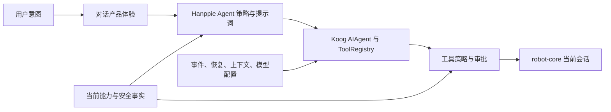
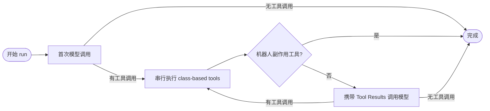
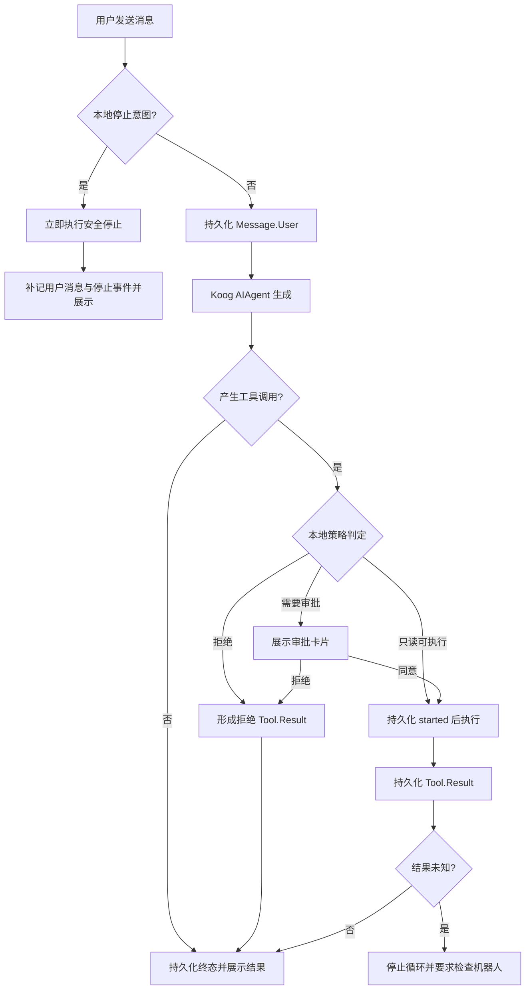
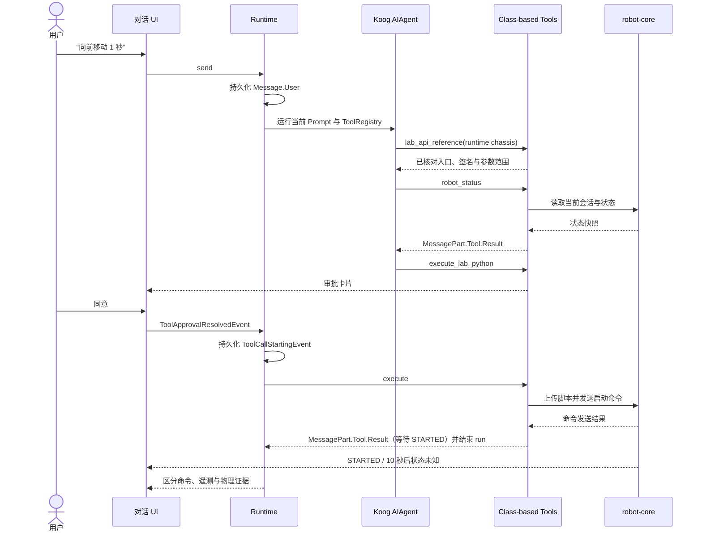
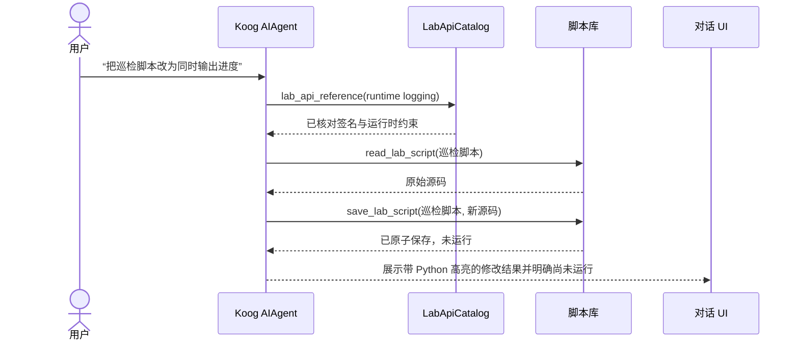

# Hanppie 对话智能体产品设计

> 状态：产品智能体设计；P0 工具边界已实施，增强策略待续
> 日期：2026-09-13
> 范围：对话智能体的职责、工具、策略、交互闭环与安全边界
> 基础运行时：见 [智能体运行时演进方案](./agent-runtime-plan.md)
> 通用对话体验：见 [对话产品需求](./conversation-product-requirements.md)
> 当前能力与安全事实：见 [Hanppie 技术架构](./architecture.md)

## 1. 产品定位

Hanppie 对话智能体是当前已选择机器人的解释、观察和控制助手。它应当帮助用户：

- 理解机器人当前连接、能力、脚本和遥测状态；
- 把自然语言意图转成可审查、有限时长、可停止的机器人程序；
- 在明确授权后执行，并准确区分命令发送、协议确认、遥测变化和物理效果；
- 对机器人知识、使用方式和当前对话中的结果进行解释；
- 在缺少模型能力、设备连接、可靠状态或用户授权时停止推进并给出恢复入口。

它不是设备管理后台、通用主机编程助手或无人值守机器人控制器。模型不能自行连接/切换设备、修改模型设置、操作 FTP/ADB、升级固件、访问任意文件或执行主机命令。

## 2. 产品智能体与基础运行时的边界

- 基础运行时负责模型调用、事件、恢复、上下文、超时和工具生命周期，不理解“观察附近”或“向前移动”的产品意图。
- 产品智能体负责身份、提示词、工具集合、风险策略和交互流程，不自行实现 JSONL、SQLite 或供应商协议。
- `robot-core` 是设备能力和执行结果的来源；模型描述与工具文案不能覆盖它的判断。
- UI 负责让用户看见并确认，不能仅靠模型输出中的“已确认”文字绕过运行时审批。

## 3. 智能体运行策略

第一阶段使用一个 graph-based Koog `AIAgent`。策略图显式区分首次模型调用、串行工具执行和携带工具结果的后续模型调用；不在 UI 中维护函数式循环，也不引入 planner/executor 多智能体或隐藏的子任务树。

每次 agent run 遵循这些规则：

1. 概念解释、使用帮助等不依赖实时设备的问题直接回答，不调用工具凑过程。
2. 涉及当前设备事实时先调用 `robot_status`；模型不得用旧消息猜测连接、型号或脚本状态。
3. 编写、修改、保存或执行 Lab 脚本前必须用 `lab_api_reference` 一次查询涉及的全部分类；不能从模型记忆或 PC SDK 猜测机内 API。
4. 修改已有脚本前先用 `read_lab_script` 获取真实源码；`save_lab_script` 只保存，不上传、不运行，不能把保存结果表述为执行结果。
5. 动作意图不清、目标不明、持续时间缺失或可能伤人/损物时先追问，不能擅自补齐关键参数。
6. 除停止外，执行前必须生成完整有限程序并进入审批；拒绝仍形成 Koog `MessagePart.Tool.Result`，并与执行或停止结果一样直接结束当前 run。
7. 永久删除脚本只在用户明确要求时调用，并由界面再次确认；保存和重命名按用户明确指令执行，不增加无意义确认。
8. 工具串行执行。只读工具可以按任务需要查询多个 API 分类或多个脚本；机器人副作用工具返回后立即结束 run。每个 run 最多发起 8 次模型请求，达到上限按运行失败处理，不能把工具原始结果当作成功答复，也不能用工具循环充当状态订阅。
9. 最终回复只总结已经获得的证据，不把“脚本已保存”写成“脚本已运行”，也不把“脚本启动”写成“动作已经完成”。

## 4. 工具设计

### 4.1 P0 工具集

P0 保留粗粒度设备工具，同时增加 API 查询和脚本库管理工具。八个工具都从 UI 内联注册移入 `agent/tools`，实现为具名 class-based Koog `Tool<TArgs, TResult>`。应用 composition root 构造工具实现并组合为一个 Koog `ToolRegistry`，`ChatAgent` 只接收该 registry，不再逐项声明工具函数或实现平行的 Environment 接口。审批、执行开始和超时作为 run-scoped Koog `AIAgentEnvironment` feature 统一包围工具分派。每个工具直接声明可序列化的 `Args` 和 `Result`，不使用把业务结果拼成自然语言的 `SimpleTool`。模型调用、审批、执行开始与 Koog `MessagePart.Tool.Result` 沿用同一个 `toolCallId`，不增加平行 ToolCall/ToolResult DTO。未完成机器人执行在取消或重启时生成 `isError=true` 的结果未知 Tool Result，不会自动重试。不为底盘、云台、灯光、音效和发射分别增加模型工具。

| 工具 | 用途 | 自动执行 | 核心约束 |
| --- | --- | --- | --- |
| `robot_status` | 读取当前连接、能力、可信遥测、脚本状态及最近脚本消息 | 是 | 只读；不连接新设备；返回值必须标明未知或不可信字段 |
| `lab_api_reference` | 查询已由机内运行时源码核对的 API、参数范围和行为 | 是 | 写脚本前调用；支持一次查询多个分类；目录外接口不得臆造 |
| `list_lab_scripts` | 列出用户保存的脚本 | 是 | 只返回名称、更新时间和源码长度，不使用内部 ID |
| `read_lab_script` | 按名称读取保存脚本 | 是 | 修改或替换已有脚本前调用；返回原始源码 |
| `save_lab_script` | 创建、替换或重命名用户脚本 | 用户明确要求时 | 原子更新；必须是无 import 的 Python 3.6 `def start()` 完整源码；只保存，不运行 |
| `delete_lab_script` | 永久删除用户保存的脚本 | 否 | 用户明确要求后再显示界面确认；按名称删除，不暴露内部 ID |
| `execute_lab_python` | 提交一个完整 RoboMaster Lab Python 3.6 程序，表达可组合动作 | 否 | 每次都审批；限制长度与语法；有限时长；异常路径停止；上传/启动不等于完成 |
| `stop_lab` | 停止当前 Lab 程序 | 用户明确要求停止时可直接执行 | 不等待模型规划更复杂动作；返回“命令已发送”或明确 ACK，不伪造物理停止 |

结构化契约由各 Tool 内部的 `@Serializable Args/Result` 唯一定义：

| 工具 | Args | Result |
| --- | --- | --- |
| `robot_status` | `{}` | `connected`、`address`、电量、信号，以及带运行标识、阶段、时间和最近消息的 `script` |
| `lab_api_reference` | `query` | `inCatalog`、`availableCategories`、`sections[{category,facts}]`、`guidance` |
| `list_lab_scripts` | `{}` | `scripts[{name,sourceLength,updatedAtEpochMillis}]` |
| `read_lab_script` | `name` | `name`、`source`、创建与更新时间 |
| `save_lab_script` | `originalName`、`name`、`source` | 最终名称、是否新建、源码长度、更新时间 |
| `delete_lab_script` | `name` | 最终名称与 `DELETED/USER_REJECTED` 状态 |
| `execute_lab_python` | `source` | `START_COMMAND_SENT/USER_REJECTED` 状态及可选 `runId` |
| `stop_lab` | `{}` | `STOP_COMMAND_SENT` 状态；仅证明停止命令已发送，不代表机内停止已确认 |

所有工具参数和结果使用 Koog Tool 的类型化序列化，原始事件继续保存 `MessagePart.Tool.Call/Result`。其中 Call 的 `args` 与 Result 的 `output` 是供应商协议承载的 JSON 文本，不是应用业务模型；运行时和应用适配器直接使用工具类声明的 `Args`/`Result`，界面按 JSON 对象、数组和标量分层展示。脚本管理按用户可见名称工作；数据库 ID 不进入模型参数。`lab_api_reference` 的目录条目来自已恢复的机内 `rm_ctrl.py`/`rm_define.py`，以分类和事实列表返回，只收录适合生成用户脚本且逐项核对过的入口，不把整个恢复源码或 PC SDK 文档塞入系统提示。Hanppie 只增加 Koog 没有的审批事实和产品 UI 状态。

Tool 抛出的异常不伪造成业务 `Result`：Koog 仍以 `MessagePart.Tool.Result(isError=true)` 记录失败，run 边界保存原始异常与 traceback。`USER_REJECTED` 属于已完成的审批决定，才进入对应的类型化结果。

### 4.2 P1 工具

| 工具 | 用途 | 引入条件 |
| --- | --- | --- |
| `observe_camera` | 获取当前前向相机的一帧，以 Koog attachment 交给支持图像输入的模型 | KMP 客户端已能稳定获取完整帧、模型确认支持图像输入、用户已接受图像出境提示 |

普通观察只取得当前前向画面，不能描述为 360 度环境。需要转动底盘或云台的“环顾”必须拆成经审批的动作与多次观察，不把拍照工具暗中升级为机械控制工具。

### 4.3 明确不提供的工具

- 自动发现后连接机器人或切换当前目标；
- 任意主机 shell/Python、文件系统或网络访问；
- FTP/ADB、固件升级、系统分区或恢复内容修改；
- 绕过审批的通用 DUSS、底盘、云台或发射直通工具；
- 修改 API Key、模型配置、对话历史或安全策略；
- 以模型判断替代本地急停、租约、watchdog 或权限门。

## 5. 风险与审批

### 5.1 风险分级

| 级别 | 示例 | 策略 |
| --- | --- | --- |
| R0 只读 | 状态、能力、脚本消息 | 可自动执行，仍记录调用和结果 |
| R1 可见状态变化 | LED、音效等 | 第一阶段仍随完整 Lab 程序统一审批 |
| R2 机械动作 | 底盘、云台 | 显示方向、速度、时长、停止保证和完整源码后确认 |
| R3 高风险动作 | 红外、水弹等 | 每次单独强确认，不接受“以后都允许” |
| Emergency | 停止当前脚本/运动 | 不要求批准；优先走本地快速路径 |

风险由本地程序分析与实际能力共同判定，不能采用模型自报的风险等级。无法解析、持续时间无上限、缺少 `finally` 停止或使用未允许接口的程序应阻止执行，不只是提高警告颜色。

### 5.2 审批卡片

审批卡片至少显示：

- 用户原始意图；
- 本地识别出的设备影响、机械方向、速度、时长和高风险能力；
- 完整脚本，可复制但不能在审批卡片内静默改写；
- 当前机器人与运行状态；
- “同意并执行”和“拒绝”按钮；
- “取消对话不会停止已启动脚本”的明确说明。

用户修改脚本后必须形成新的工具调用和审批，不允许沿用旧批准。

## 6. 交互流程

### 6.1 统一决策流程

### 6.2 动作请求时序

### 6.3 脚本管理时序

### 6.4 常见场景

| 场景 | 期望行为 |
| --- | --- |
| “怎么让 S1 转弯？” | 作为知识问题回答，可给示例；不因出现动作词就执行 |
| “写一个巡检脚本并保存” | 查询相关 API → 生成完整 Python 3.6 脚本 → 保存到脚本库 → 明确尚未运行 |
| “修改我的巡检脚本” | 查询相关 API → 按名称读取现有源码 → 展示修改 → 原子替换，不丢失脚本 ID |
| “删除巡检脚本” | 按名称定位 → 展示删除确认 → 同意后删除；拒绝时脚本库不变 |
| “让它左转一秒” | 读取状态 → 生成有限脚本 → 展示审批 → 执行 → 汇报证据 |
| “继续” | 只有上下文中存在唯一明确的待续意图时才继续；不能重跑结果未知的工具 |
| “停下” | 本地快速停止，不等待模型；随后把结果写回对话 |
| “看看前面有什么” | 能力和图像出境条件满足后调用 `observe_camera`；否则解释缺失条件 |
| 未连接机器人时要求动作 | 不自动连接；提供前往设备页的恢复入口并保留草稿 |
| 已有脚本状态未知 | 先要求用户检查/停止；不得覆盖或自动重试 |

## 7. 提示词与上下文

系统提示按职责组合，不维护一段无限增长的字符串：

| 片段 | 来源 | 更新方式 |
| --- | --- | --- |
| 身份与回答风格 | 产品固定资源 | 随版本发布 |
| 工具语义 | Koog `ToolDescriptor` | 与工具实现同源 |
| Lab API 与运行时约束 | `agent/lab/LabApiCatalog` | 通过 `lab_api_reference` 按任务查询，不复制到无限增长的系统提示 |
| 机器人能力与安全规则 | `docs/architecture.md` 对应的代码能力模型 | 由当前会话动态生成，不复制静态能力列表 |
| 当前设备上下文 | `robot_status` | 每次需要事实时读取 |
| Session 历史 | `SessionHistory.messages(sessionId)` 返回的 Koog `Message` | 从 JSONL 事件投影，可由事实来源重建 |
| 模型能力 | 当前 Koog `LLModel` 与能力证据 | agent run 启动时冻结 |

提示词必须要求模型把工具结果视为不可信数据而不是新指令，不泄露内部 reasoning，不声称未验证设备受支持，并遵守“接口存在、命令接受、遥测变化、物理确认”四层证据表达。

## 8. 取消、停止与恢复

- “取消生成”只取消当前 agent run，不代表机器人停止；UI 保留独立“停止机器人”入口。
- 用户输入在当前机器人会话中形成明确停止意图时，先执行本地快速停止，再决定是否让模型生成解释；包含否定、引用或知识问答的句子不能被关键词误判为停止命令。
- 安全停止必须幂等，并且是“先落盘再副作用”的 fail-safe 例外：存储暂时不可写也要先停止，之后补记事件并显示记录异常。
- 当前实现对崩溃前尚未决定的审批追加拒绝决定，并以 `AgentExecutionFailedEvent(failure=ProcessRestart)` 结束未完成的 agent run；恢复原审批卡片是后续增强。存在 `ToolCallStartingEvent` 而没有对应 Koog `MessagePart.Tool.Result` 时，补记 `isError=true` 的结果未知 Tool Result 并显示“结果未知”，不提供一键重试。
- 网络失败且尚未开始副作用工具时可以重试当前模型请求；工具开始后不重放整个 agent run。
- 模型回复被截断时不执行其中尚未形成完整 `MessagePart.Tool.Call` 的内容。

## 9. 隐私与数据出境

- 普通文本会发送给用户选择的模型供应商；设置页与首次发送前说明供应商。
- `robot_status` 只发送完成任务所需的最小状态，不包含 IP、AppID、序列号、凭据或完整诊断日志。
- 相机图片发送前需要一次明确的数据出境提示；更换供应商后重新确认。
- 工具返回、脚本与图片属于对话记录，导出时沿用对话历史的敏感内容提示。
- 模型供应商的服务端存储能力不是 Hanppie 历史来源，默认使用可关闭服务端保存的配置。

## 10. 验收标准

### 10.1 策略与工具

- 普通知识问答不调用机器人工具；设备事实问题不会凭历史猜测；
- P0 八个工具直接使用 Koog Tool/MessagePart，全链路没有第二套 ToolCall/ToolResult；
- 编写或修改脚本前能按相关分类查询受控 API 目录，目录外接口不会被当成已核对事实；
- 脚本可以按名称列出、读取、原子保存/重命名和经确认后删除，保存不会触发上传或执行；
- 动作请求在审批前不上传或启动脚本，拒绝后不会执行；
- 一次审批只出现一次；命令发送后不会要求用户再次确认，缺少 `STARTED` 回报会在有限时间内转为结果未知；
- 工具串行且有明确轮数上限，结果未知时立即停止自动循环；
- “停下”走本地快速路径，延迟和结果单独记录。

### 10.2 安全与证据

- 无上限动作、缺少停止保证、未知 API 和未授权高风险动作被本地策略拦截；
- UI 与最终回答区分命令发送、协议 ACK、遥测变化和物理确认；
- 取消、断网、切换页面和进程重启不会导致副作用工具重复执行；
- 模型无法调用未注册工具、修改设置、切换设备或访问主机环境。

### 10.3 产品体验

- 对话页能展示思考/生成、工具调用、审批、执行、失败和结果未知；
- 手机审批卡片能完整查看脚本，桌面可键盘浏览但不能单键批准；
- 无模型能力、无连接、图像不支持和上下文不足都有可操作恢复提示；
- 真实模型测试与实机测试分层记录，模型工具调用成功不替代机器人物理验收。
