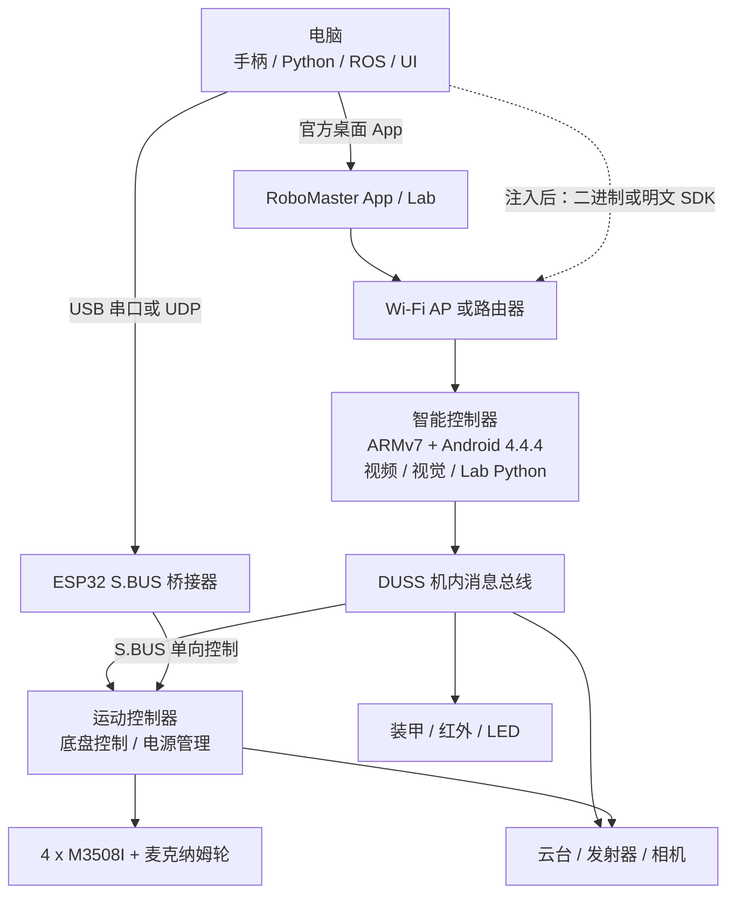

# DJI RoboMaster S1 电脑控制与二次开发调研报告

> 调研日期：2026-08-29<br>
> 目标读者：有丰富软件开发经验、尚未接触嵌入式开发的 S1 用户<br>
> 范围：保留原机主体，优先恢复电脑编程、通用手柄控制、视频和遥测能力；不讨论提升发射威力、绕过机械安全限制等改造。

> **文档关系：**长期维护的当前架构和能力结论以 [`architecture.md`](./architecture.md) 为准；本文保留为前期调研与方案比较记录。

> **实机结果更新：**后续联调已经确认本机固件为 `00.06.0521`，并成功恢复 root ADB、临时启用官方 SDK 服务、验证官方高层 API 和 LED 控制，同时确认官方相机及部分 DDS 主题存在兼容缺口。本文保留为软硬件背景和备选路线调研；实施结论以 [`s1-live-debug-2026-08-29.md`](./s1-live-debug-2026-08-29.md) 为准，S.BUS 不再是当前首选 MVP。

## 1. 执行摘要

RoboMaster S1 并不是“硬件无法编程”，而是被 DJI 的产品分层限制在 RoboMaster App/Lab 内：

- S1 自己运行一个 ARMv7、Android 4.4.4 的智能控制器，机内已经存在 Python 运行时、DUSS 消息总线、底盘/云台/视觉控制模块。
- 官方对外的 RoboMaster Python SDK 和明文 SDK 以 EP/EP Core 为正式支持对象；S1 的相同底层协议能力没有以稳定的外部入口交付。
- S1 还保留了一个官方文档明确支持的 S.BUS 输入口。它无需修改固件，就能控制底盘、云台、速度档位、运动模式和底盘扭矩开关。

因此，应把目标拆成两条互不阻塞的路线：

1. **先做 S.BUS 电脑手柄桥接器**：这是我建议的第一阶段。它不 root、不替换固件、不依赖过时 App，最容易先把玩具“救活”。
2. **再验证网络 SDK 注入**：它可获得底盘、云台、灯光、装甲、IMU、电池、视频等完整能力，但需要进入 S1 内部系统，并且高度依赖固件版本和可回滚能力。

不建议第一步就接管内部 CAN 总线。CAN 方案最彻底，但会同时引入嵌入式、电气、实时通信和协议逆向四类问题，并可能失去原机相机与视觉系统，适合作为第三阶段研究项目。

## 2. 现状与证据等级

### 2.1 官方仍可确认的事实

- DJI 的 S1 支持页仍然存在，但下载中心目前能看到的最新 Release Notes 日期为 2020-09-16，用户手册为 v1.8；这更接近“资料冻结”，而不是仍在持续维护的产品线。[DJI S1 下载中心](https://www.dji.com/downloads/products/robomaster-s1)
- 官方 S1 支持页明确写明：S1 的正式编程平台是 RoboMaster App 内的 RoboMaster Lab，支持 Scratch 和 Python，也曾提供 Windows/macOS 版本。[DJI S1 支持页](https://www.dji.com/support/product/robomaster-s1)
- 官方对外 Python SDK 仓库的定位是 “RoboMaster EP 的 Python SDK 和示例”，README 没有把消费版 S1 列为正式支持对象。[DJI RoboMaster-SDK](https://github.com/dji-sdk/RoboMaster-SDK)
- 官方手册明确记录 S1 有 6 个 PWM 输出口和 1 个 S.BUS 输入口；固件 `v00.05.0046` 及以上可使用 S.BUS，且给出了 7 个通道的控制映射。[S1 User Manual v1.8](https://dl.djicdn.com/downloads/robomaster-s1/20220429UM/RoboMaster_S1_User_Manual_v1.8_EN.pdf)

### 2.2 本地代码样本给出的事实

当前工作区有两份很有价值、但用途不同的代码样本：

- `hanppie` 保存了从 S1 侧提取/整理的 Lab Python 控制栈。它的 `EventClient` 使用 Android 抽象 Unix Datagram Socket `/duss/mb/*`，路由表来自 `/system/etc/dji.json`。因此它是**机内控制代码**，不是拿到电脑上就能直接连接 S1 的桌面 SDK。
- `RoboMaster-SDK` 是 DJI 官方 Python SDK 的本地快照，当前 HEAD 为 `ff6646e115ab125af3207a4ed3df42cc76c795b2`，最后提交日期为 2022-11-10。它实现了电脑到机器人之间的网络握手、二进制 DUSS 协议、数据订阅和音视频流。

关键代码位置：

- S1 机内 Unix Socket/DUSS 客户端：[`event_client.py`](../src/hanppie/runtime/event_client.py)
- S1 底盘、云台和 SDK 模式控制：[`rm_ctrl.py`](../src/hanppie/runtime/rm_ctrl.py)
- S1 DUSS 命令封装：[`rm_module.py`](../src/hanppie/runtime/rm_module.py)
- 官方 SDK 网络端口和连接过程：[`conn.py`](https://github.com/dji-sdk/RoboMaster-SDK/blob/ff6646e115ab125af3207a4ed3df42cc76c795b2/src/robomaster/conn.py)
- 官方 SDK 端口常量：[`config.py`](https://github.com/dji-sdk/RoboMaster-SDK/blob/ff6646e115ab125af3207a4ed3df42cc76c795b2/src/robomaster/config.py)
- 明文 SDK 连接说明：[`connection.rst`](https://github.com/dji-sdk/RoboMaster-SDK/blob/ff6646e115ab125af3207a4ed3df42cc76c795b2/docs/source/text_sdk/connection.rst)

`hanppie` README 记录的 S1 样本固件为 `00.06.0100`，其中没有 EP 的 `sdk_manager` 模块；这正是 S1 不能直接使用官方外部 SDK 的一个关键差异。你的实机固件版本尚未读取，不能假定与该样本相同。

### 2.3 社区已实现但仍需实机复验的能力

- `jukindle/robomaster_ros` 报告可在 root 后通过官方 Python SDK 控制 S1，并用 Xbox 手柄遥控、在 RViz 中查看状态和相机画面。[ROS1 S1 驱动](https://github.com/jukindle/robomaster_ros)
- `jeguzzi/robomaster_ros` 提供 S1/EP 两种 launch 配置、手柄相关 ROS 包依赖、视频/音频/里程计等接口。[ROS2 S1/EP 驱动](https://github.com/jeguzzi/robomaster_ros)
- `proroklab/robomaster_sdk_can` 已经通过 Linux SocketCAN 控制 S1，并订阅 IMU、轮编码器、电池、速度等数据；它需要把外部计算机接入内部 CAN。[C++ CAN 驱动](https://github.com/proroklab/robomaster_sdk_can)
- `JohnieBraaf/Robomaster-Micropython` 用 STM32 + MicroPython 替代带天线的智能控制器，通过云台 CAN 线控制 S1/EDU；这是整机接管实验，不是低风险扩展。[MicroPython CAN 控制器](https://github.com/JohnieBraaf/Robomaster-Micropython)

这些仓库证明“可行”，但不能证明它们在你的固件、电脑系统和硬件状态上可以直接运行。尤其是 root/SDK 注入方案，社区报告中同时存在成功、SDK 只返回版本但动作无响应、Wi-Fi 丢失等不同结果。

## 3. S1 软硬件架构



### 3.1 机械与运动

- 4 个 M3508I 无刷电机，闭环速度控制，单电机最大转速 1000 rpm、最大扭矩 0.25 N·m、最大输出功率 19 W。
- 4 个麦克纳姆轮支持前后、横移、斜移和原地旋转。
- 官方最大速度：前进 3.5 m/s、后退 2.5 m/s、横移 2.8 m/s；最大旋转速度 600°/s。
- 对室内开发而言这些上限过高。首版控制器应把平移限制在约 0.3 m/s、旋转限制在约 60°/s，并在悬空轮测试通过后再逐步放开。

### 3.2 云台、相机与感知

- 两轴云台：俯仰可控范围 -20° 到 +35°，偏航可控范围 ±250°，最大 540°/s。
- 相机：1/4 英寸 CMOS、约 500 万像素、120° FOV；实时图传为 720p/30fps，官方 SDK 视频流为 H.264。
- 6 个装甲击打传感器、宽/窄红外模块、IMU、轮速和电池状态通过内部总线汇聚。
- S1 没有 EP 的机械臂、夹爪、ToF 扩展件，因此即使复用 EP SDK，相应模块也不会凭空可用。

### 3.3 计算、网络与内部通信

本地 `hanppie` 样本记录的智能控制器为：

- Leadcore LC1860，ARMv7，多核；
- Android 4.4.4 / API 19，`userdebug`、`test-keys`；
- 约 272 MiB RAM；
- USB 配置曾包含 RNDIS、ADB、mass storage、bulk、ACM；
- 机内模块通过 DUSS 消息总线通信，Python 侧使用抽象 Unix Datagram Socket。

外部网络有两套协议形态：

| 能力 | 端口/方式 | 备注 |
| --- | --- | --- |
| 官方 Python SDK 二进制控制 | UDP/TCP `20020`，代理握手 `30030` | EP 正式支持；S1 需要先让对应服务工作 |
| 视频 | TCP `40921` | H.264 |
| 音频 | TCP `40922` | Opus |
| 明文控制 | TCP `40923` | 首先发送 `command` 进入 SDK 模式 |
| 明文消息推送 | UDP `40924` | 需订阅 |
| 明文事件上报 | TCP `40925` | 需开启事件 |
| 明文 IP 广播 | UDP `40926` | 组网发现 |
| 二进制 SDK IP 广播 | UDP `40927`；旧实现也使用 `45678` | 具体行为随 SDK 版本变化 |

S1 在 Wi-Fi 直连模式下通常是 `192.168.2.1`；路由器模式下由 DHCP 分配。以上端口是“服务启动后”的协议约定，不代表未修改 S1 一定监听这些端口。

### 3.4 电源与外部接口

- 智能电池：3S、10.8 V、2400 mAh、25.92 Wh；官方标称连续使用约 35 分钟。
- 运动控制器接口包括：电池、电机 M BUS、装甲/云台 CAN、6 路 PWM、S.BUS、保留 UART 和保留 Micro USB。
- 智能控制器本身另有一个用于连接电脑的 Micro USB 口。
- S.BUS 端口三针为 `S-Bus Signal / 5V / GND`。务必按板上丝印和手册方向确认，不要按线色猜引脚。

## 4. 可选路线对比

| 路线 | 可获得能力 | 改机风险 | 嵌入式门槛 | 主要缺点 | 建议 |
| --- | --- | ---: | ---: | --- | --- |
| 官方桌面 RoboMaster App | 键鼠、FPV、Lab Python | 低 | 无 | 软件老旧、下载与现代系统兼容性待验证；仍受 App 限制 | 先试，作为零成本基线 |
| S.BUS + 电脑桥接器 | 通用手柄、底盘、云台、模式、速度、扭矩开关 | 低 | 低 | 单向；无遥测、相机和发射控制 | **首选 MVP** |
| S1 root + EP SDK 服务注入 | Python API、遥测、相机、灯光、装甲等 | 中到高 | 中 | 固件相关，可能损坏 Wi-Fi/USB 服务，安全面扩大 | 第二阶段，先探测再决定 |
| 内部 CAN + 外部 Linux/MCU | 底盘与多种传感数据，可完全脱离原智能控制器 | 高 | 高 | 接线和协议均非消费级官方接口；可能失去相机/视觉 | 长期研究，不作为首发 |
| 更换整套运动控制 | 完全自主 | 很高 | 很高 | 实际变成重新造机器人 | 当前没有必要 |

## 5. 推荐方案 A：电脑/通用手柄到 S.BUS

### 5.1 为什么优先做它

这是唯一同时满足以下条件的路线：

- DJI 官方手册明确记录；
- 不需要修改 S1 系统分区、启动服务或协议二进制；
- 可以完全不依赖手机；
- 能在很短的开发链路中验证机械本体、底盘、云台和电池是否仍然健康；
- 后续即使做网络 SDK，S.BUS 仍可作为独立的人工接管/救援通道。

### 5.2 官方通道映射

S1 手册给出的通道中心值为 `1024`，摇杆端点为 `1024 ± 672`，即建议初始输出范围 `[352, 1696]`。

| S.BUS 通道 | Chassis Lead | Free Mode | 建议初始策略 |
| --- | --- | --- | --- |
| CH1 | 底盘横移 | 底盘横移 | 左摇杆 X，先限幅到中心 ±20% |
| CH2 | 底盘前后 | 底盘前后 | 左摇杆 Y，方向需实机校准 |
| CH3 | 云台俯仰 | 无 | 右摇杆 Y |
| CH4 | 云台偏航 | 底盘旋转 | 右摇杆 X |
| CH5 | 快 / 中 / 慢 | 快 / 中 / 慢 | 初始固定为慢速 |
| CH6 | Chassis Lead / Free | 模式开关 | 初始固定 Chassis Lead |
| CH7 | Set / Release | 底盘输出扭矩开关 | 必须绑定“按住才允许运动”的 dead-man 键 |

手册没有为 S.BUS 定义发射器控制通道，因此不要假设它能直接控制水弹或红外发射。

### 5.3 推荐硬件

第一版使用容易调试的通用器件：

- ESP32 DevKitC / ESP32-WROOM-32 开发板；
- 2N3904、S8050 等 NPN 三极管 1 个；
- 1 kΩ 基极电阻、10 kΩ 上拉电阻；
- 三针舵机线；
- USB 数据线；
- 独立 5 V USB 电源或电脑 USB；
- 可选：廉价逻辑分析仪，用于在接 S1 前检查帧波形；
- 任意被 SDL 识别的 Xbox/PlayStation/8BitDo 等通用手柄。

S.BUS 是 `100000 baud, 8E2` 的反相串口，典型帧长 25 字节，16 个模拟通道各占 11 bit；字节 23 还携带 lost-frame 和 failsafe 标志。可复用 [bolderflight/sbus](https://github.com/bolderflight/sbus) 的打包实现。

建议使用外部反相/电平输出级，而不是直接把 S1 的 5 V 信号接到 ESP32 GPIO：

```text
ESP32 TX ---- 1 kΩ ---- NPN Base
ESP32 GND -------------- NPN Emitter -------- S1 GND
S1 Signal -------------- NPN Collector
S1 5V ------ 10 kΩ ----- NPN Collector
```

这一电路让 ESP32 只驱动三极管基极，由 S1 自己的 5 V 通过 10 kΩ 提供信号上拉。ESP32 初期由电脑 USB 或独立电源供电，**不要同时把 ESP32 的 USB 5 V 与 S1 的 5 V 电源轨直接并联**。

### 5.4 软件分层

```text
host-controller/
  input/          SDL 手柄、键盘
  mapping/        死区、指数曲线、轴反向、速度档
  safety/         dead-man、超时、限幅、急停状态机
  transport/      USB Serial，后续可替换为 UDP
  telemetry/      仅记录主机侧命令和时序

sbus-bridge/
  protocol/       固定长度主机命令 + CRC
  watchdog/       主机心跳超时
  sbus/           16 通道打包和 50 Hz 输出
  diagnostics/    LED、串口日志、帧计数和超时计数
```

主机到 ESP32 的命令建议是固定长度二进制包，而不是 JSON：

```text
version | sequence | monotonic_ms | x | y | yaw | pitch | speed | mode | enable | crc16
```

第一版用 Python + SDL/pygame 做主机，PlatformIO + Arduino Framework 做 ESP32。把协议和通道映射写成纯函数并做桌面单元测试，嵌入式部分只负责串口、watchdog 和 S.BUS 输出，可以显著降低第一次接触嵌入式的复杂度。

### 5.5 必须实现的安全状态机

1. 上电默认：所有轴居中、慢速、CH7=Release。
2. 手柄必须持续按住 dead-man 键，才把 CH7 切到 Set。
3. 主机包超过 200 ms 未更新：立即轴归中、CH7=Release，同时置 S.BUS failsafe 标志。
4. 序号倒退、CRC 错误、手柄断开、进程退出：与心跳超时同样处理。
5. 主机端也要每 100~200 ms 刷新命令，不能只在摇杆变化时发送。
6. 第一次实机测试时取下水弹、抬起四轮、固定机身、保留直接关闭电池的通道。

### 5.6 验收标准

- 逻辑分析仪确认 100000 baud、8E2、反相、25 字节帧、50 Hz 连续输出。
- 上电和主机未连接时，S1 不产生底盘扭矩或运动。
- 拔掉 USB、杀死主机进程、关闭手柄后，200~250 ms 内进入 Release。
- 悬空轮测试中 CH1/CH2/CH4 方向符合预期，未激活的通道均保持中值。
- 落地后先以慢速和 20% 摇杆量运行；连续 30 分钟无失控、无明显丢帧、无异常电机温升。

## 6. 推荐方案 B：恢复外部 Python SDK

### 6.1 能力与本质

官方 Python SDK 可提供：

- 底盘速度/位置动作与轮速控制；
- 云台角度/速度控制；
- 电池、姿态、IMU、位置、ESC、装甲事件订阅；
- LED、声音、PWM；
- H.264 视频和 Opus 音频；
- S1 上存在的视觉识别、相机和发射器功能。

对 S1 而言，主要障碍不是指令编码，而是启动并开放 EP 才默认具有的 SDK 管理与网络服务。`hanppie` 的 S1 机内代码和官方 SDK 使用同一套 DUSS 命令 ID，这说明两者底层有很高复用度。

### 6.2 分四级验证，不要直接永久注入

#### Level 0：只读基线

记录以下信息：

- 机身固件版本；
- 当前是否仍能通过官方 App 以 AP/路由器方式连接；
- 电脑系统、CPU 架构、USB 是否能看到 DJI 设备；
- AP 模式下 `192.168.2.1` 的可达性；
- `20020`、`30030`、`40921` 到 `40927` 的监听状态；
- 电池健康、云台自检、四电机、相机和装甲是否正常。

这一阶段不写 S1 文件系统。

#### Level 1：仅尝试临时打开入口

恢复的运行时代码与 [`adb_bootstrap.py`](../src/hanppie/adb_bootstrap.py) 展示了两个可逆动作：

- 从 Lab Python 的安全模块命名空间取回标准 `__import__`，临时启动 `/system/bin/adb_en.sh`；
- 通过 DUSS 调用 `robot_ctrl.enable_sdk_mode()`、`SDKCtrl.sdk_on()` 和 `stream_on()`。

先只运行临时动作并重启验证是否自动恢复原状。然后只测试无运动指令：

1. ADB 是否出现；
2. SDK 端口是否开始监听；
3. 官方 SDK 的 `get_version()` 是否返回；
4. 电池或 IMU 订阅是否返回；
5. 最后才在悬空轮状态做低速底盘测试。

如果 Level 1 已成功，就没有理由替换系统服务。

#### Level 2：做完整备份和回滚演练

在考虑社区注入前，至少保存并校验：

- `/system/etc/dji.json`；
- `/data/dji_scratch/`；
- `/system/bin/dji_hdvt_uav`；
- 当前进程列表、监听端口、`getprop`、挂载表；
- 设备端与电脑端的 SHA-256。

回滚脚本必须在修改前写好，并验证 ADB 重连。备份应保存在电脑和另一个离线位置，而不是只放在 S1 内部。

#### Level 3：评估 EP SDK 服务注入

本次静态检查的社区 `s1_sdk_hack.zip` SHA-256 为：

```text
a7312ee01c90c8d9a9e5b4cfb81cba45a4e95c0007041a768933d17c3745abd9
```

该包的 v0.0.4 做了以下事情：

- 覆盖 `/data/dji_scratch/sdk` 和 `dji_scratch.py`；
- 放入 EP 的 `sdk_manager` 和明文 SDK；
- 放入一个 32-bit ARM `dji_hdvt_uav` 二进制；
- 在 Lab 服务启动时执行 `/data/patch.sh`；
- 用 bind mount 把 `/data/dji.json` 覆盖到 `/system/etc/dji.json`；
- 用 bind mount 替换 `/system/bin/dji_hdvt_uav`；
- 停止并重启 `dji_sys`、`dji_hdvt_uav`、`dji_vision`；
- 默认启用 ADB，而包内说明明确提示这会关闭 USB RNDIS。

它不是“安装一个 Python 包”，而是替换 S1 的关键通信进程和路由配置。社区讨论中有成功案例，也有 Wi-Fi 丢失和命令无响应案例；因此本报告不建议未经固件匹配和回滚验证就直接执行它。[S1 SDK Hack 讨论](https://www.reddit.com/r/RobomasterS1/comments/lwx45c/robomaster_s1_sdk_hack/)

### 6.3 主机端 MVP 架构

网络 SDK 一旦可用，先做一个小型守护进程，而不是立刻引入 ROS：

```text
Gamepad / CLI / Web UI
          |
          v
Safety Arbiter ---- Emergency Stop
          |
          v
RoboMaster Adapter ---- Telemetry Store
          |                    |
          v                    v
Binary SDK Transport      WebSocket / Log
          |
          v
        S1
```

推荐模块边界：

- `transport`：连接、重连、超时、协议日志；
- `actuator`：底盘、云台、LED；
- `telemetry`：电池、IMU、姿态、位置、装甲；
- `media`：视频流；
- `safety`：速度限幅、dead-man、命令租约、断连停车；
- `input`：手柄、键盘、脚本；
- `api`：本地 CLI 或 WebSocket。

先固定 SDK/fork 的 commit，不要依赖浮动的 PyPI 最新版本。官方 SDK 和媒体编解码依赖较老，现代 Python/Apple Silicon/Windows 环境很可能需要小范围兼容修复。

### 6.4 最小安全控制骨架

以下代码只说明主机侧结构，前提是实机已经通过前述探测确认 SDK 可用：

```python
from robomaster import robot


ep = robot.Robot()

try:
    ep.initialize(conn_type="ap")
    print(ep.get_version())

    # timeout 是机器人侧的额外停车保护；主机仍需持续心跳和 dead-man。
    ep.chassis.drive_speed(x=0.15, y=0.0, z=0.0, timeout=0.25)
finally:
    try:
        ep.chassis.drive_speed(x=0.0, y=0.0, z=0.0)
    finally:
        ep.close()
```

MVP 不实现水弹发射。先完成连接、停止、底盘、云台、电池、IMU、视频六项，再决定是否开放其他模块。

### 6.5 何时引入 ROS

只有当直接 Python 控制连续稳定后，再考虑 ROS：

- 需要 RViz、TF、里程计、导航或多机器人时，ROS 的收益明显；
- 只要手柄 + FPV 时，ROS 会把环境、消息、启动和编解码问题同时带进来，反而拖慢首个可用版本；
- 现有社区 ROS1/ROS2 仓库的发行版说明已经偏旧，应将其当作接口设计和消息映射参考，而不是无条件照抄安装步骤。

## 7. 方案 C：内部 CAN 接管

### 7.1 适用场景

只有当以下目标明确出现时再进入 CAN 路线：

- 完全不信任或不再使用原智能控制器；
- 希望在 Raspberry Pi/Jetson/自研控制板上实现长期自主运行；
- 愿意独立维护实时控制、设备枚举、协议兼容和硬件接线；
- 可以接受原相机、视觉识别和 App 生态不再可用或需要另行替换。

### 7.2 已有社区基础

`robomaster_sdk_can` 使用 Linux SocketCAN，已展示：

- 底盘工作模式和轮速命令；
- IMU、姿态、轮编码器、电池、速度订阅；
- Raspberry Pi + CAN HAT 和 Jetson Orin NX 实机测试。

这是可利用的协议资产，但内部 CAN 口在 S1 用户手册中是模块互连用途，不是面向最终用户的通用扩展口。接错供电、地或 CAN 终端电阻会带来实际硬件风险。

### 7.3 学习路径

如果未来进入该路线，建议顺序是：

1. 先用 Linux `vcan` 跑通 SocketCAN 程序和帧解析；
2. 学习差分总线、120 Ω 终端、共地、收发器和逻辑电平；
3. 在断开执行器的台架上被动抓包，不发送；
4. 只重放无运动查询帧；
5. 最后才发送低速轮命令；
6. 永远保留原线束和可逆转接线，不剪原车线。

## 8. 安全、网络与可维护性边界

### 8.1 运动与发射安全

- 所有底盘速度接口都必须经过同一个安全仲裁器，脚本、手柄和 UI 不得直接抢写执行器。
- 任何控制来源都只能获得短租约；租约未续期就归零并停车。
- 调试期间取下水弹、不要面向人或动物，首版软件不提供水弹发射入口。
- 底盘测试先悬空轮，再低速落地；云台上电自检期间不要触碰或施加外力。

### 8.2 网络与系统安全

S1 样本系统是 Android 4.4.4、`userdebug`、`test-keys`，已经不适合作为可信联网设备。启用 root ADB 或 SDK 服务后：

- 只连接机器人自建 AP 或隔离的专用路由器/VLAN，不接入家庭主网或可访问互联网的公共网络；
- 不在端口转发、VPN、Tailscale/ZeroTier 等覆盖网络上暴露 ADB 和 SDK 端口；
- 控制电脑的防火墙只允许专用网卡/机器人地址访问；
- 不使用真实密码、令牌或私人文件测试 S1 文件系统；
- 调试结束后关闭 ADB；如果采用注入方案，应把“恢复原服务并确认端口关闭”纳入关机流程。

### 8.3 可维护性

- 所有实机探测和变更都记录：日期、固件版本、文件哈希、命令、返回值和恢复方法。
- 外部依赖固定 commit 和本地归档；社区链接和二进制随时可能消失。
- 不假定可以降级 S1 固件。当前社区材料没有提供可靠、通用的降级/救砖流程。
- 不在已经失去 ADB、Wi-Fi 或 App 基线时继续叠加修改；先恢复到最后一个可验证状态。

## 9. 建议的实施里程碑

### M0：实机基线与资料归档

交付物：固件/硬件清单、USB 和网络探测结果、原机功能检查表、所有官方安装包和手册的离线副本。

退出条件：确认 App、底盘、云台、相机、电池至少有一个稳定基线；否则先维修硬件，不进入开发。

### M1：S.BUS 电气样机

交付物：ESP32 面包板电路、逻辑分析仪波形、固定 CH7=Release 的安全帧发生器。

退出条件：接上 S1 后不运动、无报警，切换 CH7 能可控地 Set/Release。

### M2：电脑通用手柄控制

交付物：主机手柄服务、ESP32 固件、通道校准文件、断连测试记录。

退出条件：低速底盘和云台可控，三类断连均在 250 ms 内停车/释放，连续运行 30 分钟通过。

### M3：网络 SDK 可行性探测

交付物：端口矩阵、ADB/SDK 临时启用结果、`get_version`/电池/IMU/视频验证记录。

退出条件：若临时启用成功，直接进入 M4；若失败，仅输出注入风险评审，不自动修改系统。

### M4：Python 控制守护进程

交付物：可复现环境、固定依赖、连接恢复、安全仲裁、CLI/手柄、遥测和视频。

退出条件：重复冷启动 10 次成功；网络断开自动停车；App 和自研控制可按设计切换，不互相抢占。

### M5：可选 ROS/自主功能

交付物：ROS bridge、TF/里程计、视觉算法或导航实验。

退出条件：以具体项目目标定义，不作为“让 S1 重新可玩”的必要条件。

## 10. 首轮实机检查清单

开始任何写入前，请收集：

- [ ] 机身固件精确版本；
- [ ] 当前 RoboMaster App 是否还能连接、查看图像并控制；
- [ ] 电脑 OS、版本、CPU 架构；
- [ ] 计划使用的手柄型号；
- [ ] 智能电池是否鼓包、能否正常充放电；
- [ ] 四个轮电机和云台自检是否正常；
- [ ] S.BUS/PWM 接口盖板和插针是否完好；
- [ ] 是否有 Micro USB 数据线而非纯充电线；
- [ ] 是否接受 root；如果接受，能否承受最坏情况下失去 Wi-Fi/需硬件维修；
- [ ] 是否有第二块电池、逻辑分析仪和可固定机身的测试台。

## 11. 最终建议

对于你的背景，最佳投入顺序是：

1. 用 1 次实机会话完成 M0；
2. 用 ESP32 做 M1/M2，把嵌入式范围限制在“串口 + watchdog + 25 字节帧”；
3. 让 S.BUS 成为始终可用的人工控制/救援通道；
4. 再用 `hanppie` 现有代码做 S1 机内行为审计，先尝试临时 SDK 模式；
5. 只有在固件和回滚均被验证后才考虑 EP 服务注入；
6. 最后才判断 ROS 或 CAN 是否真的解决了新的问题。

这条路径会先交付一个可玩的结果，同时把高风险逆向工作推迟到已经拥有独立控制通道之后。

## 参考资料

- [DJI RoboMaster S1 产品规格与支持](https://www.dji.com/robomaster-s1)
- [DJI RoboMaster S1 下载中心](https://www.dji.com/downloads/products/robomaster-s1)
- [DJI RoboMaster S1 Programming Guide](https://www.dji.com/robomaster-s1/programming-guide)
- [DJI RoboMaster S1 User Manual v1.8](https://dl.djicdn.com/downloads/robomaster-s1/20220429UM/RoboMaster_S1_User_Manual_v1.8_EN.pdf)
- [DJI RoboMaster-SDK](https://github.com/dji-sdk/RoboMaster-SDK)
- [jeguzzi/robomaster_ros](https://github.com/jeguzzi/robomaster_ros)
- [jukindle/robomaster_ros](https://github.com/jukindle/robomaster_ros)
- [proroklab/robomaster_sdk_can](https://github.com/proroklab/robomaster_sdk_can)
- [JohnieBraaf/Robomaster-Micropython](https://github.com/JohnieBraaf/Robomaster-Micropython)
- [bolderflight/sbus](https://github.com/bolderflight/sbus)
