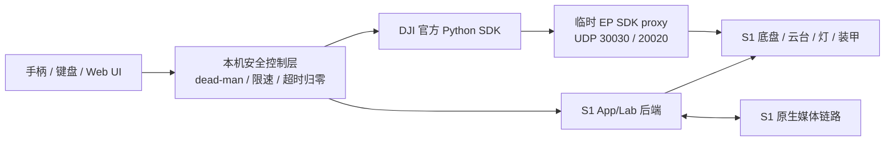

# RoboMaster S1 真机联调与官方 SDK 恢复记录

> 日期：2026-08-29
> 设备：RoboMaster S1，固件 `00.06.0521`
> 主机：macOS / Apple Silicon
> 测试边界：没有发送底盘、云台机械运动或发射器指令；只执行连接、只读遥测、视频和短暂 LED 测试。

> **文档关系：**本文是一次实机联调的可复现记录；长期维护的当前架构和能力结论见 [`architecture.md`](./architecture.md)。

> **当前实现说明（2026-08-30）：**本文记录的外部官方 SDK checkout、外部 LAB-SDK 与 Python 3.8/3.14 环境是当时的联调事实。当前项目已将 DJI SDK 同一提交 `ff6646e115ab125af3207a4ed3df42cc76c795b2` 的纯 Python 源码内置为 `src/robomaster`，并在 `src/hanppie/lab` 自行实现 App/Lab 主机后端；开发与 CI 基线改为 Python 3.10。以下外部依赖和旧命令只用于复现实测历史，当前使用方式以 README 和 [`architecture.md`](./architecture.md) 为准。机器人侧临时 SDK proxy 补丁流程不变。

## 1. 最终结论

这台 S1 已经可以在**不启动手机 App**的情况下由电脑连接，并有两条已实机验证的编程路径：

1. **S1 原生 App/Lab 兼容路径**：不修改机器人服务即可运行机内 Lab Python、读取姿态并取得 720p 视频。
2. **DJI 官方 RoboMaster Python SDK 路径**：通过 root ADB 临时 bind mount 两个 EP SDK 服务文件后，官方 `SdkConnection` 和 `Robot.initialize()` 均成功，版本、序列号、模式、云台角度和 LED 控制已验证。

官方 SDK 的兼容并非 100%：电量、IMU、电调等部分 EP DDS 主题在 S1 上只返回 0，官方相机启动命令被 S1 拒绝；同一台机器通过 App 兼容路径可以取得 720p 图像。因此建议采用**混合后端**：官方 SDK 承担控制及可用遥测，S1 Wi-Fi/Lab 后端承担视频和 S1 特有数据。

测试过程中机器人曾处于以下临时维护状态：

- root ADB：USB 和 TCP 5555 均已开启；
- 官方 SDK 兼容补丁：两个 `/data` 文件 bind mount 到 `/system` 路径；
- UDP `30030` SDK 代理正在监听；
- `dji_sys`、`dji_hdvt_uav`、`dji_vision` 三个服务均为 `running`；
- 所有改动在重启后消失，没有覆盖 `/system` 分区中的原文件。2026-08-30 回归结束时已恢复原厂哈希并重启，ADB 5555 已拒绝连接。

### 能力矩阵

| 能力 | 结果 | 实机证据 |
| --- | --- | --- |
| USB 识别 | 通过 | DJI VID/PID `0x2ca3:0x001f` |
| Wi-Fi/App 会话 | 通过 | AppID claim/ACK，机器人状态 `idle` |
| 机内 Lab Python | 通过 | FTP 上传 DSP、Lab 启动、UDP bridge 回传 |
| App 兼容姿态 | 通过 | 5 Hz 数据，首次测试 yaw 约 `26.82°` |
| App 兼容视频 | 通过 | `1280×720`，`yuv420p` 解码帧 |
| root ADB | 通过 | `uid=0(root) gid=0(root)`，USB 和 TCP 5555 |
| 官方 SDK 代理握手 | 通过 | `30030/UDP → 20020/UDP` 会话建立 |
| 官方 `Robot.initialize()` | 通过 | 固件 `00.06.0521`、SN、`free` 模式 |
| 官方云台角度订阅 | 通过 | pitch `-2.7°`、ground yaw `29.1°` |
| 官方装甲灯控制 | 通过 | 绿色亮起和关闭均返回 `True` |
| 官方位置/速度 | 有回调 | 静止时为 0，符合当前状态，但尚未用运动交叉验证 |
| 官方电量/IMU/电调 | 不可信 | 有稳定回调但值恒为 0 |
| 官方相机 API | 不通过 | `_stream_sdk(1)` 被 S1 拒绝 |
| 底盘、云台运动 | 未测试 | 等待车轮悬空、周围清空后验证 |
| 发射器 | 未测试 | 测试前应取出水弹并单独确认安全条件 |

## 2. 设备与网络身份

| 项目 | 值 |
| --- | --- |
| 固件 | `00.06.0521` |
| S1 序列号 | 已从公开记录中隐去 |
| S1 IP | `<S1_IP>` |
| 主机 IP | `<HOST_IP>` |
| S1 MAC | 已从公开记录中隐去 |
| 网络模式 | Station，经局域网连接 |
| App 日志十进制 AppID | 已从公开记录中隐去 |
| 协议实际 AppID | `<S1_APPID>` |
| USB 描述符序列号 | `0123456789ABCDEF`，通用占位值，不是 S1 SN |
| Android | `4.4.4` / API 19 / ARMv7 |
| Android 型号/产品 | `L1860` / `full_xw607_dz_ap0002_v4` |
| Build | `userdebug`、`test-keys`，日期 2022-10-27 |

AppID 必须把 App 日志中的十进制整数按 8 字节小端序解释为 ASCII，而不能直接把十六进制数字倒序：

```python
protocol_appid = decimal_appid.to_bytes(8, "little").decode("ascii")
```

错误的字节序会超时；使用正确解析的 `<S1_APPID>` 后立即收到 S1 ACK。实际值作为设备标识不写入公开仓库。

## 3. 三条通信链路及推荐组合



- **控制首选官方 SDK**：API 完整、社区样例多，已验证模式、云台角度和 LED；机械运动仍需安全条件下补测。
- **视频首选 App/Lab 后端**：已取得 720p 画面，而官方 EP 相机控制在 S1 上失败。
- **ROS 2 集成**：[`jeguzzi/robomaster_ros`](https://github.com/jeguzzi/robomaster_ros) 是基于 DJI Python SDK 的 ROS 2 驱动，提供机器人节点、话题/服务、相机与手柄入口；S1 使用前仍需本报告的机器人端 SDK 服务。ROS 2 是机器人软件中把驱动、遥测、控制、视觉等独立节点通过话题、服务和动作连接起来的中间件框架。
- **不建议先走 S.BUS/CAN 硬改**：当前 Wi-Fi 软件链路已经覆盖高层控制和视频。S.BUS 是串行遥控通道，SocketCAN 是 Linux 的 CAN socket API，`vcan` 是不接硬件的虚拟 CAN 接口；它们适合外设集成或总线逆向，不是恢复 S1 电脑控制的最短路径。详细解释见 [`robomaster-s1-revival-report.md`](./robomaster-s1-revival-report.md)。

## 4. 实际调试过程

为避免把单台设备的标识写入公开仓库，以下命令统一使用环境变量：

```bash
export S1_IP="192.168.x.x"
export S1_APPID="your-8-character-appid"
export S1_SERIAL="your-s1-serial"
```

### 4.1 保护 USB 存储

USB 复合设备中的 FAT 卷最初挂载为 `/Volumes/NO NAME`。在切换 USB 功能前执行：

```bash
diskutil unmount '/Volumes/NO NAME'
```

结果为 `Volume NO NAME on disk5 unmounted`。该操作只卸载文件系统，没有删除视频。

### 4.2 先验证无需 root 的 S1 原生路径

使用 [RoboMaster-S1-WiFi-SDK](https://github.com/tatsuyai713/RoboMaster-S1-WiFi-SDK) 的 LAB backend：

```bash
task sync:lab
uv run hanppie probe-lab \
  --robot-ip "$S1_IP" \
  --appid "$S1_APPID"
```

关键结果：

```text
uploaded stock Lab bridge: md5=149d1ee87de24c5487b76a2690f67922
attitude samples: count=5 last=[(26.820289611816406, None, None)]
```

视频探针：

```bash
uv run hanppie probe-video \
  --robot-ip "$S1_IP" \
  --appid "$S1_APPID"
```

结果：

```text
camera_frame=1280x720 format=yuv420p pts=None
```

`get_battery()` 返回 `None`，所以 LAB 后端电量查询没有通过本轮验证。

### 4.3 复现官方 SDK 初始失败

未补齐机器人端服务时，官方 `SdkConnection.request_connection()` 向 `30030/UDP` 发送连接请求后超时：

```text
official_sdk_handshake=False
remote_addr=('<S1_IP>', 20020)
```

当时机器人没有监听 UDP 30030，说明电脑网络和 SDK 调用不是主要问题，缺的是 S1 端 EP SDK 入口。

### 4.4 通过 Lab 恢复 root ADB

历史 root 没有让 ADB 默认可见，因此利用已经验证的 Lab Python 执行环境启动它。调试中发现：

- Lab Python 实际身份为 `uid=0`；
- `/system/bin/adb_en.sh`、`/system/bin/setprop`、`/system/xbin/busybox`、`/sbin/adbd` 均存在；
- Lab 环境里的 `os.system()` 固定返回 `32512`（shell exit 127），不能据此调用系统命令；
- 将 `subprocess.Popen` 放在上传程序的模块顶层可以正常执行；
- S1 Lab DSP 载荷存在约 31.5 KiB 的大小边界，AST 精简后载荷约 29.6 KiB，上传成功。

执行：

```bash
uv run hanppie adb-enable \
  --robot-ip "$S1_IP" \
  --appid "$S1_APPID" \
  --settle-seconds 8
```

随后 USB 与 Wi-Fi ADB 均出现：

```text
0123456789ABCDEF       device model:L1860
<S1_IP>:5555            device model:L1860
```

明确指定 TCP 设备的只读检查：

```bash
adb -s "$S1_IP:5555" shell id
# uid=0(root) gid=0(root)
```

关键 property：

```text
service.adb.root=1
service.adb.tcp.port=5555
persist.sys.usb.config=adb
sys.usb.config=rndis,mass_storage,bulk,acm,adb
sys.usb.state=rndis,mass_storage,bulk,acm,adb
```

原厂 `/system/bin/adb_en.sh` 会设置 root ADB、USB composite、调试标志并配置 RNDIS；额外把 TCP 端口设为 5555，避免 macOS RNDIS 驱动问题影响维护。

### 4.5 备份与补丁审计

修改服务前已把关键文件拉到本机：

```text
.s1-backup/2026-08-29-00.06.0521/
```

其中包括 `dji.json`、`dji_hdvt_uav`、`dji_scratch.py`、init rc、ADB 脚本和默认属性。该目录被 `.gitignore` 排除，因为包含专有二进制和设备信息。

原厂文件哈希：

| 文件 | SHA-256 |
| --- | --- |
| `/system/etc/dji.json` | `63db3ea0b9931cc519255265be66af35c93623c636a91ed59c3ff10280fb8ed8` |
| `/system/bin/dji_hdvt_uav` | `19d957e93672ce105d09eec509ec2fb873c8eb69a9287e0a505a6438538b2b38` |
| `/data/dji/dji_scratch.py` | `4d3dc175f1b50bfb3f3a64ce0e053cd67f702c97c96c1f2f1f8c220335ee16bb` |

审计的社区 `s1_sdk_hack.zip`：

```text
SHA-256 58e902701aceea51c5aae18215131e072d4c5a88da0bff5a0633996268dcdfa0
```

本轮只使用其中两个文件：

| 文件 | SHA-256 |
| --- | --- |
| `dji.json` | `19db1dfcab6d21840735a69210d5c4dd0083759c2b02fbd708fd0f9892d98307` |
| `dji_hdvt_uav` | `da1ccac46c2c56a70af21f6b0da747e84040ba2ea850a29e07af27bc3c21c90f` |

二进制为 ARM32 EABI5，所需动态库与 S1 原二进制相同，并包含额外 SDK handler。没有使用包内的持久化 `dji_scratch.py`、`sdk_manager.py` 或开机 `patch.sh`，从而避免修改启动链。

### 4.6 临时启用 EP SDK 服务

文件先上传到 `/data/s1_sdk_test` 并在设备端复核哈希，然后依次：

1. 停止 `dji_sys`、`dji_hdvt_uav`、`dji_vision`；
2. bind mount `/data/s1_sdk_test/dji.json` 到 `/system/etc/dji.json`；
3. bind mount `/data/s1_sdk_test/dji_hdvt_uav` 到 `/system/bin/dji_hdvt_uav`；
4. 重新启动三个服务。

已固化为工具：

```bash
uv run hanppie sdk \
  --target "$S1_IP:5555" \
  enable \
  --hack-dir /path/to/audited/s1_sdk_hack
```

启用后：

```text
official_sdk_patch=enabled_volatile
service_dji_sys=running
service_dji_hdvt_uav=running
service_dji_vision=running
udp_30030_listening=True
```

### 4.7 回滚往返验证

不是只写回滚命令，而是实际做了一次完整往返：

```bash
uv run hanppie sdk \
  --target "$S1_IP:5555" restore
```

恢复结果：原厂两个 SHA-256 完全匹配、bind mount 为空、三个服务运行、UDP 30030 不再监听。随后再次执行 `enable`，补丁哈希、mount、服务和 30030 均恢复正常。

因此有两种可靠恢复方式：

- 用上述 `restore` 命令在线恢复；
- 直接重启 S1，所有 bind mount 和临时 ADB 配置消失。

### 4.8 官方 SDK 最终验证

低层握手：

```text
official_sdk_handshake=True
local_addr=('<HOST_IP>', 10234)
remote_addr=('<S1_IP>', 20020)
```

高层 API：

```text
official_robot_initialized=True
version=00.06.0521
serial_number=<S1_SERIAL>
robot_mode=free
official_robot_closed=True
```

官方 SDK 会在 `initialize()` 中启用 SDK 模式、重置订阅/视觉并把模式设为 `free`，但不发送底盘、云台运动或发射指令。

8 个只读主题均成功订阅并持续回调。云台数据为真实非零值：

```text
gimbal_angle: samples=19
first=[(-2.7, 0.0, 0.0, 29.1)]
last=[(-2.7, 0.0, 0.0, 29.1)]
```

位置和速度在静止时为 0；电量、IMU、电调、底盘 attitude 恒为 0，暂定为 S1/EP DDS 兼容缺口，不能对上层暴露为可信传感器数据。

无机械运动的硬件控制测试：

```text
robot_mode_before=free
set_same_robot_mode=True
top_led_green=True
top_led_off=True
```

官方相机 API 的 `_stream_sdk(1)` 返回失败。macOS 缺少 DJI 原生 `libmedia_codec` 只是电脑端导入问题；本轮已经提供 PyAV 接口兼容模块，但请求在开始传输前就被机器人拒绝，所以根因是 S1/EP 媒体控制协议边界，不是解码器。视频应继续使用已验证的 App/Lab 后端。

## 5. 可复现工具

| Hanppie 入口 | 实现 | 用途 | 状态影响 |
| --- | --- | --- | --- |
| `probe-lab` | [`lab_bridge.py`](../src/hanppie/probes/lab_bridge.py) | App/Lab 会话与姿态 | 临时进入 Lab，退出时清理 |
| `probe-video` | [`lab_video.py`](../src/hanppie/probes/lab_video.py) | App 后端 720p 视频 | 临时启停视频流 |
| `adb-enable` | [`adb_bootstrap.py`](../src/hanppie/adb_bootstrap.py) | 从 Lab 开启 root ADB | 改变 USB/ADB 状态，重启恢复 |
| `adb-enable` 内置资源 | [`enable_adb_standalone.py.txt`](../src/hanppie/payloads/enable_adb_standalone.py.txt) | 机内顶层 Popen 载荷 | 同上 |
| `sdk` | [`sdk_patch.py`](../src/hanppie/sdk_patch.py) | 临时启用、检查、恢复 SDK 服务 | 停启 DJI 服务并管理 bind mount |
| `probe-connection` | [`official_connection.py`](../src/hanppie/probes/official_connection.py) | 官方低层握手 | 只建立并关闭会话 |
| `probe-official` | [`official_info.py`](../src/hanppie/probes/official_info.py) | 官方高层身份与基础主题 | 进入 SDK/free 模式后关闭 |
| `probe-telemetry` | [`official_telemetry.py`](../src/hanppie/probes/official_telemetry.py) | 8 个官方 DDS 主题能力矩阵 | 只订阅/退订 |
| `probe-led` | [`official_led.py`](../src/hanppie/probes/official_led.py) | 无机械运动控制验证 | 短暂亮绿灯后关闭 |
| `probe-camera` | [`official_camera.py`](../src/hanppie/probes/official_camera.py) | 记录官方相机失败边界 | 请求未进入视频传输 |
| 官方探针共用 | [`media_codec.py`](../src/hanppie/media_codec.py) | macOS 上以 PyAV 兼容 DJI 解码接口 | 仅电脑端 |

主机代码由 uv 管理，并通过 Ruff、pytest 和 prek 统一检查。`hanppie sdk` 的 `status`、`restore`、`enable` 三条路径已在真机运行；回滚和再次启用均验证成功。

## 6. 安全边界

### 当前最重要的风险

`<S1_IP>:5555` 是局域网上**无认证的 root ADB**。同一网络中的其他设备理论上可以取得机器人 root shell。当前只应在可信局域网中短时维护，不应暴露到公共 Wi-Fi 或端口转发。

完成本轮开发后，最简单的关闭方式是重启 S1。若只想恢复原服务但继续保留 ADB，执行：

```bash
uv run hanppie sdk \
  --target "$S1_IP:5555" restore
```

### 运动控制前置条件

后续测试底盘和云台前至少应满足：

- 车轮悬空或放在足够开阔、不会跌落的地面；
- 手边保留物理电源键；
- 上层必须有按住才生效的 dead-man；
- 手柄断连、窗口失焦、网络超时立即发送零速度；
- 首次限速建议平移不超过 `0.2 m/s`、旋转不超过 `20°/s`；
- 发射器测试前取出水弹，并把发射功能与驾驶解锁分开。

## 7. 远程控制实现建议

第一阶段不必先引入 ROS 2，可直接写一个小型 Python 控制守护进程：

```text
pygame/SDL 手柄输入
        ↓ 50 Hz
轴死区、曲线、限速、dead-man
        ↓
控制仲裁器（本地/远程/急停）
        ↓ 20 Hz command + 250 ms watchdog
DJI 官方 SDK：底盘、云台、LED
S1 Lab 后端：视频、补充遥测
        ↓
WebSocket/WebRTC：远程 UI 与视频
```

必须把“输入采样”和“向机器人发命令”拆成两个循环。控制循环只读取最新意图；超过 250 ms 没有新意图就归零，不能把最后一条非零速度无限保持。

第二阶段需要 SLAM、导航、多进程视觉或标准机器人生态时，再接入 ROS 2 和 `robomaster_ros`。建议为 S1 做一层 capability adapter：

- 官方有效主题发布为正常 ROS topic；
- 恒 0/不可信主题标记 unavailable，不伪造正常数据；
- 相机 topic 从 S1 Lab 后端注入，而不是强行使用官方相机类；
- `cmd_vel` 到官方底盘控制之间增加 dead-man、限速和 watchdog；
- 所有发射器相关 service 默认禁用，需单独启动参数解锁。

## 8. 2026-08-30 仓库化回归

仓库整理为 `src/hanppie` 包后，在同一台 S1 上从重启后的原厂运行态重新执行了完整链路，未复用上次仍在内存中的 ADB 或 bind mount：

1. `probe-lab`：连接成功，姿态回传 5 个样本；
2. `probe-video`：解码一帧 `1280×720 yuv420p`，电量仍为 `None`；
3. `adb-enable`：上传内置 936 字节载荷，USB 和 TCP ADB 均出现，身份为 `uid=0(root)`；
4. `sdk status`：启用前确认两个文件为原厂 SHA-256、无 bind mount、UDP 30030 未监听；
5. `sdk enable`：固定哈希补丁启用成功，三个 DJI 服务运行、UDP 30030 监听；
6. `probe-connection`：官方低层握手成功；
7. `probe-official` / `probe-telemetry`：固件 `00.06.0521`、序列号、模式和 8 类订阅成功，云台角度为非零实值，其余已知不可信主题仍回传零；
8. `probe-led`：顶部 LED 绿色亮起并关闭；
9. `probe-camera`：明确返回 `official_camera_supported=False`，再次确认请求由 S1 端拒绝。
10. `sdk restore` 后两个原厂 SHA-256 恢复、bind mount 为空、UDP 30030 停止监听；重启后 TCP 5555 拒绝连接且官方握手再次失败，设备已回到安全的原厂运行态。

Python 版本不是凭依赖声明推断：离线测试在 CPython 3.8.20 与 3.14.6 各执行 22 项，均通过且主机核心覆盖率约 86%；macOS 上的 Python 3.8.20 还通过固定官方源码 checkout 完成了真机低层握手和 `Robot.initialize()`。Python 3.14 初次高层导入暴露了官方 SDK 对已移除标准库模块 `audioop` 的依赖，现由 `official` extra 在 Python 3.13+ 安装 `audioop-lts==0.2.2` 解决。

## 9. 尚待实测

本轮已经证明“电脑可连接、官方 SDK 可初始化、部分遥测与非运动硬件控制可用”，但以下能力不能仅凭 API 存在就宣布可用：

1. 车轮悬空条件下验证低速底盘 `drive_speed` 和立即归零；
2. 小角度云台运动、回中和实际角度闭环；
3. 装甲碰撞/红外命中事件；
4. 扬声器；
5. 视觉识别；
6. 网络中断 watchdog；
7. 游戏手柄映射和远程 Web 控制。

每项应记录四层证据：API 存在、命令 ACK、遥测反馈、物理结果。尤其不能把“返回 `True`”当作机械动作已经正确完成。

## 10. 来源与版本

- DJI 官方 SDK 本地快照：`ff6646e115ab125af3207a4ed3df42cc76c795b2`；上游 [dji-sdk/RoboMaster-SDK](https://github.com/dji-sdk/RoboMaster-SDK)
- S1 LAB-SDK 本地快照：`fce5ff284a1ca910b7ca93c499b95eea4813152e`；上游 [tatsuyai713/RoboMaster-S1-WiFi-SDK](https://github.com/tatsuyai713/RoboMaster-S1-WiFi-SDK)
- S1 保存与 root ADB 参考：[pierluigizagaria/robomaster-s1-preservation](https://github.com/pierluigizagaria/robomaster-s1-preservation)
- S1 官方 SDK hack 使用参考：[jukindle/robomaster_ros](https://github.com/jukindle/robomaster_ros)
- ROS 2 驱动参考：[jeguzzi/robomaster_ros](https://github.com/jeguzzi/robomaster_ros)
- 完整软硬件背景：[robomaster-s1-revival-report.md](./robomaster-s1-revival-report.md)
